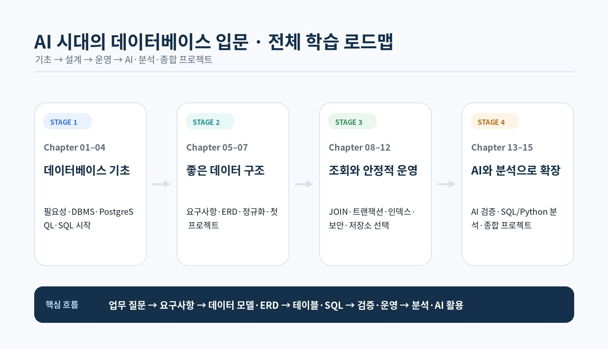
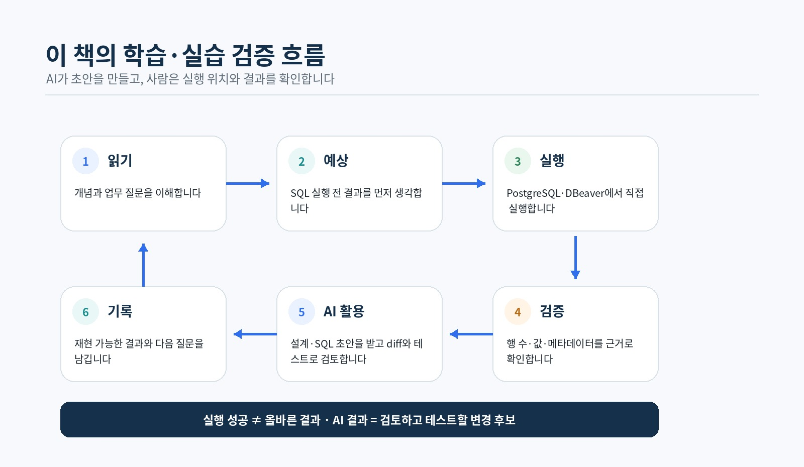
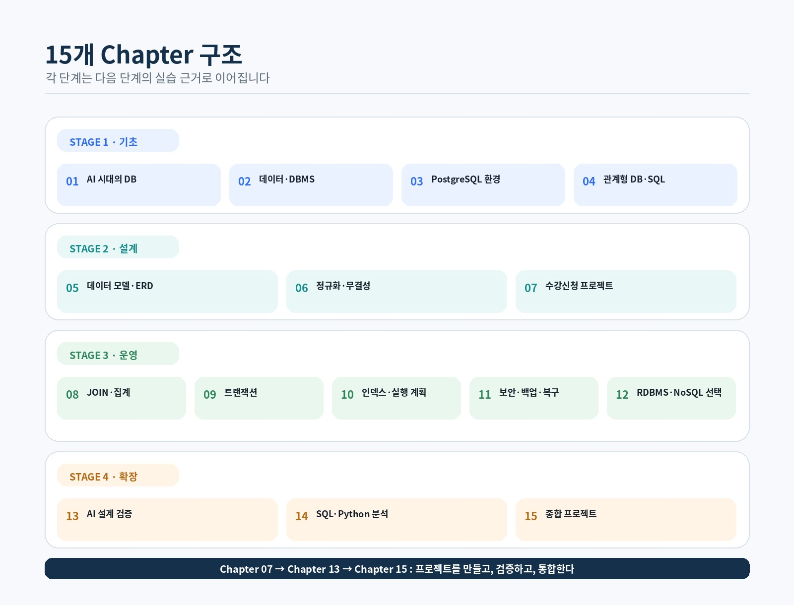

# Course Overview 블로그 발행 가이드

이 폴더는 `course_overview.md`를 네이버 블로그 등 외부 편집기에 옮길 때 필요한 원고와 본문 이미지를 한곳에서 관리합니다.

## 폴더 구성

```text
blog/course_overview/
├── course_overview.md
├── overview_learning_roadmap.jpg
├── overview_study_flow.jpg
├── overview_book_structure.jpg
└── README.md
```

블로그 대표 썸네일은 별도 JPG 파일을 사용합니다.

## 이미지 경로 원칙

`course_overview.md`에서는 같은 폴더의 이미지에 상대경로를 사용합니다.

```md



```

이렇게 하면 private 저장소에서도 GitHub에서 로그인한 사용자가 Markdown을 열었을 때 이미지가 정상적으로 표시됩니다.

## 네이버 블로그에 올릴 때

private GitHub 저장소의 `raw.githubusercontent.com` 이미지 주소는 네이버가 인증 없이 가져올 수 없으므로 사용하지 않습니다.

다음 순서로 발행합니다.

1. `course_overview.md`의 본문을 기준으로 글을 작성합니다.
2. 이미지가 들어갈 위치에서 이 폴더의 JPG 파일을 직접 업로드합니다.
3. 대표 이미지는 `course_overview_thumbnail.jpg`를 네이버 편집기에서 직접 업로드해 지정합니다.
4. 발행 전 PC와 모바일 미리보기에서 이미지가 모두 보이는지 확인합니다.

## 본문 이미지 위치

| 파일 | 삽입 위치 |
| --- | --- |
| `overview_learning_roadmap.jpg` | 「이 책에서 사용하는 기술과 도구」 뒤 |
| `overview_study_flow.jpg` | 「데이터베이스 학습의 전체 흐름」 뒤 |
| `overview_book_structure.jpg` | Chapter 15 설명 뒤 |

## 주의

- private 저장소의 GitHub Raw URL을 네이버 본문 이미지 주소로 사용하지 않습니다.
- 네이버 발행본은 반드시 이미지를 직접 업로드합니다.
- 저장소 원고에서는 상대경로를 사용해 파일 이동과 로컬 미리보기를 쉽게 유지합니다.
