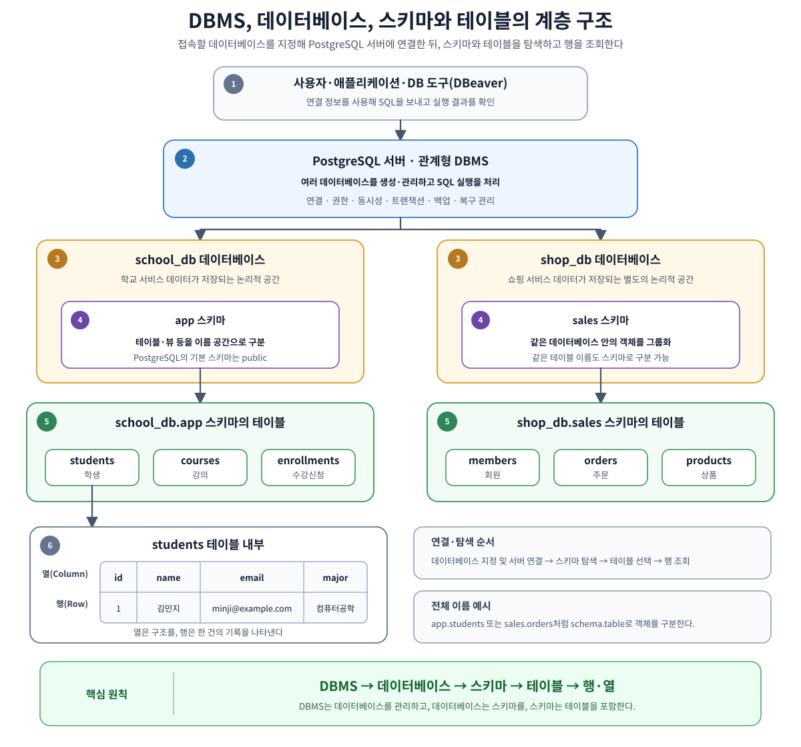
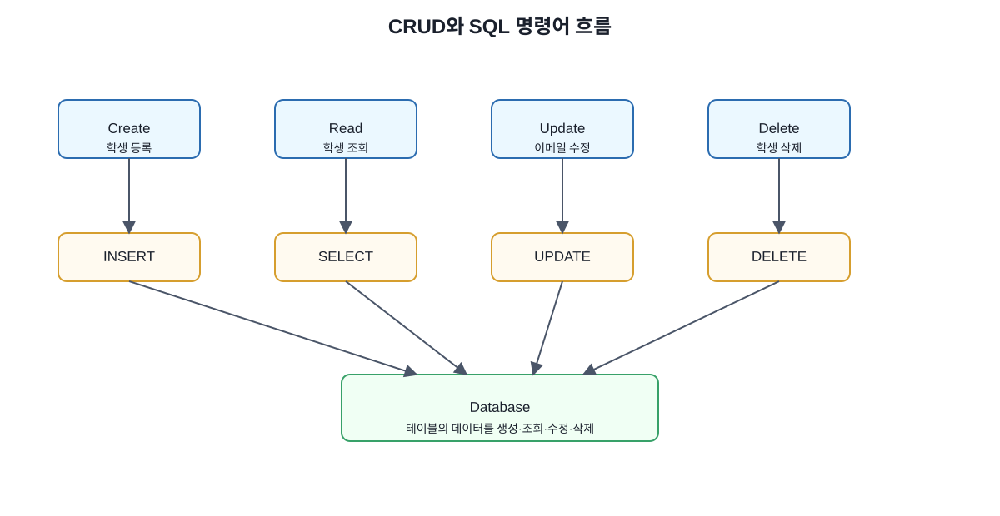
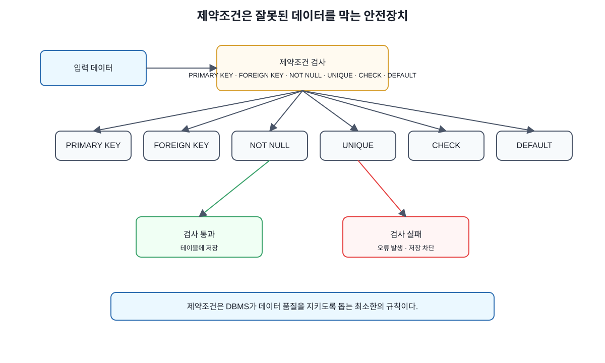

# Chapter 02. DBMS 기본 개념

---

## 이 장에서 살펴볼 내용

데이터베이스를 사용하려면 먼저 그 안에서 데이터가 어떤 구조로 저장되고 연결되는지 알아야 합니다. SQL 문법을 외우는 것만으로는 테이블이 왜 필요한지, 어떤 값을 기본키로 선택해야 하는지, 서로 다른 테이블을 어떻게 연결해야 하는지 판단하기 어렵습니다.

이 장에서는 관계형 데이터베이스를 이해하는 데 필요한 기본 용어를 하나의 흐름으로 살펴봅니다.

- 데이터베이스와 DBMS의 차이
- 테이블, 행, 열의 의미
- 기본키(PK)와 외래키(FK)의 역할
- 1:1, 1:N, N:M 관계
- SQL과 CRUD의 기본 의미
- 제약조건이 필요한 이유
- AI가 만든 테이블 구조를 검토하는 방법

이 장의 용어는 이후 SQL, 데이터 모델링, ERD, 정규화, JOIN, 트랜잭션을 이해하는 토대가 됩니다. 각각의 정의를 따로 외우기보다 학생·강의·수강신청이라는 작은 서비스 사례 안에서 서로 연결해 보는 것이 좋습니다.

```text
데이터는 테이블에 저장된다.
테이블의 각 행은 하나의 기록을 나타낸다.
기본키는 행을 구분한다.
외래키는 다른 테이블과 연결한다.
제약조건은 잘못된 데이터를 막는다.
SQL은 데이터를 생성하고 조회하고 수정하고 삭제한다.
```

---

## 1. SQL보다 먼저 데이터 구조를 이해해야 하는 이유

데이터베이스를 처음 접하면 다음과 같은 SQL부터 떠올리기 쉽습니다.

```sql
SELECT * FROM students;
```

이 SQL은 `students` 테이블의 데이터를 조회합니다. 하지만 문장을 정확히 이해하려면 먼저 다음 질문에 답할 수 있어야 합니다.

```text
students는 무엇인가?
테이블의 한 줄은 무엇을 의미하는가?
id 열은 왜 필요한가?
같은 이름을 가진 사람은 어떻게 구분하는가?
학생과 수강신청 정보는 어떻게 연결하는가?
```

SQL은 데이터베이스에 명령을 내리는 언어입니다. 명령의 대상이 되는 데이터 구조를 이해하지 못하면 SQL이 실행되더라도 그 결과가 올바른지 판단하기 어렵습니다.

AI가 SQL과 테이블 생성 코드를 빠르게 작성해 주는 시대에는 이 문제가 더 중요합니다. 예를 들어 AI가 다음 구조를 제안했다고 가정해 보겠습니다.

```sql
CREATE TABLE students (
    name VARCHAR(50),
    course_name VARCHAR(100),
    instructor_name VARCHAR(50)
);
```

학생, 강의, 강사 정보가 모두 들어 있으므로 처음에는 간단하고 편리해 보입니다. 그러나 구조를 조금만 살펴보면 여러 문제가 드러납니다.

- 각 학생을 안정적으로 구분할 기본키가 없습니다.
- 학생 정보와 강의 정보가 한 테이블에 섞여 있습니다.
- 강사 정보도 학생 행마다 반복될 수 있습니다.
- 한 학생이 여러 강의를 수강하면 학생 이름이 계속 중복됩니다.
- 강의명이나 강사명이 바뀌면 여러 행을 수정해야 합니다.

AI는 실행 가능한 SQL을 만들 수 있지만, 그 SQL이 데이터를 장기간 안정적으로 관리할 수 있는지는 사람이 판단해야 합니다. 이를 위해 필요한 공통 언어가 바로 테이블, 행, 열, 기본키, 외래키, 관계, 제약조건입니다.

---

## 2. 데이터베이스와 DBMS

### 2.1 데이터베이스란 무엇인가

데이터베이스(Database)는 관련 데이터를 일정한 구조로 저장한 공간입니다.

온라인 강의 서비스를 예로 들면 다음과 같은 데이터를 저장할 수 있습니다.

```text
회원 정보
강의 정보
강사 정보
수강신청 정보
결제 정보
강의평 정보
```

이 데이터가 여러 파일에 흩어져 있으면 특정 회원이 어떤 강의를 신청했는지 확인하거나, 강의별 수강생 수를 계산하거나, 결제 상태와 수강 상태가 일치하는지 검증하기 어렵습니다.

데이터베이스는 데이터를 구조적으로 저장하여 다음 작업을 가능하게 합니다.

```text
데이터를 저장한다.
필요한 데이터를 찾는다.
기존 데이터를 수정한다.
불필요한 데이터를 삭제하거나 상태를 변경한다.
잘못된 값이 저장되지 않도록 규칙을 적용한다.
여러 데이터 사이의 관계를 관리한다.
```

### 2.2 DBMS란 무엇인가

DBMS(Database Management System)는 데이터베이스를 생성하고 관리하고 사용할 수 있게 해 주는 소프트웨어입니다.

데이터베이스가 실제 데이터가 저장되는 공간이라면, DBMS는 그 공간에 접근하여 데이터를 저장·조회·수정하고 권한과 복구를 관리하는 시스템이라고 볼 수 있습니다.

대표적인 관계형 DBMS는 다음과 같습니다.

| DBMS | 특징 |
| --- | --- |
| PostgreSQL | 기능이 풍부한 오픈소스 관계형 DBMS이며 이 책의 기본 환경 |
| MySQL | 웹 서비스에서 널리 사용하는 오픈소스 관계형 DBMS |
| MariaDB | MySQL에서 파생된 오픈소스 관계형 DBMS |
| Oracle Database | 대규모 기업 시스템에서 많이 사용하는 상용 DBMS |
| SQL Server | Microsoft 생태계에서 널리 사용하는 상용 DBMS |
| SQLite | 별도 서버 없이 파일 형태로 사용할 수 있는 경량 관계형 DBMS |

이 책에서는 PostgreSQL을 중심으로 설명하지만, 테이블·키·관계·SQL과 같은 기본 개념은 다른 관계형 DBMS에서도 대부분 동일하게 적용됩니다.

### 2.3 데이터베이스와 DBMS의 차이

두 용어는 일상적으로 섞여 사용되지만 의미는 다릅니다.

| 구분 | 의미 | 예시 |
| --- | --- | --- |
| 데이터베이스 | 실제 데이터가 저장되는 논리적 공간 | `school_db`, `shop_db` |
| DBMS | 데이터베이스를 관리하는 소프트웨어 | PostgreSQL, MySQL |

PostgreSQL이라는 DBMS 안에 `school_db`라는 데이터베이스를 만들고, 그 안에 여러 테이블을 구성할 수 있습니다.

```text
PostgreSQL(DBMS)
└── school_db(데이터베이스)
    ├── students(테이블)
    ├── courses(테이블)
    └── enrollments(테이블)
```



그림 2-1 DBMS, 데이터베이스, 테이블의 계층 구조

이 구분을 알고 있으면 데이터베이스 도구에서 서버 연결, 데이터베이스 선택, 테이블 탐색이 서로 다른 단계라는 점을 이해하기 쉽습니다.

---

## 3. 테이블, 행, 열

관계형 데이터베이스에서 데이터를 저장하는 기본 구조는 테이블(Table)입니다. 테이블은 데이터를 행과 열로 정리합니다.

예를 들어 회원 정보를 저장하는 `students` 테이블을 다음과 같이 구성할 수 있습니다.

| id | name | email | major |
| ---: | --- | --- | --- |
| 1 | 김민지 | minji@example.com | 컴퓨터공학 |
| 2 | 이준호 | junho@example.com | 데이터사이언스 |
| 3 | 박서연 | seoyeon@example.com | 경영학 |

이 표 전체가 하나의 테이블입니다.

### 3.1 행(Row)

행은 테이블 안의 한 줄이며, 하나의 데이터 기록을 나타냅니다. 위 테이블에서 김민지의 정보가 들어 있는 한 줄이 하나의 행입니다.

행은 레코드(Record) 또는 튜플(Tuple)이라고도 부릅니다. 이 책에서는 주로 `행`이라는 표현을 사용합니다.

### 3.2 열(Column)

열은 데이터가 어떤 항목으로 구성되는지를 나타냅니다. `students` 테이블의 열은 다음과 같습니다.

```text
id
name
email
major
```

각 열은 일반적으로 이름과 데이터 타입을 가집니다. 예를 들어 `name`은 문자열, `id`는 정수, `created_at`은 날짜와 시간 타입으로 정할 수 있습니다.


그림 2-2 테이블, 행, 열과 셀의 구조

다음 문장은 테이블, 행, 열의 관계를 잘 보여 줍니다.

```text
students 테이블에서 major 열의 값이 '컴퓨터공학'인 행을 찾는다.
```

이를 SQL로 표현하면 다음과 같습니다.

```sql
SELECT *
FROM students
WHERE major = '컴퓨터공학';
```

SQL을 읽을 때는 명령어만 보는 것이 아니라 어떤 테이블의 어떤 열을 기준으로 어떤 행을 다루는지 함께 살펴보아야 합니다.

---

## 4. 기본키(PK)

기본키(Primary Key, PK)는 테이블의 각 행을 고유하게 구분하는 값입니다.

이름은 기본키로 적합할까요? 같은 이름을 가진 사람이 여러 명 있을 수 있으므로 적합하지 않습니다. 이메일은 고유할 가능성이 높지만 변경될 수 있습니다. 전화번호도 바뀌거나 공유될 수 있습니다.

그래서 실제 시스템에서는 다음과 같이 별도의 식별자 열을 두는 경우가 많습니다.

| id | name | email |
| ---: | --- | --- |
| 1 | 김민지 | minji@example.com |
| 2 | 김민지 | minji2@example.com |

두 사람의 이름은 같지만 `id`가 다르므로 서로 다른 행으로 구분할 수 있습니다.


그림 2-3 기본키가 행을 구분하는 방식

기본키는 다음 특성을 가져야 합니다.

| 특성 | 의미 |
| --- | --- |
| 고유성 | 두 행이 같은 기본키 값을 가질 수 없음 |
| 필수성 | 기본키 값은 비어 있을 수 없음 |
| 안정성 | 운영 중 자주 바뀌지 않는 값이 적합함 |
| 식별성 | 특정 행을 명확하게 찾을 수 있어야 함 |

PostgreSQL에서는 다음과 같이 기본키를 정의할 수 있습니다.

```sql
CREATE TABLE students (
    id SERIAL PRIMARY KEY,
    name VARCHAR(50) NOT NULL,
    email VARCHAR(100) UNIQUE NOT NULL
);
```

`id SERIAL PRIMARY KEY`는 새로운 행이 추가될 때 증가하는 숫자를 식별자로 사용한다는 의미입니다. PostgreSQL에서는 `IDENTITY` 방식도 사용할 수 있으며, 자세한 문법은 테이블 생성 실습에서 다시 살펴봅니다.

기본키는 하나의 열로만 구성해야 하는 것은 아닙니다. 두 개 이상의 열을 조합한 복합 기본키도 사용할 수 있습니다. 다만 입문 단계에서는 별도의 `id` 열을 두는 구조가 이해하기 쉽고 다른 테이블에서 참조하기도 편리합니다.

> 기본키와 업무상 고유값은 구분할 수 있습니다.
>
> 이메일처럼 중복되면 안 되는 값에는 `UNIQUE`를 적용하고, 변경 가능성이 낮은 별도 식별자를 기본키로 사용하는 방식이 일반적입니다.

---

## 5. 외래키(FK)

외래키(Foreign Key, FK)는 다른 테이블의 기본키나 고유한 값을 참조하는 열입니다. 외래키를 사용하면 서로 다른 테이블의 데이터가 어떤 관계인지 명확하게 표현할 수 있습니다.

학생과 강의의 관계를 생각해 보겠습니다.

```text
어떤 학생이 어떤 강의를 신청했는가?
```

이를 관리하려면 다음 세 테이블을 사용할 수 있습니다.

```text
students
courses
enrollments
```

### students

| id | name |
| ---: | --- |
| 1 | 김민지 |
| 2 | 이준호 |

### courses

| id | title |
| ---: | --- |
| 10 | 데이터베이스 입문 |
| 20 | 파이썬 기초 |

### enrollments

| id | student_id | course_id |
| ---: | ---: | ---: |
| 1 | 1 | 10 |
| 2 | 1 | 20 |
| 3 | 2 | 10 |

`enrollments.student_id`는 `students.id`를 참조하고, `enrollments.course_id`는 `courses.id`를 참조합니다.


그림 2-4 외래키로 연결되는 학생·강의·수강신청 관계

> 기본키는 자신의 테이블 안에서 행을 구분합니다.
>
> 외래키는 다른 테이블의 행을 가리켜 관계를 만듭니다.
>
> `students.id`는 학생을 구분하는 기본키이고, `enrollments.student_id`는 그 값을 참조하는 외래키입니다.

PostgreSQL에서는 다음과 같이 외래키를 정의할 수 있습니다.

```sql
CREATE TABLE enrollments (
    id SERIAL PRIMARY KEY,
    student_id INT NOT NULL,
    course_id INT NOT NULL,
    enrolled_at TIMESTAMP DEFAULT CURRENT_TIMESTAMP,
    FOREIGN KEY (student_id) REFERENCES students(id),
    FOREIGN KEY (course_id) REFERENCES courses(id)
);
```

외래키 제약조건이 적용되어 있으면 `students` 테이블에 존재하지 않는 학생 id를 수강신청에 입력하는 것을 막을 수 있습니다. 이 기능을 참조 무결성이라고 하며, 이후 장에서 삭제와 수정 규칙까지 포함해 자세히 다룹니다.

---

## 6. 테이블 사이의 관계

관계(Relationship)는 한 테이블의 데이터가 다른 테이블의 데이터와 어떻게 연결되는지를 나타냅니다.

관계형 데이터베이스는 모든 정보를 하나의 거대한 표에 넣는 대신, 성격이 다른 데이터를 여러 테이블로 나누고 키를 통해 연결합니다.

대표적인 관계 유형은 다음과 같습니다.

| 관계 유형 | 의미 | 예시 |
| --- | --- | --- |
| 1:1 | 한 행이 다른 테이블의 한 행과 연결 | 사용자와 상세 프로필 |
| 1:N | 한 행이 다른 테이블의 여러 행과 연결 | 회원과 주문 |
| N:M | 양쪽의 여러 행이 서로 연결 | 학생과 강의 |


그림 2-5 1:1, 1:N, N:M 관계 유형

### 6.1 1:1 관계

한 사용자에게 하나의 상세 프로필만 존재하고, 각 프로필도 한 사용자에게만 속한다면 1:1 관계입니다.

1:1 관계는 반드시 테이블을 분리해야 한다는 뜻은 아닙니다. 보안, 선택 입력, 데이터 크기, 역할 분리 같은 이유가 있을 때 별도 테이블로 나눌 수 있습니다.

### 6.2 1:N 관계

회원 한 명이 여러 주문을 할 수 있고, 각 주문은 한 회원에게 속한다면 회원과 주문은 1:N 관계입니다.

보통 N 쪽인 `orders` 테이블에 `member_id` 외래키를 둡니다.

```text
members 1 ─── N orders
```

### 6.3 N:M 관계

학생 한 명은 여러 강의를 신청할 수 있고, 강의 하나에도 여러 학생이 등록할 수 있습니다. 학생과 강의는 N:M 관계입니다.

관계형 데이터베이스에서는 N:M 관계를 두 테이블에 직접 표현하기보다 연결 테이블을 둡니다.

```text
students 1 ─── N enrollments N ─── 1 courses
```

`enrollments`는 학생과 강의를 연결하는 동시에 신청일, 상태, 성적처럼 그 관계 자체의 속성을 저장할 수 있습니다.

연결 테이블이 없다면 한 열에 여러 강의 id를 쉼표로 저장하거나, 학생 행을 강의 수만큼 반복하는 잘못된 구조가 만들어질 수 있습니다.

---

## 7. SQL과 CRUD

SQL(Structured Query Language)은 관계형 데이터베이스와 상호작용하는 언어입니다.

SQL을 사용하면 다음과 같은 작업을 수행할 수 있습니다.

```text
데이터베이스와 테이블을 만든다.
데이터를 추가한다.
필요한 데이터를 조회한다.
기존 데이터를 수정한다.
데이터를 삭제한다.
여러 데이터를 집계하고 분석한다.
권한과 제약조건을 설정한다.
```

CRUD는 애플리케이션에서 가장 기본이 되는 네 가지 데이터 처리 작업입니다.

| CRUD | 의미 | 대표 SQL |
| --- | --- | --- |
| Create | 새로운 데이터 생성 | `INSERT` |
| Read | 저장된 데이터 조회 | `SELECT` |
| Update | 기존 데이터 수정 | `UPDATE` |
| Delete | 데이터 삭제 | `DELETE` |



그림 2-6 CRUD와 SQL 명령어 흐름

학생 관리 기능을 CRUD로 연결하면 다음과 같습니다.

| 서비스 기능 | CRUD | 설명 |
| --- | --- | --- |
| 학생 등록 | Create | 새로운 학생 행을 추가 |
| 학생 목록 조회 | Read | 저장된 학생 행을 검색 |
| 학생 정보 수정 | Update | 이메일이나 전공 값을 변경 |
| 학생 삭제 | Delete | 학생 행을 삭제하거나 삭제 상태로 변경 |

SQL은 CRUD보다 더 넓은 개념입니다. 테이블을 정의하는 `CREATE TABLE`, 권한을 제어하는 명령, 트랜잭션을 관리하는 명령도 SQL에 포함됩니다.

또한 실제 서비스에서는 데이터를 물리적으로 삭제하지 않고 상태값을 바꾸는 소프트 삭제 방식을 사용할 수 있습니다. 어떤 방식을 택할지는 법적 보존 의무, 복구 가능성, 개인정보 정책, 데이터 관계 등을 고려해 결정해야 합니다.

---

## 8. 제약조건

제약조건(Constraint)은 테이블에 저장할 수 있는 값의 규칙을 정의합니다. 애플리케이션에서 입력값을 확인하더라도, 데이터베이스가 마지막 단계에서 규칙을 다시 검증하면 잘못된 데이터가 저장될 가능성을 줄일 수 있습니다.

예를 들어 학생의 이름은 반드시 있어야 하고 이메일은 중복되면 안 된다고 가정해 보겠습니다.

```sql
CREATE TABLE students (
    id SERIAL PRIMARY KEY,
    name VARCHAR(50) NOT NULL,
    email VARCHAR(100) UNIQUE NOT NULL
);
```

이 테이블에는 다음 규칙이 적용됩니다.

| 제약조건 | 역할 |
| --- | --- |
| PRIMARY KEY | 각 행을 고유하게 구분 |
| NOT NULL | 값이 비어 있는 것을 허용하지 않음 |
| UNIQUE | 같은 값이 중복되는 것을 허용하지 않음 |



그림 2-7 제약조건은 잘못된 데이터를 막는 안전장치

대표적인 제약조건을 정리하면 다음과 같습니다.

| 제약조건 | 설명 | 예시 |
| --- | --- | --- |
| PRIMARY KEY | 행을 고유하게 식별 | 학생 id |
| FOREIGN KEY | 다른 테이블의 행을 참조 | 수강신청의 student_id |
| NOT NULL | 빈 값 금지 | 회원 이름 |
| UNIQUE | 중복 값 금지 | 로그인 이메일 |
| CHECK | 값이 조건을 만족하는지 검사 | 가격은 0 이상 |
| DEFAULT | 값을 생략했을 때 기본값 사용 | 등록 시각을 현재 시각으로 설정 |

다음과 같은 오류는 제약조건으로 예방할 수 있습니다.

```text
이름이 없는 회원
같은 이메일로 중복 가입한 회원
존재하지 않는 학생의 수강신청
0보다 작은 상품 가격
상태값을 입력하지 않아 의미가 불분명한 주문
```

제약조건을 많이 추가한다고 항상 좋은 것은 아닙니다. 업무 규칙을 정확히 이해하고, 데이터베이스가 반드시 보장해야 하는 조건을 선택해야 합니다.

---

## 9. 하나의 사례로 개념 연결하기

지금까지 살펴본 용어를 온라인 강의 서비스의 작은 구조에 연결해 보겠습니다.

### 9.1 요구사항

```text
학생은 여러 강의를 신청할 수 있다.
강의 하나에도 여러 학생이 등록할 수 있다.
학생의 이름과 이메일을 저장한다.
강의의 제목과 가격을 저장한다.
수강신청 날짜와 상태를 저장한다.
```

### 9.2 필요한 테이블

| 테이블 | 역할 |
| --- | --- |
| students | 학생 정보 저장 |
| courses | 강의 정보 저장 |
| enrollments | 학생과 강의를 연결하고 신청 정보를 저장 |

### 9.3 예제 데이터

#### students

| id | name | email |
| ---: | --- | --- |
| 1 | 김민지 | minji@example.com |
| 2 | 이준호 | junho@example.com |

#### courses

| id | title | price |
| ---: | --- | ---: |
| 10 | 데이터베이스 입문 | 50000 |
| 20 | 파이썬 기초 | 40000 |

#### enrollments

| id | student_id | course_id | status |
| ---: | ---: | ---: | --- |
| 1 | 1 | 10 | 신청완료 |
| 2 | 1 | 20 | 신청완료 |
| 3 | 2 | 10 | 대기 |

### 9.4 개념 대응표

| 개념 | 이 사례에서의 예 |
| --- | --- |
| 데이터베이스 | 온라인 강의 서비스 데이터 저장 공간 |
| DBMS | PostgreSQL |
| 테이블 | students, courses, enrollments |
| 행 | 김민지 학생 정보 한 줄 |
| 열 | name, email, title, price |
| 기본키 | students.id, courses.id, enrollments.id |
| 외래키 | enrollments.student_id, enrollments.course_id |
| 관계 | 학생과 강의의 N:M 관계 |
| CRUD | 학생 등록, 강의 조회, 신청 상태 수정, 신청 취소 |
| 제약조건 | 이메일 중복 금지, 존재하는 학생과 강의만 참조 |

이 사례에서 중요한 점은 데이터를 한 테이블에 모두 넣지 않았다는 것입니다. 학생, 강의, 수강신청은 서로 다른 성격의 데이터이므로 별도 테이블에 저장하고 키로 연결합니다.

---

## 10. AI에게 테이블 설계를 요청하고 검토하는 법

AI는 요구사항을 바탕으로 테이블 후보와 SQL 초안을 빠르게 만들 수 있습니다. 다음과 같이 요청할 수 있습니다.

```text
학생, 강의, 수강신청 정보를 저장하는 관계형 데이터베이스를 설계해 주세요.
각 테이블의 역할과 주요 컬럼을 설명하고,
기본키와 외래키를 표시해 주세요.
학생과 강의의 N:M 관계를 어떻게 구현했는지도 설명해 주세요.
PostgreSQL 기준의 SQL 초안을 제시해 주세요.
```

AI의 답변을 받으면 다음 기준으로 검토합니다.

| 검토 항목 | 확인 질문 |
| --- | --- |
| 테이블 역할 | 각 테이블이 하나의 분명한 역할을 가지는가? |
| 기본키 | 모든 테이블에 행을 구분할 기본키가 있는가? |
| 외래키 | 관계가 텍스트가 아니라 외래키로 연결되는가? |
| N:M 관계 | 필요한 연결 테이블이 있는가? |
| 중복 | 이름이나 제목이 여러 곳에 불필요하게 반복되는가? |
| 제약조건 | NOT NULL, UNIQUE, FOREIGN KEY 등이 적절한가? |
| 확장성 | 기능과 데이터가 늘어날 때 구조를 유지할 수 있는가? |


그림 2-8 AI 생성 테이블 구조 검토 흐름

### 10.1 문제가 있는 AI 설계

AI가 다음과 같은 수강신청 테이블을 제안했다고 가정해 보겠습니다.

```sql
CREATE TABLE enrollments (
    id SERIAL PRIMARY KEY,
    student_name VARCHAR(50),
    course_title VARCHAR(100),
    enrollment_date DATE
);
```

SQL은 실행될 수 있지만 구조에는 문제가 있습니다.

- `student_name`이 학생 테이블의 행을 참조하지 않습니다.
- `course_title`이 강의 테이블의 행을 참조하지 않습니다.
- 같은 학생 이름과 강의 제목이 반복 저장됩니다.
- 이름이나 강의 제목이 바뀌면 여러 행을 수정해야 합니다.
- 존재하지 않는 학생이나 강의도 문자열로 입력할 수 있습니다.

### 10.2 개선한 구조

```sql
CREATE TABLE enrollments (
    id SERIAL PRIMARY KEY,
    student_id INT NOT NULL,
    course_id INT NOT NULL,
    enrolled_at TIMESTAMP DEFAULT CURRENT_TIMESTAMP,
    status VARCHAR(20) DEFAULT '신청완료',
    FOREIGN KEY (student_id) REFERENCES students(id),
    FOREIGN KEY (course_id) REFERENCES courses(id)
);
```

개선된 구조는 학생과 강의를 외래키로 참조합니다. 이름과 제목이 바뀌어도 수강신청 행을 모두 수정할 필요가 없고, 존재하지 않는 학생과 강의를 참조하는 값도 막을 수 있습니다.

AI의 첫 답변을 틀린 답으로만 볼 필요는 없습니다. 빠르게 만든 초안을 검토하고 개선하는 과정 자체가 AI를 활용하는 중요한 방식입니다.

---

## 11. 자주 발생하는 설계 실수

### 실수 1. 기본키를 만들지 않는다

기본키가 없으면 특정 행을 안정적으로 찾기 어렵습니다. 이름이나 제목처럼 중복될 수 있는 값을 식별자로 사용하면 데이터가 늘어날수록 문제가 커집니다.

### 실수 2. 외래키 대신 이름을 반복 저장한다

수강신청에 `student_name`과 `course_title`을 직접 저장하면 처음에는 단순해 보입니다. 그러나 이름과 제목이 바뀔 때 모든 관련 행을 찾아 수정해야 하며, 오타로 서로 다른 데이터처럼 저장될 수도 있습니다.

### 실수 3. 모든 정보를 하나의 테이블에 넣는다

학생, 강의, 강사, 수강신청, 결제 정보를 하나의 테이블에 넣으면 같은 값이 반복되고, 일부 정보만 추가하거나 수정하기 어려워집니다.

### 실수 4. 관계의 방향을 고려하지 않는다

1:N 관계에서 외래키를 어느 쪽에 둘지, N:M 관계에 연결 테이블이 필요한지 판단하지 않으면 여러 값을 한 열에 저장하는 구조가 만들어질 수 있습니다.

### 실수 5. 제약조건을 생략한다

`NOT NULL`, `UNIQUE`, `FOREIGN KEY`, `CHECK` 같은 규칙이 없으면 애플리케이션의 오류나 수동 입력을 통해 잘못된 데이터가 저장될 수 있습니다.

### 실수 6. SQL이 실행되면 설계도 맞다고 생각한다

DBMS는 문법적으로 유효한 SQL을 실행합니다. 그러나 중복이 많거나 확장하기 어려운 구조도 문법상으로는 실행될 수 있습니다.

### 실수 7. AI의 첫 설계를 완성본으로 사용한다

AI가 생성한 테이블은 요구사항을 해석한 초안입니다. 실제 업무 규칙, 삭제 정책, 권한, 보안, 성능까지 자동으로 모두 반영되었다고 가정해서는 안 됩니다.

---

## 12. 직접 확인해 보기

다음 테이블을 보고 질문에 답해 보세요.

```text
students
------------------------------------------------
id | name   | email
1  | 김민지 | minji@example.com
2  | 이준호 | junho@example.com
```

```text
1. 테이블 이름은 무엇인가?
2. 행은 몇 개인가?
3. 열은 몇 개인가?
4. 기본키로 적합한 열은 무엇인가?
5. email에 UNIQUE 제약조건이 필요한 이유는 무엇인가?
```

다음 테이블도 살펴봅니다.

```text
enrollments
------------------------------------------------
id | student_id | course_id | status
1  | 1          | 10        | 신청완료
2  | 1          | 20        | 신청완료
3  | 2          | 10        | 대기
```

```text
1. enrollments의 기본키는 무엇인가?
2. student_id는 어떤 테이블의 어떤 열을 참조해야 하는가?
3. course_id는 어떤 테이블의 어떤 열을 참조해야 하는가?
4. 김민지 학생이 신청한 강의는 몇 개인가?
5. enrollments 테이블이 없다면 학생과 강의의 관계를 어떻게 표현해야 하는가?
```

정답을 찾는 것보다 각 열이 어떤 역할을 하는지 설명하는 것이 중요합니다.

---

## 13. 직접 설계해 보기: 도서 대여 시스템

다음 요구사항을 데이터 구조로 바꾸어 보겠습니다.

```text
회원은 여러 권의 책을 대여할 수 있다.
한 책은 시간에 따라 여러 번 대여될 수 있다.
회원 이름과 이메일을 관리한다.
책 제목과 저자를 관리한다.
대여일, 반납 예정일, 실제 반납일, 반납 상태를 기록한다.
```

먼저 서로 다른 성격의 데이터를 구분합니다.

```text
회원 정보
책 정보
대여 기록
```

기본적인 테이블 후보는 다음과 같습니다.

| 테이블 | 역할 |
| --- | --- |
| members | 회원 정보 저장 |
| books | 책 정보 저장 |
| rentals | 회원과 책을 연결하고 대여 상태 저장 |

직접 다음 항목을 정해 보세요.

```markdown
## members의 주요 열
- member_id:
- name:
- email:

## books의 주요 열
- book_id:
- title:
- author:

## rentals의 주요 열
- rental_id:
- member_id:
- book_id:
- rented_at:
- due_date:
- returned_at:
- status:

## 기본키
- members:
- books:
- rentals:

## 외래키
- rentals.member_id →
- rentals.book_id →

## 필요한 제약조건
- 

## 이 구조가 요구사항에 맞는 이유
- 
```

한 가지 더 생각해 볼 문제가 있습니다. 동일한 제목의 책을 도서관이 여러 권 보유하고 있다면 `books` 테이블의 한 행이 책의 제목을 나타내는지, 실제 책 한 권을 나타내는지 결정해야 합니다. 업무 규칙에 따라 책 정보와 보유 도서를 별도 테이블로 나눌 수도 있습니다.

더 많은 판단 문제와 작성 양식은 `book/chapter02/chapter02_activity.md`의 독자 워크북에서 확인할 수 있습니다.

---

## 14. 스스로 점검하기

### 14.1 개념 확인

1. 데이터베이스와 DBMS의 차이는 무엇인가?
2. 테이블, 행, 열은 각각 무엇을 나타내는가?
3. 기본키가 필요한 이유는 무엇인가?
4. 외래키는 어떤 방식으로 테이블을 연결하는가?
5. 1:N 관계와 N:M 관계는 어떻게 다른가?
6. CRUD의 네 가지 작업은 무엇인가?
7. 제약조건이 애플리케이션 검증과 함께 필요한 이유는 무엇인가?

### 14.2 구조 판단

1. 사람 이름을 기본키로 사용하면 어떤 문제가 생길 수 있는가?
2. 이메일을 기본키로 사용하는 것과 별도 id를 기본키로 사용하는 것은 어떻게 다른가?
3. 수강신청 테이블에 학생 이름과 강의 제목을 직접 저장하면 어떤 문제가 생기는가?
4. 학생과 강의의 N:M 관계에 `enrollments`가 필요한 이유는 무엇인가?
5. 상품 가격이 음수가 되지 않게 하려면 어떤 제약조건을 사용할 수 있는가?

### 14.3 AI 생성 결과 검토

다음 테이블 구조의 문제점을 찾아보세요.

```sql
CREATE TABLE student_courses (
    student_name VARCHAR(50),
    student_email VARCHAR(100),
    course_title VARCHAR(100),
    instructor_name VARCHAR(50),
    payment_status VARCHAR(20)
);
```

다음 관점으로 검토할 수 있습니다.

```text
기본키가 있는가?
외래키가 있는가?
서로 다른 성격의 데이터가 분리되어 있는가?
같은 정보가 반복 저장되는가?
학생과 강의의 N:M 관계가 표현되어 있는가?
결제 정보의 변경 이력을 관리하기 쉬운가?
```

### 14.4 문장 완성하기

```text
외래키가 중요한 이유는 단순히 다른 테이블의 값을 저장하기 위해서가 아니라,
____________________________________________________________ 하기 위해서이다.
```

---

## 15. 핵심 정리

### 핵심 용어 한눈에 보기

| 용어 | 한 줄 설명 | 예시 |
| --- | --- | --- |
| DBMS | 데이터베이스를 관리하는 소프트웨어 | PostgreSQL |
| 데이터베이스 | 관련 데이터가 구조적으로 저장되는 공간 | school_db |
| 테이블 | 데이터를 행과 열로 정리한 구조 | students |
| 행(Row) | 하나의 데이터 기록 | 김민지 학생 정보 한 줄 |
| 열(Column) | 기록을 구성하는 데이터 항목 | id, name, email |
| 기본키(PK) | 테이블 안에서 각 행을 구분하는 값 | students.id |
| 외래키(FK) | 다른 테이블의 행을 참조하는 값 | enrollments.student_id |
| 관계 | 서로 다른 테이블의 연결 방식 | students ↔ enrollments |
| CRUD | 생성, 조회, 수정, 삭제 | INSERT, SELECT, UPDATE, DELETE |
| 제약조건 | 잘못된 데이터가 저장되는 것을 막는 규칙 | NOT NULL, UNIQUE, FOREIGN KEY |

핵심 내용을 문장으로 정리하면 다음과 같습니다.

```text
1. 데이터베이스는 관련 데이터를 일정한 구조로 저장한 공간이다.
2. DBMS는 데이터베이스를 생성하고 관리하는 소프트웨어이다.
3. 관계형 데이터베이스는 데이터를 테이블의 행과 열로 표현한다.
4. 기본키는 한 테이블의 각 행을 고유하게 식별한다.
5. 외래키는 다른 테이블을 참조해 관계를 만든다.
6. 1:N 관계는 주로 N 쪽에 외래키를 둔다.
7. N:M 관계는 연결 테이블을 통해 구현한다.
8. CRUD는 서비스에서 반복되는 기본 데이터 처리 기능이다.
9. 제약조건은 데이터의 정확성과 일관성을 지키는 안전장치이다.
10. AI가 만든 설계는 기본키, 외래키, 관계, 중복, 제약조건 관점에서 검토해야 한다.
```

이 장에서 기억해야 할 가장 중요한 문장은 다음과 같습니다.

```text
좋은 데이터베이스 설계는 데이터를 어떤 테이블로 나누고,
각 행을 어떻게 구분하며,
서로 다른 테이블을 어떤 키로 연결할지 결정하는 데서 시작한다.
```

---

## 16. 다음 장에서는

다음 장에서는 PostgreSQL과 DBeaver를 설치하고 연결합니다. 지금까지 개념으로만 살펴본 데이터베이스와 테이블을 실제 화면에서 확인하고, 간단한 SQL을 실행합니다.

```text
PostgreSQL 설치와 기본 구조
DBeaver 설치와 데이터베이스 연결
데이터베이스와 테이블 탐색
간단한 SQL 실행
연결 오류가 발생했을 때 확인할 항목
로컬 설치가 어려운 경우의 대안
```

이 장에서 살펴본 테이블, 행, 열, 기본키, 외래키 개념은 이후의 모든 SQL과 데이터 모델링 과정에서 반복해서 사용됩니다.
