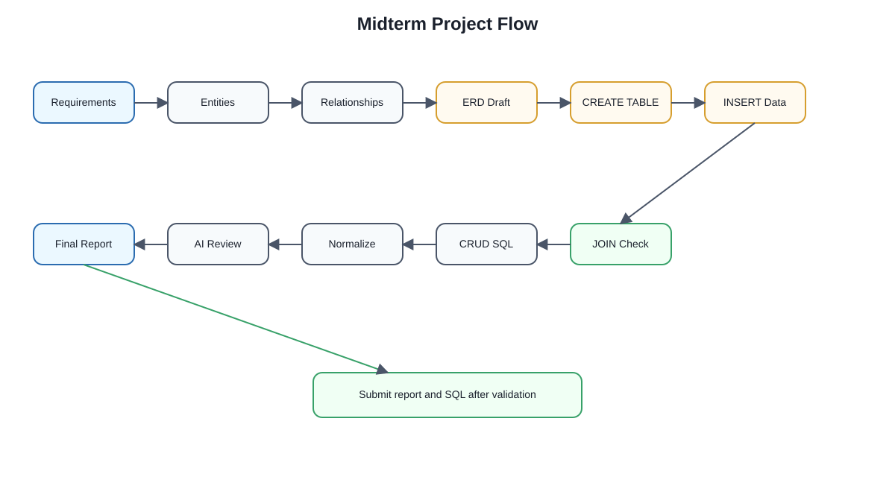
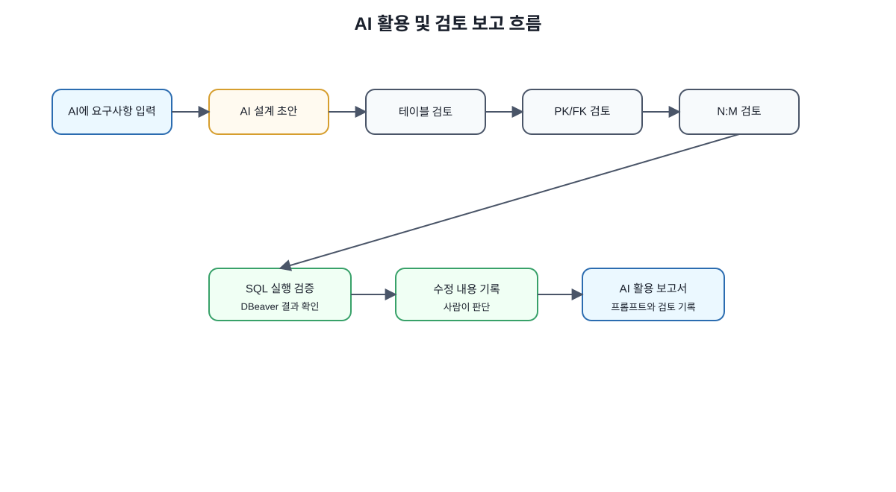
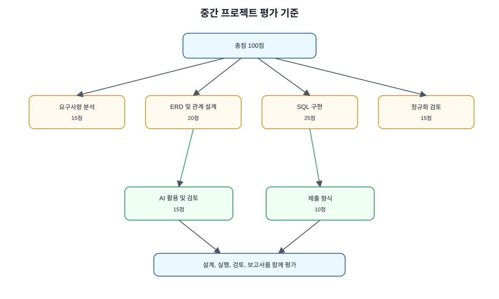

# Chapter 07. 중간 프로젝트 또는 중간 평가

> 상태: 원고 1차 확장 완료 / 도식 삽입 완료

---

## 이 장에서 수행할 프로젝트

이번 장에서는 Chapter 01부터 Chapter 06까지 배운 내용을 종합하여 **온라인 강의 수강신청 시스템**의 데이터베이스를 설계합니다.

이 장은 새로운 개념을 많이 배우는 장이라기보다, 지금까지 배운 내용을 실제 프로젝트 형태로 적용하는 장입니다. 요구사항을 읽고, 엔터티와 속성을 찾고, ERD를 작성하고, PostgreSQL 테이블을 만들고, 샘플 데이터와 SQL로 설계를 검증합니다.

또한 ChatGPT 또는 Codex가 만든 데이터베이스 설계와 SQL을 그대로 사용하지 않고, 사람이 검토하고 수정하는 과정을 포함합니다.

---

## 1. 프로젝트 목표

중간 프로젝트의 목표는 다음과 같습니다.



그림 7-1 중간 프로젝트 진행 흐름

```text
1. 요구사항에서 엔터티와 속성을 찾을 수 있다.
2. 테이블 사이의 1:N, N:M 관계를 설명할 수 있다.
3. 기본키와 외래키를 사용해 관계형 데이터베이스 구조를 만들 수 있다.
4. PostgreSQL 기준 CREATE TABLE SQL을 작성할 수 있다.
5. 샘플 데이터를 입력하고 SELECT로 확인할 수 있다.
6. 기본 CRUD SQL을 작성할 수 있다.
7. 정규화 관점에서 테이블 구조를 검토할 수 있다.
8. AI가 생성한 설계와 SQL을 사람이 검토할 수 있다.
```

프로젝트가 끝나면 다음 산출물을 제출합니다.

```text
- 요구사항 분석 문서
- 엔터티/속성 정리표
- ERD 초안
- SQL 파일
- 실행 결과 기록
- 정규화 검토 보고서
- AI 활용 및 검토 보고서
```

---

## 2. 프로젝트 시나리오

온라인 강의 서비스는 학생이 강의를 검색하고 수강신청할 수 있는 시스템입니다.

서비스에는 학생, 강사, 강의, 수강신청 정보가 필요합니다. 학생은 여러 강의를 신청할 수 있고, 하나의 강의에도 여러 학생이 등록할 수 있습니다. 강사는 여러 강의를 개설할 수 있고, 하나의 강의는 한 명의 강사가 담당합니다.

기본 요구사항은 다음과 같습니다.

```text
1. 학생은 이름, 이메일, 가입일을 가진다.
2. 강사는 이름, 이메일, 전문분야를 가진다.
3. 강의는 제목, 설명, 난이도, 수강료, 개설일을 가진다.
4. 하나의 강의는 한 명의 강사가 담당한다.
5. 한 명의 강사는 여러 강의를 개설할 수 있다.
6. 학생은 여러 강의를 수강신청할 수 있다.
7. 하나의 강의에는 여러 학생이 수강신청할 수 있다.
8. 수강신청 정보에는 신청일, 수강상태, 결제금액을 저장한다.
9. 수강상태는 신청, 수강중, 완료, 취소 중 하나로 관리한다.
10. 학생 이메일과 강사 이메일은 중복될 수 없다.
```

---

## 3. 요구사항 분석

먼저 요구사항에서 중요한 명사를 찾습니다.

```text
학생, 이름, 이메일, 가입일, 강사, 전문분야, 강의, 제목, 설명, 난이도, 수강료, 개설일, 수강신청, 신청일, 수강상태, 결제금액
```


그림 7-2 요구사항에서 엔터티 도출

이 중 테이블 후보가 될 수 있는 것은 다음입니다.

| 명사 후보 | 테이블 후보 여부 | 이유 |
| --- | --- | --- |
| 학생 | 가능 | 독립적으로 관리해야 하는 사용자 |
| 강사 | 가능 | 강의를 개설하는 독립 대상 |
| 강의 | 가능 | 서비스의 핵심 상품 |
| 수강신청 | 가능 | 학생과 강의 사이의 신청 기록 |
| 이름 | 아님 | 학생 또는 강사의 속성 |
| 이메일 | 아님 | 학생 또는 강사의 속성 |
| 수강상태 | 아님 | 수강신청의 속성 |

따라서 기본 테이블 후보는 다음 네 개입니다.

```text
students
instructors
courses
enrollments
```

---

## 4. 엔터티와 속성 정리

각 테이블의 속성을 정리하면 다음과 같습니다.

| 테이블 | 역할 | 주요 속성 |
| --- | --- | --- |
| students | 학생 정보 관리 | id, name, email, joined_at |
| instructors | 강사 정보 관리 | id, name, email, specialty |
| courses | 강의 정보 관리 | id, instructor_id, title, description, level, price, opened_at |
| enrollments | 수강신청 정보 관리 | id, student_id, course_id, enrolled_at, status, paid_amount |

이 구조에서 `courses.instructor_id`는 `instructors.id`를 참조합니다.

`enrollments.student_id`는 `students.id`를 참조하고, `enrollments.course_id`는 `courses.id`를 참조합니다.

---

## 5. 관계 분석

테이블 사이의 관계는 다음과 같습니다.

| 관계 | 관계 유형 | 설명 |
| --- | --- | --- |
| instructors - courses | 1:N | 한 강사는 여러 강의를 개설할 수 있음 |
| students - enrollments | 1:N | 한 학생은 여러 수강신청 기록을 가질 수 있음 |
| courses - enrollments | 1:N | 한 강의는 여러 수강신청 기록을 가질 수 있음 |
| students - courses | N:M | 학생은 여러 강의를 신청하고, 강의에는 여러 학생이 등록됨 |

`students`와 `courses`는 직접 N:M 관계입니다. 관계형 데이터베이스에서는 N:M 관계를 직접 표현하지 않고 중간 테이블로 풀어야 합니다.

이 프로젝트에서는 `enrollments` 테이블이 중간 테이블 역할을 합니다.

```text
students 1:N enrollments N:1 courses
```


그림 7-4 학생-강의 N:M 관계 해소

---

## 6. ERD 초안 작성

ERD를 텍스트로 표현하면 다음과 같습니다.


그림 7-3 온라인 강의 수강신청 ERD

```text
instructors
- id PK
- name
- email
- specialty

courses
- id PK
- instructor_id FK -> instructors.id
- title
- description
- level
- price
- opened_at

students
- id PK
- name
- email
- joined_at

enrollments
- id PK
- student_id FK -> students.id
- course_id FK -> courses.id
- enrolled_at
- status
- paid_amount
```

관계는 다음과 같습니다.

```text
instructors 1:N courses
students 1:N enrollments
courses 1:N enrollments
students N:M courses는 enrollments로 해소
```

---

## 7. PostgreSQL 테이블 설계

ERD 초안을 PostgreSQL 테이블로 구현합니다. 전체 실행 가능한 SQL은 다음 파일에 정리되어 있습니다.

```text
code/chapter07/midterm_project_template.sql
```


그림 7-5 SQL 기반 설계 검증 흐름

SQL 파일에는 다음 내용이 포함되어야 합니다.

```text
- students 테이블 생성
- instructors 테이블 생성
- courses 테이블 생성
- enrollments 테이블 생성
- 샘플 데이터 입력
- 기본 테이블 조회
- JOIN 기반 수강신청 현황 조회
- SELECT, INSERT, UPDATE, DELETE 실습
- 정규화 검토용 확인 쿼리
```

초급 단계에서는 `status`를 `VARCHAR(20)`으로 두고, 가능한 값은 문서에서 관리합니다. 이후 더 엄격한 제약조건이 필요하면 `CHECK` 제약조건을 추가할 수 있습니다.

---

## 8. 샘플 데이터 입력

테이블을 만들었다면 다음과 같은 샘플 데이터를 입력합니다.

```text
students: 김민지, 이준호, 박서연
instructors: 문길래, 홍길동
courses: 데이터베이스 입문, 정규화 실습, 파이썬 데이터 분석
enrollments: 학생별 수강신청 기록
```

샘플 데이터는 다음을 검증하기 위해 필요합니다.

```text
- 한 학생이 여러 강의를 신청할 수 있는가?
- 한 강의에 여러 학생이 등록될 수 있는가?
- 한 강사가 여러 강의를 개설할 수 있는가?
- 수강상태와 결제금액을 수강신청 단위로 저장할 수 있는가?
```

---

## 9. 기본 조회 SQL

수강신청 현황을 학생 이름, 강의명, 강사명과 함께 조회하려면 JOIN을 사용합니다.

조회 결과에는 다음 항목이 포함되어야 합니다.

```text
- 수강신청 ID
- 학생 이름
- 강의명
- 강사명
- 수강상태
- 결제금액
- 신청일
```

이 SQL은 다음을 검증합니다.

```text
- 학생과 수강신청이 연결되는가?
- 강의와 수강신청이 연결되는가?
- 강의와 강사가 연결되는가?
- 수강신청 현황을 사용자가 이해할 수 있는 형태로 조회할 수 있는가?
```

---

## 10. CRUD SQL 작성

중간 프로젝트 SQL 파일에는 기본 CRUD 실습이 포함되어야 합니다.

| 구분 | 확인 내용 |
| --- | --- |
| SELECT | 특정 학생의 수강신청 목록을 조회할 수 있는가 |
| INSERT | 새로운 수강신청을 추가할 수 있는가 |
| UPDATE | 수강상태를 변경할 수 있는가 |
| DELETE | 취소된 수강신청을 삭제하거나 상태 변경으로 처리할 수 있는가 |

`UPDATE`와 `DELETE`를 실행하기 전에는 반드시 같은 조건으로 `SELECT`를 먼저 실행해야 합니다.

---

## 11. 정규화 관점 검토

이 프로젝트의 구조는 다음 기준으로 검토합니다.


그림 7-6 중간 프로젝트 정규화 검토

| 검토 항목 | 확인 질문 | 검토 결과 예시 |
| --- | --- | --- |
| 엔터티 분리 | 학생, 강사, 강의, 수강신청이 분리되었는가? | 분리됨 |
| 중복 감소 | 학생 이메일과 강사 이메일이 반복 저장되지 않는가? | 각 테이블에 한 번 저장 |
| N:M 관계 | 학생과 강의 관계를 중간 테이블로 풀었는가? | enrollments 사용 |
| 외래키 | 관계가 외래키로 표현되었는가? | student_id, course_id, instructor_id 사용 |
| 수정 이상 | 학생 이메일 변경 시 한 행만 수정하면 되는가? | students만 수정 |
| 삭제 이상 | 수강신청 삭제 시 학생/강의 정보가 남는가? | 남음 |

이 구조는 초급 프로젝트 기준으로 적절합니다. 다만 실제 서비스에서는 결제, 수료증, 진도율, 강의 섹션, 강의 영상 같은 추가 테이블이 필요할 수 있습니다.

---

## 12. AI 활용 방법

AI는 다음 작업에 활용할 수 있습니다.



그림 7-7 AI 활용 및 검토 보고 흐름

```text
- 요구사항에서 테이블 후보 찾기
- 테이블 컬럼 초안 만들기
- ERD 관계 설명 받기
- CREATE TABLE SQL 초안 만들기
- JOIN SQL 초안 만들기
- 정규화 검토 질문 만들기
- 오류 메시지 해석하기
```

예시 프롬프트는 다음과 같습니다.

```text
다음 요구사항을 바탕으로 PostgreSQL 기준 데이터베이스 테이블을 제안해 주세요.
각 테이블의 컬럼, 기본키, 외래키, 1:N/N:M 관계를 설명해 주세요.
또한 정규화 관점에서 문제가 없는지 검토해 주세요.

요구사항:
온라인 강의 서비스에는 학생, 강사, 강의, 수강신청 정보가 필요합니다.
학생은 여러 강의를 신청할 수 있고, 하나의 강의에도 여러 학생이 등록할 수 있습니다.
강사는 여러 강의를 개설할 수 있고, 하나의 강의는 한 명의 강사가 담당합니다.
```

AI의 답변은 초안으로만 사용합니다. 최종 설계는 다음 기준으로 사람이 검토해야 합니다.

```text
- 요구사항이 빠지지 않았는가?
- N:M 관계를 중간 테이블로 풀었는가?
- 기본키와 외래키가 정확한가?
- 중복과 이상 현상이 줄어드는가?
- PostgreSQL에서 실제 실행 가능한가?
- 샘플 데이터와 JOIN으로 검증했는가?
```

---

## 13. 제출 산출물

중간 프로젝트 제출 산출물은 다음과 같습니다.

| 번호 | 산출물 | 설명 |
| ---: | --- | --- |
| 1 | 요구사항 분석 문서 | 주요 명사, 엔터티 후보, 제외한 속성 정리 |
| 2 | 엔터티/속성 정리표 | 각 테이블의 컬럼과 의미 정리 |
| 3 | ERD 초안 | 그림 또는 텍스트 ERD 모두 허용 |
| 4 | SQL 파일 | 테이블 생성, 샘플 데이터, 조회, 수정 SQL 포함 |
| 5 | 실행 결과 기록 | 주요 SELECT 결과와 오류 해결 기록 |
| 6 | 정규화 검토 보고서 | 중복, 이상 현상, N:M 관계 검토 |
| 7 | AI 활용 및 검토 보고서 | 사용한 프롬프트, AI 답변 요약, 수정한 내용 |

제출 파일명 예시는 다음과 같습니다.

```text
학번_이름_midterm_project.md
학번_이름_midterm_project.sql
```

---

## 14. 평가 기준

총점 100점 기준 예시는 다음과 같습니다.



그림 7-8 중간 프로젝트 평가 기준

| 평가 항목 | 배점 | 평가 기준 |
| --- | ---: | --- |
| 요구사항 분석 | 15 | 주요 엔터티와 속성을 적절히 도출했는가 |
| ERD 및 관계 설계 | 20 | PK/FK, 1:N, N:M 관계를 정확히 표현했는가 |
| SQL 구현 | 25 | 테이블 생성, 샘플 데이터, 조회, 수정 SQL이 실행 가능한가 |
| 정규화 검토 | 15 | 중복, 이상 현상, 중간 테이블 필요성을 설명했는가 |
| AI 활용 및 검토 | 15 | AI 결과를 비판적으로 검토하고 수정했는가 |
| 제출 형식 | 10 | 산출물이 명확하고 재현 가능한가 |

---

## 15. 감점 기준 예시

| 감점 상황 | 감점 예시 |
| --- | ---: |
| 요구사항에서 핵심 엔터티 누락 | -5 ~ -10 |
| N:M 관계를 중간 테이블 없이 처리 | -10 ~ -15 |
| 기본키 또는 외래키 누락 | -5 ~ -15 |
| SQL 실행 오류가 많고 수정 기록 없음 | -10 ~ -20 |
| 수정/삭제 조건 확인이 없음 | -10 ~ -20 |
| 정규화 검토 내용이 형식적임 | -5 ~ -10 |
| AI 답변을 그대로 붙여 넣고 검토가 없음 | -10 ~ -20 |
| 제출 파일명 또는 필수 산출물 누락 | -3 ~ -10 |

---

## 16. 프로젝트 진행 순서

권장 진행 순서는 다음과 같습니다.

```text
1. 요구사항을 읽고 명사 후보를 찾는다.
2. 테이블 후보와 속성을 정리한다.
3. 관계를 분석한다.
4. ERD 초안을 작성한다.
5. CREATE TABLE SQL을 작성한다.
6. 샘플 데이터를 입력한다.
7. JOIN으로 요구사항을 검증한다.
8. CRUD SQL을 작성한다.
9. 정규화 관점으로 설계를 검토한다.
10. AI가 만든 결과와 본인 설계를 비교한다.
11. 최종 보고서를 작성한다.
```

---

## 17. 자주 하는 실수

### 실수 1. 학생과 강의를 직접 연결하려고 한다

학생과 강의는 N:M 관계입니다. 따라서 `students` 테이블에 `course_id` 하나만 두면 여러 강의를 신청하는 요구사항을 표현하기 어렵습니다.

### 실수 2. 강사 정보를 courses 테이블에 반복 저장한다

강사 이름과 이메일을 `courses`에 직접 넣으면 강사가 여러 강의를 개설할 때 정보가 반복됩니다. `instructors` 테이블을 분리하고 `courses.instructor_id`로 연결하는 것이 좋습니다.

### 실수 3. SQL만 제출하고 설계 설명이 없다

이 프로젝트는 SQL 작성뿐 아니라 설계 판단을 평가합니다. 왜 테이블을 나누었는지, 왜 외래키가 필요한지 설명해야 합니다.

### 실수 4. AI가 만든 SQL을 검증하지 않는다

AI가 만든 SQL은 실행 오류가 있을 수 있고, 요구사항을 빠뜨릴 수 있습니다. 반드시 DBeaver에서 실행하고 결과를 확인해야 합니다.

### 실수 5. 수정과 삭제를 바로 실행한다

수정과 삭제 전에는 같은 조건으로 SELECT를 먼저 실행해야 합니다.

---

## 18. 정리

이번 장에서는 중간 프로젝트 형식으로 Chapter 01~06의 내용을 종합했습니다.

핵심은 다음과 같습니다.

```text
1. 요구사항을 테이블 구조로 바꾸는 능력이 중요하다.
2. 엔터티와 속성을 구분해야 한다.
3. N:M 관계는 중간 테이블로 풀어야 한다.
4. 기본키와 외래키는 관계형 데이터베이스 설계의 핵심이다.
5. SQL은 설계를 검증하는 도구이다.
6. 정규화는 중복과 이상 현상을 줄이기 위한 검토 기준이다.
7. AI는 초안을 만드는 데 도움을 주지만 최종 판단은 사람이 해야 한다.
```

중간 프로젝트의 가장 중요한 문장은 다음입니다.

```text
좋은 데이터베이스 프로젝트는 SQL을 많이 쓰는 것이 아니라, 요구사항을 정확한 테이블과 관계로 바꾸고 실행 결과로 검증하는 것이다.
```

---

## 19. 다음 장에서는

다음 장에서는 JOIN과 집계 쿼리를 더 깊게 학습합니다.

Chapter 08에서는 중간 프로젝트에서 만든 `students`, `courses`, `enrollments`, `instructors` 구조를 바탕으로 다음 내용을 다룹니다.

```text
- INNER JOIN과 OUTER JOIN
- 여러 테이블 JOIN
- GROUP BY
- COUNT, SUM, AVG
- HAVING
- 수강생 수, 강의별 매출, 상태별 통계 조회
```

Chapter 07의 프로젝트 구조는 Chapter 08의 JOIN과 집계 실습의 기반이 됩니다.
