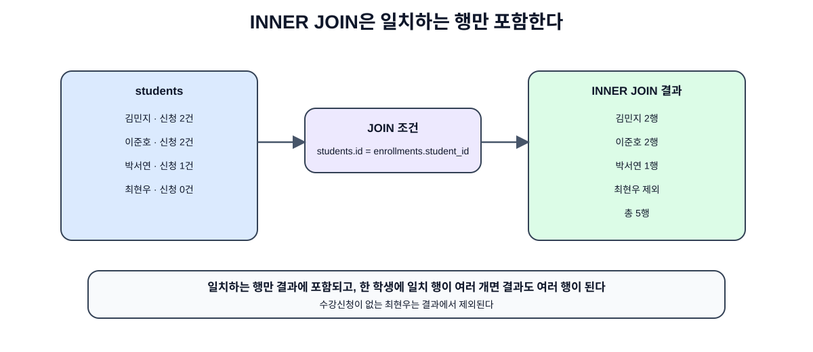
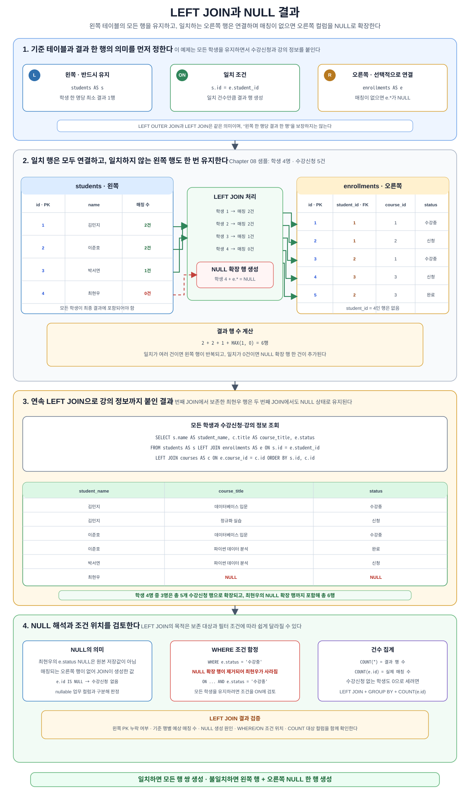
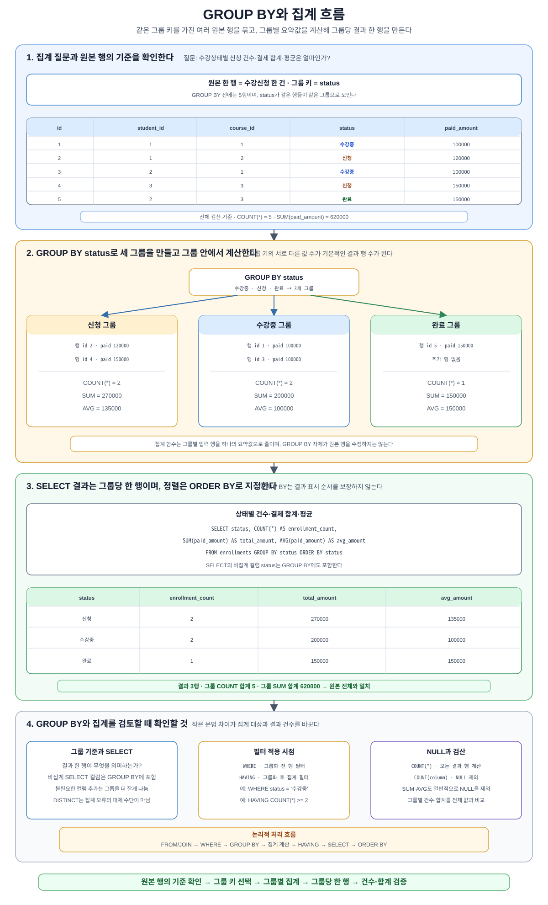
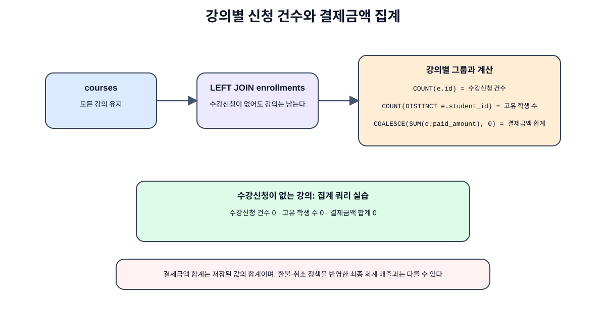

# Chapter 08. JOIN과 집계 쿼리

---

## 이 장에서 살펴볼 내용

이 장에서는 여러 테이블의 데이터를 함께 조회하는 **JOIN**과 데이터를 요약하는 **집계 쿼리**를 살펴봅니다.

Chapter 07에서는 온라인 강의 수강신청 시스템을 설계했습니다. 그 결과 `students`, `instructors`, `courses`, `enrollments` 테이블이 만들어졌습니다. 하지만 테이블이 나뉘어 있으면 한 테이블만 조회해서는 원하는 정보를 모두 볼 수 없습니다.

예를 들어 수강신청 현황을 보려면 다음 정보가 함께 필요합니다.

```text
- 학생 이름: students 테이블
- 강의 제목: courses 테이블
- 강사 이름: instructors 테이블
- 수강상태와 결제금액: enrollments 테이블
```

이처럼 나뉘어 있는 테이블을 연결하는 방법이 JOIN입니다. 그리고 수강생 수, 강의별 매출, 상태별 인원처럼 데이터를 요약하는 방법이 집계 쿼리입니다.

이 장에서 다룰 내용은 다음과 같습니다.

- INNER JOIN
- LEFT JOIN
- 여러 테이블 JOIN
- 테이블 별칭 사용
- COUNT, SUM, AVG
- GROUP BY
- HAVING
- ORDER BY와 집계 결과 정렬
- JOIN과 집계를 함께 사용하는 방법
- AI가 만든 JOIN/집계 SQL 검토하기

---

## 1. 왜 JOIN과 집계 쿼리를 배워야 하는가

정규화된 데이터베이스에서는 데이터를 여러 테이블에 나누어 저장합니다. 이 구조는 중복을 줄이고 데이터 일관성을 높입니다. 하지만 조회할 때는 테이블을 다시 연결해야 합니다.


그림 8-1 JOIN이 필요한 이유

예를 들어 `enrollments` 테이블에는 `student_id`와 `course_id`만 저장되어 있습니다.

| id | student_id | course_id | status | paid_amount |
| ---: | ---: | ---: | --- | ---: |
| 1 | 1 | 1 | 수강중 | 100000 |
| 2 | 1 | 2 | 신청 | 120000 |

이 값만 보면 `student_id = 1`이 누구인지, `course_id = 2`가 어떤 강의인지 바로 알 수 없습니다.

따라서 `students`와 `courses` 테이블을 연결해야 합니다.

```sql
SELECT
    students.name AS student_name,
    courses.title AS course_title,
    enrollments.status
FROM enrollments
JOIN students ON enrollments.student_id = students.id
JOIN courses ON enrollments.course_id = courses.id;
```

JOIN은 정규화된 데이터베이스를 실제로 사용하는 데 필수적인 기술입니다.

집계 쿼리는 데이터를 요약할 때 사용합니다.

```text
- 강의별 수강생 수는 몇 명인가?
- 강의별 총 결제금액은 얼마인가?
- 수강상태별 인원은 몇 명인가?
- 강사별 개설 강의 수는 몇 개인가?
```

이런 질문은 단순 SELECT만으로는 답하기 어렵고, `GROUP BY`와 집계 함수가 필요합니다.

---

## 2. 실습에 사용할 테이블 구조

이 장에서는 Chapter 07에서 사용한 온라인 강의 수강신청 시스템을 계속 사용합니다.

기본 테이블은 다음과 같습니다.

```text
students(id, name, email, joined_at)
instructors(id, name, email, specialty)
courses(id, instructor_id, title, description, level, price, opened_at)
enrollments(id, student_id, course_id, enrolled_at, status, paid_amount)
```

관계는 다음과 같습니다.

```text
instructors 1:N courses
students 1:N enrollments
courses 1:N enrollments
students N:M courses는 enrollments로 해소
```

실습 전에 `code/chapter07/midterm_project_template.sql`을 실행해도 되고, Chapter 08 전용 실습 파일을 사용할 수도 있습니다.

---

## 3. INNER JOIN 이해하기

`INNER JOIN`은 양쪽 테이블에서 조건이 일치하는 데이터만 조회합니다.



그림 8-2 INNER JOIN 개념

학생과 수강신청을 연결해 보겠습니다.

```sql
SELECT
    students.name AS student_name,
    enrollments.course_id,
    enrollments.status
FROM students
INNER JOIN enrollments ON students.id = enrollments.student_id;
```

이 SQL은 다음 의미입니다.

```text
students.id 값과 enrollments.student_id 값이 같은 행만 연결한다.
```

결과는 다음과 같은 형태가 됩니다.

| student_name | course_id | status |
| --- | ---: | --- |
| 김민지 | 1 | 수강중 |
| 김민지 | 2 | 신청 |
| 이준호 | 1 | 수강중 |

`INNER JOIN`에서는 수강신청 기록이 없는 학생은 결과에 나오지 않습니다.

---

## 4. 테이블 별칭 사용하기

JOIN 쿼리는 여러 테이블이 등장하므로 SQL이 길어집니다. 이때 테이블 별칭을 사용하면 읽기 쉬워집니다.

```sql
SELECT
    s.name AS student_name,
    e.course_id,
    e.status
FROM students AS s
JOIN enrollments AS e ON s.id = e.student_id;
```

여기서 `students AS s`는 `students` 테이블을 `s`라는 짧은 이름으로 부르겠다는 뜻입니다.

초급 단계에서는 별칭을 사용할 때 다음 원칙을 지키면 좋습니다.

| 테이블 | 권장 별칭 |
| --- | --- |
| students | s |
| instructors | i |
| courses | c |
| enrollments | e |

별칭을 쓰면 긴 JOIN 쿼리도 훨씬 읽기 쉬워집니다.

---

## 5. 여러 테이블 JOIN

수강신청 현황을 제대로 보려면 학생, 수강신청, 강의, 강사 테이블을 모두 연결해야 합니다.


그림 8-3 여러 테이블 JOIN 경로

```sql
SELECT
    e.id AS enrollment_id,
    s.name AS student_name,
    c.title AS course_title,
    i.name AS instructor_name,
    e.status,
    e.paid_amount,
    e.enrolled_at
FROM enrollments AS e
JOIN students AS s ON e.student_id = s.id
JOIN courses AS c ON e.course_id = c.id
JOIN instructors AS i ON c.instructor_id = i.id
ORDER BY e.id;
```

이 SQL은 다음 관계를 따라갑니다.

```text
enrollments.student_id -> students.id
enrollments.course_id -> courses.id
courses.instructor_id -> instructors.id
```

여러 테이블 JOIN에서 가장 중요한 것은 `ON` 조건을 빠뜨리지 않는 것입니다. JOIN 조건이 잘못되면 결과 행이 비정상적으로 많아질 수 있습니다.

---

## 6. LEFT JOIN 이해하기

`LEFT JOIN`은 왼쪽 테이블의 모든 행을 유지하고, 오른쪽 테이블에서 일치하는 값이 있으면 함께 보여 줍니다.



그림 8-4 LEFT JOIN과 NULL 결과

예를 들어 모든 학생을 조회하되, 수강신청이 있으면 함께 보여 주고 싶다고 가정합니다.

```sql
SELECT
    s.name AS student_name,
    c.title AS course_title,
    e.status
FROM students AS s
LEFT JOIN enrollments AS e ON s.id = e.student_id
LEFT JOIN courses AS c ON e.course_id = c.id
ORDER BY s.id;
```

이 경우 수강신청이 없는 학생도 결과에 나타납니다. 다만 강의 제목과 수강상태는 `NULL`로 표시될 수 있습니다.

`LEFT JOIN`은 다음 상황에서 자주 사용합니다.

```text
- 수강신청이 없는 학생 찾기
- 아직 수강생이 없는 강의 찾기
- 주문이 없는 고객 찾기
- 댓글이 없는 게시글 찾기
```

수강신청이 없는 학생만 찾고 싶다면 다음처럼 작성할 수 있습니다.

```sql
SELECT
    s.id,
    s.name,
    s.email
FROM students AS s
LEFT JOIN enrollments AS e ON s.id = e.student_id
WHERE e.id IS NULL;
```

---

## 7. 집계 함수 이해하기

집계 함수는 여러 행을 하나의 요약값으로 계산합니다.

대표적인 집계 함수는 다음과 같습니다.

| 함수 | 의미 | 예시 |
| --- | --- | --- |
| COUNT | 행 개수 계산 | 수강신청 수 |
| SUM | 합계 계산 | 총 결제금액 |
| AVG | 평균 계산 | 평균 결제금액 |
| MIN | 최솟값 | 가장 낮은 수강료 |
| MAX | 최댓값 | 가장 높은 수강료 |

전체 수강신청 수를 구하려면 다음처럼 작성합니다.

```sql
SELECT COUNT(*) AS enrollment_count
FROM enrollments;
```

전체 결제금액 합계를 구하려면 다음처럼 작성합니다.

```sql
SELECT SUM(paid_amount) AS total_paid_amount
FROM enrollments;
```

평균 결제금액은 다음과 같습니다.

```sql
SELECT AVG(paid_amount) AS avg_paid_amount
FROM enrollments;
```

---

## 8. GROUP BY 이해하기

`GROUP BY`는 같은 값을 가진 행을 그룹으로 묶고, 그룹별로 집계합니다.



그림 8-5 GROUP BY와 집계 흐름

예를 들어 수강상태별 인원을 구해 보겠습니다.

```sql
SELECT
    status,
    COUNT(*) AS enrollment_count
FROM enrollments
GROUP BY status
ORDER BY status;
```

결과는 다음과 같은 형태입니다.

| status | enrollment_count |
| --- | ---: |
| 신청 | 2 |
| 수강중 | 2 |

`GROUP BY`를 사용할 때 중요한 규칙이 있습니다.

```text
SELECT에 집계 함수가 아닌 컬럼을 쓰면, 그 컬럼은 GROUP BY에도 포함되어야 한다.
```

예를 들어 다음 SQL은 올바릅니다.

```sql
SELECT
    status,
    COUNT(*)
FROM enrollments
GROUP BY status;
```

하지만 `status`를 `GROUP BY`에 넣지 않으면 오류가 발생합니다.

---

## 9. 강의별 수강생 수 구하기

강의별 수강생 수를 구하려면 `courses`와 `enrollments`를 JOIN한 뒤 `courses` 기준으로 그룹화합니다.



그림 8-6 강의별 수강생 수와 매출 집계

```sql
SELECT
    c.id AS course_id,
    c.title AS course_title,
    COUNT(e.id) AS student_count
FROM courses AS c
JOIN enrollments AS e ON c.id = e.course_id
GROUP BY c.id, c.title
ORDER BY c.id;
```

이 SQL은 다음 의미입니다.

```text
1. courses와 enrollments를 course_id 기준으로 연결한다.
2. 강의별로 그룹을 만든다.
3. 각 그룹의 수강신청 수를 COUNT로 계산한다.
```

수강생이 없는 강의도 포함하려면 `LEFT JOIN`을 사용합니다.

```sql
SELECT
    c.id AS course_id,
    c.title AS course_title,
    COUNT(e.id) AS student_count
FROM courses AS c
LEFT JOIN enrollments AS e ON c.id = e.course_id
GROUP BY c.id, c.title
ORDER BY c.id;
```

`COUNT(*)`가 아니라 `COUNT(e.id)`를 사용하는 이유는 수강신청이 없는 강의에서 잘못된 1건으로 계산되는 것을 피하기 위해서입니다.

---

## 10. 강의별 매출 구하기

강의별 매출은 수강신청의 `paid_amount` 합계로 구할 수 있습니다.

```sql
SELECT
    c.title AS course_title,
    SUM(e.paid_amount) AS total_amount
FROM courses AS c
JOIN enrollments AS e ON c.id = e.course_id
GROUP BY c.id, c.title
ORDER BY total_amount DESC;
```

수강신청이 없는 강의까지 포함하고 싶다면 `LEFT JOIN`과 `COALESCE`를 함께 사용할 수 있습니다.

```sql
SELECT
    c.title AS course_title,
    COALESCE(SUM(e.paid_amount), 0) AS total_amount
FROM courses AS c
LEFT JOIN enrollments AS e ON c.id = e.course_id
GROUP BY c.id, c.title
ORDER BY total_amount DESC;
```

`COALESCE`는 값이 `NULL`일 때 대신 사용할 값을 지정합니다. 여기서는 매출이 없는 강의를 0으로 표시하기 위해 사용했습니다.

---

## 11. 강사별 강의 수 구하기

강사별로 개설한 강의 수를 구하려면 `instructors`와 `courses`를 JOIN합니다.

```sql
SELECT
    i.name AS instructor_name,
    COUNT(c.id) AS course_count
FROM instructors AS i
LEFT JOIN courses AS c ON i.id = c.instructor_id
GROUP BY i.id, i.name
ORDER BY course_count DESC;
```

여기서는 `LEFT JOIN`을 사용했습니다. 아직 강의를 개설하지 않은 강사도 결과에 포함할 수 있기 때문입니다.

---

## 12. HAVING 이해하기

`WHERE`는 그룹을 만들기 전에 행을 필터링합니다. 반면 `HAVING`은 그룹을 만든 뒤 집계 결과를 기준으로 필터링합니다.


그림 8-7 SQL 실행 순서: WHERE, GROUP BY, HAVING

예를 들어 수강생이 2명 이상인 강의만 조회하려면 다음처럼 작성합니다.

```sql
SELECT
    c.title AS course_title,
    COUNT(e.id) AS student_count
FROM courses AS c
JOIN enrollments AS e ON c.id = e.course_id
GROUP BY c.id, c.title
HAVING COUNT(e.id) >= 2
ORDER BY student_count DESC;
```

`HAVING COUNT(e.id) >= 2`는 그룹별 수강생 수가 2명 이상인 결과만 남깁니다.

초급자가 자주 헷갈리는 차이는 다음과 같습니다.

| 구분 | 사용 시점 | 예시 |
| --- | --- | --- |
| WHERE | 그룹화 전 개별 행 필터링 | status = '수강중' |
| HAVING | 그룹화 후 집계 결과 필터링 | COUNT(*) >= 2 |

---

## 13. WHERE와 GROUP BY 함께 사용하기

수강상태가 `수강중`인 신청만 대상으로 강의별 수강생 수를 구할 수 있습니다.

```sql
SELECT
    c.title AS course_title,
    COUNT(e.id) AS active_student_count
FROM courses AS c
JOIN enrollments AS e ON c.id = e.course_id
WHERE e.status = '수강중'
GROUP BY c.id, c.title
ORDER BY active_student_count DESC;
```

실행 순서를 단순화하면 다음과 같습니다.

```text
1. FROM/JOIN으로 테이블을 연결한다.
2. WHERE로 필요한 행만 남긴다.
3. GROUP BY로 그룹을 만든다.
4. COUNT/SUM/AVG로 계산한다.
5. HAVING으로 집계 결과를 필터링한다.
6. ORDER BY로 정렬한다.
```

---

## 14. AI가 만든 JOIN/집계 SQL 검토하기

AI에게 다음처럼 요청할 수 있습니다.

```text
students, courses, enrollments, instructors 테이블을 사용해서
강의별 수강생 수와 총 결제금액을 조회하는 PostgreSQL SQL을 작성해 주세요.
```

AI가 SQL을 만들어 주더라도 다음을 반드시 검토해야 합니다.


그림 8-8 AI 생성 JOIN/집계 SQL 검토

| 검토 항목 | 확인 질문 |
| --- | --- |
| JOIN 조건 | ON 조건이 빠지지 않았는가? |
| 관계 방향 | enrollments.student_id와 students.id가 연결되었는가? |
| 중복 집계 | JOIN으로 인해 같은 금액이 중복 합산되지 않는가? |
| GROUP BY | SELECT의 일반 컬럼이 GROUP BY에 포함되었는가? |
| COUNT 대상 | LEFT JOIN에서 COUNT(*)를 잘못 쓰지 않았는가? |
| NULL 처리 | 매출이 없는 경우 NULL을 0으로 처리해야 하는가? |
| 실행 검증 | DBeaver에서 실제 실행했는가? |

AI가 만든 SQL은 답안이 아니라 초안입니다. 특히 JOIN과 집계는 작은 조건 오류로 결과가 크게 달라질 수 있습니다.

---

## 15. 자주 하는 실수

### 실수 1. JOIN 조건을 빠뜨린다

JOIN 조건이 빠지면 모든 행이 서로 조합되어 결과가 비정상적으로 많아질 수 있습니다.

### 실수 2. 어떤 테이블의 id인지 구분하지 않는다

여러 테이블에 `id` 컬럼이 있으므로 `students.id`, `courses.id`처럼 테이블명이나 별칭을 함께 써야 합니다.

### 실수 3. GROUP BY 없이 일반 컬럼과 집계 함수를 함께 쓴다

`SELECT status, COUNT(*) FROM enrollments;`처럼 쓰면 오류가 발생합니다. `status`를 기준으로 그룹화해야 합니다.

### 실수 4. LEFT JOIN에서 COUNT(*)를 무조건 사용한다

수강생이 없는 강의까지 포함할 때는 `COUNT(e.id)`처럼 오른쪽 테이블의 실제 값이 있는 컬럼을 세는 것이 안전합니다.

### 실수 5. HAVING과 WHERE를 혼동한다

개별 행 조건은 `WHERE`, 집계 결과 조건은 `HAVING`을 사용합니다.

---

## 16. 스스로 확인하기

### 16.1 개념 확인

1. INNER JOIN과 LEFT JOIN의 차이를 설명해 보세요.
2. GROUP BY가 필요한 이유를 설명해 보세요.
3. WHERE와 HAVING의 차이를 설명해 보세요.
4. LEFT JOIN에서 COUNT(*) 대신 COUNT(e.id)를 사용할 때의 장점을 설명해 보세요.
5. AI가 만든 JOIN SQL을 검토할 때 확인해야 할 항목을 3가지 이상 정리해 보세요.

### 16.2 SQL 작성 문제

다음 SQL을 작성해 보세요.

```text
1. 학생별 수강신청 수를 조회한다.
2. 강의별 총 결제금액을 조회한다.
3. 수강상태별 수강신청 수를 조회한다.
4. 강사별 개설 강의 수를 조회한다.
5. 수강생이 2명 이상인 강의만 조회한다.
```

---

## 17. 정리

이번 장에서는 JOIN과 집계 쿼리를 살펴보았습니다.

핵심 내용을 정리하면 다음과 같습니다.

```text
1. JOIN은 여러 테이블에 나뉜 데이터를 연결해 조회하는 방법이다.
2. INNER JOIN은 양쪽 테이블에 모두 일치하는 데이터만 보여 준다.
3. LEFT JOIN은 왼쪽 테이블의 모든 행을 유지한다.
4. 테이블 별칭을 사용하면 JOIN 쿼리를 읽기 쉽게 만들 수 있다.
5. COUNT, SUM, AVG는 데이터를 요약하는 집계 함수이다.
6. GROUP BY는 같은 값을 가진 행을 그룹으로 묶는다.
7. HAVING은 집계 결과를 기준으로 필터링할 때 사용한다.
8. JOIN과 집계를 함께 사용할 때는 중복 집계와 NULL 처리에 주의해야 한다.
9. AI가 만든 SQL도 반드시 사람이 실행하고 결과를 검토해야 한다.
```

### JOIN/집계 SQL 실행 전 확인표

| 확인 항목 | 확인 질문 |
| --- | --- |
| JOIN 대상 | 어떤 테이블들을 연결해야 하는가? |
| JOIN 조건 | ON 조건이 외래키 관계와 맞는가? |
| JOIN 종류 | INNER JOIN과 LEFT JOIN 중 어느 것이 요구사항에 맞는가? |
| 집계 기준 | 어떤 컬럼을 기준으로 GROUP BY해야 하는가? |
| 집계 함수 | COUNT, SUM, AVG 중 어떤 함수를 사용해야 하는가? |
| COUNT 대상 | LEFT JOIN에서 COUNT(*) 대신 COUNT(오른쪽_테이블.id)가 필요한가? |
| 필터 위치 | 개별 행 조건은 WHERE, 집계 결과 조건은 HAVING에 작성했는가? |
| 결과 검증 | 결과 행 수와 합계가 요구사항과 맞는가? |
| AI 검토 | AI가 만든 SQL을 그대로 쓰지 않고 실행 결과를 확인했는가? |

이 장에서 가장 중요한 문장은 다음입니다.

```text
JOIN과 집계 쿼리는 정규화된 테이블을 실제 분석 가능한 정보로 바꾸는 기술이다.
```

---

## 18. 다음 장에서는

다음 장에서는 트랜잭션과 데이터 정합성을 살펴봅니다.

Chapter 09에서는 데이터베이스에서 여러 작업이 하나의 단위로 처리되어야 하는 이유를 살펴봅니다.

예를 들어 수강신청과 결제 처리는 함께 성공하거나 함께 실패해야 합니다. 이를 위해 트랜잭션, COMMIT, ROLLBACK, 데이터 정합성 개념을 다룹니다.
