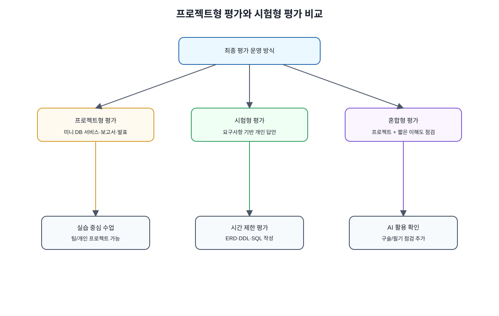
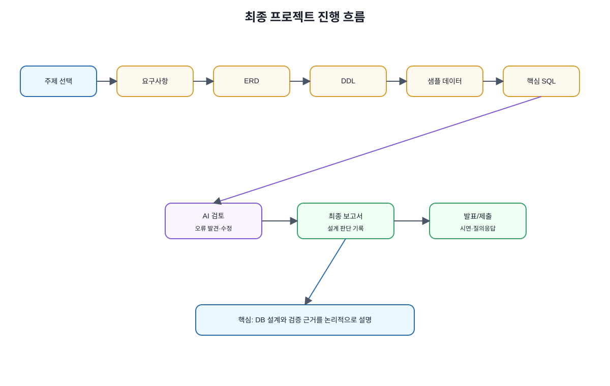
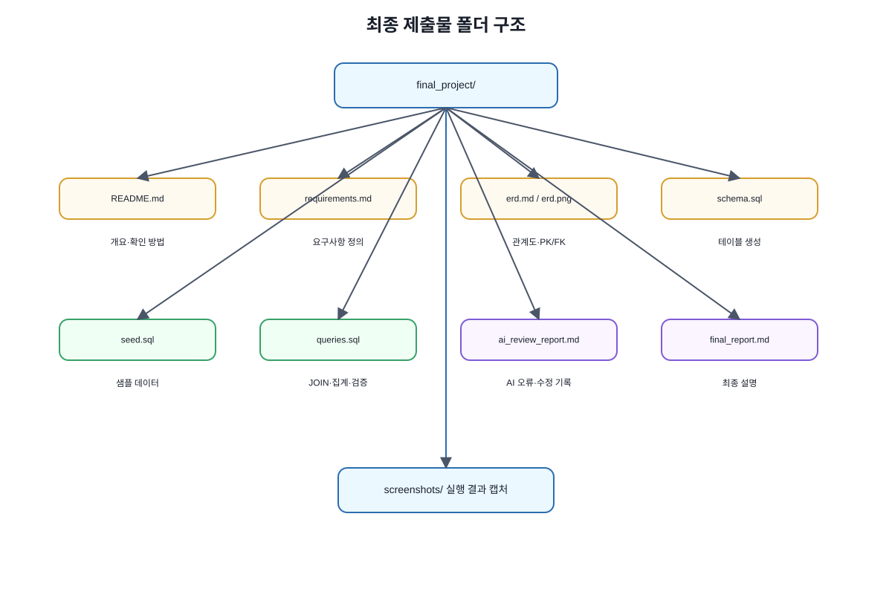
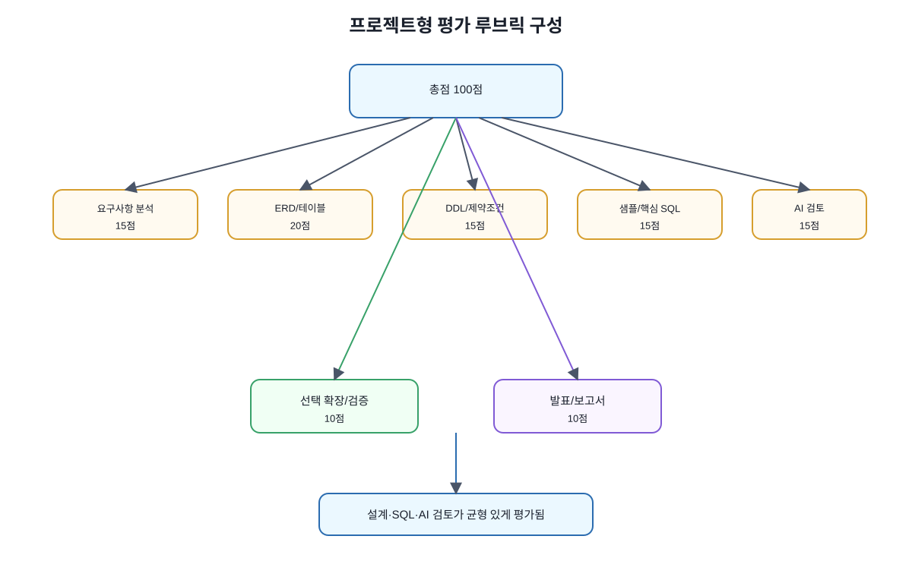
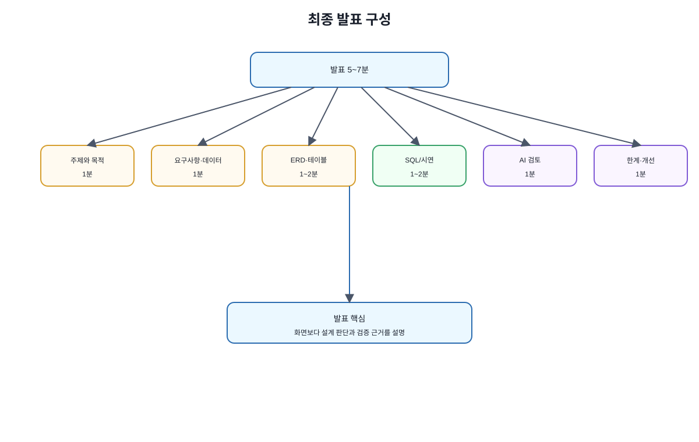
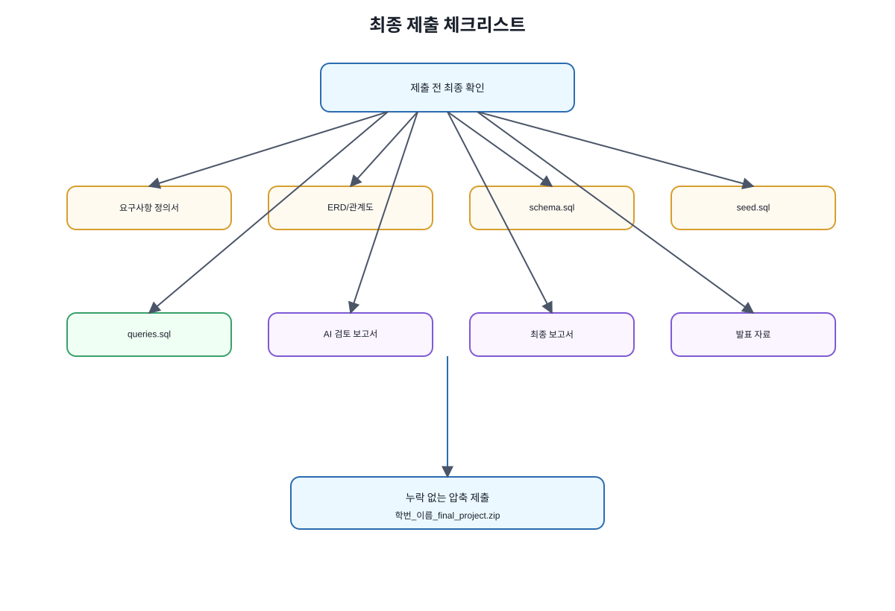

# Chapter 15. 최종 프로젝트 또는 최종 평가

> 상태: 원고 1차 리뷰 및 보완 완료

---

## 이 장에서 수행할 내용

이 장에서는 지금까지 학습한 내용을 종합해 **최종 프로젝트** 또는 **최종 평가**를 수행합니다.

앞 장까지 우리는 데이터베이스의 기본 개념, PostgreSQL 실습 환경, 관계형 데이터베이스, SQL, ERD, 정규화, 중간 프로젝트, JOIN, 트랜잭션, 인덱스, 보안과 백업, NoSQL, AI 기반 DB 설계 검증, Vector DB와 RAG 기초를 학습했습니다.

이제 중요한 것은 개별 개념을 따로 아는 것이 아니라, 하나의 작은 서비스나 평가 문제 안에서 종합적으로 활용하는 것입니다.

최종 프로젝트 또는 최종 평가는 다음 능력을 확인하는 데 목적이 있습니다.

```text
- 요구사항을 읽고 핵심 데이터를 찾을 수 있는가?
- ERD와 테이블 구조로 요구사항을 표현할 수 있는가?
- PostgreSQL DDL과 SQL을 작성할 수 있는가?
- PK, FK, UNIQUE, CHECK, NOT NULL을 적절히 사용할 수 있는가?
- 정규화와 중복 데이터 문제를 검토할 수 있는가?
- AI가 만든 설계와 SQL을 비판적으로 검토할 수 있는가?
- 필요한 경우 NoSQL 또는 Vector DB/RAG 활용 가능성을 판단할 수 있는가?
- 결과를 보고서와 발표로 설명할 수 있는가?
```

---

## 1. 왜 최종 프로젝트가 필요한가

데이터베이스는 문법만 외워서는 잘 사용할 수 없습니다. `SELECT`, `JOIN`, `GROUP BY`, `CREATE TABLE` 문법을 알고 있어도 실제 서비스의 요구사항을 데이터 구조로 바꾸는 과정은 별도의 연습이 필요합니다.

예를 들어 “온라인 강의 플랫폼”을 만든다고 할 때 다음 질문에 답해야 합니다.

```text
- 학생, 강사, 강의, 수강신청, 결제는 각각 어떤 테이블로 표현할 것인가?
- 학생과 강의의 관계는 1:N인가, N:M인가?
- 결제 상태는 어떤 값만 허용할 것인가?
- 강의 가격은 어떤 데이터 타입을 사용할 것인가?
- 삭제된 강의의 수강신청 이력은 어떻게 처리할 것인가?
- AI가 만든 설계가 요구사항을 제대로 반영했는가?
```

최종 프로젝트는 이런 질문에 직접 답해 보는 과정입니다.

```text
최종 프로젝트의 핵심은 결과물을 멋지게 꾸미는 것이 아니라, 데이터베이스 설계와 검증 과정을 논리적으로 설명하는 것이다.
```

---

## 2. 최종 평가 운영 방식

이 장은 수업 상황에 따라 두 가지 방식으로 운영할 수 있습니다.



그림 15-2 프로젝트형 평가와 시험형 평가 비교

| 방식 | 설명 | 적합한 상황 |
| --- | --- | --- |
| 프로젝트형 평가 | 팀 또는 개인이 작은 DB 기반 서비스를 설계하고 일부 구현 | 실습 중심 수업, 발표 가능 수업 |
| 시험형 평가 | 제시된 요구사항을 바탕으로 ERD, DDL, SQL, 검토 답안을 작성 | 시간 제한 평가, 개인 평가 중심 수업 |
| 혼합형 평가 | 프로젝트 제출 후 짧은 구술 또는 필기 점검 추가 | AI 활용 여부와 본인 이해도 확인 필요 |

두 방식 중 하나만 선택해도 되고, 프로젝트형 평가를 기본으로 하되 짧은 구술 또는 필기 점검을 추가할 수도 있습니다.

추천 운영 방식은 다음과 같습니다.

```text
- 대학 수업 15주차: 프로젝트 발표 및 최종 평가
- 부트캠프/실무 교육: 미니 서비스 구현 + 발표
- 온라인 수업: 보고서 + SQL 파일 + 짧은 시연 영상 제출
- 시험 중심 수업: 요구사항 분석 + ERD + SQL + AI 검토 보고서 제출
```

---

## 3. 프로젝트형 평가 개요

프로젝트형 평가는 하나의 작은 서비스를 정하고 데이터베이스를 설계한 뒤, 최소한의 SQL 또는 웹 CRUD 흐름으로 검증하는 방식입니다.



그림 15-1 최종 프로젝트 진행 흐름

전체 흐름은 다음과 같습니다.

```text
1. 프로젝트 주제 선택
2. 요구사항 정의
3. 핵심 엔터티 도출
4. ERD 작성
5. PostgreSQL DDL 작성
6. 샘플 데이터 입력
7. 핵심 SQL 작성
8. AI 설계 검토
9. 선택 기능 구현 또는 시연
10. 보고서 작성
11. 발표 또는 제출
```

여기서 웹 구현은 필수 수준을 낮게 잡는 것이 좋습니다. 이 책의 핵심은 데이터베이스 학습이므로, 웹 화면은 데이터가 실제로 저장되고 조회되는지 확인하는 정도면 충분합니다.

---

## 4. 프로젝트 주제 후보

다음 주제 중 하나를 선택하거나, 수업 목적에 맞게 변형할 수 있습니다.

| 주제 | 주요 데이터 | 확장 가능 기능 |
| --- | --- | --- |
| AI 튜터링 서비스 | 학생, 튜터, 질문, 답변, 학습 자료 | 질문 추천, 답변 평가, RAG 자료 검색 |
| 온라인 강의 플랫폼 | 학생, 강사, 강의, 수강신청, 결제 | 수강 이력, 강의 리뷰, 환불 규정 |
| RAG 기반 문서 검색 시스템 | 문서, 청크, 임베딩, 질문, 검색 로그 | 출처 표시, 답변 근거성 검토 |
| 쇼핑몰 주문/결제/재고 시스템 | 회원, 상품, 주문, 주문상세, 결제, 재고 | 재고 차감, 주문 취소, 매출 집계 |
| 병원 예약 시스템 | 환자, 의사, 진료과, 예약, 진료 기록 | 예약 변경, 중복 예약 방지 |
| 도서 대여 시스템 | 회원, 도서, 대여, 반납, 연체 | 연체료 계산, 인기 도서 집계 |
| 교회/동아리 출석 관리 | 회원, 모임, 출석, 역할, 알림 | 결석자 조회, 월별 출석 통계 |

초급자에게는 **온라인 강의 플랫폼** 또는 **도서 대여 시스템**이 가장 무난합니다. AI와 연결하고 싶다면 **AI 튜터링 서비스** 또는 **RAG 기반 문서 검색 시스템**을 선택할 수 있습니다.

---

## 5. 필수 산출물

프로젝트형 평가의 필수 산출물은 다음과 같습니다.



그림 15-3 최종 제출물 폴더 구조

```text
1. 요구사항 정의서
2. ERD 또는 테이블 관계도
3. PostgreSQL DDL 파일
4. 샘플 데이터 INSERT 파일
5. 핵심 SQL 파일
6. AI 활용 및 검토 보고서
7. 최종 보고서
8. 발표 자료 또는 시연 영상
```

선택 산출물은 다음과 같습니다.

```text
- 간단한 웹 CRUD 화면
- API 명세서
- GitHub 저장소 링크
- Vector DB/RAG 확장 설계
- NoSQL 선택 검토 자료
- 테스트 결과 캡처
```

초급 수업에서는 모든 것을 완벽히 구현하기보다, 데이터베이스 설계와 검증 근거를 명확히 제출하는 것이 중요합니다.

---

## 6. 요구사항 정의서 작성

요구사항 정의서는 프로젝트가 어떤 문제를 해결하는지 설명하는 문서입니다.

| 항목 | 작성 내용 |
| --- | --- |
| 프로젝트명 | 서비스 이름 |
| 프로젝트 목적 | 어떤 문제를 해결하는가 |
| 주요 사용자 | 관리자, 일반 사용자, 강사, 학생 등 |
| 주요 기능 | 등록, 조회, 수정, 삭제, 검색, 통계 등 |
| 핵심 데이터 | 저장해야 할 데이터 목록 |
| 제약조건 | 중복 금지, 상태값 제한, 필수 입력, 삭제 정책 등 |
| AI 활용 범위 | ChatGPT/Codex를 어디에 사용할 것인가 |

예시는 다음과 같습니다.

```text
프로젝트명: AI 튜터링 질문 관리 시스템
목적: 학생 질문과 튜터 답변을 저장하고, 자주 묻는 질문을 관리한다.
주요 사용자: 학생, 튜터, 관리자
주요 기능: 질문 등록, 답변 작성, 학습 자료 연결, 질문 상태 관리
핵심 데이터: 학생, 튜터, 질문, 답변, 학습 자료
제약조건: 질문 상태는 open, answered, closed 중 하나만 허용한다.
AI 활용 범위: ERD 초안 생성, SQL 오류 수정, 검토 체크리스트 작성
```

---

## 7. ERD와 테이블 설계 기준

ERD는 요구사항을 데이터 구조로 바꾸는 핵심 산출물입니다.

ERD 또는 테이블 설계를 제출할 때는 다음을 확인해야 합니다.

```text
- 핵심 엔터티가 빠지지 않았는가?
- 테이블 이름과 컬럼 이름이 일관적인가?
- 각 테이블의 역할이 명확한가?
- N:M 관계가 중간 테이블로 표현되었는가?
- 모든 테이블에 기본키가 있는가?
- 필요한 외래키가 누락되지 않았는가?
- 중복 데이터가 과도하지 않은가?
- 상태값과 금액, 날짜 컬럼의 타입이 적절한가?
```

예를 들어 AI 튜터링 서비스는 다음과 같은 테이블로 시작할 수 있습니다.

```text
students
tutors
questions
answers
learning_materials
question_materials
```

`questions`와 `learning_materials`가 N:M 관계라면 `question_materials` 같은 중간 테이블이 필요할 수 있습니다.

---

## 8. PostgreSQL DDL 작성 기준

DDL은 실제 테이블을 만드는 SQL입니다.

최종 프로젝트에서는 다음 요소를 반드시 포함하는 것을 권장합니다.

```text
- CREATE TABLE
- PRIMARY KEY
- FOREIGN KEY
- NOT NULL
- UNIQUE
- CHECK
- DEFAULT
- 적절한 데이터 타입
```

예시는 다음과 같습니다.

```sql
CREATE TABLE questions (
    id SERIAL PRIMARY KEY,
    student_id INTEGER NOT NULL REFERENCES students(id),
    title VARCHAR(200) NOT NULL,
    body TEXT NOT NULL,
    status VARCHAR(20) NOT NULL DEFAULT 'open'
        CHECK (status IN ('open', 'answered', 'closed')),
    created_at TIMESTAMP NOT NULL DEFAULT CURRENT_TIMESTAMP
);
```

이 DDL에서 확인할 점은 다음과 같습니다.

| 항목 | 설명 |
| --- | --- |
| `id SERIAL PRIMARY KEY` | 질문을 고유하게 식별 |
| `student_id` | 질문을 작성한 학생과 연결 |
| `NOT NULL` | 필수 값 누락 방지 |
| `CHECK` | 허용된 상태값만 저장 |
| `DEFAULT` | 기본 상태와 생성일 자동 입력 |

---

## 9. 샘플 데이터와 핵심 SQL

테이블만 만들면 설계가 제대로 되었는지 확인하기 어렵습니다. 반드시 샘플 데이터를 넣고 핵심 SQL을 실행해 보아야 합니다.


그림 15-4 DB 설계 검증 흐름

샘플 데이터는 정상 데이터, 관계가 연결된 데이터, 상태값이 다른 데이터, 집계나 JOIN 결과를 확인할 수 있는 데이터를 포함하는 것이 좋습니다.

핵심 SQL은 다음 유형을 포함할 수 있습니다.

| SQL 유형 | 예시 |
| --- | --- |
| 기본 조회 | 전체 질문 목록 조회 |
| 조건 조회 | 답변 대기 상태 질문 조회 |
| JOIN | 질문, 학생, 튜터, 답변 연결 조회 |
| 집계 | 학생별 질문 수, 튜터별 답변 수 |
| 정렬/제한 | 최근 질문 10개 조회 |
| 검증 쿼리 | 답변 없는 closed 질문 확인 |

예시는 다음과 같습니다.

```sql
SELECT
    q.id,
    s.name AS student_name,
    q.title,
    q.status,
    q.created_at
FROM questions q
JOIN students s ON q.student_id = s.id
ORDER BY q.created_at DESC;
```

---

## 10. AI 활용 허용 범위

이 프로젝트에서는 AI 활용을 금지하지 않습니다. 오히려 AI를 사용하는 과정을 기록하고 검토하는 것이 중요합니다.


그림 15-5 AI 활용 및 검토 루프

다만 AI가 만든 결과를 그대로 제출하면 안 됩니다.

| 활용 범위 | 허용 여부 | 조건 |
| --- | --- | --- |
| 요구사항 정리 초안 | 허용 | 본인이 수정해야 함 |
| ERD 초안 생성 | 허용 | 누락/오류 검토 필요 |
| DDL 초안 생성 | 허용 | PK/FK/제약조건 검토 필요 |
| SQL 오류 수정 | 허용 | 오류 원인과 수정 이유 기록 |
| 보고서 문장 다듬기 | 허용 | 본인 이해와 결과를 반영해야 함 |
| 전체 결과물 자동 생성 후 무검토 제출 | 불가 | 평가 대상에서 제외 또는 큰 감점 |

AI 활용 보고서에는 사용한 AI 도구, 주요 프롬프트, AI가 생성한 결과, 사람이 수정한 부분, AI 결과에서 발견한 오류, 최종적으로 사람이 판단한 근거를 포함합니다.

---

## 11. AI 검토 보고서 작성

AI 검토 보고서는 이 책의 핵심 철학을 반영하는 산출물입니다.

다음 질문에 답해야 합니다.

```text
1. AI가 처음 제안한 테이블 구조는 무엇이었는가?
2. 그 구조에서 어떤 문제가 발견되었는가?
3. PK, FK, 제약조건은 적절했는가?
4. 정규화 관점에서 중복 데이터는 없었는가?
5. 보안이나 개인정보 위험은 없었는가?
6. AI가 만든 SQL이 PostgreSQL에서 정상 실행되었는가?
7. 오류가 있었다면 어떻게 수정했는가?
8. 최종 설계를 선택한 이유는 무엇인가?
```

좋은 보고서는 단순히 “AI를 사용했다”라고 쓰지 않습니다. AI 결과를 어떤 기준으로 검토했고 무엇을 수정했는지 설명합니다.

---

## 12. 선택 확장: NoSQL 또는 Vector DB/RAG 검토

프로젝트 주제에 따라 NoSQL 또는 Vector DB/RAG를 선택 확장으로 검토할 수 있습니다.

| 상황 | 검토할 수 있는 기술 |
| --- | --- |
| 사용자 활동 로그가 매우 많음 | Column-family 또는 로그 저장소 |
| 장바구니 임시 저장이 필요함 | Key-Value DB |
| 상품 속성이 매우 다양함 | Document DB 또는 JSONB |
| 친구 관계나 추천 관계가 중요함 | Graph DB |
| 문서 기반 질의응답이 필요함 | Vector DB/RAG |
| 내부 매뉴얼 검색이 필요함 | Vector DB/RAG |

선택 확장을 반드시 구현할 필요는 없습니다. 다만 왜 이 기능에 해당 기술이 적합한지, 관계형 DB만 사용할 때의 한계는 무엇인지, 해당 기술을 도입하면 어떤 운영 부담이 생기는지, 실제 프로젝트에서는 언제 도입하는 것이 적절한지 설명할 수 있어야 합니다.

---

## 13. 프로젝트형 평가 루브릭

프로젝트형 평가의 100점 기준 예시는 다음과 같습니다.



그림 15-6 프로젝트형 평가 루브릭 구성

| 평가 항목 | 배점 | 평가 기준 |
| --- | ---: | --- |
| 요구사항 분석 | 15 | 문제 정의, 사용자, 기능, 핵심 데이터가 명확한가 |
| ERD 및 테이블 설계 | 20 | 엔터티, 관계, PK/FK, 정규화가 적절한가 |
| DDL 및 제약조건 | 15 | 데이터 타입, NOT NULL, UNIQUE, CHECK, FK가 적절한가 |
| 샘플 데이터와 핵심 SQL | 15 | INSERT, SELECT, JOIN, 집계, 검증 쿼리가 포함되었는가 |
| AI 활용 및 검토 보고서 | 15 | AI 결과의 오류와 수정 근거를 설명했는가 |
| 선택 확장 또는 구현 검증 | 10 | 웹 CRUD, NoSQL, RAG, API, 테스트 중 하나 이상을 검증했는가 |
| 발표/보고서 완성도 | 10 | 결과를 논리적으로 설명하고 제출 형식을 지켰는가 |

감점 기준 예시는 다음과 같습니다.

```text
- PK가 없는 핵심 테이블: 큰 감점
- FK가 필요한데 누락됨: 큰 감점
- 모든 컬럼을 TEXT로 저장: 감점
- AI 생성 결과를 검토 없이 그대로 제출: 큰 감점
- SQL 실행 결과를 확인하지 않음: 감점
- 요구사항과 테이블 구조가 맞지 않음: 큰 감점
- 제출 파일 누락: 항목별 감점
```

---

## 14. 시험형 평가 예시

프로젝트 대신 시험형 평가로 운영할 경우 다음과 같은 문제를 제시할 수 있습니다.

### 문제: AI 튜터링 질문 관리 시스템

다음 요구사항을 읽고 데이터베이스 설계와 검토 답안을 작성하세요.

```text
- 학생은 이름, 이메일, 가입일을 가진다.
- 튜터는 이름, 이메일, 전문 분야를 가진다.
- 학생은 질문을 등록할 수 있다.
- 질문은 제목, 본문, 상태, 등록일을 가진다.
- 튜터는 질문에 답변할 수 있다.
- 하나의 질문에는 여러 답변이 달릴 수 있다.
- 질문에는 관련 학습 자료를 연결할 수 있다.
- 하나의 질문은 여러 학습 자료와 연결될 수 있고, 하나의 학습 자료는 여러 질문에 연결될 수 있다.
- 질문 상태는 open, answered, closed 중 하나만 허용한다.
```

작성할 답안은 다음과 같습니다.

```text
1. 핵심 엔터티 목록
2. 테이블 설계
3. PK/FK 설명
4. N:M 관계 처리 방법
5. PostgreSQL DDL 일부
6. 핵심 SELECT/JOIN 쿼리 1개
7. AI가 만든 설계라고 가정하고 검토할 항목 5개
8. 보안 또는 개인정보 관점 주의사항 2개
```

---

## 15. 제출 형식

프로젝트형 제출 폴더 예시는 다음과 같습니다.

```text
final_project/
├── README.md
├── requirements.md
├── erd.png 또는 erd.md
├── schema.sql
├── seed.sql
├── queries.sql
├── ai_review_report.md
├── final_report.md
└── screenshots/
```

각 파일의 역할은 다음과 같습니다.

| 파일 | 내용 |
| --- | --- |
| `README.md` | 프로젝트 실행 또는 확인 방법 |
| `requirements.md` | 요구사항 정의 |
| `erd.png` 또는 `erd.md` | ERD 또는 테이블 관계도 |
| `schema.sql` | 테이블 생성 SQL |
| `seed.sql` | 샘플 데이터 입력 SQL |
| `queries.sql` | 핵심 조회 및 검증 SQL |
| `ai_review_report.md` | AI 활용 및 검토 보고서 |
| `final_report.md` | 최종 보고서 |
| `screenshots/` | 실행 결과 또는 화면 캡처 |

파일명에는 학번과 이름을 포함하는 것을 권장합니다.

```text
학번_이름_final_project.zip
```

---

## 16. 발표 구성

발표 시간은 5~7분 정도가 적절합니다.



그림 15-7 최종 발표 구성

추천 발표 구성은 다음과 같습니다.

| 순서 | 내용 | 권장 시간 |
| --- | --- | ---: |
| 1 | 프로젝트 주제와 목적 | 1분 |
| 2 | 요구사항과 핵심 데이터 | 1분 |
| 3 | ERD와 테이블 설계 | 1~2분 |
| 4 | 핵심 SQL 또는 화면 시연 | 1~2분 |
| 5 | AI 활용 및 검토 결과 | 1분 |
| 6 | 한계와 개선 방향 | 1분 |

발표에서는 모든 SQL을 자세히 설명하기보다, 설계 판단과 검증 결과를 중심으로 설명하는 것이 좋습니다.

---

## 17. 자주 하는 실수

### 실수 1. 화면부터 만들고 DB 설계를 나중에 한다

데이터베이스 수업의 최종 프로젝트에서는 화면보다 데이터 구조가 먼저입니다.

### 실수 2. AI가 만든 테이블을 그대로 사용한다

AI 결과는 초안입니다. 요구사항과 제약조건 기준으로 반드시 검토해야 합니다.

### 실수 3. FK를 생략한다

관계가 있는 데이터는 외래키로 정합성을 보호해야 합니다.

### 실수 4. 샘플 데이터가 부족하다

샘플 데이터가 너무 적으면 JOIN, 집계, 검증 쿼리를 확인하기 어렵습니다.

### 실수 5. 보고서에 실행 결과가 없다

SQL 실행 결과, 화면 캡처, 오류 수정 기록 등 검증 근거가 있어야 합니다.

### 실수 6. AI 활용 사실을 숨기거나 기록하지 않는다

이 책에서는 AI 활용 자체보다 AI 결과를 어떻게 검토했는지가 중요합니다.

---

## 18. 최종 점검 체크리스트

제출 전 다음 항목을 확인하세요.



그림 15-8 최종 제출 체크리스트

| 점검 항목 | 확인 |
| --- | --- |
| 요구사항 정의서가 있는가 |  |
| ERD 또는 테이블 관계도가 있는가 |  |
| 모든 핵심 테이블에 PK가 있는가 |  |
| 필요한 FK가 설정되어 있는가 |  |
| NOT NULL, UNIQUE, CHECK가 필요한 곳에 있는가 |  |
| 샘플 데이터가 충분한가 |  |
| 핵심 SQL이 실행되는가 |  |
| AI 활용 보고서가 있는가 |  |
| AI 결과의 오류와 수정 내용이 기록되어 있는가 |  |
| 보안/개인정보 검토가 포함되어 있는가 |  |
| 최종 보고서와 발표 자료가 준비되었는가 |  |

---

## 19. 최종 정리

이 책의 목표는 AI가 만들어 주는 결과를 그대로 사용하는 것이 아닙니다. 데이터베이스의 기본 원리를 바탕으로 AI 결과를 검토하고, 실행 가능한 설계와 SQL로 연결하는 것입니다.

최종 프로젝트 또는 최종 평가는 다음 문장으로 요약할 수 있습니다.

```text
AI를 활용하되, 데이터베이스 설계의 최종 책임은 사람이 진다.
```

지금까지 학습한 내용은 다음과 같이 연결됩니다.

```text
요구사항 분석
→ ERD 작성
→ 정규화와 제약조건 검토
→ SQL 작성
→ JOIN과 집계 확인
→ 트랜잭션, 인덱스, 보안 검토
→ NoSQL 또는 Vector DB/RAG 선택 가능성 검토
→ AI 생성 결과 검증
→ 최종 보고서와 발표
```

---

## 20. 이후 학습 방향

이 책을 마친 뒤에는 다음 주제로 확장할 수 있습니다.

```text
- PostgreSQL 심화
- 백엔드 API 개발
- ORM 활용
- 클라우드 DB 운영
- 데이터베이스 성능 튜닝
- LLM 기반 데이터 분석
- RAG 시스템 구현
- 데이터 파이프라인과 로그 분석
- 데이터 거버넌스와 보안
```

데이터베이스는 AI 시대에도 여전히 핵심입니다. AI가 코드를 도와줄수록, 사람이 데이터 구조와 검증 기준을 이해하는 능력은 더 중요해집니다.
