# AI 시대의 데이터베이스 입문

> 이 파일은 Overview와 Chapter 01~15 최신 원고를 기준으로 scripts/merge_chapters.py가 자동 생성한 통합본입니다.

<!-- 이 파일을 직접 수정하지 말고 각 chapter 원고를 수정한 뒤 병합 스크립트를 실행하세요. -->

# Overview. 이 책을 시작하기 전에

AI가 SQL을 만들어 주는데도 데이터베이스를 배워야 할까요? 이 책은 이 질문에서 시작합니다. AI가 초안을 만들고, 사람은 데이터의 의미와 실행 결과를 검증합니다.

기초 개념부터 첫 프로젝트, AI 검증, 종합 프로젝트까지 요구사항과 실행 증거를 계속 연결합니다. 목표는 SQL 문법을 외우는 데 그치지 않고, 현실의 정보를 구조화하고 결과가 실제 질문과 일치하는지 판단하는 힘을 기르는 것입니다.

## 이 책은 누구를 위한 책인가

이 책은 데이터베이스를 처음 배우는 일반 독자와 예비 개발자를 위한 실습형 입문서입니다. 데이터 분석이나 AI 활용을 위해 SQL과 데이터 구조를 이해하려는 독자도 대상으로 합니다.

SQL 경험이 없어도 시작할 수 있으며, 프로그래밍 경험이 없어도 Chapter 01~04를 순서대로 읽을 수 있습니다. 이후 장에서는 PostgreSQL 실습이 이어지므로 예제를 직접 실행하고 결과를 확인하며 학습하는 것을 권장합니다.

## AI 시대에 데이터베이스를 배우는 방법

AI는 요구사항 초안을 정리하고 테이블과 관계 후보를 제안하며, SQL·DDL 초안과 테스트 SQL 후보를 빠르게 만들 수 있습니다. 오류 메시지를 설명하거나 코드와 저장소 수정을 지원하는 일에도 유용합니다.

하지만 업무 규칙, 한 행의 의미, 키와 관계, NULL의 의미와 삭제 정책은 사람이 최종 판단해야 합니다. 개인정보와 권한, SQL 결과의 정확성, 운영 환경에서 변경 SQL을 실행해도 되는지도 실제 데이터와 실행 맥락을 바탕으로 결정해야 합니다.

AI 결과는 정답이 아니라 검토하고 테스트해야 할 변경 후보입니다. 이 책에서는 다음 원칙을 일관되게 적용합니다.

### AI 활용 원칙

1. AI가 만든 설계와 SQL은 초안으로 봅니다.
2. 변경 SQL은 실행 대상과 예상 결과를 먼저 확인합니다.
3. 최종 판단은 실제 데이터와 실행 결과를 근거로 합니다.

## 이 책에서 기르는 네 가지 능력

### 01 데이터 구조화

현실의 사용자, 주문, 강의, 질문 같은 정보를 테이블과 관계로 표현하는 방법을 익힙니다.

### 02 정확한 SQL

SQL이 오류 없이 실행되는지를 넘어, 결과가 실제 업무 질문과 일치하는지 검증합니다.

### 03 안정적인 운영

트랜잭션, 인덱스, 권한, 백업과 복구를 통해 데이터의 정확성과 안전성을 지키는 방법을 익힙니다.

### 04 AI 결과 검증

AI가 만든 ERD, DDL과 SQL을 그대로 신뢰하지 않고 테스트와 실행 결과를 통해 검토합니다.

이 네 가지 능력은 다음 흐름으로 연결됩니다.

```text
업무 질문
→ 요구사항
→ 데이터 모델·ERD
→ 테이블·SQL
→ 검증·운영
→ 분석·AI 활용
```

## 전체 학습 로드맵

### Stage 1 · Chapter 01~04: 데이터베이스 기초

- Chapter 01. AI 시대에 데이터베이스를 왜 배워야 하는가
- Chapter 02. 데이터와 DBMS의 기본 개념
- Chapter 03. PostgreSQL과 DBeaver로 실습 환경 만들기
- Chapter 04. 관계형 데이터베이스와 SQL 시작하기

데이터베이스의 필요성과 기본 개념을 이해하고 PostgreSQL 실습 환경을 준비한 뒤 기본 SQL을 시작합니다.

### Stage 2 · Chapter 05~07: 좋은 데이터 구조 만들기

- Chapter 05. 요구사항에서 데이터 모델과 ERD 만들기
- Chapter 06. 정규화와 데이터 무결성으로 좋은 테이블 만들기
- Chapter 07. 실전 프로젝트 1: 온라인 강의 수강신청 DB 완성하기

요구사항을 데이터 모델과 ERD로 바꾸고, 정규화와 무결성을 적용해 첫 번째 데이터베이스 프로젝트를 완성합니다.

### Stage 3 · Chapter 08~12: 조회와 안정적인 운영

- Chapter 08. JOIN과 집계로 서비스 질문에 답하기
- Chapter 09. 트랜잭션으로 데이터 정합성 지키기
- Chapter 10. 실행 계획으로 인덱스 효과 검증하기
- Chapter 11. 데이터베이스를 안전하게 지키고 복구하는 방법
- Chapter 12. 조회 패턴으로 RDBMS와 NoSQL 선택하기

서비스 질문에 정확하게 답하는 조회 방법부터 트랜잭션, 성능, 보안, 복구와 저장소 선택까지 확장합니다.

### Stage 4 · Chapter 13~15: AI와 분석으로 확장

- Chapter 13. AI와 실행 증거로 데이터베이스 설계 검증하기
- Chapter 14. SQL 데이터 분석과 Python 확장
- Chapter 15. 데이터베이스 종합 프로젝트

AI가 만든 설계와 SQL을 실행 증거로 검증하고, SQL 분석을 Python으로 확장한 뒤 종합 프로젝트로 전체 내용을 연결합니다.

## 프로젝트 학습 흐름

Chapter 07의 첫 프로젝트에서 데이터베이스를 직접 완성하고, Chapter 13의 AI 검증 단계를 거쳐 Chapter 15의 종합 프로젝트에서 전체 내용을 통합합니다.

### Chapter 07 · 실전 프로젝트 1

온라인 강의 수강신청 DB를 대상으로 요구사항, ERD, 정규화와 무결성을 연결합니다. PostgreSQL 구현, 샘플 데이터, 변경 시나리오와 자동 검증까지 포함해 첫 데이터베이스를 완성합니다.

### Chapter 13 · AI 검증

AI 설계와 SQL 검증 단계에서는 요구사항과 미확정 정책을 구분하고 AI가 만든 설계·DDL·SQL 초안을 검토합니다. 정상·경계·실패 테스트, 메타데이터와 diff를 근거로 사람이 최종 승인합니다.

### Chapter 15 · 종합 프로젝트

AI 튜터링 질문 관리 서비스에 요구사항과 정책, ERD·DDL, 트랜잭션, 인덱스와 권한을 통합합니다. 백업과 별도 DB 복원, SQL·pandas 분석, AI 검토를 거쳐 재현 가능한 완료 증거를 남깁니다.

프로젝트 완료는 파일이 존재하는 상태가 아니라, 다른 사람이 같은 순서로 실행해 같은 결과를 확인할 수 있는 상태입니다.

## 이 책을 읽고 실습하는 방법

| 표시 | 의미 |
| --- | --- |
| **핵심 학습** | 처음 배우는 독자가 우선 이해하고 직접 확인할 내용 |
| **선택 학습** | 필요하거나 관심이 있을 때 추가로 살펴볼 내용 |
| **심화 학습** | 운영·성능·보안 등 실무 확장을 위한 내용 |

선택 학습과 심화 학습을 모두 완료하지 않아도 다음 장으로 진행할 수 있습니다. 처음 읽는 독자는 핵심 학습을 중심으로 Chapter 01부터 순서대로 진행하는 것을 권장합니다.

### 실습에 사용하는 도구

| 도구 | 이 책에서의 역할 |
| --- | --- |
| PostgreSQL | 관계형 데이터베이스와 SQL 실습 |
| DBeaver | SQL 작성·실행과 결과 확인 |
| Python · pandas | Chapter 14~15의 데이터 분석 확장 |
| GitHub | SQL·Python 코드와 실습 자료 확인 |
| ChatGPT | 요구사항 정리·설계 대안·SQL 검토 지원 |
| Codex | 코드·SQL·저장소 작업과 테스트 지원 |

AI 도구의 세부 기능과 화면은 바뀔 수 있습니다. 이 책에서는 특정 버튼이나 기능보다 AI가 만든 결과를 사람이 검증하는 작업 방식을 중심으로 설명합니다.

### 이 책의 실습 원칙

1. 실행 위치를 확인합니다.
2. SQL을 읽고 예상 결과를 먼저 생각합니다.
3. 변경 SQL은 대상 행을 먼저 SELECT로 확인합니다.
4. 실행 후 행 수와 실제 값을 다시 확인합니다.
5. AI가 만든 결과도 같은 기준으로 검증합니다.

이제 Chapter 01에서 AI 시대에도 데이터베이스를 이해해야 하는 이유부터 살펴보겠습니다.

---

## 목차

1. Chapter 01. AI 시대에 데이터베이스를 왜 배워야 하는가
2. Chapter 02. 데이터와 DBMS의 기본 개념
3. Chapter 03. PostgreSQL과 DBeaver로 실습 환경 만들기
4. Chapter 04. 관계형 데이터베이스와 SQL 시작하기
5. Chapter 05. 요구사항에서 데이터 모델과 ERD 만들기
6. Chapter 06. 정규화와 데이터 무결성으로 좋은 테이블 만들기
7. Chapter 07. 실전 프로젝트 1: 온라인 강의 수강신청 DB 완성하기
8. Chapter 08. JOIN과 집계로 서비스 질문에 답하기
9. Chapter 09. 트랜잭션으로 데이터 정합성 지키기
10. Chapter 10. 실행 계획으로 인덱스 효과 검증하기
11. Chapter 11. 데이터베이스를 안전하게 지키고 복구하는 방법
12. Chapter 12. 조회 패턴으로 RDBMS와 NoSQL 선택하기
13. Chapter 13. AI와 실행 증거로 데이터베이스 설계 검증하기
14. Chapter 14. SQL 데이터 분석과 Python 확장
15. Chapter 15. 데이터베이스 종합 프로젝트

---

# Chapter 01. AI 시대에 데이터베이스를 왜 배워야 하는가

---

## 이 장을 시작하기 전에

이 장은 데이터베이스를 처음 배우는 독자를 대상으로 합니다. 프로그래밍이나 SQL을 사용해 본 경험이 없어도 읽을 수 있습니다.

이 장에 나오는 SQL은 문법을 암기하거나 바로 실행하기 위한 코드가 아닙니다. AI가 만든 SQL이 왜 실행되더라도 잘못된 결과를 만들 수 있는지 이해하기 위한 축약 예제입니다. 실제 PostgreSQL 환경은 Chapter 03에서 준비하고, 테이블 생성과 기본 SQL 실습은 Chapter 04에서 시작합니다.

## 이 장에서 살펴볼 내용

ChatGPT와 Codex 같은 AI 도구는 요구사항을 정리하고 테이블 구조와 SQL 초안을 만드는 작업을 지원할 수 있습니다. 그렇다면 데이터베이스를 직접 배울 필요가 줄어든 것일까요?

데이터베이스 지식의 필요성이 사라진 것은 아닙니다. AI가 만드는 설계와 SQL 초안이 많아질수록 사람은 데이터의 의미와 관계를 이해하고, 생성된 구조와 숫자가 실제 요구사항에 맞는지 판단해야 합니다. SQL이 오류 없이 실행된다는 사실만으로 결과가 올바르다고 볼 수 없으며, 테이블이 만들어졌다는 사실만으로 오래 사용할 수 있는 구조라고 판단할 수도 없습니다.

이 장에서는 다음 내용을 살펴봅니다.

- AI가 SQL을 만들어 주어도 데이터베이스를 배워야 하는 이유
- 실행되는 SQL과 요구사항에 맞는 SQL의 차이
- 잘못된 데이터와 조회 기준이 결과에 미치는 영향
- 현실의 업무를 데이터와 관계로 표현하는 방법
- 파일·스프레드시트·DBMS 중심 관리 방식을 선택하는 기준
- 기준 데이터, 파생 데이터와 AI 생성 결과의 차이
- AI가 도울 수 있는 일과 사람이 확인해야 할 일

## 이 장을 마치면

다음 내용을 자신의 말로 설명할 수 있습니다.

- AI가 SQL을 만들어도 데이터베이스 지식이 필요한 이유
- 실행 성공과 결과 정확성이 서로 다른 이유
- 파일·스프레드시트·DBMS 중 적절한 방식을 선택하는 기준
- AI가 만든 데이터 구조와 SQL에서 사람이 확인해야 할 항목

이 책 전체의 학습 표시와 실습 방법은 앞의 Overview에서 설명했습니다.

이 장의 핵심 질문은 다음과 같습니다.

```text
AI가 SQL과 데이터베이스 코드를 작성해 준다면,
사람은 무엇을 이해하고 무엇을 검증해야 하는가?
```

> **미리 보는 용어**
>
> 이 장에는 `JOIN`, `NULL`, 기본키, 외래키, 제약조건, 트랜잭션과 인덱스 같은 용어가 등장합니다. 지금은 모두 암기하지 않아도 됩니다.
>
> - `JOIN`: 서로 관련된 여러 테이블의 행을 연결해 조회하는 방법
> - `NULL`: 값이 없거나 아직 입력되지 않았음을 나타내는 상태
> - 기본키와 외래키: 행을 구분하고 참조 관계를 표현하는 키
> - 제약조건: 잘못된 값이나 관계가 저장되지 않도록 적용하는 규칙
> - 트랜잭션: 여러 데이터 변경을 하나의 작업 단위로 처리하는 방법
> - 인덱스: 데이터를 더 효율적으로 찾기 위해 사용하는 구조
>
> 각 개념은 이후 장에서 PostgreSQL 실습과 함께 단계적으로 살펴봅니다.

---

## 1. AI가 SQL을 만들어 주는데도 DB를 배워야 할까

AI에게 다음과 같이 요청하면 SQL 초안을 빠르게 받을 수 있습니다.

```text
학생 정보를 저장할 PostgreSQL 테이블을 만들어 주세요.
학생별 질문 수를 계산하는 SQL도 작성해 주세요.
```

AI는 테이블 생성문과 조회문을 빠르게 제안할 수 있습니다. 문법 오류를 설명하고 코드도 수정해 줍니다. 그러나 AI가 다음 내용을 항상 정확하게 아는 것은 아닙니다.

```text
학생 이메일은 중복될 수 있는가?
탈퇴한 학생 기록을 삭제해야 하는가?
질문이 없는 학생도 통계에 포함해야 하는가?
완료 상태의 질문에는 반드시 답변이 있어야 하는가?
어떤 정보가 개인정보이며 누가 조회할 수 있는가?
```

이 질문은 SQL 문법이 아니라 업무 규칙과 데이터 정책의 문제입니다. AI는 가능한 초안을 제안할 수 있지만 요구사항을 최종적으로 결정하고 결과를 책임지는 주체는 사람입니다.

따라서 AI 시대의 데이터베이스 학습은 모든 SQL 문장을 외우는 과정이 아닙니다. 다음 능력을 기르는 과정입니다.

```text
무엇을 저장해야 하는지 판단한다.
데이터가 어떻게 연결되는지 이해한다.
AI가 만든 구조와 SQL의 위험을 발견한다.
실행 결과가 실제 요구사항과 맞는지 검증한다.
```

---

## 2. 데이터베이스를 배워야 하는 다섯 가지 이유

데이터베이스를 배우는 이유는 다음 다섯 가지로 정리할 수 있습니다.

| 이유 | 확인해야 할 핵심 질문 |
| --- | --- |
| AI가 만든 결과 검증 | 이 SQL과 숫자가 실제 요구사항에 맞는가? |
| 현실의 업무 구조 표현 | 사용자, 주문, 강의와 신청 같은 대상은 어떻게 연결되는가? |
| 정확한 분석과 의사결정 | 중복·누락·`NULL`과 집계 기준이 올바른가? |
| 서비스의 지속적인 운영 | 사용자, 업무 상태와 결과를 어떻게 안정적으로 관리하는가? |
| 안전성·이력·복구 확보 | 잘못된 변경을 막고 원인을 추적하며 복구할 수 있는가? |

```text
AI 결과 검증
+ 업무 구조 표현
+ 정확한 분석
+ 서비스 운영
+ 안전성과 복구
```

AI 기능을 서비스에 통합하면 사용자, 요청, 상태와 결과 같은 정보를 지속적으로 관리해야 하는 경우가 많습니다. 데이터베이스는 이러한 정보를 구조적으로 저장하고 연결하는 기반이 될 수 있습니다.

이 다섯 가지 관점은 이후 장의 설계, SQL, 트랜잭션, 인덱스, 보안, 분석과 AI 검증을 연결하는 기준이 됩니다.

---

## 3. 실행되는 SQL과 올바른 SQL은 다르다

다음 질문을 생각해 보겠습니다.

```text
전체 학생 수를 계산해 주세요.
질문을 한 번도 작성하지 않은 학생도 포함해야 합니다.
```

AI가 다음 SQL을 제안했다고 가정하겠습니다.

```sql
SELECT COUNT(*) AS student_count
FROM students AS s
INNER JOIN questions AS q
    ON q.student_id = s.id;
```

지금은 `JOIN` 문법을 외울 필요가 없습니다. 이 예제에서는 SQL이 실행되는 것과 질문의 의미에 맞는 결과가 나오는 것이 별개의 문제라는 점만 확인합니다. `JOIN`은 Chapter 08에서 자세히 다룹니다.

이 SQL은 문법적으로 실행될 수 있습니다. 그러나 `INNER JOIN`은 양쪽 테이블에서 연결되는 행만 남기므로 질문이 없는 학생은 제외됩니다. 한 학생이 질문을 여러 개 작성했다면 그 학생도 질문 수만큼 반복됩니다.

작은 데이터를 예로 살펴보겠습니다.

| 학생 | 질문 수 |
| --- | ---: |
| 학생 A | 2 |
| 학생 B | 1 |
| 학생 C | 0 |

이 데이터에서 전체 학생은 3명입니다. 그런데 학생과 질문을 `INNER JOIN`한 결과의 행 수도 우연히 3행입니다.

```text
학생 A → 질문 2행
학생 B → 질문 1행
학생 C → 0행
합계   → 3행
```

숫자는 같지만 의미는 다릅니다. SQL은 학생 수가 아니라 질문과 연결된 행 수를 계산했습니다. 데이터가 조금만 달라지면 결과도 바로 틀어집니다.

이 질문의 목적이 학생 테이블의 전체 행 수라면 가장 단순한 SQL은 다음과 같습니다.

```sql
SELECT COUNT(*) AS student_count
FROM students;
```

여기서는 다음 가정을 사용합니다.

```text
students의 한 행은 학생 한 명을 나타낸다.
중복된 학생 행은 없다.
비활성·탈퇴 학생을 제외하라는 조건은 없다.
```

탈퇴 학생이나 비활성 학생을 제외해야 한다면 `status` 같은 업무 속성과 별도의 필터 기준이 필요합니다. 반대로 질문이 없는 학생까지 포함한 **학생별 질문 수**를 계산하려면 학생을 기준으로 질문을 연결하고 학생별로 집계해야 합니다. 자세한 방법은 Chapter 08에서 다룹니다.

AI가 만든 SQL을 볼 때는 우선 다음 네 가지를 확인합니다.

```text
1. 무엇을 세거나 조회하려는가?
2. 결과의 한 행은 무엇을 의미하는가?
3. 누락되거나 중복되는 데이터는 없는가?
4. 작은 예제에서 예상한 결과와 일치하는가?
```

```text
실행 성공 ≠ 올바른 결과
그럴듯한 숫자 ≠ 검증된 숫자
```

---

## 4. AI가 만든 테이블도 구조적으로 틀릴 수 있다

AI에게 “온라인 강의 서비스의 수강신청 테이블을 만들어 달라”고 요청하면 다음과 비슷한 SQL을 제안할 수 있습니다.

```sql
CREATE TABLE enrollments (
    id INTEGER GENERATED BY DEFAULT AS IDENTITY PRIMARY KEY,
    student_name VARCHAR(50),
    course_title VARCHAR(100),
    instructor_name VARCHAR(50),
    recorded_amount INTEGER
);
```

`GENERATED BY DEFAULT AS IDENTITY`의 자세한 문법은 Chapter 04에서 다룹니다. 지금은 `id`가 각 신청 행을 구분하는 값이라는 점만 보면 됩니다.

학생, 강의, 강사와 금액 정보가 모두 들어 있으므로 얼핏 완성된 구조처럼 보입니다. 그러나 이 테이블에는 여러 문제가 숨어 있습니다.

- 학생·강의·강사를 안정적으로 구분하는 식별자가 없습니다.
- 이름과 제목이 바뀌면 여러 행을 수정해야 할 수 있습니다.
- 같은 강의 제목과 강사 이름이 반복됩니다.
- 학생, 강의, 강사와 신청이라는 서로 다른 정보가 한 테이블에 섞여 있습니다.
- 필수값과 허용값을 제한하는 규칙이 없습니다.
- 진행 중인 중복 신청을 막아야 해도 이름과 제목만으로는 안정적으로 판단하기 어렵습니다.

`recorded_amount`는 신청 당시 저장한 금액입니다. 실제 결제·환불·매출은 별도의 상태와 기록이 필요한 서로 다른 데이터일 수 있습니다.

Chapter 07의 기본 프로젝트는 학생·강사·강의·수강신청과 신청 당시 기록 금액에 집중합니다. 실제 결제 흐름은 뒤의 확장 사례에서 다시 살펴봅니다.

SQL이 실행된다는 사실만으로 좋은 설계라고 판단할 수는 없습니다. AI는 구조의 초안을 만들 수 있지만 그 구조가 요구사항에 맞고 변경에 견딜 수 있는지는 사람이 확인해야 합니다.

```text
AI가 만든 SQL은 정답이 아니라 검토할 변경 후보이다.
```

---

## 5. 잘못된 데이터가 잘못된 결과를 만든다

AI가 데이터베이스 조회 결과를 바탕으로 분석할 때는 입력 데이터와 집계 기준의 정확성이 답변 품질에 직접 영향을 줍니다.

```text
데이터 또는 조회 기준의 문제
→ 잘못된 SQL 결과
→ 잘못된 AI 분석
→ 잘못된 의사결정
```

문제는 저장된 데이터 자체에 있을 수도 있고, 데이터를 조회하고 해석하는 과정에 있을 수도 있습니다.

| 문제 | 데이터·SQL 결과 | 업무·AI 영향 |
| --- | --- | --- |
| 중복 주문 | 금액이 실제보다 크게 집계됨 | 성과를 과대 해석할 수 있음 |
| 잘못된 `JOIN` | 일부 고객이 누락되어 활동 고객만 남음 | 전체 고객 현황을 잘못 판단할 수 있음 |
| 잘못된 필터 | 취소 주문이 포함되어 합계가 커짐 | 예산·목표가 잘못 설정될 수 있음 |
| 오래된 상태값 | 현재 현황과 다른 결과가 나옴 | 이전 상태를 현재처럼 설명할 수 있음 |
| `NULL` 해석 오류 | 미입력과 실제 0이 구분되지 않음 | 결측 원인을 잘못 해석할 수 있음 |

`NULL`을 0으로 바꾸는 것이 항상 잘못된 것은 아닙니다. 두 값이 업무에서 같은 의미인지 확인하지 않고 변환하는 것이 문제입니다.

AI가 분석을 지원하더라도 데이터 품질, 조회 범위와 집계 기준은 사람이 직접 확인해야 합니다. 데이터베이스를 배우는 중요한 이유 중 하나는 AI 답변의 근거가 되는 데이터를 추적하고 검증하기 위해서입니다.

---

## 6. 현실의 업무를 데이터와 관계로 표현하기

현실의 서비스는 하나의 데이터만으로 구성되지 않습니다.

```text
학생 → 질문 → 답변 → 튜터
회원 → 주문 → 주문 항목 → 상품
환자 → 예약 → 진료 → 처방
학생 → 수강신청 → 강의
```

여기서 화살표는 데이터가 서로 관련되어 있다는 **개념적 연결**만 나타냅니다. 외래키 방향과 1:N 같은 관계의 정확한 표현은 Chapter 05에서 다룹니다.

이 관계를 명확하게 표현해야 다음 질문에 답할 수 있습니다.

- 한 학생은 질문을 몇 개까지 작성할 수 있는가?
- 하나의 질문에는 여러 답변이 가능한가?
- 주문 하나에는 여러 상품이 포함될 수 있는가?
- 회원을 삭제해도 거래 이력은 보존해야 하는가?
- 신청이 취소되면 어떤 기록을 남겨야 하는가?

관계형 데이터베이스 설계는 현실의 업무 대상을 테이블과 관계로 표현하는 작업입니다. 동시에 업무 규칙을 구체적인 관계와 제약조건으로 표현하는 과정입니다.

```text
업무 문장
→ 데이터 항목
→ 데이터 사이의 관계
→ 테이블과 제약조건
→ 작은 예제로 검증
```

데이터베이스는 개발자만 사용하는 기술이 아닙니다. 기획자는 요구사항과 관계를 정의하고, 운영자는 상태와 이력을 확인하며, 분석가는 `JOIN`과 집계 기준을 검증합니다. 데이터를 이용하는 사람이라면 역할에 맞는 깊이로 구조와 결과를 이해할 필요가 있습니다.

모든 내부 구조를 깊게 알아야 하는 것은 아닙니다. 그러나 다음 질문에는 답할 수 있어야 합니다.

```text
이 숫자는 어떤 데이터에서 나왔는가?
누락된 대상은 없는가?
같은 데이터가 중복 계산되지 않았는가?
업무 규칙이 구조에 반영되어 있는가?
AI의 설명을 실제 데이터로 확인할 수 있는가?
```

---

## 7. 파일·스프레드시트·DBMS 중 무엇을 선택할까

모든 데이터를 DBMS에 저장해야 하는 것은 아닙니다. 데이터의 규모와 사용 목적에 따라 단순 파일이나 스프레드시트 중심 관리가 더 적합할 수 있습니다.

이 비교는 저장 매체의 엄격한 분류가 아니라 **일반적인 관리 방식**을 비교한 것입니다. SQLite처럼 파일 하나로 사용하는 관계형 DBMS도 있고, 클라우드 스프레드시트처럼 여러 사람이 동시에 편집하는 도구도 있습니다.

| 비교 항목 | 단순 파일 중심 관리 | 스프레드시트 중심 관리 | DBMS 중심 관리 |
| --- | --- | --- | --- |
| 적합한 데이터 | 작고 단순한 기록·설정 | 사람이 직접 관리하는 소규모 표 | 계속 증가하고 서로 연결된 업무 데이터 |
| 주요 사용자 | 주로 한 사람 또는 한 프로그램 | 한 명 또는 소규모 인원 | 여러 사용자와 여러 시스템 |
| 관계 관리 | 파일 사이 관계를 코드나 규칙으로 직접 관리 | 표와 수식으로 제한적으로 표현 | 테이블과 키로 체계적으로 관리 |
| 동시 수정 | 충돌 관리가 별도로 필요 | 공동 편집 가능, 복잡한 규칙 통제에는 한계 | 트랜잭션과 잠금으로 여러 작업 조정 가능 |
| 검색·집계 | 별도 코드가 필요한 경우가 많음 | 필터, 함수와 피벗 사용 | SQL로 반복 조회와 복잡한 집계 가능 |
| 정확성 | 프로그램·사용자가 직접 확인 | 데이터 검증과 수식으로 일부 관리 | 제약조건과 트랜잭션으로 일관성 관리 지원 |
| 권한·복구 | 운영체제 권한과 별도 백업 | 공유 권한과 버전 이력 중심 | 역할별 권한, 백업과 복구 절차 구성 가능 |
| 대표 사례 | 개인 메모, 설정 파일 | 단기 명단, 일정, 간단한 통계 | 회원, 주문, 예약, 수강신청 |

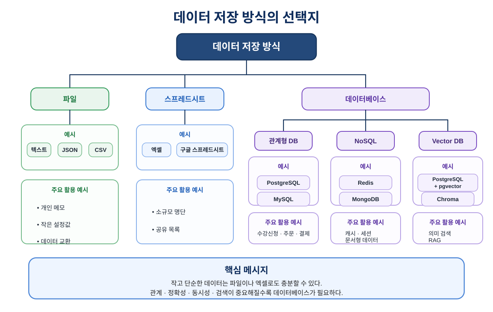

그림 1-1 데이터 특성에 따른 저장 방식 선택 흐름

다음 조건이 많을수록 DBMS 중심 관리가 필요할 가능성이 높습니다.

```text
데이터가 계속 증가한다.
데이터가 자주 변경된다.
여러 사용자가 동시에 접근한다.
데이터 사이의 관계가 중요하다.
검색과 집계가 반복적으로 필요하다.
정확성, 권한, 이력과 복구가 중요하다.
웹이나 앱에서 지속적으로 사용한다.
```

중요한 것은 가장 복잡한 도구를 선택하는 것이 아니라 현재 문제와 앞으로의 변화에 맞는 방식을 선택하는 것입니다.

---

## 8. 기준 데이터·파생 데이터·AI 결과 구분하기

데이터를 관리할 때는 특정 업무 판단에서 공식 기준으로 삼는 데이터와 이를 가공해 만든 결과를 구분해야 합니다.

| 구분 | 설명 | 예시 |
| --- | --- | --- |
| 기준 데이터 (Source of Truth) | 특정 업무 판단에서 공식 기준으로 삼는 데이터 | 회원, 주문, 신청, 출석 기록 |
| 파생 데이터 (Derived Data) | 기준 데이터를 규칙이나 계산으로 가공한 결과 | 월별 집계, 대시보드 지표, 캐시 |
| AI 생성 결과 | 모델·입력 데이터·지시에 따라 만들어진 결과 | 요약, 분류, 추천, 생성 답변 |

여기서 Source of Truth는 단순히 **가장 먼저 만들어진 파일**을 뜻하지 않습니다. 어떤 데이터를 공식 기준으로 삼을지는 업무 범위와 책임에 따라 정해야 합니다.

파생 데이터는 같은 기준 데이터와 계산식이 있으면 다시 만들 수 있는 경우가 많습니다. 기준 데이터가 변경되면 집계와 캐시도 최신 상태인지 확인해야 합니다.

AI 생성 결과는 모델, 입력 데이터와 지시가 달라지면 결과도 달라질 수 있습니다. 따라서 중요한 AI 결과는 **어떤 데이터와 지시를 사용해 만들었는지** 확인할 수 있어야 합니다.

> **선택 학습: AI 결과 기록**
>
> 실제 서비스에서는 모델, 입력 데이터의 기준 시점, 지시문과 검토 결과 등을 기록할 수 있습니다. 다만 무엇을 얼마나 보존할지는 개인정보와 보안 정책을 함께 고려해야 합니다. 구체적인 검증과 기록 방법은 Chapter 13에서 다룹니다.

Chapter 01에서는 세 종류의 데이터가 같은 의미가 아니며 관리 방법도 달라질 수 있다는 점만 이해하면 충분합니다.

---

## 9. AI가 도울 수 있는 일과 사람이 확인할 일

AI와 사람의 역할을 구분하면 AI를 더 안전하게 활용할 수 있습니다.

| 작업 | AI가 지원할 수 있는 일 | 사람이 확인할 일 |
| --- | --- | --- |
| 요구사항 정리 | 긴 설명을 표와 목록으로 정리 | 누락되거나 잘못 이해한 규칙 |
| 데이터 모델링 | 테이블과 열 후보 제안 | 한 행의 의미, 관계와 중복 |
| SQL 작성 | 테이블 생성문과 조회 SQL 초안 | `JOIN`, 필터, `NULL`과 집계 기준 |
| 오류 분석 | 가능한 원인과 수정안 제안 | 실제 DB 구조와 데이터 상태 |
| 데이터 분석 | 요약과 해석 초안 작성 | 기준 데이터, 계산식과 과장 여부 |
| 문서 작성 | 설명과 주석 초안 생성 | 사실성, 일관성과 재현 가능성 |

실제 SQL을 실행하는 장에서는 다음 흐름으로 AI 결과를 검토합니다. Chapter 01에서는 작은 예제의 예상 결과를 손으로 먼저 확인합니다. Chapter 03에서는 PostgreSQL 연결과 현재 실행 위치를 확인하고, 테이블 생성과 데이터 처리 SQL은 Chapter 04부터 본격적으로 실습합니다.

```text
질문과 요구사항 확인
→ 실제 구조와 기준 데이터 확인
→ 실행 전 예상 결과 작성
→ 직접 실행
→ 실제 결과와 비교
→ 수정 근거 기록
```

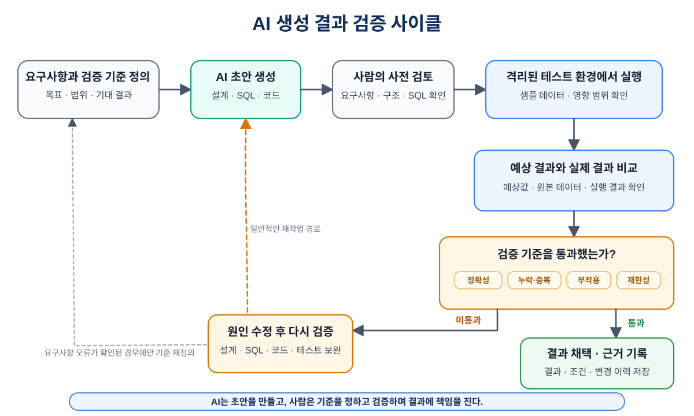

그림 1-2 AI 생성 결과 검증 사이클

처음에는 다음 네 질문만 기억해도 좋습니다.

```text
무엇을 구하려는가?
한 행은 무엇을 의미하는가?
누락·중복은 없는가?
예상 결과와 실제 결과가 일치하는가?
```

AI는 초안을 정리하고 만드는 작업을 지원할 수 있습니다. 데이터의 의미와 결과를 최종적으로 판단하는 일은 사람의 책임입니다.

---

## 10. 직접 판단해 보기

다음 온라인 강의 서비스에 적합한 저장 방식을 생각해 보세요.

```text
학생이 강의를 신청한다.
운영자는 학생·강사·강의와 신청 상태를 관리한다.
학생별 신청 이력과 월별 신청 건수를 반복 조회한다.
신청 당시 기록 금액을 보존한다.
실제 결제 기능은 나중에 확장할 수 있다.
```

다음 기준으로 판단합니다.

```text
데이터가 얼마나 증가하는가?
누가 데이터를 수정하는가?
데이터 사이의 관계가 있는가?
정확성이 중요한가?
검색과 집계가 반복적으로 필요한가?
권한과 복구가 필요한가?
```

### 권장 판단

관계형 데이터베이스를 사용하는 것이 적절합니다. 학생·강사·강의·신청의 관계와 상태를 분리해서 관리하고, 중복이나 잘못된 참조 같은 오류를 제약조건으로 줄일 수 있기 때문입니다.

정적 강의 목록 몇 개만 보여 주는 초기 단계라면 파일도 사용할 수 있습니다. 그러나 회원가입, 신청, 상태 변경, 반복 집계와 여러 사용자의 동시 작업이 시작되면 DBMS 중심 관리가 더 적합해집니다.

실제 결제 기능을 추가할 때는 신청 당시 저장한 금액과 실제 결제·환불 기록을 같은 데이터로 단정하지 않아야 합니다.

더 다양한 사례는 [Chapter 01 독자 워크북](../book/chapter01/chapter01_activity.md)에서 다룹니다.

---

## 11. 자주 하는 오해

### 오해 1. 데이터가 많아야만 데이터베이스가 필요하다

데이터 양이 적더라도 여러 사람이 동시에 수정하거나 데이터 관계와 정확성이 중요하면 데이터베이스가 필요할 수 있습니다.

### 오해 2. 스프레드시트와 데이터베이스는 크기만 다르다

스프레드시트는 사람이 표를 직접 편집하고 빠르게 공유하는 데 강합니다. DBMS는 여러 사용자와 시스템이 관계, 규칙, 동시 작업과 이력을 체계적으로 관리하도록 돕습니다.

### 오해 3. SQL이 실행되면 결과도 맞다

문법 오류가 없더라도 기준 테이블, `JOIN`, 필터와 집계가 요구사항과 다르면 결과는 틀릴 수 있습니다.

### 오해 4. 데이터 분석은 Python에서만 한다

SQL도 필터링, `JOIN`, 집계와 데이터 품질 확인에 강력합니다. Python은 SQL로 준비한 분석 데이터를 추가로 가공하고 시각화할 때 사용할 수 있습니다.

### 오해 5. 처음부터 완벽한 구조를 만들어야 한다

요구사항은 계속 바뀝니다. 작은 구조에서 시작하되 데이터의 의미와 관계를 명확히 하고, 변경 내용을 검증하면서 확장하는 것이 중요합니다.

---

## 12. 스스로 확인하기

### 12.1 개념 확인

1. AI가 SQL을 작성해도 사람이 데이터베이스를 이해해야 하는 이유는 무엇인가요?
2. SQL이 실행되는 것과 결과가 올바른 것은 왜 다른가요?
3. 데이터 품질 문제와 조회 기준 문제는 어떻게 다른가요?
4. 기준 데이터, 파생 데이터와 AI 생성 결과는 어떻게 다른가요?
5. 파일·스프레드시트·DBMS 중심 관리 방식을 선택할 때 확인할 기준을 세 가지 적어 보세요.

### 12.2 AI 결과 검토

다음 AI 답변의 문제점을 찾아보세요.

```text
온라인 강의 서비스는 데이터가 많지 않으므로 스프레드시트로 관리하면 됩니다.
회원 이름, 강의명과 신청 금액을 한 시트에 저장하면 충분합니다.
기능이 늘어나면 필요한 열을 계속 추가하면 됩니다.
```

다음 관점에서 검토합니다.

```text
회원과 강의의 관계를 안정적으로 표현할 수 있는가?
같은 정보가 여러 행에 중복되지 않는가?
신청 상태를 일관되게 관리할 수 있는가?
여러 사용자가 동시에 수정할 수 있는가?
개인정보와 접근 권한을 구분할 수 있는가?
변경 이력을 추적하고 복구할 수 있는가?
```

### 12.3 한 문장으로 정리하기

다음 문장을 완성해 보세요.

```text
AI 시대에 데이터베이스를 배워야 하는 이유는
SQL을 모두 직접 작성하기 위해서가 아니라,
________________________________________________ 하기 위해서이다.
```

### 권장 해설

1. AI는 SQL과 구조의 초안을 빠르게 만들 수 있지만 업무 규칙, 데이터 의미와 결과의 정확성을 자동으로 보장하지 않습니다.
2. 문법적으로 실행되는 SQL도 잘못된 기준 테이블, `JOIN`, 필터와 집계를 사용할 수 있습니다.
3. 데이터 품질 문제는 저장된 값 자체의 중복·누락·오류이고, 조회 기준 문제는 데이터를 잘못 연결·필터링·해석하는 문제입니다.
4. 기준 데이터는 특정 업무 판단에서 공식 기준으로 삼는 데이터이고, 파생 데이터는 기준 데이터를 계산해 만든 결과입니다. AI 결과는 모델, 입력 데이터와 지시에 따라 달라질 수 있습니다.
5. 데이터 관계, 동시 작업, 정확성, 반복 조회, 권한, 이력과 복구 필요성을 기준으로 판단할 수 있습니다.

12.2의 AI 답변은 현재 데이터 양만 보고 결론을 내렸다는 문제가 있습니다. 온라인 강의 서비스는 학생·강의·수강신청 관계, 여러 사용자의 동시 작업, 상태 일관성, 개인정보 권한과 변경 이력을 함께 고려해야 합니다.

12.3은 다음처럼 정리할 수 있습니다.

```text
AI가 만든 데이터 구조와 SQL 결과를 이해하고,
실제 요구사항과 기준 데이터에 맞는지 검증하기 위해서이다.
```

---

## 13. 핵심 정리

1. AI는 테이블과 SQL의 초안을 빠르게 만들 수 있지만 업무 규칙과 결과의 정확성을 보장하지 않습니다.
2. SQL이 실행된다는 사실과 요구사항에 맞는 결과가 나온다는 사실은 다릅니다.
3. 데이터 품질, 조회 범위, 필터와 집계 기준의 오류는 AI 분석과 의사결정의 오류로 이어질 수 있습니다.
4. 데이터베이스는 현실의 관계를 구조로 표현하고 정확성·권한·상태·이력과 복구를 관리하는 기반입니다.
5. 저장 방식은 데이터 양만이 아니라 관계, 동시 작업, 반복 조회, 권한과 복구 요구사항으로 선택합니다.
6. 기준 데이터, 파생 데이터와 AI 생성 결과는 의미와 관리 방법이 다릅니다.
7. 후속 실습에서는 AI가 만든 초안을 직접 실행하고 기준 데이터와 비교해 검증합니다.

이 장의 핵심을 한 문장으로 정리하면 다음과 같습니다.

```text
AI가 데이터베이스 작업을 지원하더라도,
사람은 데이터 구조와 결과를 이해하고 검증할 수 있어야 한다.
```

---

## 14. 다음 장에서는

다음 장에서는 데이터, 데이터베이스와 DBMS의 차이를 정확한 용어로 살펴봅니다. PostgreSQL 서버, 데이터베이스, 스키마, 테이블, 행과 열이 어떤 계층으로 연결되는지 이해하고, 기본키·외래키·SQL·CRUD 같은 이후 장의 공통 용어를 익힙니다.

---

# Chapter 02. 데이터와 DBMS의 기본 개념

---

## 이 장을 시작하기 전에

이 장은 데이터베이스를 처음 배우는 독자를 대상으로 합니다. Chapter 01의 내용을 읽었다면 별도의 선수 지식은 필요하지 않습니다.

이 장에 나오는 SQL과 테이블은 데이터베이스 구조와 용어를 이해하기 위한 축약 예제입니다. 실제 PostgreSQL 환경은 Chapter 03에서 준비하고, 테이블 생성과 데이터 입력·조회·수정·삭제는 Chapter 04에서 시작합니다.

이 책에서는 PostgreSQL을 기준으로 설명합니다. 다른 DBMS에서는 데이터베이스와 스키마의 사용 방식이나 명칭이 다를 수 있습니다.

## 이 장에서 살펴볼 내용

Chapter 01에서는 AI가 SQL과 데이터베이스 초안을 만들어 주더라도 사람이 데이터 구조와 실행 결과를 이해하고 검증해야 하는 이유를 살펴보았습니다.

이번 장에서는 다음 흐름을 정확한 용어로 읽는 방법을 배웁니다.

```text
사용자
→ DBeaver와 같은 클라이언트
→ PostgreSQL DBMS
→ 데이터베이스
→ 스키마
→ 테이블
→ 행과 열
```

## 이 장을 마치면

다음 내용을 자신의 말로 설명할 수 있습니다.

- 데이터, 데이터베이스와 DBMS의 차이
- DBeaver와 PostgreSQL의 역할
- 서버·데이터베이스·스키마·테이블의 포함 관계
- 테이블의 행·열·셀과 한 행의 의미
- 테이블과 조회 결과가 서로 다른 이유
- 내부 식별자와 업무 식별자의 차이
- 기본키와 외래키의 역할
- 조회 결과의 순서가 자동으로 보장되지 않는 이유
- AI가 만든 테이블 구조에서 먼저 확인해야 할 항목

> **학습 표시**
>
> - **핵심 학습**: 처음 배우는 독자가 우선 이해할 내용
> - **선택 학습**: 필요하거나 관심이 있을 때 추가로 살펴볼 내용
> - **심화 학습**: 운영과 실무 확장을 위한 내용
>
> 선택·심화 학습을 모두 완료하지 않아도 다음 장으로 진행할 수 있습니다.

---

## 1. 데이터베이스 안에는 무엇이 있을까

온라인 강의 서비스를 생각해 보겠습니다. 기본 서비스에는 학생, 강사, 강의와 수강신청 데이터가 필요합니다.

```text
학생
강사
강의
수강신청
신청 상태
신청 당시 기록 금액
```

관계형 데이터베이스는 관련 데이터를 테이블에 나누어 저장하고 키와 제약조건을 사용해 데이터의 의미와 연결을 관리합니다.

```text
테이블의 한 행은 하나의 기록을 나타낸다.
열은 기록을 구성하는 항목을 나타낸다.
기본키는 자신의 테이블에서 행을 구분한다.
외래키는 참조 대상 키와 연결된다.
DBMS는 데이터를 저장·조회하고 설정된 규칙을 적용한다.
```

이 흐름을 이해하면 SQL을 읽을 때 명령어만 보는 것이 아니라 어떤 구조의 데이터를 대상으로 무엇을 처리하는지 함께 판단할 수 있습니다.

---

## 2. 데이터, 데이터베이스와 DBMS

### 2.1 데이터란 무엇인가

데이터는 관찰하거나 기록한 값이나 사실입니다.

| 데이터 예시 | 나타내는 의미 |
| --- | --- |
| 김민지 | 학생 이름 |
| 1 | 데이터베이스 내부에서 학생 행을 구분하는 `id` |
| 20260001 | 업무에서 사용하는 학번 |
| 데이터베이스 입문 | 강의 제목 |
| 2026-03-02 | 수강신청일 |
| 신청 | 수강신청 상태 |

여러 값이 연결되면 하나의 업무 사실을 표현할 수 있습니다.

```text
학번 20260001인 김민지 학생이
2026년 3월 2일에
데이터베이스 입문 강의를 신청했다.
```

### 2.2 데이터베이스란 무엇인가

데이터베이스(Database)는 관련 데이터를 일정한 구조로 저장하고 관리하는 논리적 공간입니다.

이 책에서는 Chapter 03에서 `ai_database_book` 데이터베이스를 만듭니다. Chapter 04에서는 `public.students` 테이블을 생성하고, Chapter 07에서는 `course_project` 스키마에 학생·강사·강의·수강신청 테이블을 구성합니다.

### 2.3 DBMS란 무엇인가

DBMS(Database Management System)는 데이터베이스를 생성하고 관리하며 사용할 수 있게 해 주는 소프트웨어입니다.

| 역할 | 설명 |
| --- | --- |
| 저장 | 데이터를 일정한 구조로 보관 |
| 조회 | 조건에 맞는 데이터를 검색 |
| 규칙 적용 | 잘못된 값과 참조를 제한 |
| 동시 처리 | 여러 사용자의 작업을 조정 |
| 보호 | 사용자와 역할별 접근 권한 관리 |
| 복구 지원 | 백업과 장애 복구에 필요한 기능 제공 |

대표적인 관계형 DBMS에는 PostgreSQL, MySQL, MariaDB, Oracle Database, SQL Server와 SQLite가 있습니다. 이 책에서는 PostgreSQL을 기본 환경으로 사용합니다.

SQLite도 관계형 DBMS이지만 PostgreSQL과 운영 방식이 다릅니다. PostgreSQL은 일반적으로 별도의 서버 프로세스에 접속해 사용하고, SQLite는 애플리케이션이 데이터베이스 파일을 직접 사용하는 임베디드 방식으로 많이 사용합니다.

### 2.4 세 용어의 차이

| 구분 | 의미 | 예시 |
| --- | --- | --- |
| 데이터 | 기록된 개별 값이나 사실 | 이름, 학번, 신청일 |
| 데이터베이스 | 관련 데이터가 저장되는 논리적 공간 | `ai_database_book` |
| DBMS | 데이터베이스를 관리하고 SQL을 실행하는 소프트웨어 | PostgreSQL |

일상에서는 데이터베이스와 DBMS를 모두 ‘DB’라고 부르기도 합니다. 그러나 설치, 연결과 오류를 이해하려면 두 개념을 구분해야 합니다.

---

## 3. 클라이언트와 DBMS는 어떻게 연결되는가

DBeaver를 설치하면 데이터베이스가 설치되는 것으로 오해하기 쉽습니다. DBeaver와 PostgreSQL은 역할이 다릅니다.

| 구성 요소 | 역할 |
| --- | --- |
| 사용자 | 해결할 질문을 정하고 결과를 판단 |
| DBeaver | PostgreSQL에 접속해 SQL을 보내고 결과를 보여 주는 클라이언트 |
| PostgreSQL | 데이터를 저장하고 SQL을 실행하는 DBMS |
| SQL | 클라이언트가 DBMS에 전달하는 명령 언어 |

```text
사용자가 DBeaver에서 SQL 작성
→ DBeaver가 SQL을 PostgreSQL에 전달
→ PostgreSQL이 SQL 실행
→ PostgreSQL이 결과 또는 오류 반환
→ DBeaver가 결과를 화면에 표시
```

DBeaver는 여러 데이터베이스 클라이언트 중 하나입니다. PostgreSQL의 명령줄 도구인 `psql`, Python 프로그램, 웹 애플리케이션과 다른 개발 도구도 DBMS의 클라이언트가 될 수 있습니다.

DBeaver를 종료해도 PostgreSQL 서버와 데이터 저장소가 정상이라면 데이터는 유지됩니다. 반대로 DBeaver가 실행 중이어도 PostgreSQL 서버가 중지되어 있거나 연결 정보가 잘못되면 접속할 수 없습니다.

이 장의 클라이언트–서버 구조는 PostgreSQL을 기준으로 설명합니다. SQLite처럼 별도의 서버 없이 사용하는 DBMS는 연결 방식이 다릅니다.

---

## 4. PostgreSQL의 기본 계층

PostgreSQL에서 데이터를 탐색할 때는 다음 계층을 이해해야 합니다.

```text
PostgreSQL 서버
└── 데이터베이스
    └── 스키마
        └── 데이터베이스 객체
            ├── 테이블
            ├── 뷰
            ├── 시퀀스
            └── 함수
```

이번 장에서는 데이터베이스 객체 중 **테이블**을 중심으로 살펴봅니다. 뷰와 다른 객체는 필요한 장에서 다시 다룹니다.

이 책에서 구조가 만들어지는 순서는 다음과 같습니다.

```text
PostgreSQL 서버
└── ai_database_book                 Chapter 03
    ├── public
    │   └── students                 Chapter 04
    └── course_project               Chapter 07
        ├── students
        ├── instructors
        ├── courses
        └── enrollments
```

Chapter 02에서 사용하는 학생·강의·수강신청 표는 개념을 설명하기 위한 축약 예제입니다. 실제 객체는 각 장의 실습 순서에 따라 단계적으로 생성합니다.

### 4.1 서버

이 책에서는 PostgreSQL DBMS가 실행되는 하나의 인스턴스를 이해하기 쉽게 **PostgreSQL 서버**라고 부릅니다. 로컬 PC에서 실행하든 원격 환경에서 실행하든 같은 계층 구조로 이해할 수 있습니다. 한 PostgreSQL 서버에서는 여러 데이터베이스를 관리할 수 있습니다.

### 4.2 데이터베이스

업무나 프로젝트별 데이터를 분리하는 논리적 공간입니다. 한 PostgreSQL 서버 안에 여러 데이터베이스가 존재할 수 있습니다.

### 4.3 스키마

스키마(Schema)는 데이터베이스 안에서 테이블과 같은 객체를 이름으로 구분해 관리하는 이름 공간입니다.

PostgreSQL에서는 다음처럼 `스키마.테이블` 형식으로 대상을 분명하게 지정할 수 있습니다.

```text
public.students
course_project.students
```

스키마 이름을 생략하면 PostgreSQL은 검색 경로에 따라 대상을 찾습니다. 현재 데이터베이스, 스키마와 검색 경로를 실제로 확인하는 SQL은 Chapter 03에서 실행합니다.

### 4.4 다른 DBMS와의 차이

이 책의 계층과 용어는 PostgreSQL을 기준으로 합니다. MySQL, SQLite와 다른 DBMS에서는 데이터베이스와 스키마의 의미 또는 사용 방식이 다를 수 있습니다. 다른 제품을 사용할 때는 해당 DBMS의 문서를 함께 확인해야 합니다.

---

## 5. 테이블, 행, 열, 셀과 조회 결과

학생 정보를 저장하는 `students` 테이블을 살펴보겠습니다.

| id | name | email | major |
| ---: | --- | --- | --- |
| 1 | 김민지 | minji@example.com | 컴퓨터공학 |
| 2 | 이준호 | junho@example.com | 데이터사이언스 |
| 3 | 박서연 | seoyeon@example.com | 경영학 |

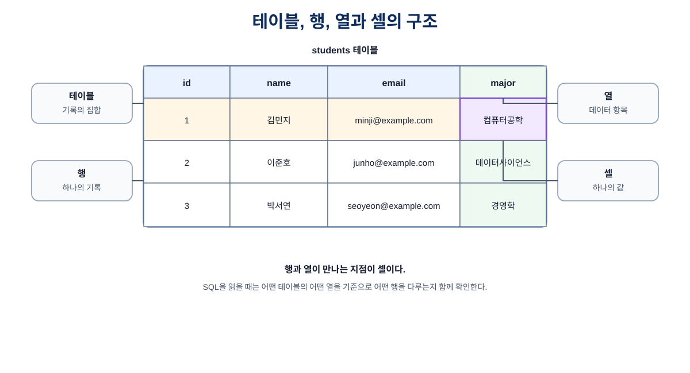

그림 2-1 테이블, 행, 열과 셀의 구조

### 5.1 테이블과 한 행의 의미

표 전체가 하나의 테이블입니다. `students` 테이블의 한 행은 학생 한 명을 나타냅니다.

```text
students 한 행 = 학생 한 명
```

한 행이 무엇을 의미하는지 명확하게 정하는 것이 좋은 데이터 구조의 출발점입니다.

### 5.2 행

행(Row)은 하나의 기록입니다. 행은 레코드(Record) 또는 튜플(Tuple)이라고도 부르지만 이 책에서는 주로 `행`이라는 표현을 사용합니다.

표에 표시된 첫째·둘째·셋째 행의 순서는 설명을 위한 예시입니다. 테이블 자체에 업무적으로 보장된 행 순서가 있다고 가정하지 않으며, 조회 결과도 `ORDER BY`로 정렬 기준을 지정하지 않으면 순서가 보장되지 않습니다.

### 5.3 열

열(Column)은 기록을 구성하는 데이터 항목입니다.

```text
id
name
email
major
```

모든 행은 같은 열 구조를 사용하지만 각 행에 저장된 값은 다릅니다.

### 5.4 셀

셀(Cell)은 표를 이해하기 위한 편의적 표현으로 특정 행과 열이 만나는 하나의 값을 뜻합니다. SQL에서는 화면상의 위치로 값을 찾지 않고 행을 찾는 조건과 열 이름을 사용합니다.

### 5.5 테이블과 조회 결과는 다르다

테이블은 데이터를 저장하는 구조입니다. `SELECT` 결과는 SQL을 실행해 만들어진 결과 집합(Result Set)입니다.

```text
테이블
→ 데이터를 저장하는 구조

조회 결과
→ SQL의 조건·연결·계산에 따라 만들어진 결과
```

조회 결과가 화면에서 표처럼 보이더라도 원본 테이블과 같은 것은 아닙니다. 여러 테이블을 연결하거나 일부 열만 선택하고 계산한 값도 하나의 조회 결과로 표시할 수 있습니다.

---

## 6. 데이터 타입 미리보기

각 열은 저장할 값의 종류를 나타내는 데이터 타입을 가집니다.

| 데이터 종류 | 예시 |
| --- | --- |
| 정수 | 내부 `id`, 수량 |
| 문자열 | 이름, 이메일, 상태, 학번 |
| 날짜·시간 | 가입일, 신청일 |
| 불리언 | 활성 여부, 완료 여부 |

학번은 숫자로만 보이더라도 계산을 위한 값이 아니며 앞자리 0이 필요할 수 있으므로 문자열로 저장하는 경우가 많습니다.

데이터 타입을 선택할 때는 다음 질문을 확인합니다.

```text
이 값은 계산하는 값인가?
앞자리 0을 보존해야 하는가?
날짜나 시각 연산이 필요한가?
값의 허용 범위가 정해져 있는가?
```

값의 겉모양만 보고 타입을 결정하지 않고 업무에서 어떻게 사용하는지도 함께 고려해야 합니다. 데이터 타입은 저장할 값의 큰 범위를 정하고, 더 구체적인 업무 규칙은 제약조건으로 보완할 수 있습니다. PostgreSQL의 구체적인 데이터 타입과 변환 방법은 Chapter 04, 제약조건은 Chapter 06에서 다룹니다.

> **선택 학습: 데이터의 구조 유형**
>
> - 정형 데이터: 행·열과 데이터 타입이 명확한 데이터
> - 반정형 데이터: JSON처럼 키와 계층 구조를 가진 데이터
> - 비정형 데이터: 문서·이미지·음성·영상처럼 고정된 행과 열로 표현하기 어려운 데이터
>
> 이 구분이 곧 저장소의 종류를 의미하는 것은 아닙니다. JSON도 PostgreSQL에 저장할 수 있으며, 구체적인 저장 방식 선택은 Chapter 12에서 살펴봅니다.

---

## 7. 내부 식별자와 업무 식별자

학생 데이터에는 `id`와 학번이 함께 존재할 수 있습니다.

```text
id = 1
→ 데이터베이스 내부에서 행을 안정적으로 구분하는 내부 식별자

student_number = 20260001
→ 학교 업무에서 부여한 업무 식별자
```

| 구분 | 목적 | 예시 |
| --- | --- | --- |
| 내부 식별자 | DB 내부에서 행을 안정적으로 구분 | `students.id` |
| 업무 식별자 | 현실의 업무에서 대상을 식별 | 학번, 회원번호, 주문번호 |

업무 식별자는 정책에 따라 형식이나 발급 규칙이 바뀔 수 있습니다. 내부 식별자와 업무 식별자가 항상 같은 것은 아닙니다.

자연키·대체키와 같은 상세 설계 용어는 Chapter 05~06에서 다시 살펴봅니다.

---

## 8. 기본키와 외래키

### 8.1 기본키

기본키(Primary Key, PK)는 한 테이블 안에서 각 행을 고유하게 구분하는 하나 이상의 열입니다. 초반 실습에서는 이해하기 쉬운 단일 `id` 열을 기본키로 사용합니다.

| id | name | email |
| ---: | --- | --- |
| 1 | 김민지 | minji@example.com |
| 2 | 김민지 | minji2@example.com |

두 학생의 이름은 같지만 `id`가 다르므로 서로 다른 행으로 구분할 수 있습니다.

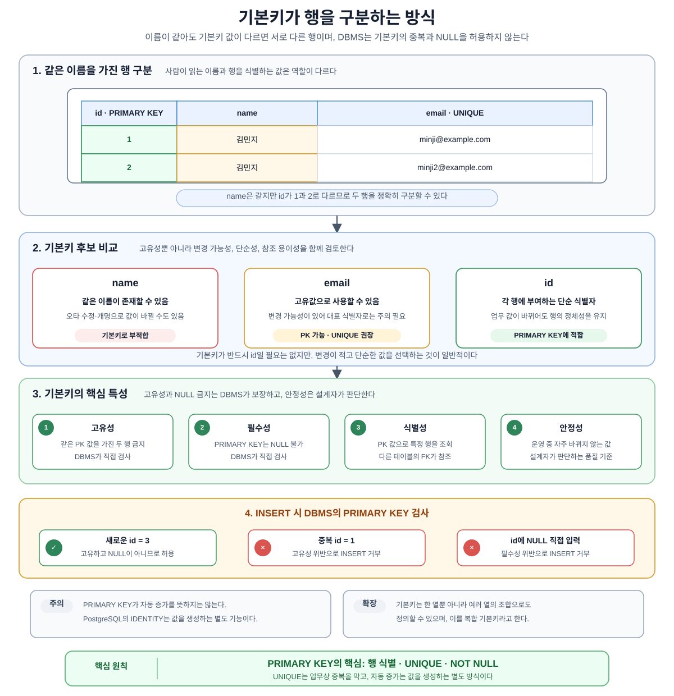

그림 2-2 기본키가 행을 구분하는 방식

```text
기본키 값 또는 값의 조합은 중복되지 않는다.
기본키를 구성하는 열은 NULL일 수 없다.
각 행을 안정적으로 구분한다.
```

여러 열을 묶어 행을 구분하는 복합 기본키는 Chapter 06에서 다룹니다.

### 8.2 외래키

외래키(Foreign Key, FK)는 다른 테이블 또는 같은 테이블의 **참조 대상 키와 연결되는 하나 이상의 열**입니다. 이 책의 초급 예제에서는 다른 테이블의 기본키를 참조하는 경우를 중심으로 살펴봅니다.

| id | student_id | course_id | status |
| ---: | ---: | ---: | --- |
| 1 | 1 | 10 | 신청 |
| 2 | 1 | 20 | 수강중 |
| 3 | 2 | 10 | 완료 |

`student_id`는 `students.id`를 참조하고 `course_id`는 `courses.id`를 참조합니다.

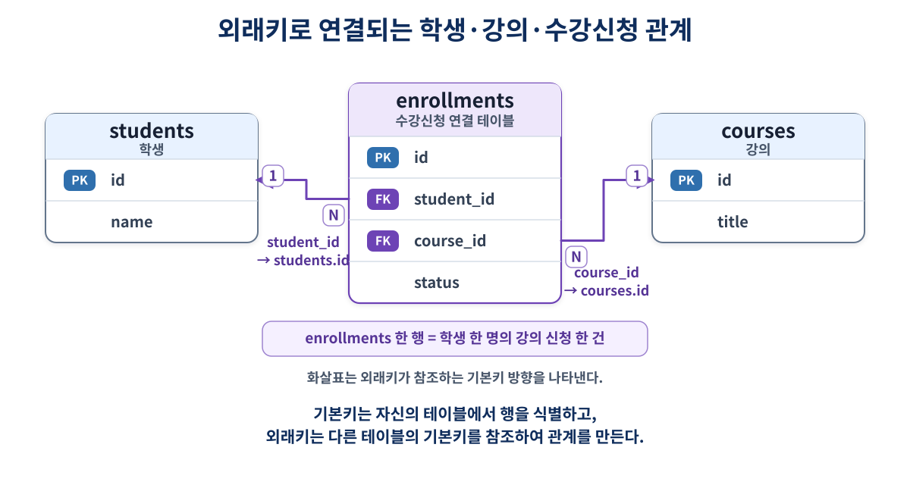

그림 2-3 외래키로 연결되는 학생·강의·수강신청 관계

```text
기본키
→ 자신의 테이블에서 행을 구분

외래키
→ 참조 대상 키와의 연결을 표현

외래키 제약조건
→ 존재하지 않는 참조가 저장되지 않도록 검사
```

외래키와 관련해 다음 차이를 기억해야 합니다.

```text
외래키 값은 여러 행에서 반복될 수 있다.
외래키는 자동으로 UNIQUE가 되지 않는다.
외래키 열은 별도의 NOT NULL 규칙이 없으면 NULL을 허용할 수 있다.
외래키만으로 필수 관계나 1:1 관계가 자동 완성되지는 않는다.
```

예제에서 학생 1은 두 강의를 신청하므로 `student_id = 1`이 반복됩니다. 이는 정상적인 1:N 관계입니다.

외래키 위치, 복합 키, 필수 관계와 삭제 정책은 Chapter 05~06에서 자세히 다룹니다.

---

## 9. 업무 관계와 카디널리티 미리보기

업무 대상은 서로 연결됩니다.

```text
학생 → 질문
회원 → 주문
학생 → 수강신청 → 강의
```

카디널리티(Cardinality)는 한쪽의 한 행이 상대편의 몇 행과 연결될 수 있는지를 나타내는 관계의 수입니다. Chapter 02에서는 먼저 1:1, 1:N, N:M처럼 **최대 연결 수**를 중심으로 읽습니다. 연결 대상이 0개여도 되는지와 같은 선택·필수 여부는 별도의 업무 규칙입니다.

| 관계 유형 | 의미 | 예시 |
| --- | --- | --- |
| 1:1 | 한 행이 상대편의 최대 한 행과 연결 | 사용자와 하나의 상세 프로필 |
| 1:N | 한 행이 상대편의 여러 행과 연결 | 학생과 질문 |
| N:M | 양쪽의 여러 행이 서로 연결 | 학생과 강의 |

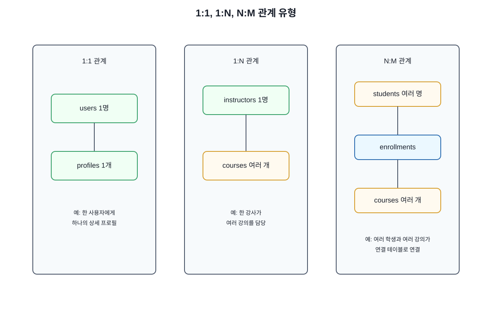

그림 2-4 업무 관계의 카디널리티 미리보기

N:M 관계는 일반적으로 `enrollments` 같은 연결 테이블을 두어 두 개의 1:N 관계로 표현합니다.

```text
students 1 ── N enrollments N ── 1 courses
```

실제 업무에서는 최대 연결 수뿐 아니라 0개를 허용하는지, 반드시 하나 이상이 필요한지도 별도로 결정해야 합니다. 이러한 선택·필수 관계와 연결 테이블을 실제로 설계하는 방법은 Chapter 05에서 다룹니다.

> **선택 학습: 릴레이션과 업무 관계**
>
> 관계형 데이터베이스의 릴레이션(Relation)은 관계 모델에서 행과 열로 구성된 구조를 뜻합니다. 학생이 강의를 신청한다는 업무 관계(Relationship)와는 구분해서 이해하는 것이 좋습니다.
>
> Chapter 02에서는 용어의 차이만 이해하고 관계 모델의 이론적 정의는 깊게 다루지 않습니다.

---

## 10. DBMS가 데이터를 지키는 방법

DBMS는 데이터를 저장하는 기능뿐 아니라 잘못된 상태를 줄이고 안전하게 운영하기 위한 기능도 제공합니다.

### 10.1 제약조건

제약조건(Constraint)은 저장할 수 있는 값과 참조에 대한 규칙입니다.

```text
학생 이름은 NULL일 수 없다.
이메일은 중복될 수 없다.
존재하지 않는 학생의 수강신청은 저장할 수 없다.
상품 가격은 0보다 작을 수 없다.
```

대표적인 제약조건에는 `PRIMARY KEY`, `FOREIGN KEY`, `NOT NULL`, `UNIQUE`, `CHECK`가 있습니다. `NOT NULL`은 NULL을 막는 규칙이며 빈 문자열 자체를 막는 규칙은 아닙니다. 빈 문자열까지 제한해야 한다면 별도의 규칙이 필요합니다. 실제 제약조건 SQL은 Chapter 06에서 다룹니다.

### 10.2 동시 처리

여러 사용자가 동시에 같은 좌석이나 재고를 변경하면 작업이 충돌할 수 있습니다. DBMS는 트랜잭션과 동시성 제어 기능으로 여러 작업을 조정합니다. 자세한 내용은 Chapter 09에서 다룹니다.

### 10.3 권한

모든 사용자가 모든 데이터를 읽고 수정할 수 있어서는 안 됩니다. DBMS는 사용자와 역할에 따라 접근 권한을 구분할 수 있습니다.

### 10.4 백업과 복구

DBMS는 백업과 복구에 필요한 기능을 제공하지만 데이터가 자동으로 안전해지는 것은 아닙니다. 백업을 만들고 실제로 복구할 수 있는지 확인해야 합니다. 권한, 보안, 백업과 복구는 Chapter 11에서 살펴봅니다.

---

## 11. SQL과 CRUD 미리보기

SQL(Structured Query Language)은 관계형 DBMS에 명령을 전달하는 언어입니다.

```sql
SELECT *
FROM students;
```

이 SQL은 `students` 테이블의 모든 행과 열을 조회하라는 의미입니다. 결과 순서는 `ORDER BY`가 없으면 보장되지 않습니다.

CRUD는 애플리케이션에서 반복되는 네 가지 기본 데이터 작업입니다.

| CRUD | 의미 | 대표 SQL |
| --- | --- | --- |
| Create | 새로운 데이터 행 추가 | `INSERT` |
| Read | 저장된 데이터 조회 | `SELECT` |
| Update | 기존 데이터 수정 | `UPDATE` |
| Delete | 데이터 삭제 기능 | `DELETE` 또는 정책에 따른 `UPDATE` |

CRUD의 Create는 새로운 데이터 행을 추가하는 작업입니다. SQL의 `CREATE TABLE`은 데이터 행이 아니라 테이블 구조를 만드는 명령입니다.

```text
CRUD Create → INSERT로 데이터 행 추가
CREATE TABLE → 테이블 구조 생성
```

서비스의 ‘삭제’ 기능도 항상 행을 물리적으로 지우는 SQL `DELETE`와 같지는 않습니다. 이력을 보존해야 하는 경우에는 행을 남기고 상태나 삭제 시각을 변경할 수 있습니다. 구체적인 삭제 정책은 Chapter 06과 후속 운영 장에서 살펴봅니다.

---

## 12. 하나의 사례로 구조 읽기

온라인 강의 서비스의 구조를 읽어 보겠습니다.

```text
students
- 한 행: 학생 한 명
- 기본키: id

courses
- 한 행: 강의 한 개
- 기본키: id

enrollments
- 한 행: 수강신청 한 건
- 기본키: id
- 외래키: student_id, course_id
```

### 12.1 표로 구조 읽기

| 테이블 | 한 행이 나타내는 것 | 기본키 | 다른 테이블과의 연결 |
| --- | --- | --- | --- |
| `students` | 학생 한 명 | `id` | 신청과 연결 |
| `courses` | 강의 한 개 | `id` | 신청과 연결 |
| `enrollments` | 수강신청 한 건 | `id` | 학생과 강의를 참조 |

### 12.2 구조를 읽을 때 확인할 질문

```text
이 테이블의 한 행은 무엇을 나타내는가?
각 행을 구분하는 값은 무엇인가?
다른 테이블을 참조하는 값은 무엇인가?
같은 값이 반복되어도 되는 열은 무엇인가?
필수로 저장해야 하는 값은 무엇인가?
```

`recorded_amount`가 있다면 이는 신청 당시 저장한 금액입니다. 실제 결제 완료 금액이나 회계 매출과 같은 의미라고 단정하지 않습니다. 결제·환불의 상세 구조는 기본 범위에 포함하지 않습니다.

> **Chapter 01 복습**
>
> - 기준 데이터: 특정 업무 판단에서 공식 기준으로 삼는 데이터
> - 파생 데이터: 기준 데이터를 계산해 만든 결과
> - AI 결과: 모델과 입력·지시에 따라 생성된 결과
>
> 이번 장에서는 이 구분을 복습하는 수준으로만 다룹니다. AI 결과의 실행 맥락과 체계적인 검증은 Chapter 13에서 살펴봅니다.

---

## 13. AI가 만든 구조 검토하기

AI가 다음 구조를 제안했다고 가정하겠습니다.

```sql
CREATE TABLE student_courses (
    student_name VARCHAR(50),
    student_email VARCHAR(100),
    course_title VARCHAR(100),
    instructor_name VARCHAR(50)
);
```

문법적으로 테이블을 만들 수 있더라도 좋은 구조라고 단정할 수는 없습니다.

다음 다섯 질문으로 먼저 검토합니다.

```text
1. 이 테이블의 한 행은 무엇을 나타내는가?
2. 각 행을 구분할 기본키가 있는가?
3. 다른 테이블을 참조해야 할 값은 무엇인가?
4. 서로 다른 성격의 데이터가 한 테이블에 섞이지 않았는가?
5. 데이터 타입과 필수 여부가 값의 의미에 맞는가?
```

| 검토 질문 | 예제에서 확인되는 문제 |
| --- | --- |
| 한 행의 의미 | 학생인지 신청인지 명확하지 않음 |
| 기본키 | 각 행을 안정적으로 구분할 값이 없음 |
| 참조 관계 | 학생·강의·강사를 이름 문자열로만 저장 |
| 데이터 혼합 | 학생·강의·강사 정보가 한 테이블에 섞임 |
| 타입과 필수 여부 | 필수값과 선택값을 판단할 규칙이 없음 |

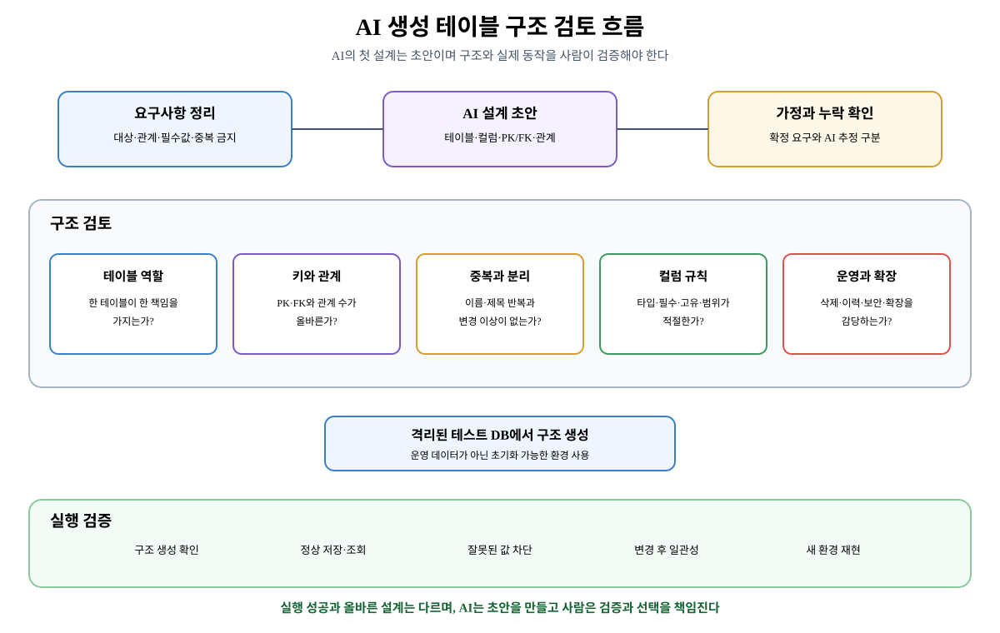

그림 2-5 AI 생성 테이블 구조 검토 흐름

이 장에서는 기본 용어로 문제를 발견하는 데 집중합니다. 테이블 분리와 ERD는 Chapter 05, 정규화와 제약조건은 Chapter 06, AI 설계와 SQL의 체계적인 검증은 Chapter 13에서 다룹니다.

---

## 14. 자주 하는 오해와 스스로 확인하기

### 14.1 자주 하는 오해

#### 오해 1. DBeaver가 데이터베이스이다

DBeaver는 PostgreSQL 같은 DBMS에 접속하는 클라이언트 도구입니다.

#### 오해 2. DBMS와 데이터베이스는 같은 것이다

PostgreSQL은 DBMS이고 그 안에 만든 `ai_database_book`은 데이터베이스입니다.

#### 오해 3. 스키마와 데이터베이스는 같은 것이다

PostgreSQL에서 스키마는 데이터베이스 안에 있으며 테이블과 같은 객체를 이름으로 구분합니다.

#### 오해 4. 테이블과 SELECT 결과는 같은 것이다

테이블은 데이터를 저장하는 구조이고 조회 결과는 SQL을 실행해 만들어진 결과 집합입니다.

#### 오해 5. 테이블의 행은 항상 같은 순서로 보인다

`ORDER BY`가 없으면 조회 결과의 행 순서는 보장되지 않습니다.

#### 오해 6. 외래키는 중복될 수 없고 항상 값이 있어야 한다

외래키 값은 1:N 관계에서 반복될 수 있으며, 별도의 `UNIQUE`와 `NOT NULL` 규칙에 따라 중복과 NULL 허용 여부가 달라집니다.

#### 오해 7. SQL이 실행되면 데이터 구조도 올바르다

DBMS는 문법적으로 유효한 SQL을 실행할 수 있지만 한 행의 의미와 업무 규칙까지 자동으로 판단하지는 않습니다.

### 14.2 개념 확인

1. 데이터, 데이터베이스와 DBMS의 차이를 설명해 보세요.
2. PostgreSQL과 DBeaver의 역할은 어떻게 다른가요?
3. 데이터베이스, 스키마와 테이블의 포함 관계를 설명해 보세요.
4. 테이블, 행, 열과 셀은 각각 무엇인가요?
5. 테이블과 조회 결과는 어떻게 다른가요?
6. `ORDER BY`가 없을 때 행 순서를 가정하면 안 되는 이유는 무엇인가요?
7. 내부 식별자와 업무 식별자의 차이는 무엇인가요?
8. 기본키와 외래키의 역할은 어떻게 다른가요?
9. 외래키 값이 여러 행에서 반복될 수 있는 이유는 무엇인가요?
10. AI가 만든 테이블에서 먼저 확인해야 할 다섯 가지는 무엇인가요?

### 14.3 구조 읽기

```text
PostgreSQL 서버
└── school_db
    └── public
        ├── students
        └── questions
```

1. DBMS는 무엇인가요?
2. 데이터베이스 이름은 무엇인가요?
3. 스키마 이름은 무엇인가요?
4. 테이블은 몇 개인가요?
5. DBeaver는 이 구조에서 어떤 역할을 하나요?

### 14.4 기본키와 외래키 찾기

```text
students
id | name
1  | 김민지
2  | 이준호

questions
id | student_id | title
1  | 1          | JOIN 질문
2  | 1          | NULL 질문
3  | 2          | 기본키 질문
```

1. 각 테이블의 기본키는 무엇인가요?
2. `questions.student_id`는 무엇을 참조하나요?
3. `student_id = 1`이 반복되어도 되는 이유는 무엇인가요?
4. 존재하지 않는 `student_id`가 저장되면 어떤 문제가 생기나요?

### 권장 해설

- 데이터는 기록된 값이나 사실입니다.
- 데이터베이스는 관련 데이터가 저장되는 논리적 공간입니다.
- DBMS는 데이터베이스를 관리하고 SQL을 실행하는 소프트웨어입니다.
- 테이블은 데이터를 저장하고 조회 결과는 SQL이 만들어 냅니다.
- 내부 `id`는 행을 안정적으로 구분하고 학번과 같은 업무 식별자는 업무에서 사용합니다.
- 기본키는 자신의 테이블에서 행을 고유하게 구분합니다.
- 외래키는 참조 대상 키와 연결되며 1:N 관계에서는 같은 값이 반복될 수 있습니다. 외래키 제약조건이 설정되어 있다면 존재하지 않는 참조는 DBMS가 거부합니다.

더 많은 활동은 [Chapter 02 독자 워크북](../book/chapter02/chapter02_activity.md)에서 진행합니다.

---

## 15. 핵심 정리와 다음 장

| 용어 | 한 줄 설명 | 예시 |
| --- | --- | --- |
| 데이터 | 기록된 값이나 사실 | 학생 이름, 신청일 |
| DBMS | 데이터베이스를 관리하고 SQL을 실행하는 소프트웨어 | PostgreSQL |
| 데이터베이스 | 관련 데이터가 저장되는 논리적 공간 | `ai_database_book` |
| 클라이언트 | DBMS에 명령을 보내고 결과를 보여 주는 도구 | DBeaver, `psql`, 애플리케이션 |
| 스키마 | 데이터베이스 안의 객체를 구분하는 이름 공간 | `public`, `course_project` |
| 테이블 | 같은 성격의 데이터를 행과 열로 저장한 구조 | `students` |
| 조회 결과 | SQL을 실행해 만들어진 결과 집합 | `SELECT` 결과 |
| 행 | 하나의 데이터 기록 | 학생 한 명 |
| 열 | 기록을 구성하는 데이터 항목 | `id`, `name` |
| 내부 식별자 | DB 내부에서 행을 구분하는 값 | `students.id` |
| 업무 식별자 | 업무에서 대상을 식별하는 값 | 학번, 주문번호 |
| 기본키 | 자신의 테이블에서 행을 고유하게 구분하는 열 또는 열 조합 | `students.id` |
| 외래키 | 참조 대상 키와 연결되는 열 또는 열 조합 | `enrollments.student_id` |
| 카디널리티 | 한 행이 상대편의 몇 행과 연결될 수 있는지를 나타내는 관계의 수 | 1:1, 1:N, N:M |
| SQL | 관계형 DBMS에 명령을 전달하는 언어 | `SELECT` |
| CRUD | 데이터 행의 생성·조회·수정·삭제 기능 | `INSERT`, `SELECT`, `UPDATE`, `DELETE` |

이번 장에서 기억해야 할 흐름은 다음과 같습니다.

```text
클라이언트에서 SQL 작성
→ PostgreSQL이 SQL 실행
→ 데이터베이스의 스키마와 테이블에 접근
→ 행과 열로 데이터를 저장·조회
→ 기본키로 행을 구분하고 외래키로 참조 관계를 연결
→ 한 행의 의미와 타입을 확인해 구조를 검토
```

```text
데이터베이스 구조를 이해한다는 것은
DBMS, 데이터베이스, 스키마, 테이블, 행, 열과 키가
어떤 역할로 연결되는지 설명할 수 있다는 뜻이다.
```

다음 장에서는 로컬 PostgreSQL을 설치하고 DBeaver로 연결합니다. `ai_database_book` 데이터베이스를 만든 뒤 현재 데이터베이스·스키마·검색 경로를 실제 화면과 SQL로 확인합니다.

관리형 PostgreSQL과 Supabase는 선택 학습으로 살펴봅니다. 필수 실습 흐름은 로컬 PostgreSQL 환경을 기준으로 진행합니다.

---

# Chapter 03. PostgreSQL과 DBeaver로 실습 환경 만들기

---

## 이 장을 시작하기 전에

이 장은 PostgreSQL을 처음 설치하고 사용하는 독자를 대상으로 합니다. Chapter 02에서 데이터베이스, DBMS, 클라이언트와 스키마의 의미를 이해했다면 별도의 선수 지식은 필요하지 않습니다.

운영체제와 프로그램 버전에 따라 설치 화면, 메뉴 이름과 버튼 위치가 달라질 수 있습니다. 화면을 그대로 따라 하기보다 다음 상태를 만드는 데 집중합니다.

```text
PostgreSQL 서버가 실행된다.
DBeaver에서 연결 테스트가 성공한다.
ai_database_book 데이터베이스에 연결된다.
현재 연결 대상을 SQL로 확인한다.
SQL 한 문장과 전체 스크립트 실행을 구분한다.
환경 확인 파일을 다시 실행할 수 있다.
```

이 책의 SQL은 PostgreSQL 15 이상을 기준으로 작성했습니다. 화면 예시는 집필 당시 환경을 기준으로 하며 최신 버전에서는 메뉴와 화면 배치가 달라질 수 있습니다.

## 권장 기본 경로와 대안 경로

처음 시작하는 독자에게는 다음 환경을 권장합니다.

```text
권장 기본 경로
→ 로컬 PostgreSQL + DBeaver Community
```

이미 다른 환경이 준비되어 있다면 반드시 같은 설치 방법을 사용할 필요는 없습니다.

| 현재 상황 | 권장 진행 |
| --- | --- |
| Windows에서 처음 설치 | 본문의 Windows 기본 경로 사용 |
| PostgreSQL이 이미 설치됨 | 설치를 생략하고 서버 상태와 버전 확인 |
| macOS 사용 | 선택 학습의 macOS 설치 경로 참고 |
| Ubuntu 계열 Linux 사용 | 선택 학습의 Ubuntu 설치 경로 참고 |
| 프로그램 설치 권한이 없음 | 관리형 PostgreSQL 또는 제공된 원격 서버 검토 |
| Docker 사용 경험이 있음 | 컨테이너 기반 PostgreSQL을 선택적으로 사용 |

환경이 달라도 이 장의 **기본 완료 기준**을 만족하면 다음 장의 실습을 진행할 수 있습니다. 다만 저장소에서 제공하는 `setup_validate_local.sql`은 이름 그대로 권장 로컬 환경을 확인하는 파일이며, 관리형 환경에서는 일부 조건이 다를 수 있습니다.

## 이 장을 마치면

다음 작업을 수행할 수 있습니다.

- PostgreSQL과 DBeaver의 역할을 구분한다.
- 자신의 환경에 맞는 설치 경로를 선택한다.
- PostgreSQL 서버의 실행 상태를 확인한다.
- DBeaver에서 PostgreSQL 연결을 만든다.
- Host, Port, Database와 Username의 의미를 설명한다.
- `ai_database_book` 데이터베이스를 확인하고 필요한 경우 생성한다.
- 새 데이터베이스로 연결을 전환한다.
- 현재 데이터베이스, 사용자, 스키마와 검색 경로를 확인한다.
- SQL 한 문장, 선택 영역과 전체 스크립트 실행을 구분한다.
- 환경 확인 SQL과 자동 확인 SQL을 실행한다.
- 연결 오류를 유형별로 분류하고 다시 확인한다.
- 비밀번호와 전체 접속 URL을 공개 자료에서 분리한다.

> **학습 표시**
>
> - **핵심 학습**: 권장 기본 환경을 준비하는 데 필요한 내용
> - **선택 학습**: 다른 운영체제, Docker와 관리형 PostgreSQL을 사용하는 경우 참고할 내용
> - **심화 학습**: 권한, 비밀정보 파일과 운영 환경으로 확장되는 내용

---

## 1. 이 장에서 준비할 환경

이 책의 기본 실습 환경은 다음과 같습니다.

```text
로컬 PostgreSQL 서버
+ DBeaver Community
+ 저장해 둔 SQL 파일
```

| 구성 요소 | 역할 |
| --- | --- |
| PostgreSQL | 데이터를 저장하고 SQL을 실행하는 관계형 DBMS |
| DBeaver | PostgreSQL에 연결해 SQL을 작성하고 결과를 보여 주는 클라이언트 |
| SQL 파일 | 실행 과정과 확인 기준을 다시 실행할 수 있게 보존 |
| Git 저장소 | SQL과 문서의 변경 이력을 선택적으로 관리 |
| AI 도구 | 오류 설명과 SQL 초안 작성을 보조 |

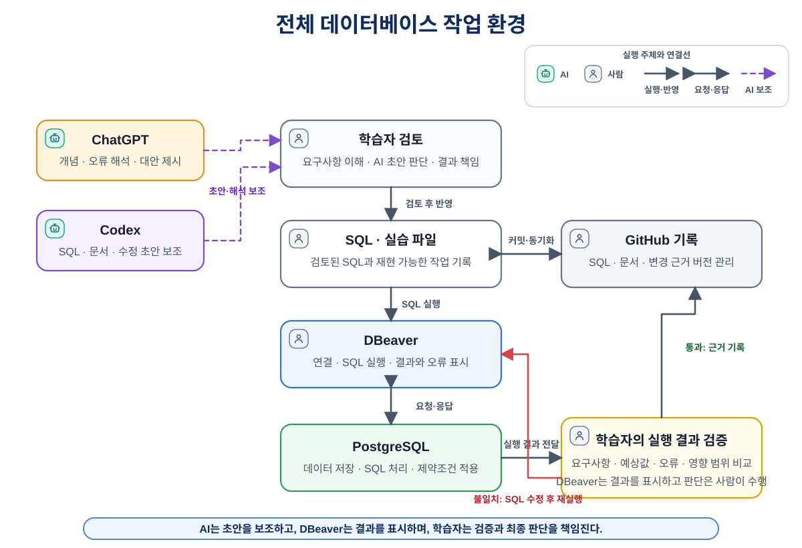

그림 3-1 전체 데이터베이스 작업 환경

공식 다운로드 페이지는 다음과 같습니다.

- PostgreSQL: <https://www.postgresql.org/download/>
- DBeaver Community: <https://dbeaver.io/download/>

설치 프로그램의 정확한 최신 버전은 다운로드 시점에 공식 페이지에서 확인합니다.

### 기본 완료 기준

| 단계 | 확인할 상태 |
| --- | --- |
| PostgreSQL 서버 | 실행 중이며 접속할 수 있음 |
| DBeaver | 연결 테스트 성공 |
| 작업 데이터베이스 | `ai_database_book`에 연결 |
| SQL 실행 | `SELECT 1 + 1;` 결과가 `2` |
| 현재 위치 | 데이터베이스와 사용자를 SQL로 확인 |
| 실행 범위 | 한 문장과 전체 스크립트를 구분 |
| 환경 자동 확인 | 권장 로컬 환경에서 검증 파일 통과 |
| 보안 | 공개 파일에 실제 비밀번호와 전체 접속 URL이 없음 |

---

## 2. PostgreSQL과 DBeaver 역할 복습

PostgreSQL과 DBeaver는 같은 종류의 프로그램이 아닙니다.

| 구분 | PostgreSQL | DBeaver |
| --- | --- | --- |
| 종류 | DBMS·데이터베이스 서버 | 데이터베이스 클라이언트 |
| 주요 역할 | 데이터 저장과 SQL 실행 | 서버 연결, SQL 작성과 결과 표시 |
| 데이터 보관 | 실제 데이터를 보관 | 연결 정보와 화면 설정을 관리할 수 있지만 DB 데이터를 직접 보관하지 않음 |
| 프로그램 종료 | 서버가 중지되면 접속할 수 없음 | DBeaver만 닫히며 서버 데이터는 유지 |

```text
사용자
→ DBeaver에서 SQL 작성
→ PostgreSQL에 SQL 전달
→ PostgreSQL이 SQL 실행
→ DBeaver가 결과 또는 오류 표시
```

DBeaver만 설치했다고 PostgreSQL 서버가 준비되는 것은 아닙니다. 반대로 PostgreSQL은 `psql`, Python 프로그램, 웹 애플리케이션과 다른 개발 도구에서도 접속할 수 있습니다. 이 책에서는 구조와 결과를 화면으로 확인하기 쉬운 DBeaver를 기본 클라이언트로 사용합니다.

---

## 3. 나에게 맞는 설치 경로 선택하기

### 3.1 권장 기본 경로: 로컬 PostgreSQL

로컬 PostgreSQL은 자신의 컴퓨터에서 서버를 실행합니다.

장점:

- 인터넷 연결 없이 연습할 수 있다.
- 서버, 데이터베이스와 연결 구조를 직접 확인하기 쉽다.
- 테스트 데이터를 자유롭게 만들고 지울 수 있다.

확인할 점:

- 프로그램 설치 권한이 필요하다.
- PostgreSQL 서비스가 실행 중이어야 한다.
- 포트 충돌이나 기존 설치 여부를 확인해야 한다.

### 3.2 선택 학습: 관리형 PostgreSQL

관리형 PostgreSQL은 외부 플랫폼이 서버 운영의 일부를 담당합니다.

```text
플랫폼이 주로 담당
→ 서버 인프라와 서비스 운영 기능

사용자가 계속 담당
→ 테이블 설계, 데이터 정확성, 권한, 비밀정보와 비용
```

관리형 환경은 인터넷, 계정, SSL과 서비스별 연결 설정이 필요합니다. 서비스별 세부 화면과 연결 방식은 빠르게 바뀔 수 있으므로 공식 문서를 함께 확인합니다.

### 3.3 선택 학습: Supabase 개요

Supabase는 별도의 단순화된 DBMS가 아니라 실제 PostgreSQL을 중심으로 Auth, Storage, Realtime 같은 기능을 연결한 플랫폼입니다.

```text
Supabase 프로젝트
├── PostgreSQL
├── Auth
├── Storage
└── Realtime 등
```

로컬 PostgreSQL과 데이터베이스 이름, 연결 방식과 권한 구조가 다를 수 있습니다. 이 장에서는 이러한 차이가 있다는 점만 이해합니다. Pooler, API 키, RLS와 Storage 세부 운영은 서비스 공식 문서와 후속 심화 자료에서 다룹니다.

### 3.4 선택 학습: Docker

Docker 경험이 있는 독자는 PostgreSQL 컨테이너를 사용할 수 있습니다. 다만 다음 항목을 스스로 관리할 수 있어야 합니다.

```text
컨테이너 포트 연결
데이터 볼륨 보존
관리자 비밀번호
컨테이너 시작·중지
DBeaver에서 사용할 Host와 Port
```

Docker가 처음이라면 PostgreSQL과 Docker를 동시에 배우기보다 운영체제용 설치 프로그램을 사용하는 편이 단순합니다.

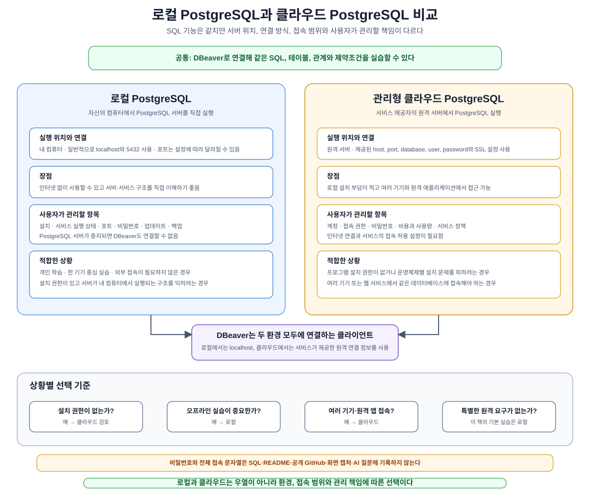

그림 3-2 로컬과 관리형 PostgreSQL 연결 구조

---

## 4. PostgreSQL 설치와 서버 상태 확인

설치 화면보다 설치 후 상태가 중요합니다.

```text
설치 성공
→ PostgreSQL 프로그램이 준비됨

서버 실행 성공
→ PostgreSQL 서비스가 실행 중임

연결 성공
→ 올바른 Host·Port·Database·Username으로 인증됨

SQL 실행 성공
→ 연결된 데이터베이스에서 SQL이 실행됨
```

이 네 단계는 서로 다릅니다. 설치가 완료되어도 서비스가 중지되어 있으면 연결할 수 없습니다.

### 4.1 Windows 기본 경로

설치할 때 다음 항목을 확인합니다.

- PostgreSQL Server
- 명령행 도구
- 관리자 사용자 `postgres`
- 관리자 비밀번호
- 기본 포트 또는 직접 선택한 포트
- 데이터 저장 위치

Stack Builder는 추가 도구와 드라이버를 설치하는 도구이며 이 책의 기본 실습에는 필수가 아닙니다.

설치 후 Windows 서비스 관리 화면에서 PostgreSQL 서비스가 실행 중인지 확인합니다. 서비스 이름에는 버전 번호가 포함될 수 있습니다.

### 4.2 선택 학습: macOS

대표적인 설치 방식은 다음과 같습니다.

- PostgreSQL 다운로드 페이지에서 안내하는 설치 프로그램
- Postgres.app
- Homebrew

설치 방식마다 서버 시작 방법과 데이터 위치가 다릅니다. 사용한 방식의 공식 안내에서 서버 시작과 상태 확인 방법을 확인합니다.

### 4.3 선택 학습: Ubuntu 계열 Linux

대표적으로 패키지 관리자를 사용할 수 있습니다.

```bash
sudo apt update
sudo apt install postgresql
```

설치 후 서비스 상태와 실제 버전을 확인합니다. 배포판 저장소의 PostgreSQL 버전은 PostgreSQL 공식 최신 버전과 다를 수 있습니다.

### 4.4 버전 확인

명령행 도구가 경로에 등록되어 있다면 다음 명령을 사용할 수 있습니다.

```bash
psql --version
```

명령이 인식되지 않더라도 서버 설치 실패라고 단정하지 않습니다. PATH 설정 문제일 수 있으므로 서버 서비스와 DBeaver 연결을 별도로 확인합니다.

---

## 5. DBeaver 설치하기

DBeaver Community를 설치한 뒤 처음 PostgreSQL 연결을 만들 때 JDBC 드라이버 다운로드가 필요할 수 있습니다. 인터넷 연결이 제한된 환경에서는 드라이버 다운로드가 실패할 수 있습니다.

설치가 끝나면 다음을 확인합니다.

```text
DBeaver가 실행된다.
새 데이터베이스 연결 메뉴를 열 수 있다.
PostgreSQL 연결 유형을 선택할 수 있다.
```

DBeaver 메뉴와 단축키는 버전과 운영체제에 따라 다를 수 있습니다. 기능 이름과 현재 선택된 실행 범위를 기준으로 판단합니다.

---

## 6. PostgreSQL 연결 만들기

처음에는 설치 과정에서 일반적으로 만들어지는 `postgres` 데이터베이스에 연결합니다.

| 항목 | 일반적인 로컬 값 | 의미 |
| --- | --- | --- |
| Host | `localhost` | PostgreSQL 서버 주소 |
| Port | `5432` | 서버가 연결을 받는 포트 |
| Database | `postgres` | 처음 접속할 데이터베이스 |
| Username | `postgres` | 처음 접속할 로그인 역할 |
| Password | 설치할 때 설정한 값 | 인증 정보 |

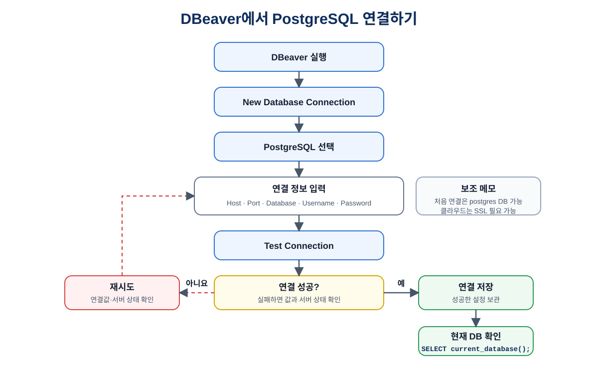

그림 3-3 DBeaver 연결 구성

`postgres`는 사용자 이름과 데이터베이스 이름에 모두 나타날 수 있습니다.

```text
postgres 사용자
→ PostgreSQL에 로그인하는 관리자 역할

postgres 데이터베이스
→ 설치할 때 일반적으로 생성되는 기본 데이터베이스
```

Test Connection이 성공하면 서버, 네트워크, 인증과 지정한 데이터베이스 접속이 가능하다는 뜻입니다. 하지만 다른 데이터베이스의 존재나 실제 변경 권한, `public` 스키마의 `USAGE`·`CREATE` 권한까지 모두 확인한 것은 아닙니다.

### 연결 이름 권장 예시

연결이 늘어날 때 혼동을 줄이기 위해 의미 있는 이름을 사용합니다.

```text
local-postgres-admin
local-ai-database-book
```

비밀번호, 실제 서버 주소의 민감한 부분과 개인 식별정보는 연결 이름에 넣지 않습니다.

---

## 7. 연결 정보 이해하기

연결 오류를 해결하려면 각 값의 의미를 알아야 합니다.

```text
Host
→ 어느 서버에 연결하는가

Port
→ 서버의 어느 연결 통로를 사용하는가

Database
→ 서버 안의 어느 데이터베이스에 접속하는가

Username
→ 어떤 PostgreSQL 역할로 로그인하는가

Password
→ 해당 역할의 인증 정보
```

같은 서버와 사용자라도 Database 값이 다르면 서로 다른 데이터베이스에 접속할 수 있습니다. 데이터베이스를 새로 만들었다고 기존 연결의 Database 값이 자동으로 바뀌지는 않습니다.

---

## 8. 작업용 데이터베이스 준비하기

이 책에서는 `ai_database_book`을 작업용 데이터베이스로 사용합니다.

### 8.1 기존 데이터베이스 확인

먼저 `postgres` 데이터베이스에 연결한 상태에서 존재 여부와 소유자를 확인합니다.

```sql
SELECT datname,
       pg_get_userbyid(datdba) AS database_owner
FROM pg_database
WHERE datname = 'ai_database_book';
```

결과가 0행이면 같은 이름의 데이터베이스가 없습니다. 1행이면 이미 존재하므로 바로 삭제하거나 다시 만들지 않습니다.

기존 데이터베이스가 있다면 다음을 확인합니다.

```text
누가 소유하고 있는가?
기존 스키마와 테이블이 있는가?
이 책의 연습용으로 계속 사용해도 되는가?
보존해야 할 데이터가 있는가?
```

### 8.2 필요한 경우 생성

데이터베이스가 없고 생성 권한이 있다면 다음 문장을 실행합니다.

```sql
CREATE DATABASE ai_database_book;
```

`CREATE DATABASE`는 열린 트랜잭션 안에서 실행할 수 없습니다. DBeaver의 Auto-commit 상태를 확인하고, 다른 SQL과 함께 전체 스크립트로 실행하지 말고 해당 문장만 선택해 실행합니다.

대표 오류:

```text
already exists
→ 같은 이름의 데이터베이스가 이미 있음

permission denied to create database
→ 현재 사용자에게 생성 권한이 없음

cannot run inside a transaction block
→ 열린 트랜잭션이나 실행 방식 확인 필요
```

> **관리자 계정의 범위**
>
> 개인 컴퓨터의 연습 환경을 처음 구성할 때는 `postgres` 관리자 역할을 사용할 수 있습니다. 실제 애플리케이션이나 공용 서버에서는 관리자 역할 대신 목적에 맞는 전용 사용자와 최소 권한을 사용합니다. 역할과 권한은 Chapter 11에서 자세히 다룹니다.

---

## 9. `ai_database_book`으로 다시 연결하기

데이터베이스를 생성해도 현재 연결이 자동으로 이동하지 않습니다.

```text
데이터베이스 생성
≠ 현재 연결 대상 변경
```

다음 중 한 방법을 사용합니다.

- 새 연결을 만들고 Database를 `ai_database_book`으로 지정한다.
- 기존 연결을 복제한 뒤 Database 값만 변경한다.
- 기존 연결 설정을 수정하고 다시 연결한다.

새 연결에서 다음 SQL을 실행합니다.

```sql
SELECT current_database();
```

기대 결과:

```text
ai_database_book
```

DBeaver 탐색기에서는 다음 위치를 확인합니다.

```text
연결
→ ai_database_book
→ Schemas
→ public
→ Tables
```

Chapter 04에서 첫 테이블을 만들기 전에는 `Tables`가 비어 있어도 정상입니다.

---

## 10. 현재 데이터베이스와 스키마 확인하기

`ai_database_book` 연결에서 다음 SQL을 실행합니다.

```sql
SELECT current_database();
SELECT current_user;
SELECT current_schema();
SHOW search_path;
```

각 결과의 의미는 다음과 같습니다.

| SQL | 확인하는 내용 |
| --- | --- |
| `current_database()` | 현재 연결된 데이터베이스 |
| `current_user` | 현재 접속한 PostgreSQL 역할 |
| `current_schema()` | `search_path`에서 실제로 사용할 수 있는 첫 번째 스키마 |
| `SHOW search_path` | 스키마 이름을 생략했을 때 객체를 찾는 순서 |

현재 스키마는 환경과 검색 경로에 따라 `public`이 아닐 수 있습니다. Chapter 04에서는 대상을 명확히 하기 위해 `public.students`처럼 스키마 이름을 함께 사용합니다.

다음 항목도 환경 확인 파일에서 참고할 수 있습니다.

```sql
SHOW transaction_read_only;
SHOW TimeZone;
```

- `transaction_read_only = off`: 현재 트랜잭션이 읽기 전용으로 강제되지 않은 상태. 실제 변경 가능 여부는 데이터베이스·스키마·객체 권한에 따라 달라질 수 있음
- `TimeZone`: 날짜와 시각을 해석하고 표시할 때 사용하는 세션 시간대

이 장에서는 값을 확인하는 데 집중합니다. 읽기 전용 연결과 시간대 설정의 운영 원리는 후속 장에서 확장합니다.

---

## 11. SQL을 안전하게 실행하기

DBeaver에서는 실행 범위를 구분해야 합니다.

```text
현재 문장 실행
→ 커서가 위치한 SQL 한 문장 실행

선택 영역 실행
→ 직접 선택한 SQL만 실행

전체 스크립트 실행
→ 편집기나 파일의 여러 문장 실행
```

단축키는 환경마다 다를 수 있으므로 실행 버튼의 기능 이름과 선택 영역을 확인합니다.

### 실행 전에 확인할 세 가지

```text
1. 어느 데이터베이스에 연결되어 있는가?
2. 어떤 SQL이 선택되어 있는가?
3. Auto-commit 상태는 무엇인가?
```

Auto-commit에서는 성공한 변경 SQL이 즉시 확정될 수 있습니다. Manual commit에서는 Commit 또는 Rollback이 필요할 수 있습니다. 트랜잭션의 정확한 원리는 Chapter 09에서 다룹니다.

Chapter 09 전까지는 변경 SQL을 한 문장 또는 확인한 선택 영역 단위로 실행하는 습관을 권장합니다.

---

## 12. 환경 확인 파일 실행하기

저장소에는 두 개의 환경 확인 파일이 있습니다.

### 12.1 `setup_check.sql`

파일: [`setup_check.sql`](../code/chapter03/setup_check.sql)

이 파일은 환경 정보를 독자가 직접 읽고 확인하기 위한 조회문을 포함합니다.

```text
PostgreSQL 버전
현재 데이터베이스
현재 스키마와 search_path
현재 사용자
읽기 전용 상태
TimeZone
현재 시각
간단한 SQL 계산
```

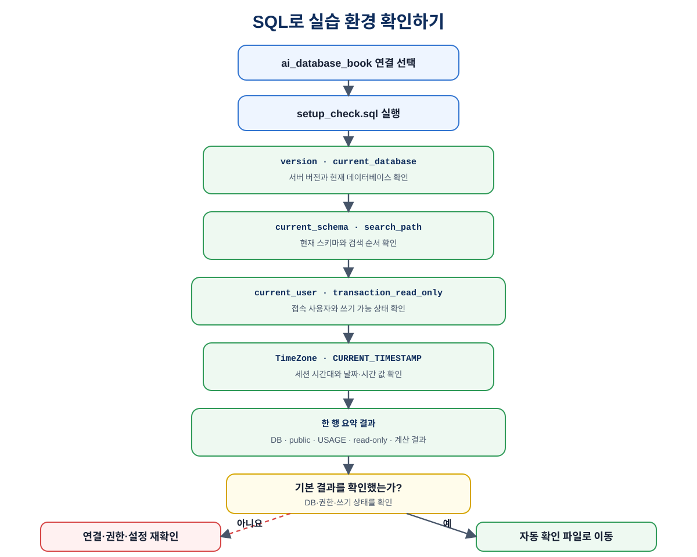

그림 3-4 SQL로 환경 정보 확인하기

이 파일은 정보를 보여 주지만 모든 조건을 자동으로 통과·실패 판정하지는 않습니다.

### 12.2 `setup_validate_local.sql`

파일: [`setup_validate_local.sql`](../code/chapter03/setup_validate_local.sql)

이 파일은 권장 로컬 환경에서 다음 조건을 자동으로 확인합니다.

```text
PostgreSQL 15 이상
현재 데이터베이스 = ai_database_book
현재 사용자의 CONNECT 권한
public 스키마 존재
public 스키마 USAGE 권한
public 스키마 CREATE 권한
읽기 전용 상태가 아님
기본 SQL 계산 정상
```

`USAGE`는 스키마 안의 객체를 참조할 때 필요한 권한이고, `CREATE`는 그 스키마에 새 객체를 만들 때 필요한 권한입니다. Chapter 04에서 `public.students`를 생성하려면 권장 로컬 경로에서 두 권한을 모두 확인하는 편이 안전합니다.

모두 통과하면 다음 메시지가 표시됩니다.

```text
Chapter 03 recommended local environment validation passed
```

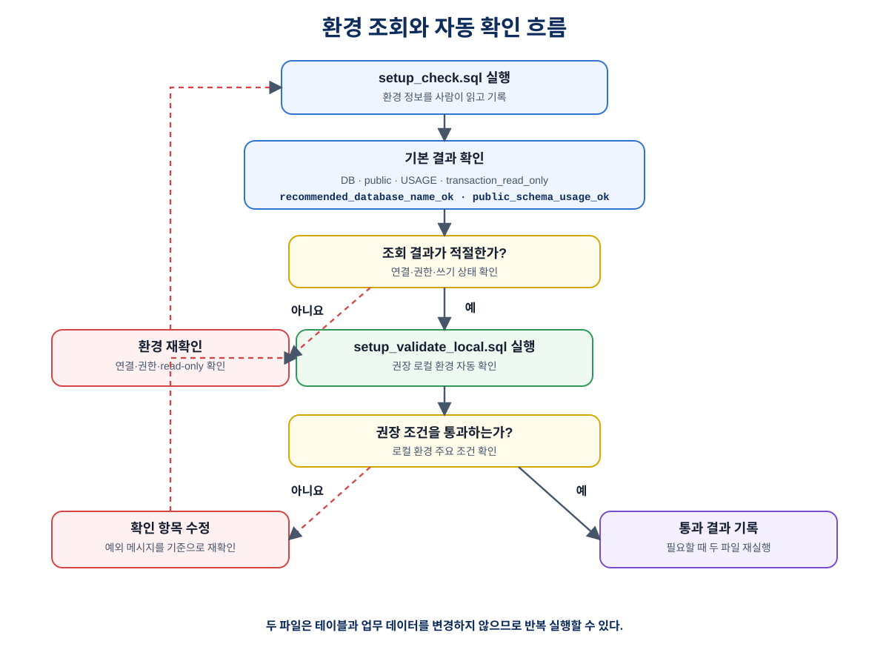

그림 3-5 환경 조회와 자동 확인 흐름

두 파일은 테이블과 업무 데이터를 생성·수정·삭제하지 않으므로 같은 연결에서 다시 실행할 수 있습니다.

관리형 PostgreSQL에서는 데이터베이스 이름, 권한과 읽기 전용 상태가 다를 수 있습니다. 이 경우 자동 확인 파일을 무조건 통과시키기 위해 권한을 변경하지 말고, 서비스 환경에서 Chapter 04의 테이블 생성이 가능한지 별도로 확인합니다.

---

## 13. 자주 발생하는 연결 오류 해결하기

먼저 문제의 단계를 구분합니다.

```text
설치 문제
→ PostgreSQL 프로그램이나 서비스가 준비되지 않음

서버 실행 문제
→ 설치됐지만 PostgreSQL 서비스가 중지됨

연결 문제
→ 서버는 실행되지만 연결값이나 인증이 잘못됨

SQL 문제
→ 연결은 성공했지만 실행한 SQL에 문제가 있음
```

| 증상 또는 메시지 | 우선 확인할 내용 |
| --- | --- |
| Connection refused | 서버 서비스, Host, Port, 방화벽 |
| Password authentication failed | Username과 Password |
| Database does not exist | Database 값과 생성 여부 |
| Permission denied to create database | 접속 사용자와 데이터베이스 생성 권한 |
| Permission denied for schema public | 현재 사용자와 `public` 스키마의 `CREATE` 권한 |
| Cannot run inside a transaction block | 실행 범위, 열린 트랜잭션과 Auto-commit |
| 데이터베이스나 테이블이 보이지 않음 | 현재 Database, Schema, 필터와 새로고침 |
| SSL 또는 Host 오류 | SSL 설정, DNS와 네트워크 |
| 관리형 연결 시간 초과 | 서비스 연결 방식, 네트워크와 IP 지원 |

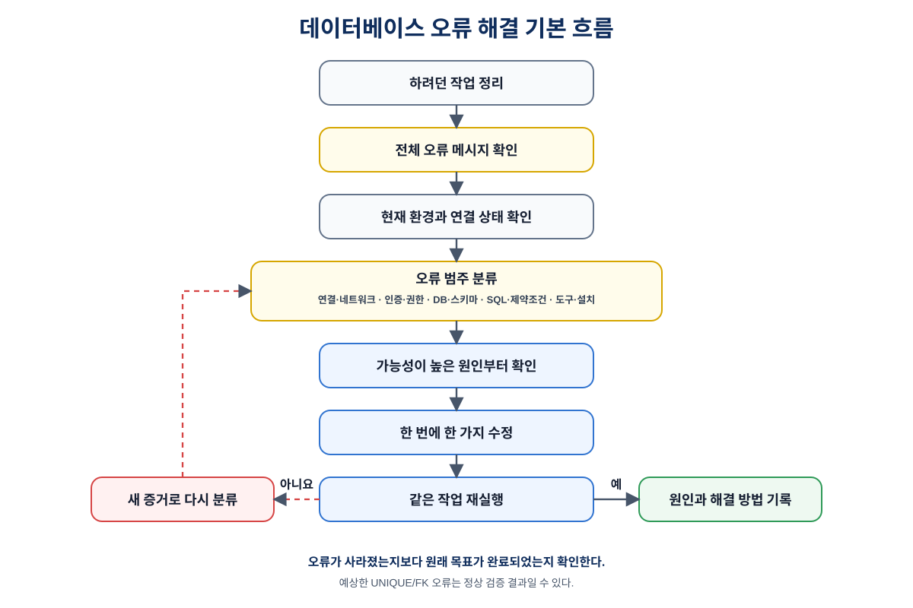

그림 3-6 데이터베이스 오류 해결 기본 흐름

공통 해결 순서:

```text
1. 실행하려던 작업을 한 문장으로 정리한다.
2. 오류 메시지를 생략하지 않고 읽는다.
3. 서버 상태와 Host·Port·Database·Username을 확인한다.
4. 설치·서버·네트워크·인증·권한·DB·스키마·SQL 문제로 분류한다.
5. 한 번에 하나의 설정만 바꾼다.
6. 같은 작업을 다시 실행한다.
7. 해결 방법과 실제 결과를 기록한다.
```

### 선택 학습: AI에게 오류 질문하기

AI에게 질문할 때는 다음 정보를 제공하면 원인 분석에 도움이 됩니다.

```text
운영체제
PostgreSQL 사용 방식: 로컬 / 관리형 / Docker
PostgreSQL과 DBeaver 버전
Host 일부 마스킹, Port, Database
실행한 작업
오류 원문
이미 확인한 내용
Auto-commit 상태
```

비밀번호, 전체 접속 URL, API 키와 Access Token은 포함하지 않습니다. AI가 제안한 해결 방법은 한 번에 하나씩 적용하고 실제 재실행 결과로 확인합니다.

---

## 14. 비밀번호와 접속 정보 보호하기

Chapter 03에서는 다음 원칙만 우선 기억합니다.

```text
비밀번호를 SQL 파일에 작성하지 않는다.
전체 접속 URL을 공개하지 않는다.
화면 캡처 전에 연결 정보를 확인한다.
공용 PC에서는 비밀번호 저장에 주의한다.
```

후속 Python과 명령행 실습에서는 다음과 같은 표준 접속 변수 이름을 사용할 수 있습니다.

```text
PGHOST
PGPORT
PGDATABASE
PGUSER
```

실제 비밀번호를 저장하는 방식, `PGPASSFILE`, 운영체제별 password file 위치와 파일 권한은 Chapter 11에서 자세히 다룹니다.

DBeaver 연결 설정을 내보내거나 화면을 캡처할 때도 서버 주소, 사용자 이름과 인증 정보가 포함될 수 있습니다.

비밀번호나 키가 공개되었다면 파일에서 삭제하는 것만으로 끝내지 않습니다. 해당 비밀번호나 키를 즉시 변경하거나 폐기해야 합니다.

---

## 15. 완료 점검과 다음 장

다음 항목을 확인합니다.

| 점검 항목 | 기본 완료 기준 |
| --- | --- |
| PostgreSQL 서버 | 실행 중이며 접속 가능 |
| DBeaver | Test Connection 성공 |
| 작업 데이터베이스 | `ai_database_book`에 연결 |
| 현재 위치 | 데이터베이스와 사용자를 SQL로 확인 |
| SQL 실행 범위 | 한 문장, 선택 영역과 전체 스크립트 구분 |
| 환경 확인 | `setup_check.sql` 결과 확인 |
| 로컬 자동 확인 | 권장 로컬 경로에서 `setup_validate_local.sql` 통과 |
| 비밀정보 | 공개 파일에 실제 비밀번호와 전체 접속 URL 없음 |

환경이 준비되었는지 최소 SQL로 다시 확인할 수 있습니다.

```sql
SELECT current_database();
SELECT current_user;
SELECT 1 + 1 AS result;
```

기대 상태:

```text
current_database = ai_database_book
result = 2
```

관리형이나 다른 대안 환경에서는 데이터베이스 이름이 다를 수 있습니다. 이 경우 현재 연결 대상을 정확히 알고 있으며 다음 장에서 테이블을 생성할 권한이 있는지 확인합니다.

다음 장에서는 준비한 연결에서 `public.students` 테이블을 만들고 데이터를 입력·조회·수정·삭제합니다. 설치와 연결이 끝났다는 사실보다 **어느 데이터베이스에서 어떤 SQL을 실행하는지 확인하는 습관**이 더 중요합니다.

---

# Chapter 04. 관계형 데이터베이스와 SQL 시작하기

---

## 이 장을 시작하기 전에

이 장은 SQL을 처음 실행하는 독자를 대상으로 합니다. Chapter 03에서 PostgreSQL 서버와 DBeaver 연결을 준비했다면 별도의 SQL 경험은 필요하지 않습니다.

실습을 시작하기 전에 다음 상태를 확인합니다.

```text
PostgreSQL 서버가 실행 중이다.
DBeaver에서 ai_database_book에 연결했다.
현재 연결과 실행 범위를 확인할 수 있다.
Chapter 04 실습 SQL 파일을 열 수 있다.
```

실습 파일과 실행 순서는 [Chapter 04 실습 코드 안내](../code/chapter04/README.md)에서 확인할 수 있습니다.

이번 장에서는 처음으로 테이블과 데이터를 직접 변경합니다. 따라서 SQL 문법을 많이 외우는 것보다 다음 순환을 반복하는 습관이 중요합니다.

```text
SQL 읽기
→ 예상 결과 작성
→ 현재 연결과 실행 범위 확인
→ 실행
→ 반환 행 또는 영향받은 행 수 확인
→ 실제 데이터와 비교
```

## 이 장을 마치면

다음 작업을 수행할 수 있습니다.

- `public.students` 테이블을 생성한다.
- 한 행과 여러 행을 입력한다.
- 필요한 열과 조건에 맞는 행을 조회한다.
- `AND`, `OR`, `IN`과 문자열 패턴을 사용한다.
- `NULL` 값을 올바르게 확인한다.
- 중복을 제거하고 결과를 정렬하며 개수를 제한한다.
- 대상 행을 먼저 확인한 뒤 데이터를 수정하거나 삭제한다.
- SQL 실행 전 예상과 실행 후 결과를 비교한다.

> **학습 표시**
>
> - **핵심 학습**: 처음 SQL을 배우는 독자가 직접 실행할 내용
> - **선택 학습**: PostgreSQL의 편리한 기능과 추가 문법
> - **심화 학습**: 데이터 타입과 내부 동작을 더 정확하게 이해할 내용

---

## 1. 첫 번째 테이블과 SQL 실습 흐름

이번 장에서는 `students` 테이블 하나를 사용합니다.

```text
테이블: public.students
한 행: 학생 한 명
열: id, name, email, major, grade, created_at
기본키: id
```

테이블을 만든 뒤 네 가지 기본 작업을 수행합니다.

| CRUD | SQL | 역할 | 기능 예시 |
| --- | --- | --- | --- |
| Create | `INSERT` | 새 데이터 행 추가 | 학생 등록 |
| Read | `SELECT` | 저장된 데이터 조회 | 학생 목록 확인 |
| Update | `UPDATE` | 기존 데이터 수정 | 학생 정보 변경 |
| Delete | `DELETE` | 기존 데이터 삭제 | 학생 기록 삭제 |

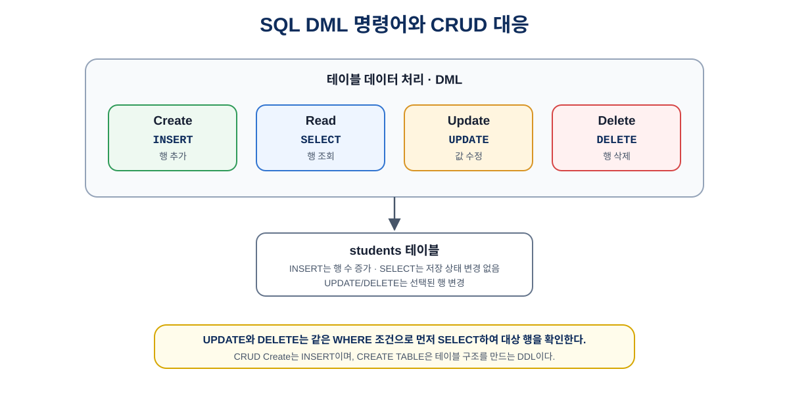

그림 4-1 SQL 명령어와 CRUD 대응

CRUD의 Create는 새 **데이터 행**을 추가하는 작업이므로 `INSERT`에 해당합니다. `CREATE TABLE`은 데이터를 추가하는 명령이 아니라 데이터를 저장할 구조를 만드는 명령입니다.

이 장의 권장 실행 파일 순서는 다음과 같습니다.

```text
01_create_students.sql
→ 02_insert_students.sql
→ 03_select_students.sql
→ 04_update_delete_students.sql
```

현재 상태를 확인할 때는 `verify_students.sql`, 처음부터 다시 시작할 때는 `reset_students.sql`을 사용합니다.

---

## 2. 실습 위치와 실행 범위 확인하기

먼저 현재 연결을 확인합니다.

```sql
SELECT current_database();
SELECT current_user;
SELECT current_schema();
SHOW search_path;
```

확인할 핵심은 다음과 같습니다.

```text
현재 데이터베이스가 ai_database_book인가?
예상한 사용자로 접속했는가?
search_path를 확인했는가?
```

현재 스키마는 환경에 따라 `public`이 아닐 수 있습니다. 이 장에서는 대상을 분명히 하기 위해 모든 주요 테이블 이름을 `public.students`처럼 스키마와 함께 작성합니다. 권장 로컬 경로에서는 Chapter 03의 `setup_validate_local.sql`로 `public` 스키마의 `USAGE`와 `CREATE` 권한까지 확인합니다. `transaction_read_only = off`라는 사실만으로 실제 객체 생성 권한까지 보장되는 것은 아닙니다.

DBeaver에서 실행하기 전에는 다음 세 가지를 확인합니다.

```text
1. 어느 데이터베이스에 연결되어 있는가?
2. 어떤 SQL 문장 또는 영역을 선택했는가?
3. Auto-commit 상태는 무엇인가?
```

자동 커밋 상태에서는 `INSERT`, `UPDATE`, `DELETE`가 실행 직후 확정될 수 있습니다. Chapter 09에서 트랜잭션을 배우기 전까지는 변경 SQL을 한 문장 또는 확인한 선택 영역 단위로 실행합니다.

---

## 3. SQL의 기본 작성 규칙

이 책에서는 다음 작성 방식을 사용합니다.

```text
SQL 키워드: 대문자
테이블명·열 이름: 소문자 snake_case
문자열 값: 작은따옴표
숫자: 따옴표 없이 작성
문장 끝: 세미콜론
한 줄 주석: --
```

예를 들어 문자열과 숫자는 다음처럼 작성합니다.

```sql
SELECT *
FROM public.students
WHERE major = '컴퓨터공학'
  AND grade = 2;
```

작은따옴표와 큰따옴표는 역할이 다릅니다.

```text
'김민지'
→ 문자열 값

"name"
→ 따옴표가 필요한 식별자
```

초급 실습에서는 큰따옴표가 필요한 테이블명과 열 이름을 만들지 않습니다.

SQL 키워드는 대소문자를 구분하지 않지만, 키워드와 데이터 이름을 시각적으로 구분하기 위해 책에서는 키워드를 대문자로 작성합니다.

---

## 4. CREATE TABLE로 첫 테이블 만들기

다음 SQL로 `public.students`를 만듭니다.

```sql
CREATE TABLE public.students (
    id INTEGER GENERATED BY DEFAULT AS IDENTITY PRIMARY KEY,
    name VARCHAR(50) NOT NULL,
    email VARCHAR(100) UNIQUE NOT NULL,
    major VARCHAR(100),
    grade INTEGER,
    created_at TIMESTAMPTZ NOT NULL DEFAULT CURRENT_TIMESTAMP
);
```

| 구성 | 의미 |
| --- | --- |
| `CREATE TABLE` | 새 테이블 구조 생성 |
| `public.students` | `public` 스키마의 `students` 테이블 |
| `INTEGER` | 정수 데이터 타입 |
| `VARCHAR(50)` | 최대 길이를 지정한 문자열 타입 |
| `PRIMARY KEY` | 각 행을 고유하게 구분 |
| `NOT NULL` | 최종 저장값으로 `NULL`을 허용하지 않음 |
| `UNIQUE` | 같은 비-`NULL` 값의 중복을 제한 |
| `DEFAULT` | 열 값을 생략했을 때 사용할 기본값 |
| `IDENTITY` | 값을 생략하면 자동 번호 생성 |
| `TIMESTAMPTZ` | 절대 시점을 저장하고 세션 `TimeZone`에 맞춰 표시하는 날짜·시각 타입 |

테이블을 만든 뒤 DBeaver의 탐색기에서 다음 위치를 새로고침합니다.

```text
Schemas
→ public
→ Tables
→ students
```

같은 `CREATE TABLE`을 다시 실행하면 이미 테이블이 존재한다는 오류가 발생할 수 있습니다. 오류를 피하기 위해 바로 삭제하지 말고 먼저 기존 구조와 데이터를 확인합니다.

> `CREATE TABLE IF NOT EXISTS`는 같은 이름의 테이블이 있을 때 오류를 피하지만, 기존 테이블의 열과 제약조건이 원하는 구조인지 보장하지는 않습니다.

---

## 5. 열, 데이터 타입과 제약조건 읽기

`students` 테이블의 한 행은 학생 한 명을 나타냅니다.

| 열 | 타입 | 필수 여부 | 역할 |
| --- | --- | --- | --- |
| `id` | `INTEGER` | 자동 생성·필수 | 내부 식별자 |
| `name` | `VARCHAR(50)` | 필수 | 학생 이름 |
| `email` | `VARCHAR(100)` | 필수·중복 금지 | 학생 이메일 |
| `major` | `VARCHAR(100)` | 선택 | 전공 |
| `grade` | `INTEGER` | 선택 | 학년 |
| `created_at` | `TIMESTAMPTZ` | 기본값·필수 | 등록 시각 |

`major`와 `grade`에는 `NOT NULL`이 없으므로 값을 생략하면 `NULL`이 저장될 수 있습니다. `NOT NULL`은 INSERT 문에서 해당 열 이름을 반드시 적어야 한다는 뜻이 아니라, 최종적으로 저장되는 값이 `NULL`일 수 없다는 뜻입니다. 예를 들어 `created_at`은 `NOT NULL`이지만 `DEFAULT CURRENT_TIMESTAMP`가 있으므로 INSERT에서 열을 생략할 수 있습니다.

### 자주 사용하는 데이터 타입

| 종류 | PostgreSQL 예 | 사용 예 |
| --- | --- | --- |
| 정수 | `INTEGER`, `BIGINT` | 수량, 내부 ID |
| 정확한 소수 | `NUMERIC` | 금액, 정밀한 비율 |
| 문자열 | `VARCHAR`, `TEXT` | 이름, 이메일, 코드 |
| 논리값 | `BOOLEAN` | 활성 여부 |
| 날짜 | `DATE` | 생년월일, 기준일 |
| 날짜와 시각 | `TIMESTAMPTZ` | 등록 시각 |

금액처럼 정확성이 중요한 값은 부동소수점 타입보다 `NUMERIC`을 우선 검토합니다. 정밀도와 업무 규칙은 Chapter 06에서 확장합니다.

### 선택 학습: 형 변환

문자열을 정수로 바꾸는 예입니다.

```sql
SELECT CAST('3' AS INTEGER) AS grade_number;
SELECT '3'::INTEGER AS grade_number;
```

`CAST()`는 표준적인 표현이고 `::`는 PostgreSQL에서 자주 사용하는 축약 문법입니다. 데이터 타입이 다른 값을 비교하거나 계산할 때 자동 변환에만 의존하지 말고 의도를 확인합니다.

### 선택 학습: UUID와 JSONB

PostgreSQL은 `UUID`, `JSONB` 같은 타입도 제공합니다. 이번 장에서는 직접 사용하지 않으며 유연한 데이터와 확장 기능은 Chapter 12에서 살펴봅니다.

### 심화 학습: 자동값의 의미

자동 생성 `id`는 행을 구분하는 값입니다. 학생 수나 학번처럼 빈틈없는 업무 번호가 아닙니다. 실패한 입력이나 삭제 등으로 번호 사이에 빈 구간이 생길 수 있습니다.

`TIMESTAMPTZ`는 시간대가 포함된 입력을 하나의 절대 시점으로 변환해 저장하고, 조회할 때는 현재 세션의 `TimeZone`에 맞춰 표시합니다. 입력할 때 사용한 원래 시간대 이름 자체를 보존하는 타입은 아닙니다.

`created_at`을 생략하면 `CURRENT_TIMESTAMP`가 기본값으로 사용됩니다. PostgreSQL의 `CURRENT_TIMESTAMP`는 현재 트랜잭션의 시작 시각을 사용하므로 같은 트랜잭션에서 입력한 여러 행은 같은 값을 가질 수 있습니다. 이 장의 `02_insert_students.sql`도 여섯 학생을 하나의 명시적 트랜잭션으로 입력하므로 `created_at`이 모두 같을 수 있습니다. 이때 `id`는 결과 순서를 안정적으로 만드는 **동률 해소 기준**으로 사용할 뿐, 실제 생성 시각을 대신하는 업무 시간으로 해석하지 않습니다.

이 테이블은 기본 SQL 학습용 최소 구조입니다. 학년 범위, 전공 표준화, 이메일 대소문자와 탈퇴 정책은 Chapter 06에서 보완합니다.

---

## 6. INSERT로 데이터 입력하기

`INSERT`는 새 행을 추가합니다.

```sql
INSERT INTO public.students (name, email, major, grade)
VALUES ('김민지', 'minji@example.com', '컴퓨터공학', 2);
```

문자열은 작은따옴표로 감싸고 숫자는 따옴표 없이 입력합니다. `id`와 `created_at`은 생략했으므로 PostgreSQL이 값을 결정합니다.

### 선택 학습: RETURNING

PostgreSQL의 `RETURNING`을 사용하면 실제로 입력된 값을 바로 확인할 수 있습니다.

```sql
INSERT INTO public.students (name, email, major, grade)
VALUES ('김민지', 'minji@example.com', '컴퓨터공학', 2)
RETURNING id, name, created_at;
```

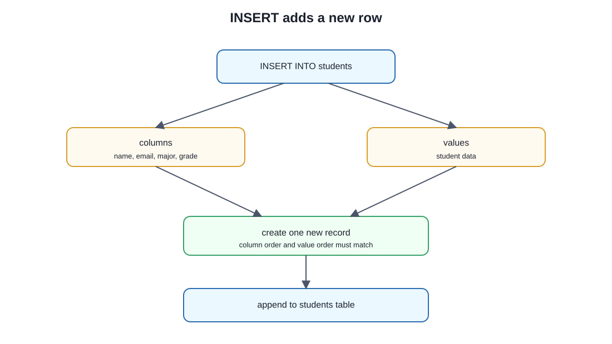

그림 4-2 INSERT로 새 행 추가하기

여러 행도 한 문장으로 입력할 수 있습니다.

```sql
INSERT INTO public.students (name, email, major, grade)
VALUES
    ('이준호', 'junho@example.com', '데이터사이언스', 3),
    ('박서연', 'seoyeon@example.com', '경영학', 1),
    ('최현우', 'hyunwoo@example.com', '컴퓨터공학', 4),
    ('정하늘', 'haneul@example.com', 'AI데이터공학', 2);
```

전공과 학년을 모르는 학생은 해당 열을 생략할 수 있습니다.

```sql
INSERT INTO public.students (name, email)
VALUES ('윤서진', 'seojin@example.com');
```

입력 완료 후의 **초기 데이터 상태**는 다음과 같습니다.

| 항목 | 상태 |
| --- | --- |
| 학생 수 | 6명 |
| 이준호 학년 | 3 |
| 박서연 | 존재 |
| 컴퓨터공학 학생 | 김민지, 최현우 |
| `major`, `grade`가 `NULL`인 학생 | 윤서진 |

행 수는 다음처럼 확인할 수 있습니다.

```sql
SELECT COUNT(*) AS student_count
FROM public.students;
```

`COUNT(*)`와 집계 함수는 Chapter 08에서 자세히 다룹니다.

---

## 7. SELECT로 필요한 데이터 조회하기

모든 열을 조회합니다.

```sql
SELECT *
FROM public.students;
```

`*`는 모든 열을 뜻합니다. 필요한 열만 명시하면 결과의 의미가 더 분명합니다.

```sql
SELECT id, name, email, major
FROM public.students
ORDER BY id ASC;
```

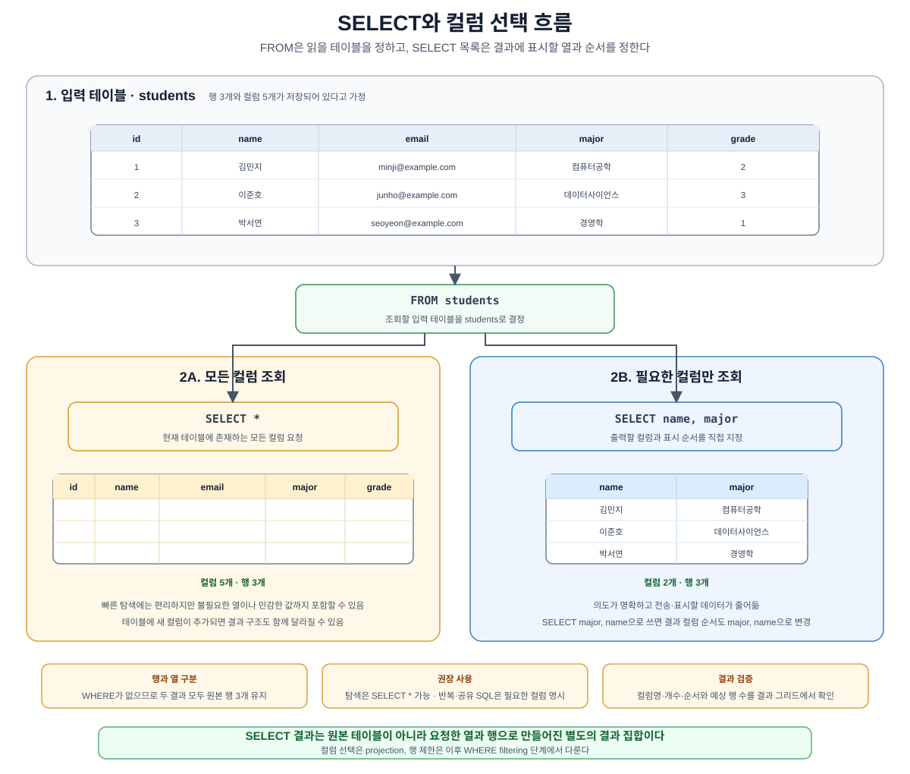

그림 4-3 SELECT로 필요한 열 선택하기

조회 결과의 열 이름만 바꾸어 표시하려면 별칭을 사용할 수 있습니다.

```sql
SELECT
    name AS student_name,
    major AS student_major
FROM public.students
ORDER BY id ASC;
```

`AS`는 원본 테이블의 열 이름을 변경하지 않습니다.

조회 결과를 확인할 때는 다음을 살펴봅니다.

```text
어떤 열이 반환되었는가?
몇 행이 반환되었는가?
결과 순서가 필요한가?
예상한 값과 실제 값이 일치하는가?
```

`ORDER BY`가 없는 조회 결과의 순서는 보장되지 않습니다.

---

## 8. WHERE와 비교 연산자

`WHERE`는 조건에 맞는 행만 선택합니다.

```sql
SELECT *
FROM public.students
WHERE major = '컴퓨터공학'
ORDER BY id ASC;
```

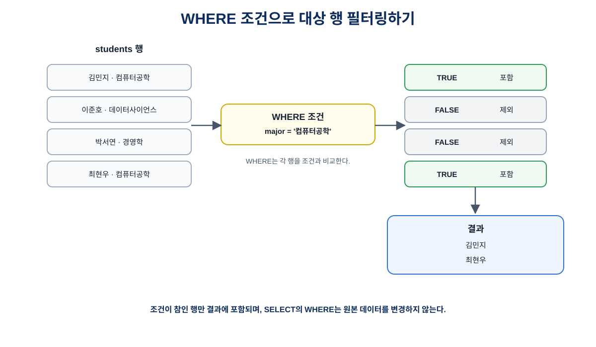

그림 4-4 WHERE 조건으로 대상 행 필터링하기

| 연산자 | 의미 | 예시 |
| --- | --- | --- |
| `=` | 같다 | `grade = 2` |
| `<>` | 같지 않다 | `major <> '경영학'` |
| `>` | 크다 | `grade > 2` |
| `>=` | 크거나 같다 | `grade >= 3` |
| `<` | 작다 | `grade < 3` |
| `<=` | 작거나 같다 | `grade <= 2` |

학년이 3 이상인 학생을 조회합니다.

```sql
SELECT id, name, grade
FROM public.students
WHERE grade >= 3
ORDER BY grade DESC, id ASC;
```

조건 값의 타입도 열의 의미와 맞아야 합니다.

```text
grade = 3
→ 정수 비교

major = '컴퓨터공학'
→ 문자열 비교
```

---

## 9. AND, OR, IN으로 조건 조합하기

`AND`는 모든 조건을 만족해야 합니다.

```sql
SELECT *
FROM public.students
WHERE major = '컴퓨터공학'
  AND grade >= 3
ORDER BY id ASC;
```

`OR`는 조건 중 하나 이상을 만족하면 됩니다.

```sql
SELECT *
FROM public.students
WHERE major = '컴퓨터공학'
   OR major = '데이터사이언스'
ORDER BY id ASC;
```

같은 열을 여러 값과 비교할 때는 `IN`이 읽기 쉽습니다.

```sql
SELECT *
FROM public.students
WHERE major IN ('컴퓨터공학', '데이터사이언스')
ORDER BY id ASC;
```

`AND`와 `OR`를 함께 사용하면 괄호로 의도를 분명하게 표현합니다.

```sql
SELECT *
FROM public.students
WHERE major = '컴퓨터공학'
  AND (grade = 2 OR grade = 3)
ORDER BY id ASC;
```

---

## 10. LIKE로 문자열 검색하기

`LIKE`는 문자열 패턴을 검색합니다.

```sql
SELECT *
FROM public.students
WHERE name LIKE '김%'
ORDER BY id ASC;
```

| 패턴 | 의미 |
| --- | --- |
| `'김%'` | 김으로 시작 |
| `'%민%'` | 중간에 민 포함 |
| `'%우'` | 우로 끝남 |
| `'김__'` | 김 뒤에 정확히 두 문자 |

`%`는 0개 이상의 문자를, `_`는 정확히 한 문자를 나타냅니다.

### 선택 학습: ILIKE

PostgreSQL에서는 대소문자를 구분하지 않는 패턴 검색에 `ILIKE`를 사용할 수 있습니다.

```sql
SELECT *
FROM public.students
WHERE email ILIKE '%EXAMPLE.COM'
ORDER BY id ASC;
```

`ILIKE`는 PostgreSQL 문법이며 다른 DBMS에서는 지원 방식이 다를 수 있습니다.

---

## 11. NULL 값 확인하기

`NULL`은 0이나 빈 문자열이 아닙니다.

```text
NULL
→ 값이 없거나 아직 알려지지 않은 상태
```

윤서진 학생의 `major`와 `grade`는 `NULL`입니다.

다음 조건은 원하는 결과를 반환하지 않습니다.

```sql
SELECT *
FROM public.students
WHERE major = NULL;
```

`NULL`은 일반 값처럼 `=` 또는 `<>`로 비교하지 않습니다. `IS NULL`과 `IS NOT NULL`을 사용합니다.

```sql
SELECT *
FROM public.students
WHERE major IS NULL
ORDER BY id ASC;
```

```sql
SELECT *
FROM public.students
WHERE major IS NOT NULL
ORDER BY id ASC;
```

`major <> '경영학'`은 `major`가 `NULL`인 행을 포함하지 않습니다. `NULL`도 포함하려면 의도를 명시합니다.

```sql
SELECT *
FROM public.students
WHERE major <> '경영학'
   OR major IS NULL
ORDER BY id ASC;
```

### 심화 학습: UNKNOWN과 IS DISTINCT FROM

일반 값과 `NULL`을 비교하면 결과가 참이나 거짓이 아니라 `UNKNOWN`이 될 수 있습니다. `WHERE`는 참인 행만 남기므로 해당 행이 제외됩니다.

PostgreSQL에서는 `NULL`을 포함한 비교에 다음 문법도 사용할 수 있습니다.

```sql
WHERE major IS DISTINCT FROM '경영학'
```

---

## 12. DISTINCT, ORDER BY와 LIMIT

### 중복 값 제거

전공 목록을 중복 없이 조회합니다.

```sql
SELECT DISTINCT major
FROM public.students
WHERE major IS NOT NULL
ORDER BY major ASC;
```

`DISTINCT`는 **조회 결과**의 중복을 제거합니다. 원본 테이블의 데이터를 삭제하거나 수정하지 않습니다.

### 결과 정렬

```sql
SELECT *
FROM public.students
ORDER BY grade ASC, id ASC;
```

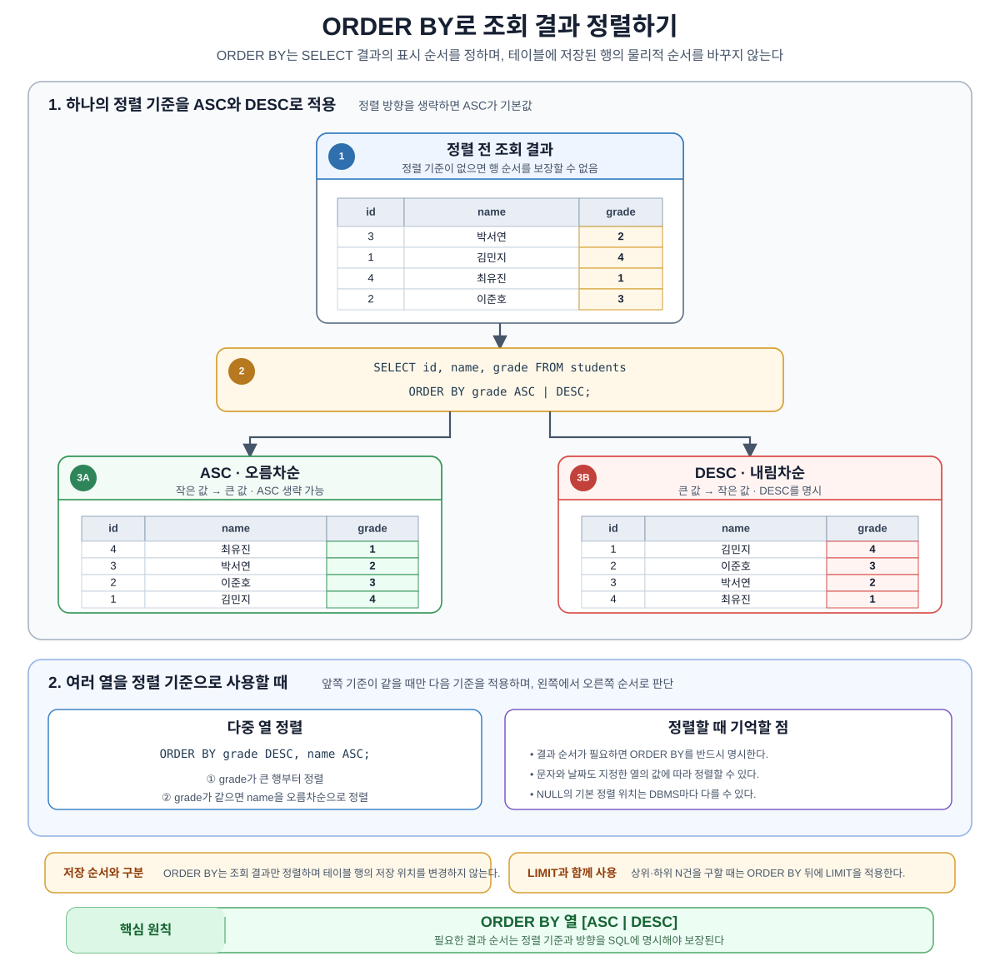

그림 4-5 ORDER BY로 조회 결과 정렬하기

### 선택 학습: NULL 위치 지정

PostgreSQL에서는 `NULLS FIRST`와 `NULLS LAST`로 `NULL` 위치를 지정할 수 있습니다.

```sql
SELECT *
FROM public.students
ORDER BY grade DESC NULLS LAST, id ASC;
```

### 결과 개수 제한

```sql
SELECT *
FROM public.students
ORDER BY created_at DESC, id DESC
LIMIT 3;
```

```text
ORDER BY
→ 결과 순서를 정함

LIMIT
→ 정렬된 결과 중 가져올 행 수를 정함
```

`LIMIT`을 사용할 때는 먼저 정렬 기준을 명시합니다. 위 예제는 `created_at`이 큰 행부터 정렬하고, 같은 시각이면 `id`로 순서를 고정한 뒤 상위 3행을 가져옵니다. `id`는 여기서 동률 해소용일 뿐 실제 시간의 대체값은 아닙니다.

---

## 13. UPDATE를 안전하게 실행하기

이준호의 학년을 4로 수정합니다.

### 1단계: 대상 확인

```sql
SELECT *
FROM public.students
WHERE email = 'junho@example.com';
```

### 2단계: 수정과 결과 확인

```sql
UPDATE public.students
SET grade = 4
WHERE email = 'junho@example.com'
RETURNING id, name, grade;
```

예상 영향 행 수는 1행입니다.

### 3단계: 다시 조회

```sql
SELECT *
FROM public.students
WHERE email = 'junho@example.com';
```

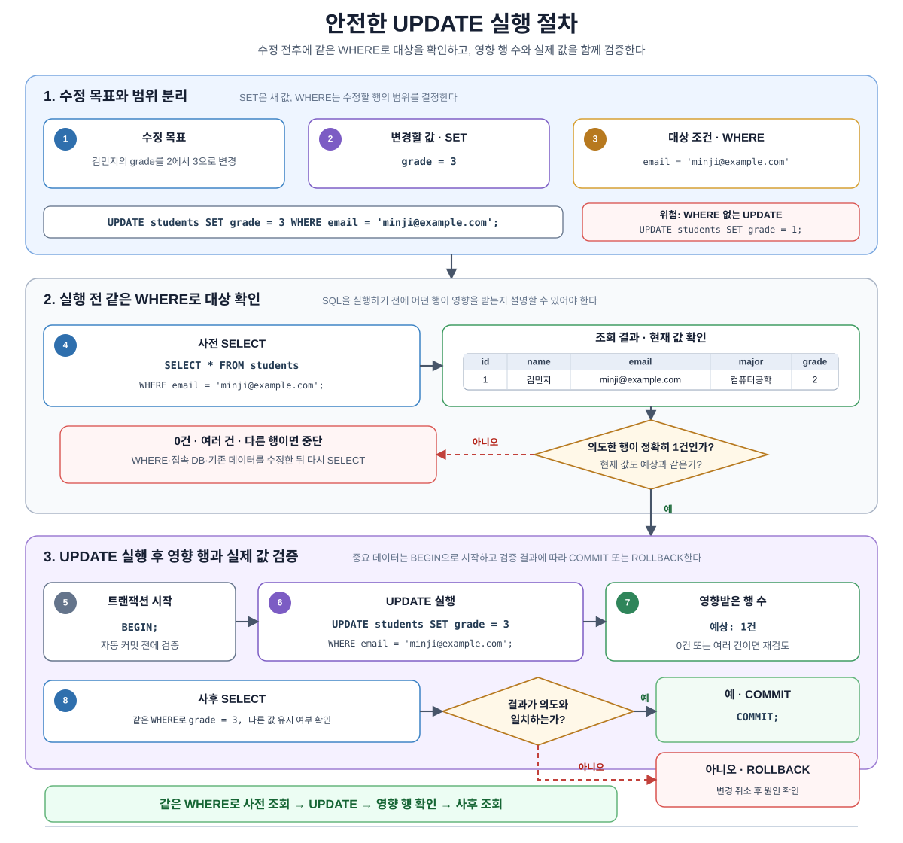

그림 4-6 안전한 UPDATE 실행 절차

```text
SELECT로 대상 확인
→ UPDATE 실행
→ RETURNING과 영향받은 행 수 확인
→ SELECT로 결과 재확인
```

`WHERE`가 없는 다음 SQL은 모든 행을 변경합니다.

```sql
UPDATE public.students
SET grade = 1;
```

문법 오류는 아니지만 의도하지 않은 전체 변경이 될 수 있습니다.

### 선택 학습: 여러 열 수정

```sql
UPDATE public.students
SET major = '소프트웨어공학',
    grade = 3
WHERE email = 'minji@example.com'
RETURNING id, name, major, grade;
```

이 예제는 데이터 상태를 바꾸므로 기본 실습에서는 실행하지 않고 구조만 확인합니다.

**수정 실습 후 상태**는 학생 6명, 이준호 학년 4, 박서연 존재입니다.

---

## 14. DELETE를 안전하게 실행하기

박서연 학생을 삭제합니다.

### 1단계: 대상 확인

```sql
SELECT *
FROM public.students
WHERE email = 'seoyeon@example.com';
```

### 2단계: 삭제와 결과 확인

```sql
DELETE FROM public.students
WHERE email = 'seoyeon@example.com'
RETURNING id, name, email;
```

예상 영향 행 수는 1행입니다.

### 3단계: 다시 조회

```sql
SELECT *
FROM public.students
WHERE email = 'seoyeon@example.com';
```

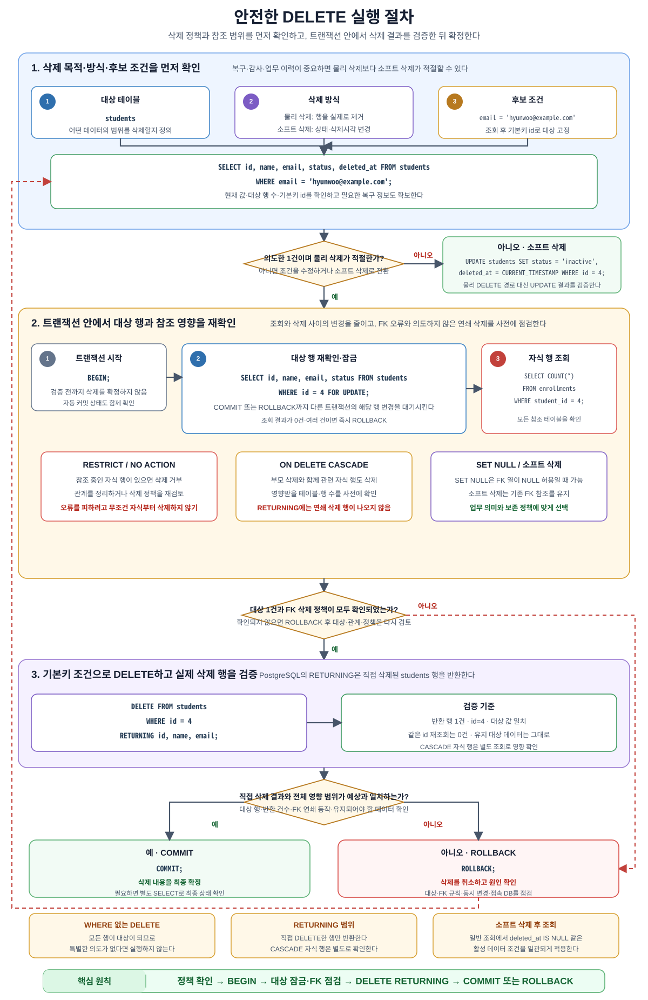

그림 4-7 안전한 DELETE 실행 절차

```text
SELECT로 대상 확인
→ DELETE 실행
→ RETURNING과 영향받은 행 수 확인
→ SELECT로 결과 재확인
```

`WHERE`가 없는 다음 SQL은 테이블의 모든 행을 삭제합니다.

```sql
DELETE FROM public.students;
```

테이블 구조는 남지만 데이터는 모두 사라집니다.

**삭제 실습 후 상태**는 학생 5명, 이준호 학년 4, 박서연 삭제입니다.

이 장에서는 SQL `DELETE`의 동작을 배우기 위해 행을 실제로 삭제합니다. 실제 서비스의 “삭제” 기능은 보존 정책과 감사 요구사항에 따라 상태값을 바꾸는 `UPDATE` 등으로 구현할 수도 있습니다. 어떤 삭제 정책을 사용할지는 업무 규칙과 함께 별도로 결정해야 합니다.

---

## 15. AI가 만든 SQL 검토하기

AI가 다음 SQL을 제안했다고 가정하겠습니다.

```sql
DELETE FROM public.students
WHERE major = '컴퓨터공학';
```

문법이 맞더라도 바로 실행하지 않습니다. 먼저 같은 조건으로 대상을 조회합니다.

```sql
SELECT id, name, email, major
FROM public.students
WHERE major = '컴퓨터공학'
ORDER BY id ASC;
```

삭제 실습 후 상태를 기준으로 김민지와 최현우 두 행이 조회됩니다. 두 학생을 모두 삭제하는 것이 실제 요구사항인지 확인해야 합니다. 이 장에서는 해당 `DELETE`를 실행하지 않습니다.

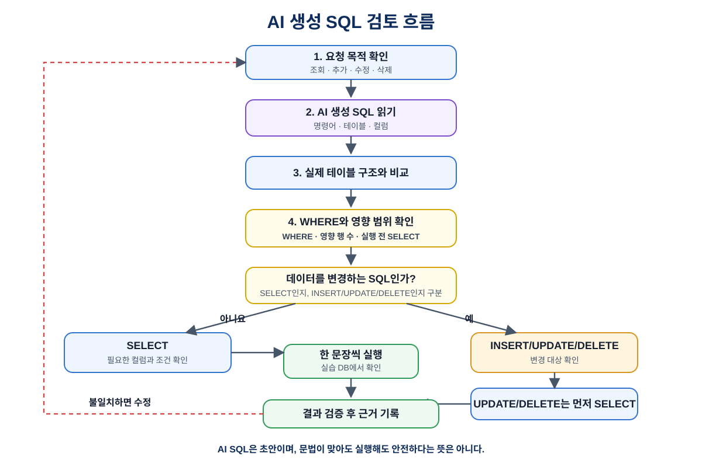

그림 4-8 AI 생성 SQL 검토 흐름

다음 여섯 질문으로 검토합니다.

```text
1. 현재 연결과 테이블이 맞는가?
2. 사용하는 열과 데이터 타입이 맞는가?
3. WHERE 조건과 NULL 처리가 요구사항과 맞는가?
4. 예상 반환 행 또는 영향받는 행 수는 몇 개인가?
5. UPDATE·DELETE 전에 같은 조건으로 SELECT했는가?
6. 실행 결과가 예상과 일치하는가?
```

조회 SQL이라면 `ORDER BY`와 `LIMIT`이 필요한지도 확인합니다.

---

## 16. 자주 하는 실수와 스스로 확인하기

### 자주 하는 실수

```text
현재 연결을 확인하지 않는다.
SQL 파일 전체를 반복 실행한다.
문자열에 작은따옴표를 사용하지 않는다.
NULL을 = NULL로 비교한다.
AND와 OR의 범위를 괄호로 표현하지 않는다.
ORDER BY 없이 결과 순서를 가정한다.
WHERE 없이 UPDATE나 DELETE를 실행한다.
Auto-commit과 영향받은 행 수를 확인하지 않는다.
자동 생성 id를 학생 수나 학번으로 사용한다.
AI가 만든 SQL을 그대로 실행한다.
```

### 개념 확인

1. CRUD의 Create와 `CREATE TABLE`은 어떻게 다른가요?
2. 문자열과 숫자 값은 SQL에서 어떻게 작성하나요?
3. `NULL`은 0이나 빈 문자열과 어떻게 다른가요?
4. `WHERE major = NULL`이 원하는 결과를 반환하지 않는 이유는 무엇인가요?
5. `DISTINCT`, `ORDER BY`, `LIMIT`의 역할은 각각 무엇인가요?
6. `UPDATE`와 `DELETE` 전에 같은 조건의 `SELECT`를 실행해야 하는 이유는 무엇인가요?

### SQL 작성

초기 데이터 상태를 기준으로 작성합니다.

```text
이름과 이메일만 id 순서로 조회하기
컴퓨터공학 또는 데이터사이언스 전공 조회하기
이름이 김으로 시작하는 학생 조회하기
전공이 NULL인 학생 조회하기
전공 목록을 중복 없이 조회하기
`created_at` 기준 상위 3행을 동률까지 안정적인 순서로 조회하기
```

수정·삭제 실습을 이미 완료했다면 `reset_students.sql`을 실행한 뒤 `01_create_students.sql`과 `02_insert_students.sql`을 순서대로 실행해 초기 상태를 다시 만듭니다.

더 많은 기록 활동과 권장 해설은 [Chapter 04 독자 워크북](../book/chapter04/chapter04_activity.md)에서 확인합니다.

---

## 17. 핵심 정리와 다음 장

| 작업 | SQL | 실행 전 확인 | 실행 후 확인 |
| --- | --- | --- | --- |
| 구조 생성 | `CREATE TABLE` | 현재 DB, 같은 이름의 테이블 | 실제 테이블 구조 |
| 데이터 입력 | `INSERT` | 열·값·타입, 실행 범위 | 추가된 행과 자동값 |
| 데이터 조회 | `SELECT` | 열·조건·정렬 | 반환 행, 값과 순서 |
| 데이터 수정 | `UPDATE` | 같은 조건의 `SELECT` | 영향 행과 변경값 |
| 데이터 삭제 | `DELETE` | 같은 조건의 `SELECT` | 영향 행과 남은 데이터 |

핵심 원칙은 다음과 같습니다.

```text
현재 연결과 실행 범위를 확인한다.
SQL을 실행하기 전에 결과를 예상한다.
NULL은 IS NULL 또는 IS NOT NULL로 확인한다.
결과 순서가 필요하면 ORDER BY를 사용한다.
LIMIT에는 안정적인 정렬 기준을 함께 사용한다.
UPDATE와 DELETE 전에는 같은 조건으로 SELECT한다.
실행 후 반환 행과 영향받은 행 수를 확인한다.
```

```text
SQL은 실행하는 것보다,
실행 전에 어떤 데이터가 영향을 받고
실행 후 실제 결과가 예상과 일치하는지 확인하는 것이 더 중요하다.
```

다음 장에서는 학생, 강의와 수강신청처럼 여러 종류의 데이터를 요구사항에서 찾아 테이블과 관계로 표현하고 ERD를 작성합니다.

---

# Chapter 05. 요구사항에서 데이터 모델과 ERD 만들기

---

## 이 장을 시작하기 전에

이 장은 데이터 모델링과 ERD를 처음 배우는 독자를 대상으로 합니다. Chapter 02에서 기본키·외래키와 관계의 기본 의미를 살펴보고, Chapter 04에서 테이블과 열을 직접 만들고 SQL을 실행했다면 별도의 설계 경험은 필요하지 않습니다.

Chapter 04에서는 이미 정해진 `students` 테이블을 만들고 SQL을 실행했습니다. 실제 프로젝트에서는 테이블이 먼저 주어지지 않습니다. 업무 요구사항을 읽고 무엇을 저장할지, 각 행이 무엇을 의미할지, 데이터가 어떻게 연결될지부터 결정해야 합니다.

이 장의 핵심 흐름은 다음과 같습니다.

```text
요구사항 읽기
→ 업무 사실·규칙·미확정 질문 구분
→ 관리 대상·속성·사건 찾기
→ 테이블별 한 행의 의미 결정
→ 관계를 양방향 문장으로 작성
→ 카디널리티와 선택성 판단
→ ERD 초안 작성
→ 요구사항 추적표로 누락 확인
→ 작은 시나리오로 구조 검증
```

## 이 장을 마치면

다음 작업을 수행할 수 있습니다.

- 요구사항에서 관리 대상, 속성과 업무 규칙을 구분한다.
- 확정된 규칙과 미확정 정책을 분리한다.
- 각 테이블의 한 행이 무엇을 의미하는지 설명한다.
- 기본키와 업무상 고유값 후보를 구분한다.
- 관계를 양방향 문장으로 작성한다.
- 카디널리티와 선택성을 판단한다.
- N:M 관계를 연결 테이블로 풀고, 사건 속성을 가진 연결 엔터티를 설명한다.
- ERD와 작은 샘플 시나리오로 요구사항 반영 여부를 확인한다.

> **학습 표시**
>
> - **핵심 학습**: 요구사항을 데이터 구조로 바꾸는 데 반드시 필요한 내용
> - **선택 학습**: 모델 수준, 1:1 관계와 PostgreSQL 구현을 확장하는 내용
> - **심화 학습**: 실물 복본(copy)·여러 저자·동시 대여·모델 변경을 다루는 내용

> **핵심 원칙**
>
> 좋은 데이터 모델은 명사를 많이 찾아 만든 표가 아니라, 각 테이블·열·관계가 어느 요구사항에서 나왔는지 설명할 수 있는 구조입니다.

---

## 1. 요구사항에서 데이터 구조를 만드는 이유

다음과 같은 하나의 큰 표를 생각해 보겠습니다.

| member_name | member_email | book_title | author | borrowed_at | due_at |
| --- | --- | --- | --- | --- | --- |
| 김민지 | minji@example.com | 데이터베이스 입문 | 문길래 | 2026-04-01 | 2026-04-15 |
| 김민지 | minji@example.com | SQL 기초 | 홍길동 | 2026-04-02 | 2026-04-16 |

회원 정보와 도서 정보가 대여 기록마다 반복됩니다. 이메일이나 책 제목이 바뀌면 여러 행을 수정해야 하며, 한 행이 회원인지 도서인지 대여 사건인지도 분명하지 않습니다.

데이터 모델링은 현실의 업무를 관리 가능한 데이터 구조로 정리하는 과정입니다.

```text
현실의 업무
→ 관리 대상과 사건
→ 속성
→ 관계
→ 업무 규칙
→ 테이블과 제약조건 후보
```

반복되는 정보는 테이블을 나눌 필요가 있다는 신호일 수 있습니다. 구체적인 정규화 기준은 Chapter 06에서 다룹니다. Chapter 05에서는 먼저 **무엇을 왜 분리하고 연결하는지**에 집중합니다.

---

## 2. 이 장에서 완성할 설계 산출물

ERD 그림 하나만 만들었다고 설계가 끝나는 것은 아닙니다. 이 장에서는 다음 결과물을 순서대로 완성합니다.

```text
1. 요구사항 목록
2. 미확정 질문 목록
3. 테이블별 한 행의 의미
4. 엔터티·속성·사건 후보표
5. 양방향 관계 문장
6. ERD 초안
7. 요구사항 추적표
8. 작은 검증 시나리오
9. PostgreSQL DDL 초안
```

각 산출물은 앞 단계의 판단 근거를 보존합니다. 요구사항이 바뀌면 어느 테이블과 관계를 다시 검토해야 하는지도 추적할 수 있습니다.

### 선택 학습: 개념·논리·물리 모델

데이터 모델은 다음 수준으로 구분할 수 있습니다.

| 수준 | 핵심 질문 | 대표 결과 |
| --- | --- | --- |
| 개념 모델 | 어떤 업무 대상과 사건이 있는가? | 회원, 도서, 대여 |
| 논리 모델 | 어떤 속성·키·관계가 필요한가? | `members`, `books`, `loans` 구조 |
| 물리 모델 | PostgreSQL에서 어떻게 구현하는가? | 열 타입, PK, FK, `CREATE TABLE` |

이 책에서는 초보자가 설계와 SQL을 연결할 수 있도록 논리 모델을 PostgreSQL 테이블 구조와 가깝게 표현한 실무형 ERD를 사용합니다. 엔터티와 테이블은 밀접하지만 완전히 같은 개념은 아닙니다.

---

## 3. 요구사항과 모델의 범위 정하기

이 장에서는 단순한 도서 대여 시스템을 설계합니다.

```text
R-01. 도서관은 회원을 관리한다.
R-02. 회원은 이름, 이메일, 가입일을 가진다.
R-03. 도서는 제목과 저자를 관리하며, 출판연도와 ISBN 정보도 저장할 수 있다.
R-04. 회원은 여러 권의 책을 대여할 수 있다.
R-05. 책은 시간에 따라 여러 번 대여될 수 있다.
R-06. 대여 기록에는 대여일, 반납예정일, 실제반납일을 저장한다.
R-07. 아직 반납되지 않은 대여 기록은 실제반납일이 비어 있을 수 있다.
```

요구사항만큼 중요한 것이 모델의 범위입니다.

> **이 장의 단순화된 범위**
>
> - `books` 한 행은 이 장에서 대여 대상으로 취급하는 **간소화된 도서 항목 한 건**이다.
> - 실제 서가의 개별 복본(copy)은 별도 엔터티로 모델링하지 않으므로, 같은 ISBN을 가진 여러 실물 책을 서로 구분할 수 없다.
> - 한 도서에 여러 저자가 연결되는 구조는 다루지 않는다.
> - 샘플 데이터에서는 같은 도서의 동시 미반납 대여를 만들지 않는다.
> - 동시 대여 차단을 데이터베이스에서 보장하는 방법은 Chapter 06에서 검토한다.

따라서 이 장의 `books`는 서지 정보와 실제 복본을 완전히 분리한 실무형 도서관 모델이 아닙니다. “도서 항목 하나를 대여 대상으로 취급한다”는 입문용 단순화이며, 복본별 바코드·소장 위치·분실 상태 같은 정보는 표현하지 않습니다.

---

## 4. 업무 사실·규칙·미확정 질문 구분하기

요구사항을 읽을 때 명사만 표시하지 않습니다. 다음 세 가지를 구분합니다.

| 구분 | 예 | 모델에서의 역할 |
| --- | --- | --- |
| 업무 사실·관리 대상 | 회원과 도서를 관리한다 | 엔터티 후보 |
| 설명 값 | 이름, ISBN, 대여일 | 속성 후보 |
| 업무 규칙 | 회원은 여러 권을 대여할 수 있다 | 관계·제약조건 후보 |

요구사항을 표로 분해하면 다음과 같습니다.

| ID | 데이터 요소 | 관계·규칙 후보 |
| --- | --- | --- |
| R-01 | 회원 | 독립적으로 관리 |
| R-02 | 이름, 이메일, 가입일 | 회원의 속성 |
| R-03 | 제목, 저자, 출판연도, ISBN | 도서의 속성 후보, 일부 값의 필수 여부는 추가 확인 |
| R-04 | 회원, 도서, 대여 | 회원과 대여의 반복 관계 |
| R-05 | 도서, 대여 | 시간에 따른 반복 사건 |
| R-06 | 대여일, 반납예정일, 실제반납일 | 대여 사건의 속성 |
| R-07 | 실제반납일 | `NULL` 허용 후보 |

### 확정된 규칙

현재 요구사항에서 분명하게 알 수 있는 내용입니다.

```text
회원과 도서를 관리한다.
대여 기록은 회원과 도서를 연결한다.
대여일과 반납예정일을 저장한다.
실제반납일은 비어 있을 수 있다.
한 회원과 한 도서는 시간에 따라 여러 대여 기록을 가질 수 있다.
```

### 미확정 질문

요구사항에 답이 없으면 임의로 확정하지 않습니다.

```text
회원 이메일은 반드시 고유한가?
이메일 대소문자를 같은 값으로 취급하는가?
ISBN은 반드시 고유한가?
ISBN이 없는 도서를 등록할 수 있는가?
동일 ISBN의 실제 복본을 어떻게 구분하는가?
한 도서에 여러 저자가 가능한가?
회원 한 명의 최대 대여 권수는 몇 권인가?
대여일보다 반납예정일이 앞설 수 있는가?
실제반납일이 대여일보다 앞설 수 있는가?
같은 도서를 동시에 두 명이 빌릴 수 있는가?
회원 삭제 후 대여 이력을 유지하는가?
```

미확정 질문은 설계 실패가 아닙니다. 오히려 확인되지 않은 정책을 `UNIQUE`, `CHECK`, 삭제 규칙으로 임의 구현하지 않도록 돕는 중요한 결과물입니다.

---

## 5. 엔터티·속성·사건 찾기

엔터티 후보를 판단할 때 다음 질문을 사용합니다.

```text
독립적인 식별자가 필요한가?
여러 속성을 가지는가?
여러 건이 저장되는가?
다른 대상과 관계를 가지는가?
시간에 따라 반복되는 사건이나 이력인가?
```

| 후보 | 분류 | 판단 근거 |
| --- | --- | --- |
| 회원 | 대상 엔터티 | 독립적으로 식별·관리하며 여러 속성을 가짐 |
| 도서 | 대상 엔터티 | 독립적으로 식별·관리하며 대여 이력을 가짐 |
| 대여 기록 | 사건 엔터티 | 반복 발생하며 날짜와 상태를 가짐 |
| 이메일 | 속성 | 회원을 설명하는 값 |
| ISBN | 속성 | 도서를 설명하는 값 |
| 반납예정일 | 속성 | 대여 사건을 설명하는 값 |

따라서 이 장의 핵심 테이블 후보는 다음과 같습니다.

```text
members
books
loans
```

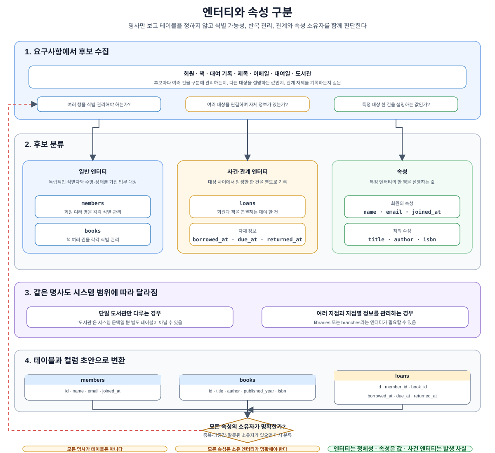

그림 5-1 엔터티·속성·사건 구분하기

`loans`는 회원과 도서를 연결하는 역할뿐 아니라 대여 시점과 반납 상태를 저장합니다. 따라서 단순 연결 테이블보다 **사건·업무 테이블**로 이해하는 것이 적절합니다.

---

## 6. 테이블별 한 행의 의미 정하기

열을 정하기 전에 각 테이블의 한 행이 무엇을 나타내는지 먼저 작성합니다.

| 테이블 | 한 행의 의미 |
| --- | --- |
| `members` | 회원 한 명 |
| `books` | 이 장에서 대여 대상으로 취급하는 간소화된 도서 항목 한 건 |
| `loans` | 특정 회원이 특정 도서를 대여한 사건 한 건 |

한 행의 의미가 명확하면 속성의 위치를 판단하기 쉽습니다.

```text
회원 이름과 이메일
→ members에 저장

도서 제목과 ISBN
→ books에 저장

대여일과 실제반납일
→ loans에 저장
```

다음과 같은 구조는 한 행의 의미를 흐리게 만듭니다.

```text
members.book_id
→ 회원 한 명이 여러 도서를 대여하는 이력을 한 열로 표현할 수 없음

books.member_ids
→ 여러 회원 ID를 문자열이나 배열 한 값처럼 저장하면 대여 시점·반납 상태와 개별 관계를 독립적으로 검증하기 어려움
```

---

## 7. 식별자와 기본키 후보 정하기

각 행은 안정적으로 구분되어야 합니다.

| 테이블 | 기본키 후보 | 업무상 고유값 후보 | 현재 정책 상태 |
| --- | --- | --- | --- |
| `members` | `id` | `email` | 고유성 미확정 |
| `books` | `id` | `isbn` | 고유성·복본 정책 미확정 |
| `loans` | `id` | 별도 업무 규칙 필요 | 사건 한 건 식별 |

이 장에서는 모든 테이블에 숫자형 `id`를 내부 기본키로 사용합니다.

```text
기본키
→ 데이터베이스 내부에서 행을 안정적으로 식별

업무상 고유값 후보
→ 정책이 확정되면 중복 금지를 검토할 값
```

이메일과 ISBN이 고유해 보이더라도 요구사항에서 보장하지 않으면 바로 `UNIQUE`를 적용하지 않습니다. 고유값 후보와 실제 고유성 제약조건은 구분해야 합니다.

### 선택 학습: 1:1 관계

일반 외래키만 추가하면 여러 자식 행이 같은 부모를 참조할 수 있으므로 그 자체로 1:1이 보장되지는 않습니다. 실제 1:1을 구현하려면 외래키에 `UNIQUE`를 적용하거나 부모의 기본키를 자식의 기본키이자 외래키로 사용하는 방법을 검토할 수 있습니다. 구체적인 제약조건 구현은 Chapter 06으로 넘깁니다.

---

## 8. 관계를 양방향 문장으로 표현하기

ERD를 그리기 전에 관계를 자연어로 작성합니다.

```text
한 회원은 0개 이상의 대여 기록을 가질 수 있다.
하나의 대여 기록은 정확히 한 회원을 참조한다.

한 도서는 0개 이상의 대여 기록을 가질 수 있다.
하나의 대여 기록은 정확히 한 도서를 참조한다.
```

양방향 관계 문장은 다음 질문에 답하게 합니다.

- 어느 쪽이 1이고 어느 쪽이 N인가?
- 외래키는 어느 테이블에 있어야 하는가?
- 관계는 필수인가 선택인가?
- 요구사항과 반대 방향 문장이 모두 일치하는가?

관계 문장이 모호하면 ERD부터 그리지 말고 추가 질문을 작성해야 합니다.

---

## 9. 카디널리티와 선택성 판단하기

카디널리티는 한쪽 행이 다른 쪽 행과 최대 몇 개까지 연결되는지 나타냅니다. 선택성은 최소 하나가 반드시 필요한지를 나타냅니다.

| 표기 | 의미 |
| --- | --- |
| `1` | 정확히 하나 |
| `0..1` | 없거나 하나 |
| `0..N` | 없거나 여러 개 |
| `1..N` | 하나 이상 |

도서 대여 관계는 다음과 같습니다.

```text
회원 → 대여 기록: 0..N
대여 기록 → 회원: 1
도서 → 대여 기록: 0..N
대여 기록 → 도서: 1
```

회원은 가입 직후 대여 기록이 없어도 되고, 신규 도서는 아직 대여되지 않았을 수 있습니다. 반면 대여 기록은 반드시 특정 회원과 특정 도서를 참조해야 합니다.

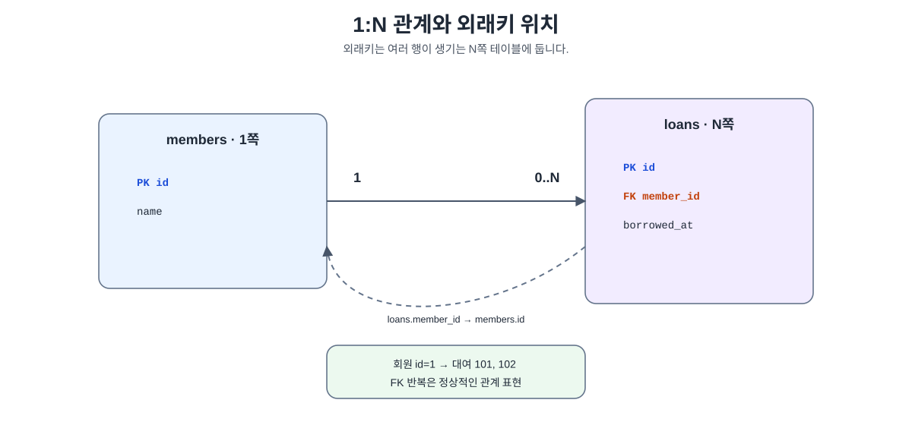

그림 5-2 1:N 관계와 외래키 위치

> **관계와 시간 규칙은 다릅니다.**
>
> `books 1 : N loans`는 한 도서가 시간 전체에 걸쳐 여러 대여 기록을 가질 수 있다는 뜻입니다. 같은 시점에 미반납 대여가 하나만 존재해야 한다는 규칙은 별도의 시간 기반 업무 제약입니다. ERD의 1:N 표기만으로 자동 보장되지 않습니다.

---

## 10. N:M 관계를 사건 테이블로 풀기

회원과 도서를 직접 연결하면 N:M 관계입니다.

```text
한 회원은 여러 도서를 대여할 수 있다.
한 도서는 시간에 따라 여러 회원에게 대여될 수 있다.
```

관계형 데이터베이스에서는 N:M 관계를 보통 연결(교차) 테이블로 풀어 두 개의 1:N 관계로 표현합니다. 이 사례의 `loans`는 연결 정보뿐 아니라 대여일과 반납 상태 같은 사건 속성까지 가지므로 **연결 엔터티이자 사건 테이블**로 이해할 수 있습니다.

```text
members 1 ─── N loans N ─── 1 books
```

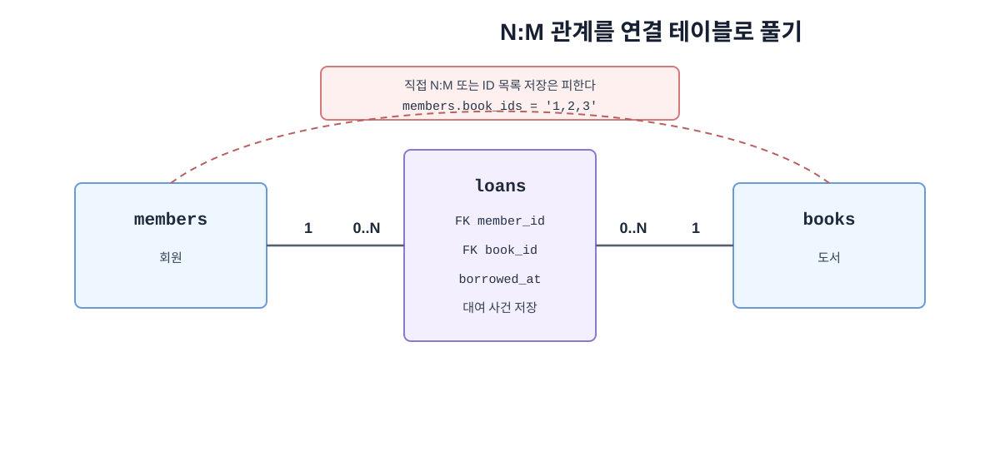

그림 5-3 N:M 관계를 사건 테이블로 풀기

`loans`에는 다음과 같은 사건 정보가 포함됩니다.

```text
member_id
book_id
borrowed_at
due_at
returned_at
```

따라서 `loans` 한 행은 단순히 회원과 도서가 연결되었다는 사실뿐 아니라 **언제 대여했고 언제 반납 예정이며 실제로 반납했는지**를 기록합니다.

---

## 11. ERD 표기와 텍스트 초안

이 책에서는 본문에서 읽기 쉬운 텍스트 표기를 기본으로 사용합니다.

```text
1      정확히 하나
0..1   없거나 하나
0..N   없거나 여러 개
1..N   하나 이상
```

Crow’s Foot 표기에서는 일반적으로 다음 기호를 조합합니다.

```text
|  하나
O  선택
<  여러 개
```

도구마다 표시 모양은 조금 다를 수 있으므로 기호를 암기하기보다 관계 문장과 함께 읽습니다.

먼저 텍스트 ERD를 작성합니다.

```text
members
- id PK
- name
- email
- joined_at

books
- id PK
- title
- author
- published_year
- isbn

loans
- id PK
- member_id FK -> members.id
- book_id FK -> books.id
- borrowed_at
- due_at
- returned_at

관계
members 1 : 0..N loans
books   1 : 0..N loans
```

텍스트 구조를 먼저 작성하면 외래키 위치와 누락된 속성을 그림 도구에 의존하지 않고 검토할 수 있습니다.

---

## 12. 도서 대여 시스템 ERD

요구사항과 관계 문장을 바탕으로 한 핵심 ERD는 다음과 같습니다.

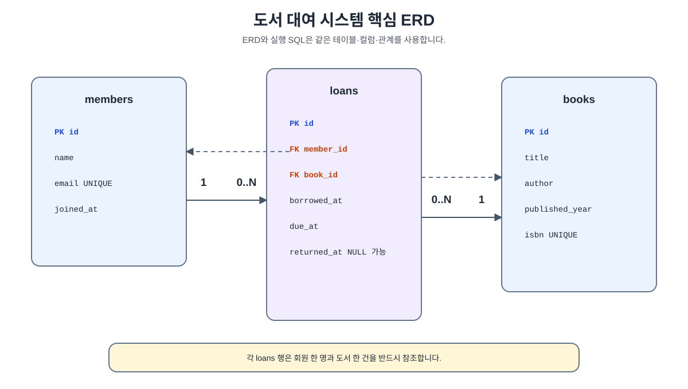

그림 5-4 도서 대여 시스템 핵심 ERD

ERD를 다시 자연어로 검증합니다.

```text
members 한 행은 회원 한 명이다.
books 한 행은 이 장에서 대여 대상으로 취급하는 간소화된 도서 항목 한 건이다.
loans 한 행은 대여 사건 한 건이다.

loans.member_id는 반드시 members.id를 참조한다.
loans.book_id는 반드시 books.id를 참조한다.
returned_at은 미반납 상태를 표현하기 위해 비어 있을 수 있다.
```

ERD가 보기 좋더라도 이 문장을 설명할 수 없으면 설계가 충분히 검토된 것은 아닙니다.

---

## 13. 요구사항 추적표로 누락 확인하기

요구사항 추적표는 요구사항과 설계 결과를 연결합니다.

| ID | 요구사항 또는 질문 | 상태 | 반영 위치 | 검증 시나리오 |
| --- | --- | --- | --- | --- |
| R-01 | 회원을 관리한다 | 확정 | `members` | 회원만 저장 가능 |
| R-02 | 이름·이메일·가입일 저장 | 확정 | `members` 열 | 회원 샘플 조회 |
| R-03 | 도서 정보 저장 | 확정 | `books` | 신규 도서 저장 가능 |
| R-04 | 회원의 반복 대여 | 확정 | `loans.member_id` | 회원 101의 여러 대여 |
| R-05 | 도서의 반복 대여 이력 | 확정 | `loans.book_id` | 도서 201의 시간순 이력 |
| R-06 | 대여 날짜 저장 | 확정 | `loans` 날짜 열 | 날짜 값 조회 |
| R-07 | 미반납 상태 허용 | 확정 | `returned_at` NULL 허용 | 미반납 3건 조회 |
| Q-01 | 이메일은 고유한가? | 미확정 | 제약조건 보류 | 정책 확인 필요 |
| Q-02 | ISBN은 항상 존재하며 고유한가? | 미확정 | `isbn` NULL 허용·UNIQUE 보류 | 정책 확인 필요 |
| A-01 | `books` 한 행을 간소화된 대여 대상 도서 항목으로 취급 | 가정 | 모델 범위 | 복본 미구분 명시 |
| O-01 | 여러 저자 모델 | 범위 제외 | 미반영 | 후속 확장 과제 |

상태는 다음 네 가지로 통일합니다.

```text
확정
미확정
가정
범위 제외
```

추적표의 목적은 모든 질문에 억지로 답하는 것이 아닙니다. 무엇을 구현했고 무엇을 아직 결정하지 않았는지 드러내는 것입니다.

---

## 14. ERD를 PostgreSQL 구조로 변환하기

ERD 요소는 다음과 같이 PostgreSQL 구조 후보로 연결됩니다.

| ERD 요소 | PostgreSQL 구조 후보 |
| --- | --- |
| 엔터티 | 테이블 |
| 속성 | 열 |
| 식별자 | 기본키 |
| 1:N 관계 | N쪽 테이블의 외래키 |
| 필수 속성 | `NOT NULL` 후보 |
| 확정된 업무상 고유값 | `UNIQUE` 후보 |
| 선택 속성 또는 필수 여부 미확정 속성 | NULL 허용 후보 |

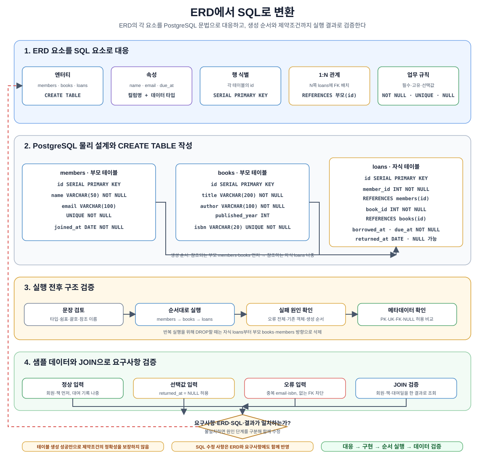

그림 5-5 ERD를 PostgreSQL 구조로 변환하기

현재 연결을 확인합니다.

```sql
SELECT current_database();
SELECT current_user;
SELECT current_schema();
SHOW search_path;
```

현재 스키마는 환경에 따라 `public`이 아닐 수 있습니다. 이 장의 실습 파일은 `public.members`처럼 스키마를 명시합니다.

```sql
CREATE TABLE public.members (
    id INTEGER GENERATED BY DEFAULT AS IDENTITY PRIMARY KEY,
    name VARCHAR(50) NOT NULL,
    email VARCHAR(100) NOT NULL,
    joined_at DATE NOT NULL
);

CREATE TABLE public.books (
    id INTEGER GENERATED BY DEFAULT AS IDENTITY PRIMARY KEY,
    title VARCHAR(200) NOT NULL,
    author VARCHAR(100) NOT NULL,
    published_year INTEGER,
    isbn VARCHAR(20)
);

CREATE TABLE public.loans (
    id INTEGER GENERATED BY DEFAULT AS IDENTITY PRIMARY KEY,
    member_id INTEGER NOT NULL REFERENCES public.members(id),
    book_id INTEGER NOT NULL REFERENCES public.books(id),
    borrowed_at DATE NOT NULL,
    due_at DATE NOT NULL,
    returned_at DATE
);
```

이메일과 ISBN에는 아직 `UNIQUE`를 적용하지 않았습니다. 중복을 허용하기로 확정한 것이 아니라 고유성 정책이 미확정이므로 적용을 보류한 것입니다. 또한 ISBN이 없는 도서를 허용할지도 미확정이므로 Chapter 05의 `isbn`은 `NULL`을 허용합니다. Chapter 06에서 정책을 확정한 뒤 기존 데이터와 함께 `NOT NULL`·`UNIQUE` 적용 여부를 검토합니다.

부모 테이블을 먼저 만들고 이를 참조하는 자식 테이블을 나중에 만듭니다.

```text
public.members
→ public.books
→ public.loans
```

권장 실행 파일은 다음과 같습니다.

- [`01_library_schema.sql`](../code/chapter05/01_library_schema.sql)
- [`02_library_seed.sql`](../code/chapter05/02_library_seed.sql)
- [`03_library_validation.sql`](../code/chapter05/03_library_validation.sql)
- [`reset_library.sql`](../code/chapter05/reset_library.sql)

### 심화 학습: 고정 ID와 IDENTITY

샘플 관계를 쉽게 확인하기 위해 실습 파일은 `101`, `201`, `1001`처럼 고정 ID를 사용합니다. 명시적 ID 입력 후 자동 생성값의 다음 위치를 조정하는 작업은 `02_library_seed.sql`이 처리합니다. 이 내부 동작을 이해하지 않아도 핵심 모델링 실습을 진행할 수 있습니다.

---

## 15. 작은 샘플 시나리오로 구조 검증하기

모델은 정상적인 업무 시나리오를 표현할 수 있어야 합니다.

| 시나리오 | 구조가 표현해야 할 상태 |
| --- | --- |
| 신규 회원 | 대여 기록 없이 회원만 저장 가능 |
| 신규 도서 | 대여 이력 없이 도서만 저장 가능 |
| 반복 대여 | 같은 회원이 여러 대여 기록 보유 |
| 도서 이력 | 같은 도서가 시간에 따라 여러 번 대여됨 |
| 미반납 상태 | `returned_at`이 `NULL` |
| 관계 연결 | 모든 대여가 특정 회원과 도서를 참조 |

샘플 기준은 다음과 같습니다.

```text
members: 3행
books: 3행
loans: 4행
미반납 대여: 3행
고아 대여 기록: 0행
```

도서 201은 첫 대여가 2026년 4월 2일 반납된 뒤 2026년 4월 3일 다시 대여됩니다. 이 샘플은 시간에 따른 반복 이력을 표현하지만 동시 미반납 상태는 만들지 않습니다. 다만 `books`가 실물 복본을 구분하지 않는 간소화 모델이므로, 이 사실만으로 실제 도서관의 복본별 대여 가능성을 완전하게 표현했다고 볼 수는 없습니다.

관계가 실제 조회로 이어지는지 최소 JOIN으로 확인할 수 있습니다.

```sql
SELECT
    loans.id,
    members.name AS member_name,
    books.title AS book_title,
    loans.returned_at
FROM public.loans AS loans
JOIN public.members AS members
    ON loans.member_id = members.id
JOIN public.books AS books
    ON loans.book_id = books.id
ORDER BY loans.id;
```

이 SQL은 ERD의 연결이 실제 데이터 조회로 이어지는지만 확인합니다. JOIN 문법과 다양한 결합 방식은 Chapter 08에서 학습합니다.

외래키 오류, 날짜 선후 관계, 이메일·ISBN 고유성, 동시 활성 대여 차단은 Chapter 06에서 실패 사례와 제약조건으로 검토합니다.

### 선택 학습: 요구사항이 바뀌면

요구사항은 바뀔 수 있습니다.

```text
한 도서에 여러 저자가 필요해짐
동일 ISBN의 실제 복본을 구분해야 함
회원 이메일의 고유성이 확정됨
대여 상태를 별도 값으로 관리해야 함
```

이때 테이블을 무조건 삭제하고 다시 만드는 것이 아니라 다음 흐름을 따릅니다.

```text
변경 요구사항 기록
→ 기존 모델 영향 분석
→ ERD 수정
→ ALTER TABLE·데이터 이전 계획
→ 검증
```

`ALTER TABLE`과 제약조건 변경은 Chapter 06에서 이어서 다룹니다.

---

## 16. AI가 만든 모델 검토하기

AI는 엔터티와 관계 후보를 빠르게 정리할 수 있지만, 요구사항에 없는 정책을 자연스럽게 추가하거나 모델의 범위를 바꿀 수 있습니다.

AI에게 다음 항목을 명시해 요청합니다.

```text
요구사항에서 엔터티·속성·사건 후보를 구분해 주세요.
각 테이블의 한 행 의미를 작성해 주세요.
관계를 양방향 문장으로 설명해 주세요.
각 테이블과 열의 요구사항 ID를 표시해 주세요.
확정 규칙, 미확정 질문, 가정과 범위 제외를 구분해 주세요.
요구사항에 없는 UNIQUE·CHECK·삭제 정책을 임의로 확정하지 마세요.
작은 검증 시나리오를 함께 제안해 주세요.
```

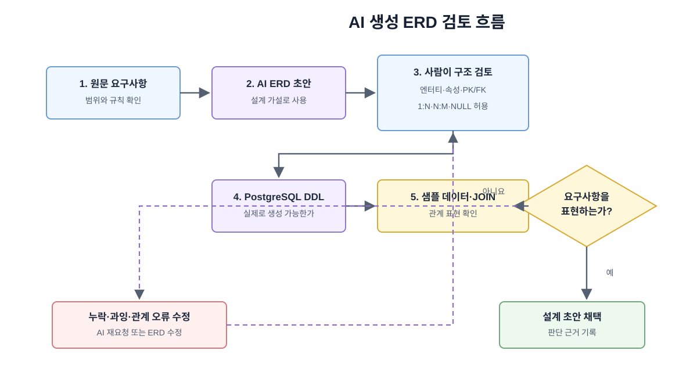

그림 5-6 AI 생성 ERD 검토 흐름

AI 결과는 다음 여섯 질문으로 검토합니다.

```text
1. 각 테이블과 열의 요구사항 근거가 있는가?
2. 각 테이블의 한 행 의미가 명확한가?
3. 미확정 정책을 임의로 확정하지 않았는가?
4. 관계를 양방향으로 읽었을 때 카디널리티가 맞는가?
5. N:M 관계와 반복 사건을 적절히 분리했는가?
6. 작은 샘플 시나리오를 구조가 표현할 수 있는가?
```

예를 들어 AI가 `members`에 `book_id` 하나만 추가했다면 한 회원의 반복 대여와 시간 이력을 표현할 수 없습니다. `loans` 같은 사건 테이블이 필요합니다.

---

## 17. 자주 하는 실수·스스로 확인하기·핵심 정리

### 자주 하는 실수

1. 중요한 명사를 모두 테이블로 만든다.
2. 테이블의 한 행 의미를 정하지 않는다.
3. 동사와 수량 표현을 무시한다.
4. 요구사항에 없는 정책을 임의로 확정한다.
5. 관계를 한 방향으로만 읽는다.
6. N:M 관계를 문자열이나 배열 한 열로 저장한다.
7. ERD의 1:N이 동시성 업무 규칙까지 보장한다고 생각한다.
8. 그림이 그럴듯하면 요구사항 검증이 끝났다고 생각한다.
9. 샘플 데이터만 보고 이메일·ISBN의 고유성을 확정한다.
10. 요구사항 변경 시 기존 데이터 영향을 검토하지 않는다.

### 스스로 확인하기

1. `members`, `books`, `loans`의 한 행 의미를 각각 설명해 보세요.
2. 이메일과 ISBN에 바로 `UNIQUE`를 적용하지 않은 이유는 무엇인가요?
3. 회원과 도서의 N:M 관계를 `loans`가 어떻게 두 개의 1:N으로 바꾸나요?
4. 회원에서 대여 기록으로 향하는 관계가 `0..N`인 이유는 무엇인가요?
5. 대여 기록에서 회원으로 향하는 관계가 `1`인 이유는 무엇인가요?
6. ERD의 1:N 관계와 동시 미반납 대여 금지 규칙은 왜 다른가요?
7. 요구사항 추적표에서 `미확정`과 `가정`은 어떻게 다른가요?
8. AI가 이메일 고유성과 회원 삭제 정책을 임의로 추가했다면 어떻게 수정해야 하나요?

[Chapter 05 독자 워크북](../book/chapter05/chapter05_activity.md)에서 요구사항 분석과 ERD 판단 근거를 직접 기록할 수 있습니다.

### 핵심 정리

| 질문 | 설계 결과 |
| --- | --- |
| 무엇을 관리하는가? | 엔터티·사건 후보 |
| 한 행은 무엇인가? | 테이블의 의미 |
| 무엇을 저장하는가? | 속성·열 후보 |
| 어떻게 연결되는가? | 관계 문장·외래키 후보 |
| 몇 개까지 연결되는가? | 카디널리티 |
| 반드시 연결되어야 하는가? | 선택성·NULL 여부 후보 |
| 정책이 확정되었는가? | 제약조건 적용 또는 보류 |
| 요구사항이 반영되었는가? | 추적표·샘플 시나리오 |

이 장에서 가장 중요한 문장은 다음과 같습니다.

```text
각 테이블의 한 행은 무엇을 의미하며,
그 테이블·열·관계가 어느 요구사항에서 나왔는지 설명할 수 있어야 한다.
```

---

## 다음 장에서는

Chapter 06에서는 이 장의 모델을 더 안전한 데이터베이스 구조로 발전시킵니다.

```text
반복 데이터와 함수적 종속 확인
→ 정규화
→ UNIQUE·CHECK·외래키 제약조건
→ ALTER TABLE로 구조 보완
→ 잘못된 데이터 입력 실패 확인
→ 참조 무결성과 동시 활성 대여 검토
```

---

# Chapter 06. 정규화와 데이터 무결성으로 좋은 테이블 만들기

---

## 이 장을 시작하기 전에

이 장은 정규화와 데이터 무결성을 처음 배우는 독자를 대상으로 합니다. Chapter 05에서 테이블의 한 행 의미, 기본키·외래키와 관계를 이해했다면 별도의 정규화 경험은 필요하지 않습니다.

Chapter 05에서는 요구사항을 바탕으로 `members`, `books`, `loans` 구조를 설계하고, 이메일·ISBN 고유성, ISBN의 필수 여부, 날짜 순서와 동시 활성 대여 같은 정책을 미확정 질문으로 남겼습니다. 이번 장에서는 서로 다른 사실이 한 테이블에 섞일 때 생기는 문제를 분석하고, 필요한 정책을 확정한 뒤 PostgreSQL 제약조건으로 구현합니다.

```text
한 행의 의미 확인
→ 위험한 중복과 이상 현상 찾기
→ 각 열의 주인 결정
→ 1NF·2NF·3NF 질문 적용
→ 정규화된 구조 만들기
→ 정책 확정
→ 제약조건 추가
→ 정상·경계·오류 데이터 검증
```

## 이 장을 마치면

다음 작업을 수행할 수 있습니다.

- 위험한 중복과 정상적인 반복을 구분한다.
- 삽입·수정·삭제 이상을 설명한다.
- 각 열의 주인 테이블을 판단한다.
- 제1·제2·제3정규형의 핵심 질문을 적용한다.
- 확정 규칙을 적절한 제약조건과 연결한다.
- 정규화와 데이터 무결성 제약조건의 역할을 구분한다.
- 정상·경계·오류 데이터로 제약조건을 검증한다.
- 기존 데이터가 있는 테이블에 규칙을 추가하기 전에 영향 범위를 확인한다.

> **학습 표시**
>
> - **핵심 학습**: 정규화와 기본 무결성 제약조건을 이해하는 데 필요한 내용
> - **선택 학습**: `ALTER TABLE`, 삭제 정책과 부분 고유 인덱스를 확장하는 내용
> - **심화 학습**: 후보키, 기간 중첩과 운영 마이그레이션을 다루는 내용

> **핵심 원칙**
>
> 정규화는 각 사실의 주인을 정하는 과정이고, 무결성 제약조건은 확정된 업무 규칙에 따라 저장 가능한 값과 관계의 경계를 정하는 장치입니다.

---

## 1. 좋은 테이블은 데이터가 변할 때 드러난다

처음 데이터를 입력할 때는 하나의 큰 테이블이 편해 보일 수 있습니다.

| loan_id | member_name | member_email | book_title | author | borrowed_at | due_at | returned_at |
| ---: | --- | --- | --- | --- | --- | --- | --- |
| 1001 | 김민지 | minji@example.com | 데이터베이스 입문 | 문길래 | 2026-04-01 | 2026-04-15 | 2026-04-02 |
| 1002 | 김민지 | minji@example.com | SQL 기초 | 홍길동 | 2026-04-02 | 2026-04-16 | NULL |
| 1003 | 이준호 | junho@example.com | 데이터베이스 입문 | 문길래 | 2026-04-03 | 2026-04-17 | NULL |

한 행은 대여 사건을 나타내지만 회원과 도서의 현재 정보까지 함께 저장합니다. 이 구조를 실제 저장 테이블로 사용하면 다음 문제가 생깁니다.

```text
김민지의 이름과 이메일이 대여 기록마다 반복된다.
같은 도서의 제목과 저자가 여러 행에 반복된다.
회원 이메일을 바꿀 때 여러 행을 수정해야 한다.
대여되지 않은 새 도서를 독립적으로 등록하기 어렵다.
마지막 대여 행을 삭제하면 도서 정보까지 사라질 수 있다.
```

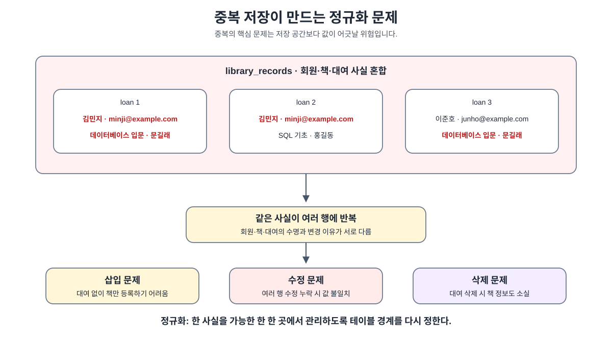

그림 6-1 중복 저장이 만드는 정규화 문제

좋은 테이블은 처음 입력하기 쉬운 구조가 아니라, 데이터가 추가·수정·삭제될 때도 사실의 의미와 일관성을 지킬 수 있는 구조입니다.

---

## 2. 위험한 중복과 의미 있는 반복

값이 반복된다고 모두 잘못된 것은 아닙니다.

```text
여러 대여 행에 같은 회원 이메일이 복사됨
→ 같은 현재 사실을 여러 곳에서 관리하는 위험한 중복

loans_nf.member_id에 101이 여러 번 나타남
→ 회원 101이 여러 대여 사건을 가진다는 정상적인 반복

여러 주문 행에 주문 당시 가격이 저장됨
→ 과거 시점의 사실을 보존하는 의미 있는 이력
```

다음 질문으로 구분합니다.

```text
같은 사실의 복사본인가?
각 행마다 독립적인 업무 의미가 있는가?
값이 바뀔 때 한 곳만 수정하면 되는가?
사건 당시 값을 보존하기 위해 의도적으로 저장한 것인가?
```

정규화의 목적은 반복을 무조건 제거하는 것이 아니라, 같은 사실의 복사본이 서로 다른 값이 되는 위험을 줄이는 것입니다.

---

## 3. 삽입·수정·삭제 이상

잘못된 테이블 경계는 데이터 변경 과정에서 이상 현상을 만듭니다.

| 이상 현상 | 의미 | 도서 대여 사례 |
| --- | --- | --- |
| 삽입 이상 | 독립적인 정보를 자연스럽게 추가하기 어려움 | 아직 대여되지 않은 도서를 등록하기 어려움 |
| 수정 이상 | 같은 사실을 여러 곳에서 수정해야 함 | 회원 이메일을 여러 대여 행에서 수정해야 함 |
| 삭제 이상 | 한 행을 지울 때 보존할 정보까지 사라짐 | 마지막 대여 행 삭제 시 도서 정보도 사라짐 |

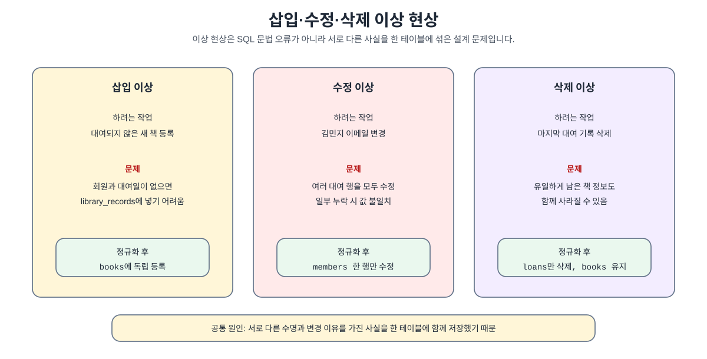

그림 6-2 삽입·수정·삭제 이상 현상

이상 현상은 SQL 문법 오류가 아닙니다. SQL은 정상적으로 실행되지만 데이터의 의미가 손상되는 구조 문제입니다.

---

## 4. 한 행의 의미와 열의 주인

정규화를 시작할 때 먼저 각 테이블의 한 행이 무엇을 나타내는지 정합니다.

```text
library_records_raw 한 행
→ 대여 사건 한 건이지만 회원·도서의 현재 사실까지 혼합

members_nf 한 행
→ 회원 한 명

books_nf 한 행
→ 이 장에서 대여 대상으로 취급하는 간소화된 도서 항목 한 건

여기서 “대여 대상으로 관리하는 도서 한 건”이라는 표현은 실제 복본 한 권을 뜻하지 않고, 이 장의 단순화 범위에서 사용하는 도서 항목 한 건을 뜻합니다.

loans_nf 한 행
→ 특정 회원이 특정 도서를 대여한 사건 한 건
```

| 열 | 표현하는 사실 | 적절한 주인 |
| --- | --- | --- |
| `member_name`, `member_email` | 회원의 현재 정보 | `members_nf` |
| `book_title`, `author` | 도서의 현재 정보 | `books_nf` |
| `borrowed_at`, `due_at`, `returned_at` | 대여 사건 | `loans_nf` |
| `member_id`, `book_id` | 대여와 부모 행의 관계 | `loans_nf` |

다음 질문을 반복합니다.

```text
이 값은 누구를 설명하는가?
값이 바뀌는 이유와 시점은 무엇인가?
한 곳에서 관리해야 하는 현재 사실인가?
사건 당시 값을 보존해야 하는 이력인가?
```

---

## 5. 함수적 종속의 기초

함수적 종속은 업무 범위 안에서 어떤 값이 다른 값을 결정하는 관계입니다.

```text
X → Y
```

같은 `X` 값이면 `Y`도 항상 같아야 한다는 업무 규칙을 의미합니다.

```text
member_id → member_name, member_email
book_id   → book_title, author
loan_id   → borrowed_at, due_at, returned_at
```

샘플에서 값이 우연히 반복된다고 함수적 종속이 되는 것은 아닙니다. 결정 관계는 업무 규칙과 식별 기준에 근거해야 합니다.

---

## 6. 제1정규형: 독립 값을 한 셀이나 반복 열에 섞지 않는다

제1정규형은 각 속성이 정의된 도메인의 값을 갖고 반복 그룹이 없도록 관계를 구성하는 기준입니다. 이 책에서는 입문 단계의 판단 질문으로, 개별적으로 검색·연결·수정해야 할 반복값을 쉼표 목록이나 `book1`, `book2` 같은 반복 열에 묶어 두지 않는지 확인합니다.

| member_id | member_name | borrowed_books |
| ---: | --- | --- |
| 101 | 김민지 | 데이터베이스 입문, SQL 기초 |

`borrowed_books` 안의 각 책을 독립적으로 검색하거나 외래키로 연결하기 어렵습니다. 다음처럼 한 대여당 한 행으로 표현할 수 있습니다.

| member_id | member_name | book_title |
| ---: | --- | --- |
| 101 | 김민지 | 데이터베이스 입문 |
| 101 | 김민지 | SQL 기초 |

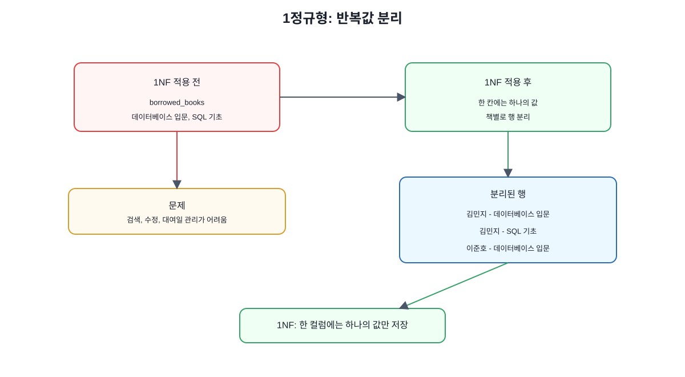

그림 6-3 제1정규형: 독립 값을 행으로 분리하기

`book1`, `book2`, `book3`처럼 반복 열을 만드는 방식도 피합니다. 다만 JSON 문서 자체가 하나의 업무 값인 경우처럼 저장 목적과 조회 방식이 다른 구조는 별도로 판단해야 하며, JSONB는 Chapter 12에서 다룹니다.

---

## 7. 제2정규형: 복합키 일부에만 의존하는 열을 분리한다

제2정규형은 제1정규형을 만족한 관계에서 비키 속성이 후보키 전체가 아니라 그 일부에만 의존하는 부분 종속이 있는지 확인합니다. 입문 단계에서는 복합 후보키가 있는 테이블을 중심으로 살펴보면 이해하기 쉽습니다.

| student_id | course_id | student_name | course_name | grade |
| ---: | ---: | --- | --- | --- |
| 1 | 101 | 김민지 | 데이터베이스 | A |
| 1 | 102 | 김민지 | 알고리즘 | B |
| 2 | 101 | 이준호 | 데이터베이스 | A |

이 예제에서는 한 학생이 같은 강의를 한 번만 수강한다고 가정하고 `(student_id, course_id)`를 복합키로 봅니다.

```text
student_id → student_name
course_id → course_name
student_id + course_id → grade
```

따라서 다음처럼 각 열의 주인으로 분리합니다.

```text
students(id, name)
courses(id, name)
enrollments(student_id, course_id, grade)
```

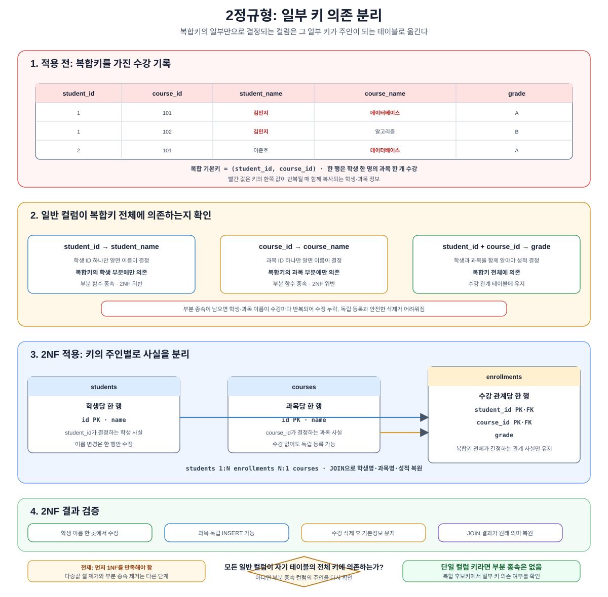

그림 6-4 제2정규형: 복합키 일부 의존 분리

모든 후보키가 단일 열이라면 후보키의 일부라는 개념이 없으므로 부분 종속은 발생하지 않습니다. 재수강·학기·분반을 관리한다면 `term_id`, `section_id` 같은 식별 요소를 추가로 검토해야 합니다.

---

## 8. 제3정규형: 일반 열이 다른 일반 열을 결정하는지 확인한다

제3정규형은 제2정규형을 만족한 관계에서 비키 속성이 다른 비키 속성을 통해 후보키에 전이적으로 의존하는 구조가 있는지 확인합니다. 이 책에서는 대표적인 전이 종속 패턴을 중심으로 살펴봅니다.

> 다음 예제에서는 설명을 단순화하기 위해 하나의 `zip_code`가 하나의 `city`를 결정한다고 가정합니다. 실제 주소 체계는 별도 기준을 확인해야 합니다.

| member_id | member_name | zip_code | city |
| ---: | --- | --- | --- |
| 1 | 김민지 | 04524 | 서울 |
| 2 | 이준호 | 04524 | 서울 |
| 3 | 박서연 | 48058 | 부산 |

```text
member_id → zip_code
zip_code → city
```

`city`는 회원 ID보다 우편번호에 직접 의존하므로 다음처럼 분리할 수 있습니다.

```text
members(id, name, zip_code)
zip_codes(zip_code, city)
```

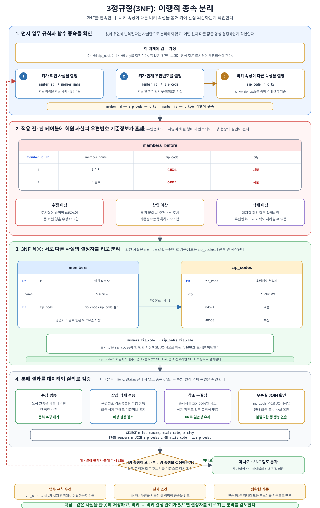

그림 6-5 제3정규형: 일반 열 간 의존 분리

값이 반복된다는 이유만으로 테이블을 분리하지 않습니다. 일관된 결정 규칙과 독립적으로 관리할 필요가 있는지 확인해야 합니다.

---

## 9. 도서 대여 구조 정규화하기

정규화 전 구조는 회원·도서·대여 사실이 한 행에 섞여 있습니다.

```text
library_records_raw(
    loan_id,
    member_name,
    member_email,
    book_title,
    author,
    borrowed_at,
    due_at,
    returned_at
)
```

열의 주인을 기준으로 다음 구조로 분리합니다.

```text
members_nf(id, name, email, joined_at)
books_nf(id, title, author, published_year, isbn)
loans_nf(id, member_id, book_id, borrowed_at, due_at, returned_at)
```

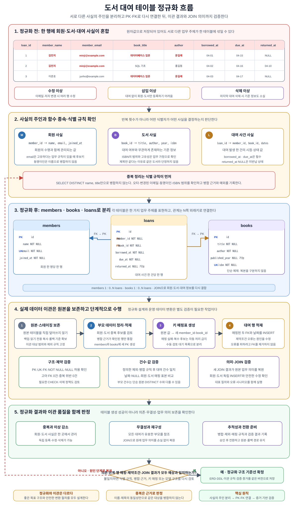

그림 6-6 도서 대여 구조 정규화 흐름

`joined_at`, `published_year`, `isbn`은 원시 테이블을 나누는 과정에서 자동으로 생긴 값이 아닙니다. Chapter 05의 전체 요구사항에서 가져온 속성입니다. 정규화는 존재하지 않던 업무 데이터를 만들어 내는 작업이 아닙니다. 또한 위 구조는 개념을 설명하기 위한 정규화 결과입니다. 실제 원시 데이터를 새 테이블로 이전하려면 회원·도서를 식별할 원천 키나 매핑 규칙, 중복 처리 기준과 데이터 검증 절차가 별도로 필요합니다.

---

## 10. 미확정 정책을 확정 규칙으로 바꾸기

Chapter 05에서 남긴 질문 가운데 이번 실습에 필요한 정책을 다음처럼 확정합니다. Chapter 05에서 이미 필수로 사용한 회원 이름·이메일·가입일, 도서 제목·저자, 대여의 회원·도서·대여일·반납예정일도 정규화 후 테이블에 다시 적용합니다. `01_normalization_schema.sql`에서는 제약조건 추가 과정을 보여 주기 위해 이 규칙들을 잠시 생략하고, `04_add_integrity_rules.sql`에서 기존 데이터 검사 후 복원합니다.

| ID | 확정 규칙 | 구현 후보 |
| --- | --- | --- |
| C-01 | 정확히 같은 이메일 문자열 중복 금지 | `UNIQUE (email)` |
| C-02 | ISBN은 필수이며 같은 ISBN 문자열 중복 금지 | `NOT NULL` + `UNIQUE (isbn)` |
| C-03 | 회원 이름과 도서 제목의 공백 문자열 금지 | `CHECK` |
| C-04 | 반납예정일은 대여일 이상 | `CHECK` |
| C-05 | 실제반납일은 `NULL` 또는 대여일 이상 | `CHECK` |
| C-06 | 존재하는 회원·도서만 참조 | `FOREIGN KEY` |
| C-07 | 대여 이력이 있는 부모 행 삭제 금지 | `ON DELETE RESTRICT` |
| C-08 | 도서당 미반납 대여 최대 한 건 | 부분 고유 인덱스 |

다음은 이번 장의 단순화 범위입니다.

```text
이메일 대소문자와 별칭 정규화는 다루지 않는다.
동일 ISBN의 여러 실물 복본은 별도 모델로 분리하지 않는다. 따라서 이번 실습에서는 ISBN을 도서 항목의 필수 고유값으로 확정한다.
여러 저자 관계는 다루지 않는다.
과거 대여 기간 전체의 중첩은 검사하지 않는다.
현재 미반납 대여의 중복만 차단한다.
```

제약조건은 좋은 아이디어를 임의로 추가하는 기능이 아니라, 요구사항이나 명시적으로 확정한 가정을 DBMS가 검사할 수 있도록 바꾸는 기능입니다.

---

## 11. 정규화와 데이터 무결성의 역할

정규화된 테이블만 만들었다고 잘못된 데이터가 자동으로 차단되지는 않습니다.

```text
정규화
→ 사실을 적절한 테이블에 배치

무결성 제약조건
→ 확정된 규칙에 따라 허용할 값과 관계를 선언
```

무결성 규칙은 다음처럼 분류할 수 있습니다.

| 무결성 유형 | 대표 구현 | 확인 내용 |
| --- | --- | --- |
| 개체 무결성 | `PRIMARY KEY` | 각 행을 안정적으로 구분하는가 |
| 필수값·도메인 무결성 | 타입, `NOT NULL`, `CHECK` | 허용된 형태와 범위인가 |
| 고유성 | `UNIQUE` | 업무상 중복되면 안 되는가 |
| 참조 무결성 | `FOREIGN KEY` | 존재하는 부모를 참조하는가 |
| 여러 행의 업무 규칙 | 고유 인덱스·트랜잭션·애플리케이션 | 여러 행을 함께 비교해야 하는가 |

---

## 12. PRIMARY KEY·NOT NULL·UNIQUE·CHECK

### PRIMARY KEY

기본키는 테이블 안의 각 행을 고유하게 식별합니다.

```sql
id INTEGER GENERATED BY DEFAULT AS IDENTITY PRIMARY KEY
```

### NOT NULL

열의 최종 저장값으로 `NULL`을 허용하지 않습니다.

```sql
name VARCHAR(50) NOT NULL
```

`INSERT`에서 열을 생략했더라도 `DEFAULT`가 있으면 기본값이 채워질 수 있습니다. 기본값도 없어서 최종 값이 `NULL`이 되면 `NOT NULL` 위반입니다. `NOT NULL`은 빈 문자열이나 공백 문자열까지 막지는 않습니다.

### UNIQUE

업무상 중복되면 안 된다고 확정한 값을 제한합니다.

```sql
CONSTRAINT uq_members_nf_email UNIQUE (email)
```

PostgreSQL의 기본 `UNIQUE` 동작에서는 `NULL`을 서로 같은 값으로 보지 않으므로, NULL을 허용하는 열에는 여러 NULL이 존재할 수 있습니다. 필요하면 `NULLS NOT DISTINCT`를 사용해 NULL도 같은 값처럼 취급할 수 있습니다. 이번 실습의 이메일과 ISBN은 `NOT NULL`과 `UNIQUE`를 함께 적용하므로 이 차이가 실제 저장 결과에 영향을 주지는 않습니다.

### CHECK

한 행 안의 값이 만족해야 할 조건을 선언합니다.

```sql
CONSTRAINT chk_loans_nf_due_date
    CHECK (due_at >= borrowed_at)
```

`CHECK` 식이 `FALSE`이면 저장이 거부됩니다. PostgreSQL에서는 식의 결과가 `TRUE`이거나 `NULL`이면 제약조건을 만족한 것으로 처리하므로, 필수값까지 보장하려면 `NOT NULL`이 별도로 필요합니다.

```sql
grade INTEGER NOT NULL
    CHECK (grade BETWEEN 1 AND 4)
```

제약조건에 `uq_`, `chk_`, `fk_`처럼 의미 있는 이름을 붙이면 오류 메시지에서 실패한 규칙을 찾기 쉽습니다.

---

## 13. 외래키와 참조 무결성

외래키는 자식 테이블의 값이 실제 부모 행을 참조하도록 보장합니다.

```sql
CONSTRAINT fk_loans_nf_member
    FOREIGN KEY (member_id)
    REFERENCES public.members_nf(id)
    ON DELETE RESTRICT
```

존재하지 않는 회원이나 도서를 참조하는 대여 기록은 저장할 수 없습니다.

```text
자식 행은 존재하는 부모만 참조한다.
부모 행 삭제 시 기존 자식 관계를 고려한다.
외래키 열과 참조 키의 타입은 호환되어야 한다.
```

> **선택 학습: 삭제 정책**
>
> - `RESTRICT`: 참조 중인 부모 삭제를 즉시 차단하며 검사를 지연할 수 없음
> - `NO ACTION`: 기본 동작이며, 일반적인 즉시 검사에서는 참조 중인 부모 삭제를 차단함. 지연 가능한 외래키라면 트랜잭션 뒤로 검사를 미룰 수 있음
> - `CASCADE`: 부모 삭제 시 자식도 함께 삭제
> - `SET NULL`: 자식의 외래키를 NULL로 변경
>
> `SET NULL`을 사용하려면 외래키 열이 NULL을 허용해야 합니다. `CASCADE`는 중요한 이력까지 연쇄 삭제할 수 있으므로 반드시 업무 근거가 필요합니다.

---

## 14. 기존 테이블에 규칙 추가하기

요구사항은 테이블을 만든 뒤 확정될 수도 있습니다. 이때 기존 데이터를 확인하지 않고 바로 제약조건을 추가하면 현재 데이터 때문에 작업이 실패할 수 있습니다.

예를 들어 이메일 고유성이 확정되었다면 먼저 중복을 확인합니다.

```sql
SELECT email, COUNT(*)
FROM public.members_nf
GROUP BY email
HAVING COUNT(*) > 1;
```

위반 데이터가 없다면 다음처럼 규칙을 추가할 수 있습니다.

```sql
ALTER TABLE public.members_nf
ADD CONSTRAINT uq_members_nf_email
UNIQUE (email);
```

이번 장의 번호형 실습 파일은 다음 흐름을 사용합니다.

- [`01_normalization_schema.sql`](../code/chapter06/01_normalization_schema.sql): 기본 테이블 생성
- [`02_normalization_seed.sql`](../code/chapter06/02_normalization_seed.sql): 정상 샘플 입력
- [`03_normalization_compare.sql`](../code/chapter06/03_normalization_compare.sql): 정규화 전후 비교
- [`04_add_integrity_rules.sql`](../code/chapter06/04_add_integrity_rules.sql): 기존 데이터 검사 후 `ALTER TABLE`과 인덱스로 규칙 추가
- [`05_integrity_tests.sql`](../code/chapter06/05_integrity_tests.sql): 정상·경계·오류 테스트

스키마 변경의 기본 순서는 다음과 같습니다.

```text
정책 확정
→ 기존 데이터 검사
→ 위반 데이터 처리 결정
→ ALTER TABLE로 규칙 추가
→ 정상·오류 테스트
→ 결과 기록
```

큰 원시 테이블을 여러 테이블로 분리하는 작업은 새 테이블 생성, 데이터 변환·입력, 검증과 전환이 필요한 마이그레이션입니다. 운영 마이그레이션과 롤백 전략은 심화 주제로 남겨 둡니다.

---

## 15. 여러 행에 걸친 업무 규칙

PostgreSQL의 `CHECK`는 현재 행의 값으로 판단하는 규칙에 사용하며, 다른 행이나 다른 테이블의 현재 데이터를 참조하는 교차 행 규칙을 보장하는 용도로 사용하지 않습니다. 같은 도서의 미반납 대여가 이미 있는지처럼 여러 행을 비교하는 규칙에는 `UNIQUE`, 부분 고유 인덱스, 제외 제약조건 같은 다른 수단을 검토합니다.

C-08은 PostgreSQL의 부분 고유 인덱스로 구현할 수 있습니다.

```sql
CREATE UNIQUE INDEX uq_loans_nf_active_book
ON public.loans_nf (book_id)
WHERE returned_at IS NULL;
```

```text
반납된 과거 대여 여러 건
→ 허용

같은 도서의 미반납 대여 두 건
→ 두 번째 입력 차단
```

이 규칙은 현재 미반납 상태의 중복만 막습니다. 과거 대여 기간 전체의 중첩까지 검사하지는 않습니다. 또한 이것은 `UNIQUE` 제약조건이 아니라 조건을 만족하는 행에만 적용되는 **고유 인덱스 객체**이므로 메타데이터와 오류 메시지에서도 인덱스 이름으로 확인합니다.

> **선택 학습**
>
> 부분 고유 인덱스는 PostgreSQL의 편리한 구현 방식입니다. 인덱스의 구조와 성능은 Chapter 10에서 다룹니다.

---

## 16. 정상·경계·오류 데이터로 검증하기

제약조건은 선언만 읽는 것보다 실제 데이터를 넣어 검증해야 합니다.

### 정상 데이터

```text
정상 회원·도서·대여가 저장된다.
한 회원과 한 도서의 여러 이력이 표현된다.
반납된 도서는 다음 대여를 시작할 수 있다.
```

### 허용되어야 하는 경계값

```text
due_at = borrowed_at
returned_at = borrowed_at
returned_at = NULL
published_year = NULL
공백이 아닌 한 글자 이름
```

### 실패해야 하는 오류값

| 테스트 | 기대 결과 |
| --- | --- |
| 이름 `NULL` | `NOT NULL` 오류 |
| ISBN `NULL` | `NOT NULL` 오류 |
| 중복 이메일·ISBN | `UNIQUE` 오류 |
| 공백 이름·제목 | `CHECK` 오류 |
| 없는 회원·도서 참조 | `FOREIGN KEY` 오류 |
| 잘못된 날짜 순서 | `CHECK` 오류 |
| 두 번째 미반납 대여 | 부분 고유 인덱스 오류 |
| 참조 중인 부모 삭제 | `RESTRICT` 또는 FK 오류 |

오류 테스트는 한 번에 하나씩 실행합니다. 수동 커밋 상태나 명시적 트랜잭션에서 오류 후 `current transaction is aborted`가 표시되면 다음 테스트 전에 `ROLLBACK;`으로 실패한 트랜잭션을 종료합니다. 트랜잭션의 상세 원리는 Chapter 09에서 다룹니다.

검증할 때 다음을 기록합니다.

```text
어떤 규칙 ID를 위반했는가?
어떤 제약조건이나 인덱스가 차단했는가?
정상·경계값은 성공했는가?
오류 후 기준 데이터는 유지되었는가?
```

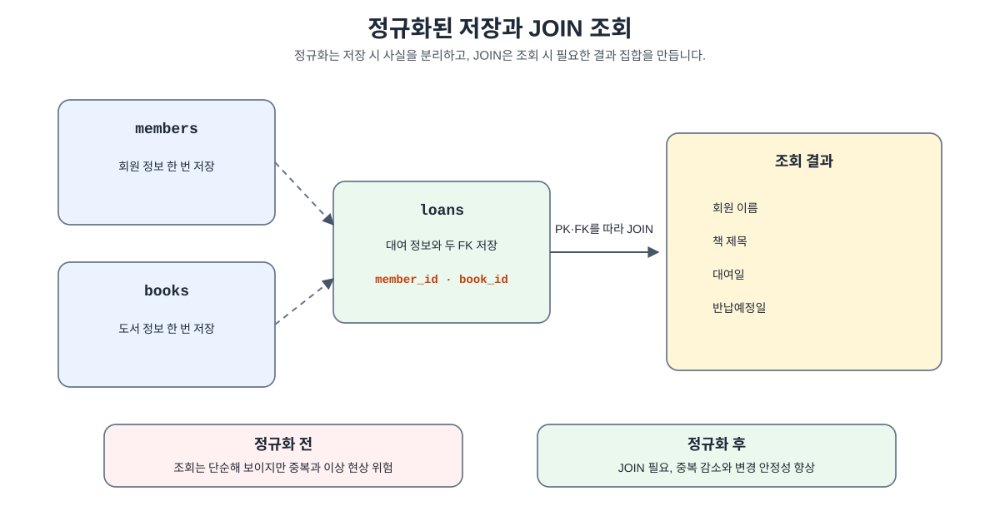

그림 6-7 정규화된 저장과 조회 결과

정규화 후에는 사실을 각 주인 테이블에 저장하고, 필요한 결과는 관계를 따라 조회합니다. JOIN 문법은 Chapter 08에서 자세히 다룹니다.

---

## 17. AI 설계 검토와 자주 하는 실수

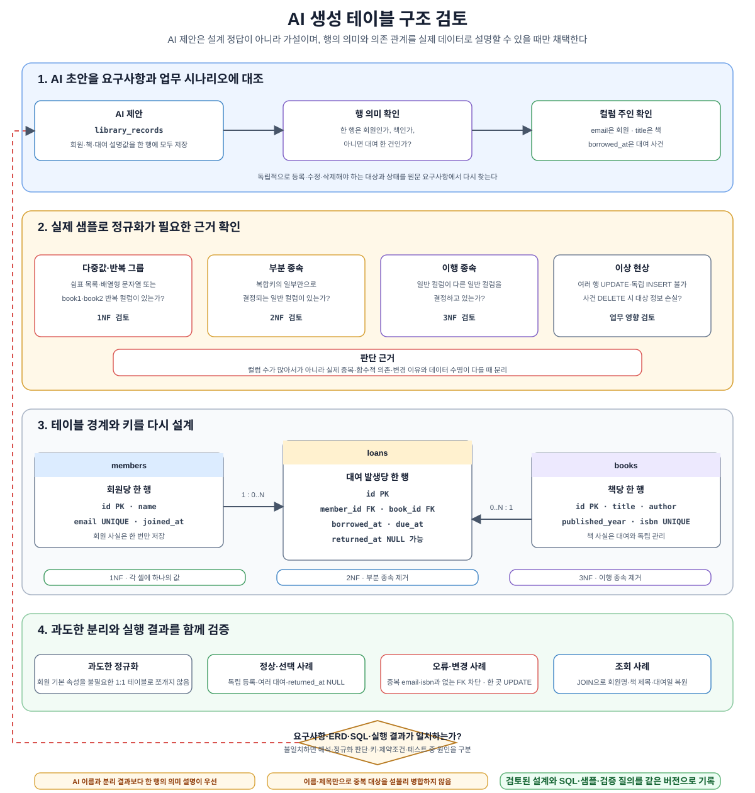

그림 6-8 AI 생성 구조와 무결성 검토 흐름

AI가 만든 구조는 다음 일곱 질문으로 검토합니다.

```text
1. 각 테이블의 한 행 의미가 명확한가?
2. 같은 현재 사실이 여러 행이나 테이블에 복사되어 있는가?
3. 각 열의 주인 테이블이 적절한가?
4. 정규형 위반의 근거를 업무 규칙으로 설명할 수 있는가?
5. 제약조건이 확정된 규칙과 연결되는가?
6. 정상·경계·오류 데이터의 기대 결과가 분명한가?
7. 요구사항에 없는 UNIQUE·CHECK·CASCADE를 임의로 추가하지 않았는가?
```

자주 하는 실수는 다음과 같습니다.

```text
값이 반복되면 모두 제거한다.
열이 많으면 무조건 테이블을 나눈다.
샘플의 우연한 반복을 함수적 종속으로 단정한다.
1NF만 만족하면 정규화가 끝났다고 생각한다.
NOT NULL과 CHECK의 역할을 혼동한다.
기존 데이터 확인 없이 ALTER TABLE을 실행한다.
CASCADE를 편리하다는 이유만으로 적용한다.
부분 고유 인덱스가 모든 기간 중첩을 막는다고 생각한다.
```

정규화는 테이블 수를 최대한 늘리는 작업이 아닙니다. 서로 다른 사실과 수명, 반복 관계나 보안·보존 경계가 있을 때 분리해야 합니다.

[Chapter 06 독자 워크북](../book/chapter06/chapter06_activity.md)에서 정규형 판단과 제약조건 검증 결과를 직접 기록할 수 있습니다.

---

## 18. 핵심 정리와 다음 장

```text
정규화는 같은 사실의 복사본이 불일치하는 위험을 줄인다.
삽입·수정·삭제 이상은 잘못된 테이블 경계에서 발생한다.
1NF·2NF·3NF는 각각 반복 그룹과 독립값 표현, 후보키 일부에 대한 부분 종속, 비키 속성을 거치는 전이 종속을 점검한다.
제약조건은 확정된 업무 규칙만 구현해야 한다.
NOT NULL, UNIQUE, CHECK와 FOREIGN KEY는 서로 다른 문제를 해결한다.
기존 테이블에 규칙을 추가하기 전 현재 데이터를 먼저 검사한다.
정상·경계·오류 데이터가 모두 예상대로 동작해야 검증이 끝난다.
```

Chapter 07에서는 요구사항 ID, ERD, 정규화, 제약조건과 검증 시나리오를 온라인 강의 수강신청 프로젝트에 통합합니다.

---

# Chapter 07. 실전 프로젝트 1: 온라인 강의 수강신청 DB 완성하기

---

## 이 장을 시작하기 전에

이 장은 Chapter 04의 기본 SQL, Chapter 05의 요구사항 분석과 ERD, Chapter 06의 정규화와 데이터 무결성을 하나의 프로젝트로 연결합니다. 별도의 프로젝트 경험은 필요하지 않지만, 테이블의 한 행 의미와 기본키·외래키의 역할을 설명할 수 있어야 합니다.

프로젝트 주제는 **온라인 강의 수강신청 데이터베이스**입니다.

```text
프로젝트 범위 결정
→ 핵심 요구사항과 설계 결정 구분
→ 테이블별 한 행의 의미와 관계 작성
→ ERD·정규화·무결성 검토
→ 전용 스키마와 샘플 데이터 생성
→ 안전한 변경 시나리오 실행
→ 자동 검증과 설계 결정 기록
```

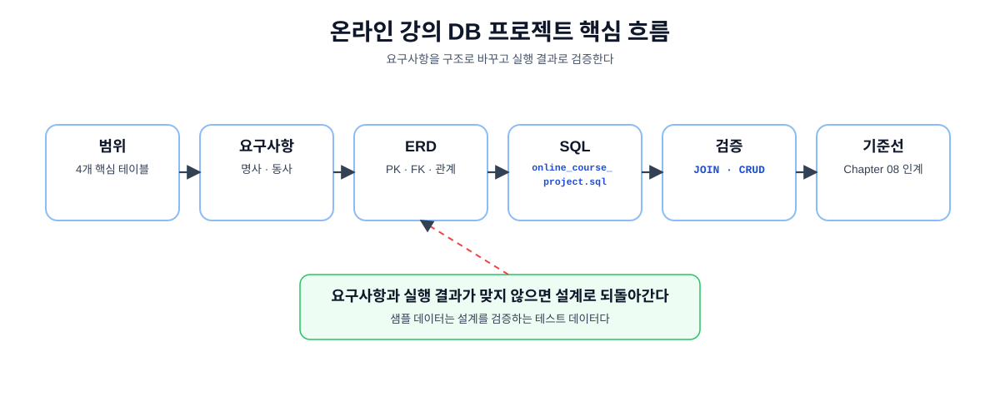

그림 7-1 온라인 강의 데이터베이스 프로젝트 핵심 흐름

## 이 장을 마치면

다음 작업을 수행할 수 있습니다.

- 프로젝트의 포함·제외 범위를 정한다.
- 요구사항과 프로젝트 결정을 구분한다.
- 테이블별 한 행의 의미와 관계를 설명한다.
- 전용 스키마에 프로젝트 구조를 생성한다.
- 검증 목적의 샘플 데이터를 설계한다.
- 예상 이전 상태를 확인하며 데이터를 변경한다.
- 자동 검증으로 최종 상태를 판정한다.
- 설계 결정과 실행 결과를 다른 사람이 재현할 수 있게 기록한다.

> **학습 표시**
>
> - **핵심 학습**: 프로젝트를 생성하고 최종 검증까지 완료하는 최소 경로
> - **선택 학습**: 경계·오류 테스트, 전체 추적표와 AI 제안 검토
> - **심화 학습**: 결제·상태 이력·정원·통합 계정으로 확장하는 내용

> **핵심 원칙**
>
> 프로젝트 완료는 SQL 파일이 존재한다는 뜻이 아닙니다. 다른 사람이 같은 순서로 실행해 같은 구조와 데이터를 만들고, 각 설계 선택의 근거와 검증 결과를 설명할 수 있어야 합니다.

---

## 1. 프로젝트 목표와 최소 완료 경로

처음 학습하는 독자는 다음 네 파일을 순서대로 실행하면 핵심 프로젝트를 완료할 수 있습니다.

```text
01_course_project_schema.sql
→ 02_course_project_seed.sql
→ 03_course_project_changes.sql
→ 04_course_project_validation.sql
```

선택 활동은 다음 파일과 문서로 확장합니다.

```text
05_course_project_integrity_tests.sql
06_course_project_optional_tests.sql
PROJECT_DECISIONS.md
```

핵심 경로의 완료 기준은 다음과 같습니다.

```text
course_project 스키마와 네 테이블이 존재한다.
최종 행 수가 3 / 2 / 3 / 5이다.
신청 1001은 완료, 1004는 취소, 1005는 신청 상태이다.
고아 관계와 활성 중복 신청이 없다.
최종 기록 금액 검산값이 예상과 일치한다.
```

---

## 2. 프로젝트 산출물과 실행 파일

| 산출물 | 확인 내용 |
| --- | --- |
| 프로젝트 범위 | 포함·제외 기능과 단순화 가정 |
| 핵심 요구사항 | 반드시 저장하고 지켜야 할 데이터와 관계 |
| 프로젝트 결정 | 이번 버전에서 명시적으로 선택한 정책 |
| 미확정 질문 | 운영 전에 추가로 확인할 정책 |
| 테이블 정의 | 한 행의 의미, 열과 키 |
| 관계 문장·ERD | 카디널리티와 외래키 위치 |
| PostgreSQL 파일 | 스키마, 샘플, 변경, 검증과 테스트 |
| 설계 결정 기록 | 선택한 구조, 대안, AI 제안과 실행 결과 |

```text
code/chapter07/
├── 01_course_project_schema.sql
├── 02_course_project_seed.sql
├── 03_course_project_changes.sql
├── 04_course_project_validation.sql
├── 05_course_project_integrity_tests.sql
├── 06_course_project_optional_tests.sql
├── reset_course_project.sql
├── PROJECT_DECISIONS.md
├── online_course_project.sql
└── README.md
```

`online_course_project.sql`은 기존 링크 호환을 위한 읽기 전용 확인 파일입니다.

---

## 3. 전용 스키마와 프로젝트 범위

프로젝트 객체는 `course_project` 스키마에 생성합니다.

```text
course_project
├── students
├── instructors
├── courses
└── enrollments
```

전용 스키마를 사용하면 앞 장의 `public.students` 같은 동명 테이블과 충돌하지 않고, Chapter 08 이후에도 프로젝트 데이터를 명확히 참조할 수 있습니다.

```sql
SELECT *
FROM course_project.students;
```

모든 객체에 스키마를 명시하므로 `current_schema()`가 `course_project`일 필요는 없습니다. 실행 전 다음 위치 정보를 확인합니다.

```sql
SELECT current_database();
SELECT current_user;
SELECT current_schema();
SHOW search_path;
```

### 포함 범위

```text
학생
강사
강의
수강신청
신청 상태
강의 기준 가격
신청 시 기록 금액
```

### 제외 범위

```text
실제 결제 시도·승인·실패·환불 이력
강의 정원과 대기열
상태 변경 전체 이력
진도·수료·강의 콘텐츠
수강평·쿠폰·할인 적용 이력
```

범위 제외는 중요하지 않다는 뜻이 아니라, 현재 프로젝트에서 다루지 않는다는 뜻입니다.

---

## 4. 핵심 요구사항·결정·미확정 질문

본문에서는 대표 항목만 사용하고 전체 목록은 `PROJECT_DECISIONS.md`에 기록합니다.

### 핵심 요구사항

| ID | 요구사항 |
| --- | --- |
| `P07-R01` | 학생은 이름, 이메일과 가입일을 가진다. |
| `P07-R02` | 강사는 이름, 이메일과 전문 분야를 가진다. |
| `P07-R03` | 강의는 제목, 선택 설명, 난이도, 기준 가격과 개설일을 가진다. |
| `P07-R04` | 하나의 강의는 정확히 한 강사를 참조한다. |
| `P07-R05` | 수강신청은 학생, 강의, 신청일, 상태와 신청 시 기록 금액을 가진다. |
| `P07-R06` | 상태는 신청, 수강중, 완료, 취소 중 하나다. |
| `P07-R07` | 학생·강사 이메일은 각 테이블 안에서 공백·동일 문자열 중복이 허용되지 않는다. |
| `P07-R08` | 가격과 신청 시 기록 금액은 음수일 수 없다. |
| `P07-R09` | 존재하는 학생·강사·강의만 참조한다. |

### 프로젝트 결정

| ID | 결정 | 구현 |
| --- | --- | --- |
| `P07-D01` | 무료 금액은 `0`으로 표현하고 `NULL`·음수는 허용하지 않음 | `NOT NULL`, `CHECK >= 0` |
| `P07-D02` | 할인 기능이 없는 현재 범위에서는 신청 생성 시 `courses.price`를 `recorded_amount`에 복사해 보존 | `INSERT ... SELECT` + `NUMERIC(12, 0)` |
| `P07-D03` | 진행 중 중복 신청 금지 | 부분 고유 인덱스 |
| `P07-D04` | 상태 변경 전에 예상 이전 상태 확인 | 조건부 `UPDATE` |
| `P07-D05` | 학생과 강사는 별도 역할 | 별도 테이블 |
| `P07-D06` | 참조 중 부모 삭제 제한 | `ON DELETE RESTRICT` |

### 대표 미확정 질문

```text
P07-Q01 학생과 강사 사이에서도 이메일을 전역 고유하게 제한해야 하는가?
P07-Q02 탈퇴 시 개인정보와 신청 이력을 어떻게 보존·익명화하는가?
P07-Q03 상태 전이와 변경 이력을 어느 수준까지 DB에서 관리하는가?
```

미확정 질문을 설계자가 임의로 제약조건으로 바꾸지 않습니다.

---

## 5. 테이블별 한 행의 의미

요구사항을 구조로 바꾸기 전에 각 테이블의 한 행 의미를 고정합니다.

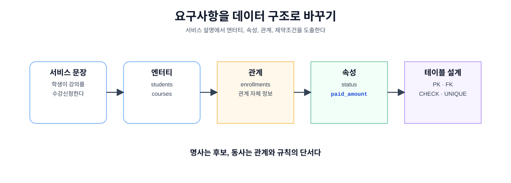

그림 7-2 요구사항에서 엔터티·속성·사건 도출하기

| 테이블 | 한 행의 의미 |
| --- | --- |
| `students` | 학생 한 명 |
| `instructors` | 강사 한 명 |
| `courses` | 개설된 강의 한 개 |
| `enrollments` | 특정 학생의 특정 강의 신청 사건 한 건 |

`enrollments`는 단순 연결 테이블이 아닙니다. 다음 사건 속성을 가집니다.

```text
enrolled_at
status
recorded_amount
```

이 값들은 학생 전체나 강의 전체가 아니라 특정 신청 사건에 속합니다.

---

## 6. 관계 문장과 ERD

ERD를 그리기 전에 관계를 양방향 문장으로 작성합니다.

```text
한 강사는 0개 이상의 강의를 담당할 수 있다.
한 강의는 정확히 한 명의 강사를 참조한다.

한 학생은 0개 이상의 수강신청을 가질 수 있다.
한 수강신청은 정확히 한 명의 학생을 참조한다.

한 강의는 0개 이상의 수강신청을 가질 수 있다.
한 수강신청은 정확히 한 개의 강의를 참조한다.
```

```text
instructors 1 ─── 0..N courses
students    1 ─── 0..N enrollments
courses     1 ─── 0..N enrollments
```

학생과 강의의 N:M 관계는 `enrollments`를 통해 두 개의 1:N 관계로 바뀝니다.

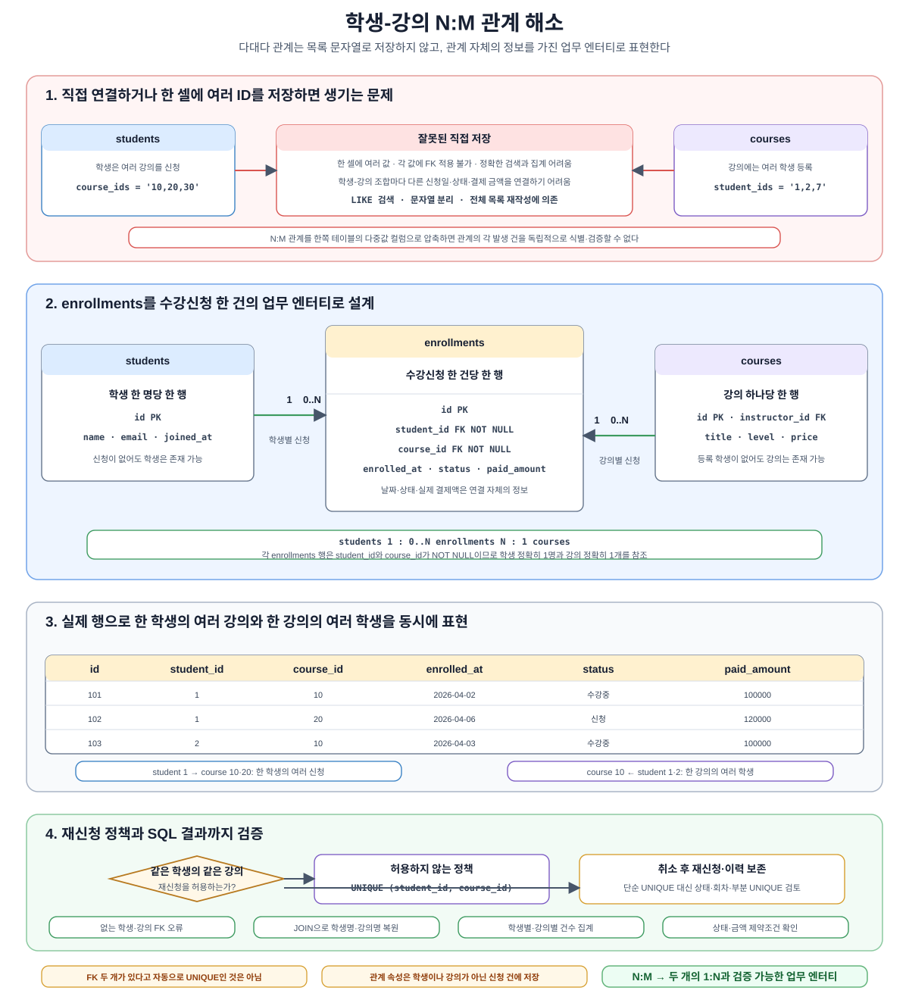

그림 7-3 `enrollments`로 학생-강의 N:M 관계 해소

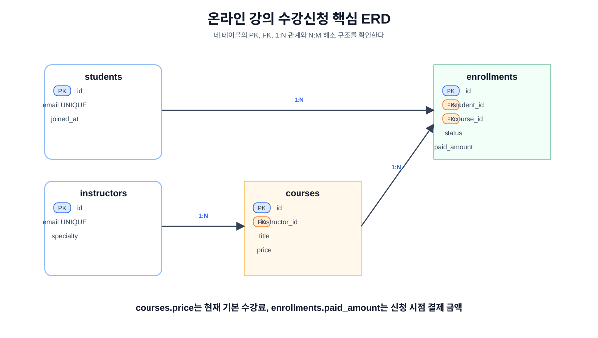

그림 7-4 온라인 강의 수강신청 핵심 ERD

---

## 7. 현재 사실과 신청 당시 사실

금액 열은 다음 두 가지 사실을 구분합니다.

```text
courses.price
→ 현재 강의의 기준 가격

enrollments.recorded_amount
→ 해당 신청이 만들어질 때 신청 행에 기록한 금액
```

두 값이 같아도 의미와 시점이 다릅니다. 이번 프로젝트에는 쿠폰·할인 기능이 없으므로 **신청을 생성하는 순간의 `courses.price`를 `recorded_amount`에 복사**합니다. 강의 가격이 나중에 바뀌어도 과거 신청의 `recorded_amount`는 자동으로 바뀌지 않습니다.

```sql
INSERT INTO course_project.enrollments (
    id, student_id, course_id, enrolled_at, status, recorded_amount
)
SELECT
    1005, 102, c.id, DATE '2026-04-07', '신청', c.price
FROM course_project.courses AS c
WHERE c.id = 302;
```

이 복사는 `CHECK`나 외래키가 자동으로 수행하는 기능이 아닙니다. 현재 프로젝트에서는 신청 생성 SQL이 값을 복사하고, 이후 검증 SQL이 기대 금액을 확인합니다. 다른 행·다른 테이블의 현재 값을 `CHECK`로 계속 비교해 과거 기록을 강제로 맞추는 방식은 사용하지 않습니다.

`recorded_amount`는 실제 결제 승인 금액을 뜻하지 않습니다. 결제·환불을 관리하려면 다음과 같은 별도 구조가 필요합니다.

```text
payments
payment_events
refunds
```

이번 프로젝트에서는 실제 결제 거래를 다루지 않습니다.

금액 타입은 정확한 원 단위 값을 저장하기 위해 다음을 사용합니다.

```sql
NUMERIC(12, 0)
```

---

## 8. 정규화와 무결성 규칙

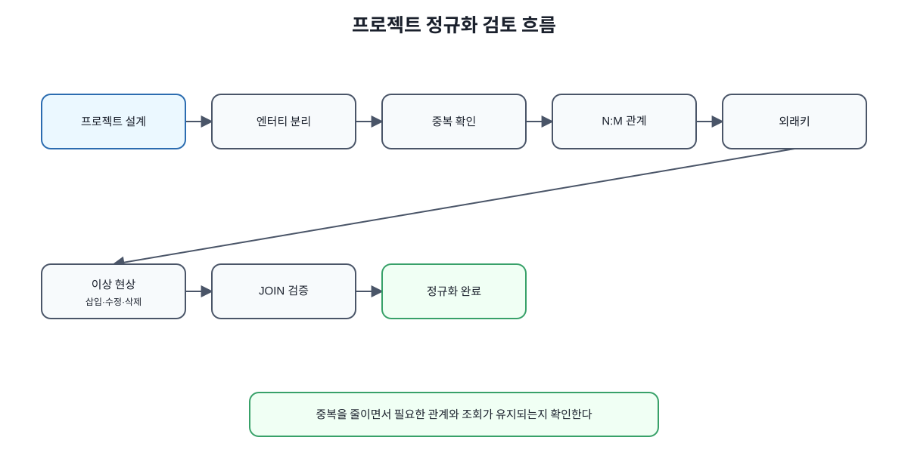

그림 7-5 온라인 강의 프로젝트 정규화 점검

| 사실 | 관리 위치 |
| --- | --- |
| 학생의 현재 정보 | `students` |
| 강사의 현재 정보 | `instructors` |
| 강의의 현재 정보 | `courses` |
| 신청 시점의 상태와 금액 | `enrollments` |

기본 무결성은 다음과 같이 구현합니다.

| 규칙 | 구현 |
| --- | --- |
| 행 식별 | `PRIMARY KEY` |
| 자동 내부 ID | `IDENTITY` |
| 필수값 | `NOT NULL` |
| 이메일 중복 금지 | `UNIQUE` |
| 공백·허용값·금액 범위 | `CHECK` |
| 존재하는 부모 참조 | `FOREIGN KEY` |
| 이력 보존 | `ON DELETE RESTRICT` |
| 진행 중 중복 신청 금지 | 부분 고유 인덱스 |

```sql
CREATE UNIQUE INDEX uq_course_enrollments_active
ON course_project.enrollments (student_id, course_id)
WHERE status IN ('신청', '수강중');
```

완료·취소 이력은 여러 건 존재할 수 있지만 현재 진행 중인 신청은 학생·강의 조합당 최대 한 건만 허용합니다. `uq_course_enrollments_active`는 `UNIQUE` 제약조건이 아니라 조건을 만족하는 행에만 적용되는 **부분 고유 인덱스 객체**입니다.

---

## 9. PostgreSQL 프로젝트 구조 만들기

`01_course_project_schema.sql`은 다음 작업을 하나의 트랜잭션으로 수행합니다.

```text
현재 DB·DB의 `CREATE` 권한·쓰기 가능 상태·기존 스키마 확인
→ course_project 스키마 생성
→ 부모 테이블 생성
→ 자식 테이블 생성
→ 부분 고유 인덱스 생성
→ 객체 존재 확인
→ COMMIT
```

핵심 열은 다음과 같습니다.

```sql
price NUMERIC(12, 0) NOT NULL
    CHECK (price >= 0)

recorded_amount NUMERIC(12, 0) NOT NULL
    CHECK (recorded_amount >= 0)
```

생성 파일은 기존 객체를 자동으로 삭제하지 않습니다. 처음부터 다시 시작할 때만 `reset_course_project.sql`을 사용합니다.

---

## 10. 검증 목적의 샘플 데이터 입력

샘플 데이터는 행 수를 채우기 위한 값이 아니라 요구사항을 증명하기 위한 사례입니다.

| 샘플 | 검증 목적 |
| --- | --- |
| 학생 101의 신청 2건 | 학생 1:N 신청 관계 |
| 강의 301의 신청 2건 | 강의 1:N 신청 관계 |
| 강사 201의 강의 2개 | 강사 1:N 강의 관계 |
| 신청별 다른 상태와 금액 | 사건 속성 분리 |

기본 샘플 입력 직후 기대 행 수는 다음과 같습니다.

| 테이블 | 행 수 |
| --- | ---: |
| students | 3 |
| instructors | 2 |
| courses | 3 |
| enrollments | 4 |

`02_course_project_seed.sql`은 네 테이블이 모두 비어 있고 필요한 객체가 존재할 때만 데이터를 입력합니다. 전체 입력과 다음 자동 ID 조정은 하나의 트랜잭션으로 실행합니다.

고정 ID는 관계를 쉽게 확인하기 위한 학습용 선택입니다. 다음 자동 ID 조정은 실습 파일이 처리합니다.

---

## 11. 안전한 신청과 상태 변경

`03_course_project_changes.sql`은 다음 초기 상태를 자동으로 확인합니다.

```text
enrollments = 4
1001 상태 = 수강중
1004 상태 = 신청
1005 행 없음
학생 102·강의 302의 활성 신청 없음
```

그 뒤 하나의 트랜잭션에서 다음 작업을 수행합니다.

```text
신청 1005 추가
→ 신청 1001을 완료로 변경
→ 신청 1004를 취소로 변경
→ 최종 상태 검사
→ COMMIT
```

상태 변경에는 예상 이전 상태를 포함합니다.

```sql
UPDATE course_project.enrollments
SET status = '완료'
WHERE id = 1001
  AND status = '수강중'
RETURNING id, status, recorded_amount;
```

예상 상태와 실제 상태가 다르면 전체 변경을 완료하지 않습니다. 조건부 `UPDATE`는 이 파일에서 실행하는 변경을 보호하는 방식이며, 모든 가능한 상태 전이를 데이터베이스 전체에서 강제하는 규칙은 아닙니다. 마지막 자동 검증까지 통과하지 못하면 같은 트랜잭션의 변경을 완료 상태로 보지 않습니다.

### 상태값과 상태 전이

`CHECK`는 저장 가능한 상태값만 제한합니다.

```text
신청 / 수강중 / 완료 / 취소
```

상태 전이는 별도 정책입니다.

| 이전 상태 | 이번 프로젝트에서 허용하는 변경 |
| --- | --- |
| 신청 | 수강중, 취소 |
| 수강중 | 완료, 취소 |
| 완료 | 기존 행 유지, 필요하면 새 신청 |
| 취소 | 기존 행 유지, 필요하면 새 신청 |

완전한 상태 전이와 변경 이력은 확장 범위입니다.

---

## 12. 자동 검증으로 최종 상태 확인

`04_course_project_validation.sql`은 단순 조회에 그치지 않고 완료 조건을 자동 판정합니다.

```text
students = 3
instructors = 2
courses = 3
enrollments = 5
고아 관계 = 0
도메인 오류 = 0
활성 중복 신청 = 0
1001 = 완료
1004 = 취소
1005 = 신청
전체 기록 금액 = 590000
취소 제외 기록 금액 = 440000
```

통과하면 다음 메시지가 출력됩니다.

```text
Chapter 07 course project validation passed
```

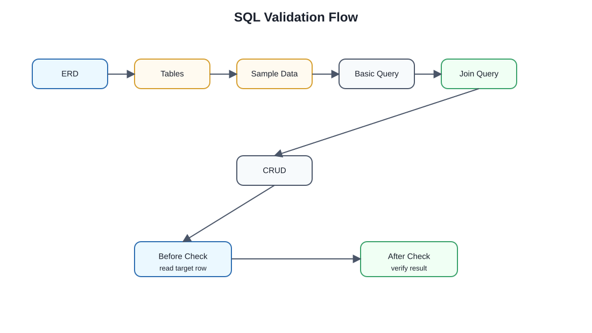

그림 7-6 샘플 데이터와 조회로 설계를 검증하는 흐름

> **금액 검산 주의**
>
> 전체 기록 금액과 취소 제외 기록 금액은 신청 행에 저장된 금액의 합계입니다. 실제 결제 승인액, 환불액이나 회계 매출을 의미하지 않습니다.

---

## 13. 경계·오류 데이터 테스트

핵심 테스트 파일은 대표 규칙만 확인합니다.

### 성공해야 하는 경계

```text
무료 강의 price = 0
무료 신청 recorded_amount = 0
선택 설명 description = NULL
```

### 실패해야 하는 오류

```text
대표 `NOT NULL` 위반
학생 이메일 중복
허용되지 않은 난이도
음수 recorded_amount
존재하지 않는 부모 참조
두 번째 활성 신청
참조 중인 부모 삭제
```

나머지 공백 문자열, 한 글자 이름, 완료 뒤 재신청과 참조되지 않는 부모 삭제는 `06_course_project_optional_tests.sql`에서 선택적으로 확인합니다.

오류 테스트는 한 번에 하나씩 실행하고, 수동 트랜잭션에서 오류 후 실패 상태가 되면 `ROLLBACK`합니다. 트랜잭션의 상세 원리는 Chapter 09에서 다룹니다.

---

## 14. 설계 결정과 AI 제안 기록

AI는 요구사항 정리, ERD·DDL 초안과 테스트 제안에 활용할 수 있습니다. 그러나 결과는 다음 질문으로 검토합니다.

```text
1. 요구사항에서 테이블과 관계를 도출했는가?
2. 각 테이블의 한 행 의미가 명확한가?
3. 요구사항에 없는 정책을 임의로 추가했는가?
4. 현재 사실과 신청 당시 사실을 구분했는가?
5. 정상·경계·오류 테스트가 규칙과 연결되는가?
6. 실행 결과를 다른 사람이 재현할 수 있는가?
```

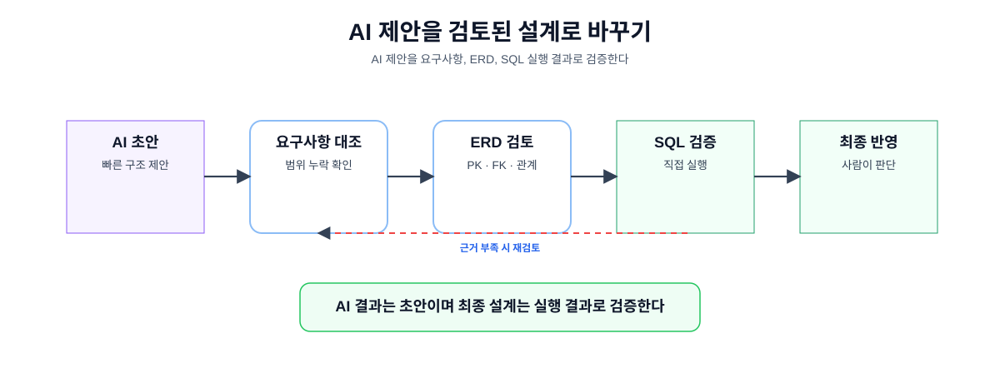

그림 7-7 AI 제안을 검토된 프로젝트 설계로 바꾸기

`PROJECT_DECISIONS.md`에는 다음을 기록합니다.

```text
요구사항과 범위
선택한 구조와 검토한 대안
AI 제안과 사람의 최종 결정
실행 환경과 검증 결과
남은 질문과 Chapter 08 인계 상태
```

---

## 15. 프로젝트 완료 점검

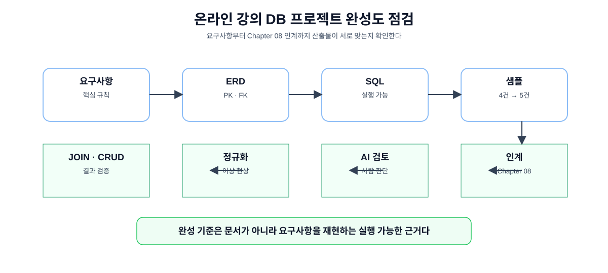

그림 7-8 온라인 강의 데이터베이스 프로젝트 완성도 점검

| 영역 | 완료 기준 |
| --- | --- |
| 범위 | 포함·제외 기능이 구분됨 |
| 요구사항 | 핵심 요구사항과 프로젝트 결정이 구분됨 |
| 구조 | 한 행 의미·PK·FK·관계가 일치함 |
| 정규화 | 현재 사실과 신청 당시 사실이 구분됨 |
| 무결성 | 잘못된 값과 관계가 차단됨 |
| 변경 | 예상 이전 상태와 최종 상태를 확인함 |
| 검증 | 자동 검증 통과 메시지를 확인함 |
| 재현성 | 파일 순서와 초기화 방법이 문서화됨 |
| 기록 | 설계 결정과 실행 결과가 남아 있음 |

---

## 16. 확장 백로그

| 확장 기능 | 구조·규칙 후보 |
| --- | --- |
| 통합 사용자 계정 | users, roles, 학생·강사 프로필 |
| 실제 결제·환불 | payments, payment_events, refunds |
| 상태 변경 이력 | enrollment_status_history |
| 강의 정원·대기 | capacity, waitlist, 동시 신청 제어 |
| 강의 구성·진도 | sections, lessons, progress |
| 탈퇴·익명화 | 소프트 삭제, 개인정보 대체 정책 |

새 기능은 바로 열을 추가하지 않고 다음 순서로 검토합니다.

[Chapter 07 독자 프로젝트 워크북](../book/chapter07/chapter07_activity.md)에는 실행 결과와 설계 판단을 직접 기록할 수 있는 체크 항목이 있습니다.

```text
새 요구사항
→ 새 사실과 규칙
→ 기존 속성인지 새 엔터티인지 판단
→ 관계·이력·동시성 검토
→ ERD·DDL·테스트 갱신
```

---

## 17. 핵심 정리와 Chapter 08 인계

Chapter 07에서는 다음을 하나의 프로젝트로 연결했습니다.

```text
범위와 요구사항
→ 한 행 의미와 관계
→ 정규화와 무결성
→ 전용 스키마와 테스트 데이터
→ 안전한 변경
→ 자동 검증
→ 설계 결정 기록
```

Chapter 08 인계 기준은 다음과 같습니다.

```text
students 3행
instructors 2행
courses 3행
enrollments 5행
1001 완료 / recorded_amount 100000
1004 취소 / recorded_amount 150000
1005 신청 / recorded_amount 120000
활성 중복 신청 0건
전체 기록 금액 590000
취소 제외 기록 금액 440000
```

Chapter 08에서는 이 기준 데이터를 이용해 JOIN과 집계를 학습합니다.

---

# Chapter 08. JOIN과 집계로 서비스 질문에 답하기

---

## 이 장에서 살펴볼 내용

Chapter 07에서는 `course_project` 스키마에 온라인 강의 수강신청 데이터베이스를 완성했습니다. 이제 저장된 데이터를 관계에 따라 연결하고, 업무 질문에 맞게 요약합니다.

이 장의 흐름은 다음과 같습니다.

```text
Chapter 07 기준 상태 확인
→ 업무 질문 정의
→ 결과 한 행의 기준 결정
→ PK·FK JOIN 경로 확인
→ INNER JOIN 또는 LEFT JOIN 선택
→ 행 수와 NULL 해석
→ 분석 상태 범위 결정
→ COUNT·SUM·AVG로 기본 검산
→ GROUP BY·HAVING으로 요약
→ 상세 결과와 집계 결과 대조
→ AI SQL의 누락·중복·과대 집계 검토
```

이 장에서는 다음 내용을 다룹니다.

- `INNER JOIN`, `LEFT JOIN`과 다중 JOIN
- 결과 한 행의 기준과 1:N 관계의 반복
- 외부 JOIN에서 `ON`과 `WHERE` 조건의 차이
- `LEFT JOIN ... IS NULL`과 `NOT EXISTS`
- `COUNT(*)`, `COUNT(column)`, `COUNT(DISTINCT column)`
- `SUM`, `AVG`, `MIN`, `MAX`
- `GROUP BY`, `HAVING`, `COALESCE`
- PostgreSQL의 조건부 집계 `FILTER`
- 전체 신청, 활성 신청과 취소 제외 신청 이력의 구분
- 여러 1:N JOIN에서의 과대 집계
- 상세 데이터와 집계 결과의 검산
- AI가 만든 JOIN·집계 SQL 검토

이 장에서는 서비스 조회에서 자주 사용하는 `INNER JOIN`과 `LEFT JOIN`에 집중합니다. `RIGHT JOIN`, `FULL OUTER JOIN`, `CROSS JOIN`은 입문 프로젝트 범위에서 제외합니다. `RIGHT JOIN`의 많은 사례는 테이블 순서를 바꾸어 `LEFT JOIN`으로 표현할 수 있습니다.

> **핵심 원칙**
>
> JOIN과 집계 쿼리는 문법보다 먼저 “한 행이 무엇을 뜻하는지, 어떤 상태와 행을 포함할지, 무엇을 세거나 더할지”를 결정해야 합니다.

---

## 1. Chapter 07 최종 데이터를 그대로 사용한다

Chapter 08은 별도 테이블을 만들거나 Chapter 07 데이터를 삭제하지 않습니다. 다음 파일을 순서대로 실행한 최종 상태를 그대로 사용합니다.

```text
code/chapter07/01_course_project_schema.sql
code/chapter07/02_course_project_seed.sql
code/chapter07/03_course_project_changes.sql
code/chapter07/04_course_project_validation.sql
```

프로젝트 객체는 다음과 같습니다.

```text
course_project.students
course_project.instructors
course_project.courses
course_project.enrollments
```

### 실행 위치 확인

```sql
SELECT current_database();
SELECT current_schema();
SHOW search_path;
```

모든 객체를 `course_project.students`처럼 스키마 한정 이름으로 사용하므로 `current_schema()`가 `course_project`일 필요는 없습니다. 다만 현재 데이터베이스가 `ai_database_book`인지 확인합니다.

### 기준 상태 복원

Chapter 07의 무결성 테스트에서 임시 학생, 강의 또는 신청을 입력했다면 삭제 문장까지 실행했는지 확인합니다. 임시 행이 남으면 Chapter 08의 모든 기준값이 달라집니다.

기준값이 다르면 Chapter 08을 계속 실행하지 않습니다. 보존할 프로젝트 데이터가 없는 실습 환경에서는 다음 순서로 복원합니다.

```text
code/chapter07/reset_course_project.sql
→ 01_course_project_schema.sql
→ 02_course_project_seed.sql
→ 03_course_project_changes.sql
→ 04_course_project_validation.sql
```

초기화 파일은 현재 데이터베이스와 삭제 대상을 직접 확인한 뒤 선택적으로 실행합니다.

### 최종 기준 데이터

| 테이블 | 행 수 |
| --- | ---: |
| `students` | 3 |
| `instructors` | 2 |
| `courses` | 3 |
| `enrollments` | 5 |

수강신청 상태는 다음과 같습니다.

| enrollment_id | student_id | course_id | status | recorded_amount |
| ---: | ---: | ---: | --- | ---: |
| 1001 | 101 | 301 | 완료 | 100000 |
| 1002 | 101 | 302 | 신청 | 120000 |
| 1003 | 102 | 301 | 수강중 | 100000 |
| 1004 | 103 | 303 | 취소 | 150000 |
| 1005 | 102 | 302 | 신청 | 120000 |

기본 검산값은 다음과 같습니다.

| 분석 범위 | 포함 상태 | 건수 | 기록 금액 |
| --- | --- | ---: | ---: |
| 전체 신청 이력 | 모든 상태 | 5 | 590000 |
| 활성 신청 | 신청, 수강중 | 3 | 340000 |
| 취소 제외 신청 이력 | 신청, 수강중, 완료 | 4 | 440000 |
| 취소 신청 | 취소 | 1 | 150000 |

`recorded_amount`는 신청 당시 기록 금액입니다. 취소 후에도 기록이 남을 수 있으며 결제 성공, 환불과 매출 인식 정보가 없으므로 실제 회계 매출로 단정하지 않습니다.

이 장의 SQL은 데이터를 변경하지 않는 조회 전용 파일로 구성합니다.

```text
code/chapter08/
├── 00_check_course_project.sql
├── 01_join_queries.sql
├── 02_aggregation_queries.sql
├── 03_join_aggregation_validation.sql
├── join_aggregation_practice.sql
└── README.md
```

`00_check_course_project.sql`은 현재 데이터베이스, 프로젝트 테이블, 행 수와 기준 금액이 예상과 다르면 예외를 발생시켜 실행을 중단합니다.

`03_join_aggregation_validation.sql`은 상세·그룹·JOIN 결과의 핵심 검산값을 자동으로 비교합니다. 하나라도 다르면 예외로 중단하고, 모두 맞으면 `Chapter 08 join and aggregation validation passed` 메시지를 출력합니다.

---

## 2. SQL 작성 전에 업무 질문을 정확히 정의한다

같은 테이블을 사용해도 질문의 정의가 다르면 SQL과 결과가 달라집니다.

예를 들어 “강의별 수강생 수”라는 표현에는 여러 해석이 가능합니다.

```text
수강신청 행 수인가?
고유한 학생 수인가?
취소 신청도 포함하는가?
활성 신청만 세는가?
완료 이력도 포함하는가?
신청이 없는 강의도 0으로 표시하는가?
```

SQL을 작성하기 전에 다음 내용을 결정합니다.

| 결정 항목 | 확인 질문 |
| --- | --- |
| 결과 한 행 | 학생 한 명, 신청 한 건, 강의 한 개 중 무엇인가? |
| 포함 범위 | 연결된 행만 필요한가, 연결되지 않은 부모도 필요한가? |
| 상태 기준 | 신청·수강중·완료·취소 중 무엇을 포함하는가? |
| 집계 대상 | 신청 사건 수, 고유 학생 수, 기록 금액 중 무엇인가? |
| 0·NULL 표현 | 데이터가 없을 때 행을 제외할지 0으로 표시할지? |
| 정렬 | 결과를 어떤 업무 순서로 보여 줄 것인가? |

이 장에서는 다음 용어를 구분합니다.

```text
전체 신청 이력
→ 모든 enrollments 행

활성 신청
→ status IN ('신청', '수강중')

취소 제외 신청 이력
→ status <> '취소'
→ 신청, 수강중, 완료 포함

취소 신청
→ status = '취소'
```

Chapter 07에서 `status`는 `NOT NULL`이므로 현재 구조에서 `status <> '취소'` 조건은 상태가 NULL인 행을 별도로 고려하지 않습니다.

“취소 제외 신청”과 “활성 신청”은 같은 의미가 아닙니다. 완료 상태는 취소 제외 이력에는 포함되지만 현재 활성 신청에는 포함되지 않습니다.

---

## 3. JOIN은 ERD의 관계 경로를 따라간다

정규화된 테이블은 서로 다른 사실을 분리해 저장합니다.

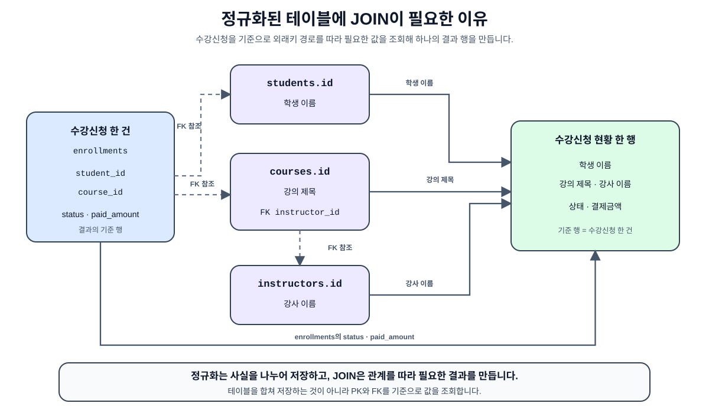

그림 8-1 정규화된 테이블에 JOIN이 필요한 이유

수강신청 한 건에 학생 이름, 강의 제목과 강사 이름을 붙이려면 다음 경로를 사용합니다.

```text
enrollments.student_id → students.id
enrollments.course_id  → courses.id
courses.instructor_id   → instructors.id
```

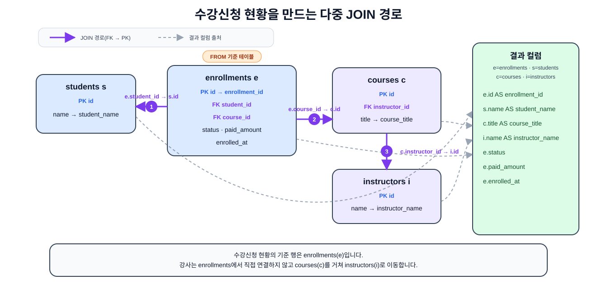

그림 8-2 수강신청 현황을 만드는 다중 JOIN 경로

JOIN 조건은 이름이 비슷한 컬럼을 임의로 연결하는 것이 아닙니다. Chapter 07에서 설계한 실제 외래키와 기본키 관계를 따라야 합니다.

잘못된 예:

```sql
-- 이름이 같다는 이유만으로 연결하면 동명이인과 이름 변경을 처리하기 어렵다.
-- ON e.student_name = s.name
```

올바른 관계:

```sql
ON e.student_id = s.id
```

---

## 4. INNER JOIN: 연결된 신청 한 건을 한 행으로 조회한다

수강신청 현황의 기준 행은 `enrollments` 한 건입니다.

```sql
SELECT
    e.id AS enrollment_id,
    s.name AS student_name,
    c.title AS course_title,
    e.status
FROM course_project.enrollments AS e
INNER JOIN course_project.students AS s
    ON e.student_id = s.id
INNER JOIN course_project.courses AS c
    ON e.course_id = c.id
ORDER BY e.id;
```

외래키가 정상이라면 신청 5건이 모두 학생과 강의에 연결되므로 결과도 5행입니다.

| enrollment_id | student_name | course_title | status |
| ---: | --- | --- | --- |
| 1001 | 김민지 | 데이터베이스 입문 | 완료 |
| 1002 | 김민지 | 정규화 실습 | 신청 |
| 1003 | 이준호 | 데이터베이스 입문 | 수강중 |
| 1004 | 박서연 | 파이썬 데이터 분석 | 취소 |
| 1005 | 이준호 | 정규화 실습 | 신청 |

김민지와 이준호가 각각 두 번 나타나는 것은 중복 오류가 아닙니다. 한 학생이 여러 신청을 가진 1:N 관계를 신청 한 건 기준으로 펼친 정상 결과입니다.

```text
원본 신청 5건
→ INNER JOIN 결과 5행
```

JOIN 후 결과 행이 예상보다 많다고 바로 `DISTINCT`를 추가하지 않습니다. 먼저 결과 한 행의 기준과 1:N 관계를 확인합니다.

---

## 5. 여러 테이블 JOIN: 학생·강의·강사 정보를 한 결과로 만든다

강사 정보는 `enrollments`에서 직접 연결하지 않고 `courses`를 거쳐야 합니다.

```sql
SELECT
    e.id AS enrollment_id,
    s.name AS student_name,
    c.title AS course_title,
    i.name AS instructor_name,
    e.status,
    e.recorded_amount,
    e.enrolled_at
FROM course_project.enrollments AS e
JOIN course_project.students AS s
    ON e.student_id = s.id
JOIN course_project.courses AS c
    ON e.course_id = c.id
JOIN course_project.instructors AS i
    ON c.instructor_id = i.id
ORDER BY e.id;
```

테이블 별칭은 짧지만 의미가 분명하게 사용합니다.

| 테이블 | 별칭 |
| --- | --- |
| `students` | `s` |
| `instructors` | `i` |
| `courses` | `c` |
| `enrollments` | `e` |

다중 JOIN에서도 결과 한 행은 여전히 신청 한 건입니다. 학생·강의·강사 컬럼을 추가했다고 기준 행이 바뀌지는 않습니다.

---

## 6. LEFT JOIN: 조건에 맞는 자식이 없어도 부모를 유지한다

현재 모든 학생은 적어도 한 신청 이력을 가지고 있습니다. 따라서 모든 신청을 대상으로 단순 `LEFT JOIN`을 하면 학생이 누락되는 사례가 나타나지 않습니다.

대신 “취소 제외 신청이 없는 학생도 포함한다”는 질문을 사용합니다.

```sql
SELECT
    s.id AS student_id,
    s.name AS student_name,
    e.id AS enrollment_id,
    e.status
FROM course_project.students AS s
LEFT JOIN course_project.enrollments AS e
    ON s.id = e.student_id
   AND e.status <> '취소'
ORDER BY s.id, e.id;
```

결과는 다음과 같습니다.

```text
김민지: 취소 제외 신청 이력 2건
이준호: 취소 제외 신청 이력 2건
박서연: 취소 제외 신청 이력 0건 → 오른쪽 컬럼 NULL
```

박서연은 취소 신청 한 건만 있으므로 `ON` 조건에 맞는 오른쪽 행이 없습니다. 그러나 `LEFT JOIN`은 왼쪽 학생 행을 유지합니다.

```text
student_id = 103
student_name = 박서연
enrollment_id = NULL
status = NULL
```

이 NULL은 원본 학생 테이블에 저장된 값이 아닙니다. JOIN 조건에 맞는 오른쪽 행이 없어 결과 과정에서 생성된 NULL입니다.

---

## 7. LEFT JOIN에서 ON과 WHERE의 위치가 결과를 바꾼다

외부 JOIN에서는 오른쪽 테이블 조건을 어디에 두는지가 중요합니다.

### 조건을 ON에 둔 경우

```sql
SELECT
    s.id,
    s.name,
    COUNT(e.id) AS non_cancelled_count
FROM course_project.students AS s
LEFT JOIN course_project.enrollments AS e
    ON s.id = e.student_id
   AND e.status <> '취소'
GROUP BY s.id, s.name
ORDER BY s.id;
```

모든 학생을 유지하면서 취소 제외 신청만 셉니다.

| student_id | name | non_cancelled_count |
| ---: | --- | ---: |
| 101 | 김민지 | 2 |
| 102 | 이준호 | 2 |
| 103 | 박서연 | 0 |

### 같은 조건을 WHERE에 둔 경우

```sql
SELECT
    s.id,
    s.name,
    COUNT(e.id) AS non_cancelled_count
FROM course_project.students AS s
LEFT JOIN course_project.enrollments AS e
    ON s.id = e.student_id
WHERE e.status <> '취소'
GROUP BY s.id, s.name
ORDER BY s.id;
```

오른쪽 행이 없는 결과에서는 `e.status`가 NULL입니다. `WHERE e.status <> '취소'`는 이 행을 참으로 평가하지 않으므로 박서연이 결과에서 사라집니다.

```text
ON 조건
→ 왼쪽 행을 유지하면서 JOIN 대상만 제한

WHERE 조건
→ JOIN 결과가 만들어진 뒤 행을 제거
```

“0건인 학생·강의도 보여 달라”는 요구사항에서는 조건 위치를 특히 주의해야 합니다.

---

## 8. 연결되지 않은 대상을 찾는 두 가지 방법

취소 제외 신청이 없는 학생은 `LEFT JOIN ... IS NULL`로 찾을 수 있습니다.

```sql
SELECT
    s.id,
    s.name,
    s.email
FROM course_project.students AS s
LEFT JOIN course_project.enrollments AS e
    ON s.id = e.student_id
   AND e.status <> '취소'
WHERE e.id IS NULL;
```

같은 질문을 `NOT EXISTS`로도 작성할 수 있습니다.

```sql
SELECT
    s.id,
    s.name,
    s.email
FROM course_project.students AS s
WHERE NOT EXISTS (
    SELECT 1
    FROM course_project.enrollments AS e
    WHERE e.student_id = s.id
      AND e.status <> '취소'
);
```

두 SQL 모두 박서연 한 명을 반환합니다.

```text
LEFT JOIN ... IS NULL
→ 대응하는 오른쪽 행이 없는 결과를 찾는다.

NOT EXISTS
→ 조건을 만족하는 자식 행이 존재하지 않는 부모를 찾는다.
```

성능은 데이터 크기, 인덱스와 실행 계획에 따라 달라질 수 있으므로 Chapter 10에서 `EXPLAIN`으로 확인합니다.

---

## 9. 집계 전에 원본 기준값을 먼저 확인한다

복잡한 `GROUP BY`를 작성하기 전에 원본 신청 테이블을 먼저 검산합니다.

```sql
SELECT
    COUNT(*) AS enrollment_count,
    SUM(recorded_amount) AS total_recorded_amount,
    ROUND(AVG(recorded_amount), 2) AS avg_recorded_amount,
    MIN(recorded_amount) AS min_recorded_amount,
    MAX(recorded_amount) AS max_recorded_amount
FROM course_project.enrollments;
```

| 항목 | 값 |
| --- | ---: |
| enrollment_count | 5 |
| total_recorded_amount | 590000 |
| avg_recorded_amount | 118000.00 |
| min_recorded_amount | 100000 |
| max_recorded_amount | 150000 |

`recorded_amount`는 `NUMERIC(12,0)`이며 PostgreSQL의 `AVG(recorded_amount)`는 `numeric`을 반환합니다. DBeaver 설정에 따라 소수점 이하 0이 길게 표시될 수 있으므로 예제에서는 `ROUND(..., 2)`로 표시 형식을 맞춥니다.

활성 신청 기준을 확인합니다.

```sql
SELECT
    COUNT(*) AS active_enrollment_count,
    SUM(recorded_amount) AS active_recorded_amount,
    ROUND(AVG(recorded_amount), 2) AS active_avg_recorded_amount
FROM course_project.enrollments
WHERE status IN ('신청', '수강중');
```

결과는 `3건`, `340000`입니다.

취소 제외 신청 이력 기준도 확인합니다.

```sql
SELECT
    COUNT(*) AS non_cancelled_count,
    SUM(recorded_amount) AS non_cancelled_recorded_amount,
    ROUND(AVG(recorded_amount), 2) AS non_cancelled_avg_recorded_amount
FROM course_project.enrollments
WHERE status <> '취소';
```

결과는 `4건`, `440000`, `110000.00`입니다.

### 집계 함수와 NULL

| 함수 | NULL 처리 | 입력 대상이 없을 때 |
| --- | --- | --- |
| `COUNT(*)` | 결과 행 자체를 셈 | 0 |
| `COUNT(column)` | NULL 제외 | 0 |
| `SUM(column)` | NULL 제외 | NULL |
| `AVG(column)` | NULL 제외 | NULL |
| `MIN(column)` | NULL 제외 | NULL |
| `MAX(column)` | NULL 제외 | NULL |

`COALESCE(..., 0)`는 업무적으로 “데이터 없음”과 숫자 0을 같은 방식으로 표시해도 될 때만 사용합니다. 평균이나 최솟값이 없다는 사실을 무조건 0으로 바꾸면 의미가 달라질 수 있습니다.

---

## 10. GROUP BY: 같은 기준의 행을 그룹으로 요약한다

상태별 신청 건수와 기록 금액을 구합니다.

```sql
SELECT
    status,
    COUNT(*) AS enrollment_count,
    SUM(recorded_amount) AS total_recorded_amount
FROM course_project.enrollments
GROUP BY status
ORDER BY CASE status
    WHEN '신청' THEN 1
    WHEN '수강중' THEN 2
    WHEN '완료' THEN 3
    WHEN '취소' THEN 4
    ELSE 99
END;
```

문자열의 기본 정렬 순서에 맡기지 않고 서비스의 업무 순서를 `CASE`로 명시했습니다.

| status | enrollment_count | total_recorded_amount |
| --- | ---: | ---: |
| 신청 | 2 | 240000 |
| 수강중 | 1 | 100000 |
| 완료 | 1 | 100000 |
| 취소 | 1 | 150000 |

검산:

```text
그룹별 건수 합 = 2 + 1 + 1 + 1 = 5
그룹별 기록 금액 합 = 240000 + 100000 + 100000 + 150000 = 590000
```

`GROUP BY`에서 `SELECT`에 일반 컬럼을 표시하려면 해당 컬럼이 그룹 기준에 포함되어야 합니다.

```text
집계 함수가 아닌 SELECT 컬럼
→ GROUP BY에 포함하거나
→ 그룹 안에서 하나의 값으로 결정된다는 근거가 필요하다.
```

입문 단계에서는 `SELECT`의 일반 컬럼을 `GROUP BY`에 명시적으로 포함하는 습관이 안전합니다.

---

## 11. COUNT 대상에 따라 질문이 달라진다

강의별 취소 제외 신청을 `LEFT JOIN`으로 요약합니다.

```sql
SELECT
    c.id AS course_id,
    c.title AS course_title,
    COUNT(*) AS joined_row_count,
    COUNT(e.id) AS enrollment_count,
    COUNT(DISTINCT e.student_id) AS student_count
FROM course_project.courses AS c
LEFT JOIN course_project.enrollments AS e
    ON c.id = e.course_id
   AND e.status <> '취소'
GROUP BY c.id, c.title
ORDER BY c.id;
```

| course_id | course_title | joined_row_count | enrollment_count | student_count |
| ---: | --- | ---: | ---: | ---: |
| 301 | 데이터베이스 입문 | 2 | 2 | 2 |
| 302 | 정규화 실습 | 2 | 2 | 2 |
| 303 | 파이썬 데이터 분석 | 1 | 0 | 0 |

강의 303은 취소 제외 신청이 없습니다. 하지만 `LEFT JOIN`은 강의 행을 유지하므로 결과 행 자체는 한 행 생성됩니다.

```text
COUNT(*) = 1
→ LEFT JOIN 결과 행을 센다.

COUNT(e.id) = 0
→ NULL이 아닌 실제 신청 ID만 센다.

COUNT(DISTINCT e.student_id) = 0
→ 고유한 학생 ID를 센다.
```

따라서 `LEFT JOIN`에서 자식 사건 수를 계산할 때는 `COUNT(*)`보다 `COUNT(e.id)`가 의도에 맞는 경우가 많습니다.

현재 데이터에는 같은 학생의 같은 강의 재신청 이력이 없으므로 신청 건수와 고유 학생 수가 같습니다. 완료·취소 이력 뒤 재신청이 추가되면 두 값은 달라질 수 있습니다.

---

## 12. PostgreSQL FILTER로 조건부 집계하기

상태별 값을 열로 나란히 보여 주고 싶다면 PostgreSQL의 `FILTER`를 사용할 수 있습니다.

```sql
SELECT
    COUNT(*) AS total_count,
    COUNT(*) FILTER (
        WHERE status = '신청'
    ) AS requested_count,
    COUNT(*) FILTER (
        WHERE status = '수강중'
    ) AS learning_count,
    COUNT(*) FILTER (
        WHERE status IN ('신청', '수강중')
    ) AS active_enrollment_count,
    COUNT(*) FILTER (
        WHERE status = '완료'
    ) AS completed_count,
    COUNT(*) FILTER (
        WHERE status = '취소'
    ) AS cancelled_count,
    SUM(recorded_amount) FILTER (
        WHERE status IN ('신청', '수강중')
    ) AS active_recorded_amount,
    SUM(recorded_amount) FILTER (
        WHERE status <> '취소'
    ) AS non_cancelled_recorded_amount
FROM course_project.enrollments;
```

| total_count | requested_count | learning_count | active_enrollment_count | completed_count | cancelled_count | active_recorded_amount | non_cancelled_recorded_amount |
| ---: | ---: | ---: | ---: | ---: | ---: | ---: | ---: |
| 5 | 2 | 1 | 3 | 1 | 1 | 340000 | 440000 |

`learning_count`는 `수강중` 상태만 세고, `active_enrollment_count`는 Chapter 07과 동일하게 `신청`과 `수강중`을 함께 셉니다.

`FILTER`는 집계 함수마다 다른 조건을 적용할 때 읽기 쉽습니다. 다른 DBMS와의 호환성이 중요하다면 `CASE` 식을 사용할 수 있습니다.

```sql
SUM(CASE WHEN status = '취소' THEN 0 ELSE recorded_amount END)
```

이 책의 기본 환경은 PostgreSQL이므로 `FILTER`를 우선 소개합니다.

---

## 13. 강의별 신청 건수와 기록 금액 합계 구하기

모든 강의를 유지하면서 취소 제외 신청 이력만 집계합니다.

```sql
SELECT
    c.id AS course_id,
    c.title AS course_title,
    COUNT(e.id) AS non_cancelled_count,
    COUNT(DISTINCT e.student_id) AS student_count,
    COALESCE(SUM(e.recorded_amount), 0) AS non_cancelled_recorded_amount
FROM course_project.courses AS c
LEFT JOIN course_project.enrollments AS e
    ON c.id = e.course_id
   AND e.status <> '취소'
GROUP BY c.id, c.title
ORDER BY c.id;
```

| course_id | course_title | non_cancelled_count | student_count | non_cancelled_recorded_amount |
| ---: | --- | ---: | ---: | ---: |
| 301 | 데이터베이스 입문 | 2 | 2 | 200000 |
| 302 | 정규화 실습 | 2 | 2 | 240000 |
| 303 | 파이썬 데이터 분석 | 0 | 0 | 0 |

수강신청이 없는 그룹에서 `SUM`은 NULL이 될 수 있습니다. 강의별 기록 금액을 숫자 0으로 표시해도 된다는 업무 정의에 따라 `COALESCE`를 사용했습니다.

```text
COUNT(e.id)
→ 일치 행이 없으면 0

SUM(e.recorded_amount)
→ 일치 값이 없으면 NULL

COALESCE(SUM(...), 0)
→ 이 질문에서는 데이터 없음의 표시를 0으로 변환
```

`non_cancelled_recorded_amount`는 취소를 제외한 신청 당시 기록 금액 합계입니다. 결제 성공·환불·매출 인식 규칙을 반영한 회계 매출이 아닙니다.

---

## 14. WHERE와 HAVING은 필터링 시점이 다르다

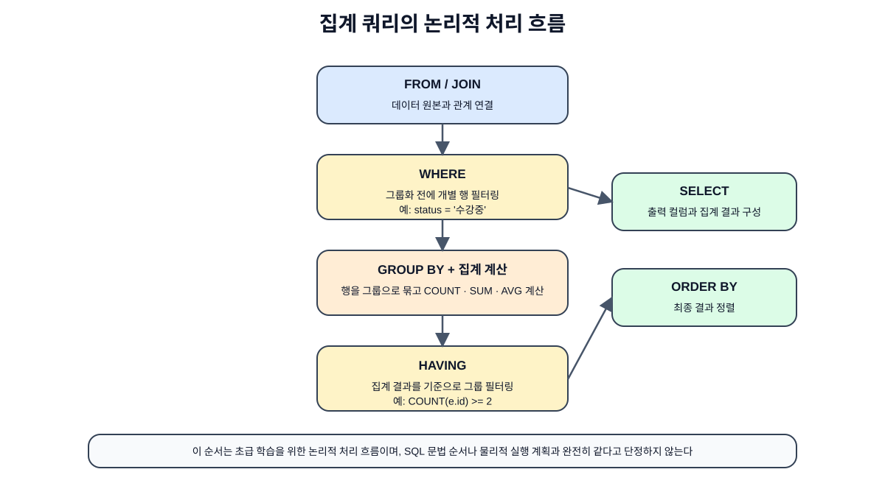

그림 8-3 집계 쿼리의 논리적 처리 흐름

`WHERE`는 그룹화 전에 개별 행을 필터링하고, `HAVING`은 그룹화 후 집계 결과를 필터링합니다.

취소 제외 신청을 먼저 선택하고, 신청이 두 건 이상인 강의만 찾습니다.

```sql
SELECT
    c.id,
    c.title,
    COUNT(e.id) AS enrollment_count
FROM course_project.courses AS c
JOIN course_project.enrollments AS e
    ON c.id = e.course_id
WHERE e.status <> '취소'
GROUP BY c.id, c.title
HAVING COUNT(e.id) >= 2
ORDER BY c.id;
```

결과는 다음 두 강의입니다.

```text
데이터베이스 입문: 2건
정규화 실습: 2건
```

논리적 흐름은 다음처럼 이해합니다.

```text
FROM / JOIN
→ WHERE
→ GROUP BY와 집계 계산
→ HAVING
→ SELECT
→ ORDER BY
```

이 순서는 SQL의 논리적 의미를 이해하기 위한 설명입니다. 실제 DBMS의 물리적 실행 계획과 완전히 같다는 뜻은 아닙니다.

---

## 15. 강사별 강의 수와 신청 수를 함께 구하기

강사 한 명은 여러 강의를, 각 강의는 여러 신청을 가질 수 있습니다.

```sql
SELECT
    i.id AS instructor_id,
    i.name AS instructor_name,
    COUNT(DISTINCT c.id) AS course_count,
    COUNT(e.id) AS enrollment_count,
    COUNT(e.id) FILTER (
        WHERE e.status <> '취소'
    ) AS non_cancelled_count
FROM course_project.instructors AS i
LEFT JOIN course_project.courses AS c
    ON i.id = c.instructor_id
LEFT JOIN course_project.enrollments AS e
    ON c.id = e.course_id
GROUP BY i.id, i.name
ORDER BY i.id;
```

| instructor_id | instructor_name | course_count | enrollment_count | non_cancelled_count |
| ---: | --- | ---: | ---: | ---: |
| 201 | 문길래 | 2 | 4 | 4 |
| 202 | 홍길동 | 1 | 1 | 0 |

`courses`와 `enrollments`를 함께 JOIN하면 강의 한 개가 신청 수만큼 반복됩니다. 따라서 강의 수는 `COUNT(DISTINCT c.id)`로 계산해야 합니다.

### 금액 과대 집계 예

다음 SQL은 실행되지만 강의 가격이 신청 수만큼 반복되어 과대 합산됩니다.

```sql
SELECT
    i.id,
    SUM(c.price) AS wrong_course_price_sum
FROM course_project.instructors AS i
JOIN course_project.courses AS c
    ON i.id = c.instructor_id
JOIN course_project.enrollments AS e
    ON c.id = e.course_id
GROUP BY i.id;
```

현재 기준 데이터에서 결과는 다음과 같습니다.

| instructor_id | 잘못된 `SUM(c.price)` |
| ---: | ---: |
| 201 | 440000 |
| 202 | 150000 |

강사 201의 실제 강의는 301과 302 두 개이고 현재 기준 가격 합계는 `100000 + 120000 = 220000`입니다. 하지만 각 강의가 신청 두 건씩과 연결되면서 가격도 두 번씩 반복되어 `440000`으로 계산됩니다. 강사 202는 신청이 한 건뿐이라 잘못된 쿼리와 올바른 합계가 우연히 `150000`으로 같습니다. 값이 우연히 같다고 해서 집계 기준이 올바른 것은 아닙니다.

`SUM(DISTINCT c.price)`도 일반적인 해결책이 아닙니다. 서로 다른 두 강의가 같은 가격이면 한 번만 더해질 수 있기 때문입니다.

강의 가격 합계가 질문이라면 신청 테이블을 JOIN하지 않고 강의 수준에서 계산합니다.

```sql
SELECT
    instructor_id,
    SUM(price) AS course_price_sum
FROM course_project.courses
GROUP BY instructor_id
ORDER BY instructor_id;
```

| instructor_id | 올바른 `course_price_sum` |
| ---: | ---: |
| 201 | 220000 |
| 202 | 150000 |

집계 전에 어떤 테이블의 한 행이 합산 대상인지 정해야 합니다.

---

## 16. 상세 결과와 집계 결과를 반드시 대조한다

집계 SQL이 실행되었다고 결과가 정확한 것은 아닙니다.

### 전체 행 수 검산

```sql
SELECT COUNT(*)
FROM course_project.enrollments;
```

결과: `5`

```sql
SELECT SUM(enrollment_count)
FROM (
    SELECT status, COUNT(*) AS enrollment_count
    FROM course_project.enrollments
    GROUP BY status
) AS status_summary;
```

결과: `5`

### 전체 기록 금액 검산

```sql
SELECT SUM(recorded_amount)
FROM course_project.enrollments;
```

결과: `590000`

```sql
SELECT SUM(total_recorded_amount)
FROM (
    SELECT
        course_id,
        SUM(recorded_amount) AS total_recorded_amount
    FROM course_project.enrollments
    GROUP BY course_id
) AS course_summary;
```

결과: `590000`

### 활성 신청 검산

```sql
SELECT
    COUNT(*) AS active_enrollment_count,
    SUM(recorded_amount) AS active_recorded_amount
FROM course_project.enrollments
WHERE status IN ('신청', '수강중');
```

결과: `3`, `340000`

### 취소 제외 신청 이력 검산

```sql
SELECT
    COUNT(*) AS non_cancelled_count,
    SUM(recorded_amount) AS non_cancelled_recorded_amount
FROM course_project.enrollments
WHERE status <> '취소';
```

결과: `4`, `440000`

상세 합계와 그룹별 합계가 다르면 다음을 확인합니다.

```text
Chapter 07 임시 테스트 행이 남아 있는가?
JOIN으로 동일 사건이 여러 번 복제되었는가?
WHERE나 ON 조건으로 일부 행이 빠졌는가?
활성·완료·취소 상태 기준이 서로 다른가?
COUNT(*)와 COUNT(column)을 혼동했는가?
DISTINCT가 필요한 대상을 잘못 선택했는가?
NULL 합계를 0으로 해석해도 되는 질문인가?
```

---

## 17. DISTINCT로 문제를 숨기지 않는다

JOIN 결과가 예상보다 많을 때 `SELECT DISTINCT`를 먼저 추가하면 원인을 숨길 수 있습니다.

학생별 신청 목록에서는 한 학생이 여러 번 나타나는 것이 정상입니다.

```text
김민지 2행
이준호 2행
박서연 1행
```

이 결과에 `DISTINCT student_name`을 적용하면 학생 이름 3개만 남지만 신청 정보가 사라집니다.

`DISTINCT`를 사용하기 전에 다음을 확인합니다.

```text
결과 한 행의 기준은 무엇인가?
반복이 1:N 관계의 정상 결과인가?
JOIN 조건이 빠지거나 잘못되었는가?
정말 고유한 대상 수를 구하려는가?
```

고유 학생 수가 목적이라면 다음처럼 집계 의도를 명시합니다.

```sql
COUNT(DISTINCT e.student_id)
```

---

## 18. AI가 만든 JOIN·집계 SQL 검토하기

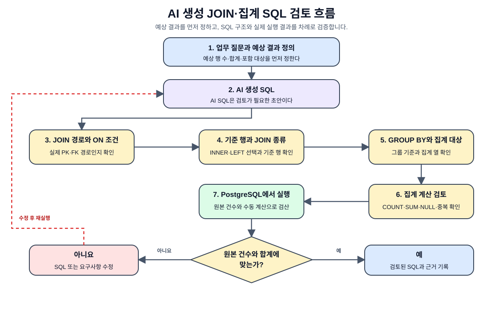

그림 8-4 AI 생성 JOIN·집계 SQL 검토 흐름

AI에게 SQL 초안을 요청할 때 질문의 정의와 기준값을 함께 제공합니다.

```text
course_project 스키마의 온라인 강의 데이터로
모든 강의를 유지하면서 취소 제외 신청 이력 건수와 고유 학생 수,
신청 당시 기록 금액 합계를 조회해 주세요.

조건:
- 신청이 없는 강의도 0으로 표시
- 취소 상태는 집계에서 제외
- 활성 신청은 신청·수강중 상태로 별도 구분
- 실제 FK 경로 사용
- COUNT(*)와 COUNT(e.id)의 차이 설명
- 예상 결과와 검산 SQL 제공
- 저장 금액을 실제 매출로 표현하지 않음
```

AI 결과는 다음 기준으로 검토합니다.

| 검토 영역 | 확인 질문 |
| --- | --- |
| 질문 정의 | 활성·취소 제외·전체 이력 범위가 명확한가? |
| 기준 행 | 신청·학생·강의 중 어떤 단위인가? |
| JOIN 경로 | 실제 PK·FK 관계를 따르는가? |
| JOIN 종류 | 누락 대상 포함 요구에 `LEFT JOIN`을 사용했는가? |
| 조건 위치 | 외부 JOIN의 오른쪽 조건이 `ON`과 `WHERE` 중 올바른 위치인가? |
| COUNT 대상 | `COUNT(*)`, `COUNT(e.id)`, `COUNT(DISTINCT ...)`의 의미가 맞는가? |
| 금액 기준 | 신청 당시 기록 금액과 실제 매출을 구분했는가? |
| NULL 처리 | 0으로 보여야 하는 합계에만 `COALESCE`를 사용했는가? |
| 과대 집계 | 여러 1:N JOIN으로 같은 값이 반복되지 않았는가? |
| 정렬 | 상태 업무 순서를 명시했는가? |
| 검산 | 5·590000, 3·340000, 4·440000 기준으로 대조했는가? |

### 대표적인 AI 오류 1: LEFT JOIN을 INNER JOIN처럼 바꾸는 WHERE

```sql
FROM course_project.courses AS c
LEFT JOIN course_project.enrollments AS e
    ON c.id = e.course_id
WHERE e.status <> '취소'
```

취소 제외 신청이 없는 강의 303이 사라집니다. 모든 강의를 유지하려면 조건을 `ON`에 두는 방식이 적합합니다.

### 대표적인 AI 오류 2: LEFT JOIN에서 COUNT(*) 사용

신청이 없는 강의도 JOIN 결과 한 행이 존재하므로 1건으로 잘못 셀 수 있습니다.

### 대표적인 AI 오류 3: 수강중만 active_count로 표현

Chapter 07에서 활성 신청은 `신청`과 `수강중` 상태를 함께 의미합니다. `수강중`만 세는 값은 `learning_count`처럼 구분해야 합니다.

### 대표적인 AI 오류 4: 신청 건수를 고유 학생 수라고 이름 붙임

재신청 이력이 존재하면 `COUNT(e.id)`와 `COUNT(DISTINCT e.student_id)`는 달라집니다.

### 대표적인 AI 오류 5: 기록 금액을 실제 매출로 단정

환불과 결제 성공 정보가 없으므로 회계 매출을 계산할 수 없습니다.

### 대표적인 AI 오류 6: JOIN 반복 금액을 DISTINCT로 무조건 해결

`SUM(DISTINCT value)`는 서로 다른 대상의 값이 우연히 같을 때 하나만 합산할 수 있습니다. 먼저 합산할 기준 행을 바로잡아야 합니다.

---

## 19. 자주 하는 실수

1. `00_check_course_project.sql`을 생략하고 기준 데이터가 다른 상태에서 실습한다.
2. `current_schema()`가 `course_project`여야 한다고 오해한다. 객체에 스키마를 명시하면 현재 스키마와 관계없이 조회할 수 있다.
3. 결과 한 행의 기준을 정하지 않는다.
4. `LEFT JOIN` 조건을 `WHERE`에 두어 0건 대상을 제거한다.
5. `LEFT JOIN`에서 `COUNT(*)`로 자식 건수를 센다.
6. JOIN으로 늘어난 행에서 부모 수나 부모 금액을 그대로 집계한다.
7. `DISTINCT`를 원인 분석 없이 추가한다.
8. `수강중`과 활성 신청을 같은 말로 사용한다. 활성 신청은 `신청`과 `수강중`이다.
9. 취소 제외 신청 이력과 활성 신청을 구분하지 않는다.
10. 상태 정렬을 단순 문자열 순서에 맡긴다.
11. 데이터 없음의 NULL을 모든 집계에서 0으로 바꾼다.
12. 저장된 `recorded_amount` 합계를 실제 매출로 표현한다.
13. 그룹 결과를 원본 기준값과 대조하지 않는다.
14. 별도 Chapter 08 데이터로 Chapter 07 프로젝트를 덮어쓴다.

---

## 20. 스스로 확인하기

### 개념 확인

1. 결과 한 행의 기준을 먼저 정해야 하는 이유는 무엇인가요?
2. `INNER JOIN`과 `LEFT JOIN`의 포함 범위 차이는 무엇인가요?
3. `LEFT JOIN`의 오른쪽 조건을 `ON`과 `WHERE`에 둘 때 결과가 어떻게 달라지나요?
4. `COUNT(*)`, `COUNT(e.id)`, `COUNT(DISTINCT e.student_id)`는 각각 어떤 질문에 답하나요?
5. 활성 신청과 취소 제외 신청 이력의 상태 범위는 어떻게 다른가요?
6. `COALESCE(SUM(...), 0)`이 필요한 경우와 사용하면 안 되는 경우를 설명해 보세요.
7. `WHERE`와 `HAVING`의 필터링 시점은 어떻게 다른가요?
8. 신청 당시 기록 금액 합계와 실제 매출을 구분해야 하는 이유는 무엇인가요?
9. 상태별 결과를 `ORDER BY status`에만 맡기지 않은 이유는 무엇인가요?
10. 여러 JOIN 뒤 `SUM(c.price)`가 과대 계산될 수 있는 이유는 무엇인가요?
11. 그룹별 집계 결과를 원본 기준값과 검산하는 방법을 설명해 보세요.

### SQL 작성 문제

```text
1. 학생별 전체 신청 수와 취소 제외 신청 이력 수를 조회한다.
2. 강의별 전체 신청 수와 고유 학생 수를 조회한다.
3. 모든 강의를 유지하며 취소 제외 신청 기록 금액 합계를 조회한다.
4. 취소 제외 신청이 없는 학생을 NOT EXISTS로 조회한다.
5. 강사별 강의 수와 취소 제외 신청 수를 조회한다.
6. 취소 제외 신청이 두 건 이상인 강의만 조회한다.
7. 상태별 신청 건수 합이 전체 5건과 일치하는지 검산한다.
8. 활성 신청이 3건이고 기록 금액이 340000인지 검산한다.
```

실행 결과를 표로 기록하려면 `book/chapter08/chapter08_activity.md`의 독자 워크북을 사용합니다.

---

## 21. 권장 해설

### 21.1 개념 확인

- 기준 행을 먼저 정해야 JOIN으로 늘어난 반복이 정상인지 오류인지 판단할 수 있습니다.
- `INNER JOIN`은 양쪽에 일치 행이 있는 결과만, `LEFT JOIN`은 왼쪽 행을 유지합니다.
- 오른쪽 필터를 `ON`에 두면 부모를 유지하면서 연결 대상을 제한할 수 있고, `WHERE`에 두면 JOIN 결과에서 행을 제거합니다.
- `COUNT(*)`는 결과 행, `COUNT(column)`은 NULL이 아닌 값, `COUNT(DISTINCT column)`은 고유값을 셉니다.
- 활성 신청은 `신청`·`수강중` 3건이고 취소 제외 신청 이력은 여기에 `완료`를 포함한 4건입니다.
- `COALESCE`는 데이터 없음과 0을 같은 의미로 표시해도 되는 합계에 사용합니다. 평균이나 최솟값이 없음을 0으로 바꾸면 의미가 왜곡될 수 있습니다.
- `WHERE`는 그룹화 전 행을, `HAVING`은 그룹화 후 집계 결과를 필터링합니다.
- `recorded_amount`만으로 결제 성공·환불·매출 인식을 알 수 없으므로 실제 매출을 계산할 수 없습니다.
- 상태 업무 순서는 문자열 정렬 규칙과 다를 수 있으므로 `CASE`로 명시합니다.
- 강의와 신청을 JOIN하면 강의 행이 신청 수만큼 반복되어 강의 가격이 과대 합산될 수 있습니다.

### 21.2 SQL 작성 예시

```sql
-- 1. 학생별 전체 신청과 취소 제외 신청 이력
SELECT
    s.id,
    s.name,
    COUNT(e.id) AS total_enrollment_count,
    COUNT(e.id) FILTER (
        WHERE e.status <> '취소'
    ) AS non_cancelled_count
FROM course_project.students AS s
LEFT JOIN course_project.enrollments AS e
    ON s.id = e.student_id
GROUP BY s.id, s.name
ORDER BY s.id;

-- 2. 강의별 전체 신청과 고유 학생 수
SELECT
    c.id,
    c.title,
    COUNT(e.id) AS enrollment_count,
    COUNT(DISTINCT e.student_id) AS student_count
FROM course_project.courses AS c
LEFT JOIN course_project.enrollments AS e
    ON c.id = e.course_id
GROUP BY c.id, c.title
ORDER BY c.id;

-- 3. 모든 강의를 유지한 취소 제외 기록 금액
SELECT
    c.id,
    c.title,
    COALESCE(SUM(e.recorded_amount), 0) AS non_cancelled_recorded_amount
FROM course_project.courses AS c
LEFT JOIN course_project.enrollments AS e
    ON c.id = e.course_id
   AND e.status <> '취소'
GROUP BY c.id, c.title
ORDER BY c.id;

-- 4. 취소 제외 신청이 없는 학생
SELECT
    s.id,
    s.name
FROM course_project.students AS s
WHERE NOT EXISTS (
    SELECT 1
    FROM course_project.enrollments AS e
    WHERE e.student_id = s.id
      AND e.status <> '취소'
);

-- 5. 강사별 강의 수와 취소 제외 신청 수
SELECT
    i.id,
    i.name,
    COUNT(DISTINCT c.id) AS course_count,
    COUNT(e.id) FILTER (
        WHERE e.status <> '취소'
    ) AS non_cancelled_count
FROM course_project.instructors AS i
LEFT JOIN course_project.courses AS c
    ON i.id = c.instructor_id
LEFT JOIN course_project.enrollments AS e
    ON c.id = e.course_id
GROUP BY i.id, i.name
ORDER BY i.id;

-- 6. 취소 제외 신청 2건 이상 강의
SELECT
    c.id,
    c.title,
    COUNT(e.id) AS enrollment_count
FROM course_project.courses AS c
JOIN course_project.enrollments AS e
    ON c.id = e.course_id
WHERE e.status <> '취소'
GROUP BY c.id, c.title
HAVING COUNT(e.id) >= 2
ORDER BY c.id;

-- 7. 상태별 건수 합 검산
SELECT SUM(enrollment_count)
FROM (
    SELECT status, COUNT(*) AS enrollment_count
    FROM course_project.enrollments
    GROUP BY status
) AS status_summary;

-- 8. 활성 신청 검산
SELECT
    COUNT(*) AS active_enrollment_count,
    SUM(recorded_amount) AS active_recorded_amount
FROM course_project.enrollments
WHERE status IN ('신청', '수강중');
```

예상 결과는 상태별 합 `5`, 활성 신청 `3건·340000`, 취소 제외 신청 이력 `4건·440000`입니다.

---

## 22. 핵심 정리

```text
1. JOIN은 실제 PK·FK 관계를 따라 정규화된 사실을 조회 시점에 연결한다.
2. SQL 작성 전에 결과 한 행의 기준과 포함 범위를 정한다.
3. INNER JOIN은 일치 행만, LEFT JOIN은 왼쪽 행을 유지한다.
4. 외부 JOIN에서는 오른쪽 필터의 ON·WHERE 위치가 결과를 바꾼다.
5. 1:N 관계에서 부모가 여러 행으로 반복되는 것은 정상일 수 있다.
6. COUNT(*)·COUNT(column)·COUNT(DISTINCT column)은 서로 다른 질문에 답한다.
7. 활성 신청과 취소 제외 신청 이력은 서로 다른 상태 범위다.
8. GROUP BY는 그룹별 한 행을 만들고 HAVING은 집계 후 결과를 필터링한다.
9. FILTER는 PostgreSQL에서 조건별 집계를 명확하게 표현한다.
10. NULL을 0으로 바꾸는 것은 업무 의미가 맞을 때만 수행한다.
11. JOIN 뒤 부모 값이나 금액이 반복되어 과대 집계될 수 있다.
12. 기록 금액 합계는 실제 매출과 구분한다.
13. 상태 업무 순서는 CASE로 명시할 수 있다.
14. 상세 결과·원본 합계·그룹 합계를 서로 대조해 SQL을 검증한다.
```

### JOIN·집계 SQL 확인표

| 확인 항목 | 질문 |
| --- | --- |
| 사전 조건 | Chapter 07 기준 상태가 정확한가? |
| 업무 정의 | 전체·활성·취소 제외 중 어떤 범위인가? |
| 기준 행 | 결과 한 행은 무엇을 뜻하는가? |
| JOIN 경로 | 실제 PK·FK를 따라가는가? |
| JOIN 종류 | 누락 대상도 포함해야 하는가? |
| 조건 위치 | `ON`과 `WHERE` 중 요구사항에 맞는가? |
| COUNT 대상 | 사건·NULL이 아닌 행·고유 대상을 구분했는가? |
| 금액 기준 | 신청 당시 기록 금액과 실제 매출을 구분했는가? |
| NULL 처리 | 0과 NULL 중 어떤 표현이 필요한가? |
| 중복 | 1:N 또는 여러 JOIN으로 행이 늘어났는가? |
| 정렬 | 업무상 상태 순서를 명시했는가? |
| 검산 | 5·590000, 3·340000, 4·440000에 맞는가? |

---

## 23. 다음 장에서는

Chapter 09에서는 조회가 아니라 여러 데이터 변경이 하나의 업무 단위로 움직여야 하는 이유를 다룹니다.

```text
BEGIN, COMMIT, ROLLBACK
원자성
수강신청과 정원 변경
오류 발생 시 전체 취소
동시 실행과 잠금의 기초
트랜잭션 경계 검토
```

Chapter 08에서 “어떤 행을 읽고 어떤 기준으로 검증할 것인가”를 배웠다면, Chapter 09에서는 “여러 변경을 어디까지 한 번에 성공하거나 실패하게 할 것인가”를 판단합니다.

---

# Chapter 09. 트랜잭션으로 데이터 정합성 지키기

---

## 이 장에서 살펴볼 내용

Chapter 08에서는 `course_project` 데이터를 JOIN하고 집계해 결과를 검산했습니다. 이번 장에서는 조회가 아니라 여러 변경이 하나의 업무 단위로 함께 성공하거나 실패하도록 만드는 **트랜잭션**을 다룹니다.

```text
업무 단위 정의
→ 실행 전 상태 검사
→ BEGIN
→ 좌석 행 잠금과 최신 상태 확인
→ 조건부 좌석 확보
→ 신청·결제 생성
→ 영향 행 수와 관계 검증
→ 정상: COMMIT
→ 문제: ROLLBACK
→ 확정 후 정합성 재검증
→ 동시 실행·취소·오류 복구 검토
```

이 장에서는 다음 내용을 살펴봅니다.

- `BEGIN`, `COMMIT`, `ROLLBACK`
- ACID의 기본 의미
- 제약조건·트랜잭션·업무 검증의 역할 차이
- 조건부 좌석 차감과 영향 행 수
- 데이터 변경 CTE와 `RETURNING`
- 신청·결제·좌석 변경의 원자적 처리
- ROLLBACK과 IDENTITY 번호의 차이
- SQL 오류가 발생한 트랜잭션과 `SAVEPOINT`
- `SELECT ... FOR UPDATE`, Lock 대기와 Deadlock
- 취소와 좌석 복구 트랜잭션
- AI가 만든 트랜잭션 SQL 검토

> **핵심 원칙**
>
> 관련 변경은 같은 트랜잭션 안에서 실행하고, 영향 행 수와 최종 상태가 모두 맞을 때만 `COMMIT`합니다.

---

## 1. 왜 트랜잭션이 필요한가

온라인 강의 수강신청을 확정하는 업무에 다음 세 변경이 필요하다고 가정합니다.

```text
1. 남은 좌석 1개 차감
2. 수강신청 행 생성
3. 결제 행 생성
```

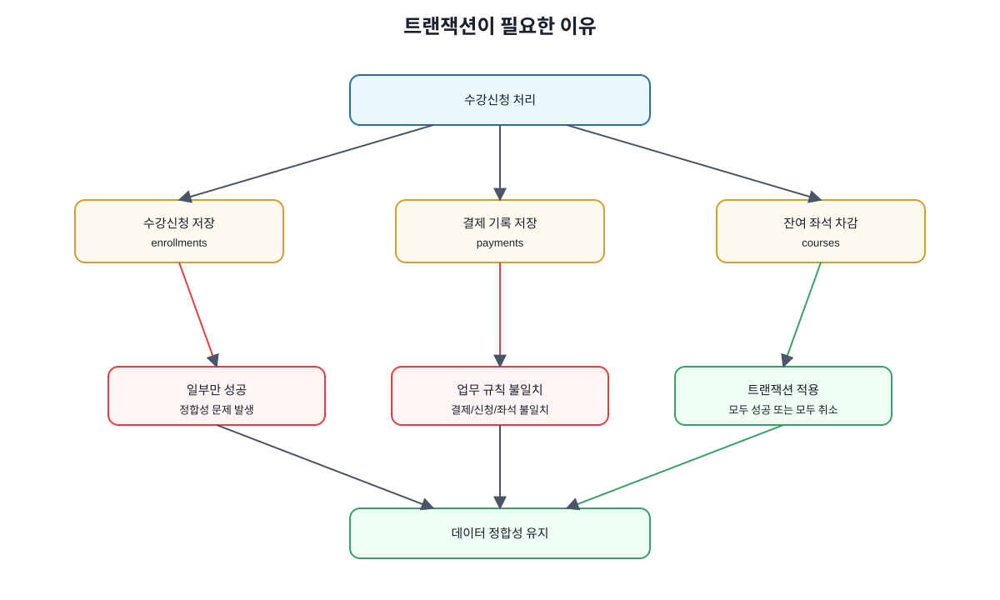

그림 9-1 트랜잭션이 필요한 이유

세 작업을 각각 독립적으로 확정하면 중간 실패가 남을 수 있습니다.

```text
좌석만 감소하고 신청은 없음
신청은 있지만 결제가 없음
결제는 있지만 연결된 신청이 없음
신청·결제는 있지만 좌석은 감소하지 않음
```

트랜잭션은 이 변경들을 하나의 성공·실패 경계로 묶습니다.

```text
모든 변경과 검증 성공 → COMMIT
하나라도 실패하거나 결과가 예상과 다름 → ROLLBACK
```

트랜잭션은 SQL을 여러 줄 묶는 문법이 아니라, 하나의 업무가 어디에서 시작하고 어디에서 확정되는지를 정하는 설계입니다.

---

## 2. Chapter 07·08 데이터를 보호하는 실습 구조

기존 프로젝트 테이블을 삭제하거나 다시 만들면 앞 장의 데이터가 손상됩니다. Chapter 09에서는 별도의 실습 스키마를 사용합니다.

```text
course_project
- students
- instructors
- courses
- enrollments

transaction_lab
- course_inventory
- enrollments
- payments
```

`transaction_lab`은 좌석과 트랜잭션 실험 상태만 저장합니다. 학생과 강의 마스터는 Chapter 07의 데이터를 외래키로 참조합니다.

```text
transaction_lab.course_inventory.course_id
→ course_project.courses.id

transaction_lab.enrollments.student_id
→ course_project.students.id

transaction_lab.enrollments.course_id
→ course_project.courses.id

transaction_lab.payments.enrollment_id
→ transaction_lab.enrollments.id
```

이 구조의 장점은 다음과 같습니다.

```text
Chapter 07·08 데이터가 변경되지 않는다.
트랜잭션 실습만 독립적으로 초기화할 수 있다.
같은 학생·강의 ID를 사용해 도메인 연속성을 유지한다.
삭제 대상을 transaction_lab으로 제한할 수 있다.
```

---

## 3. 실습 파일과 실행 순서

```text
code/chapter09/
├── 01_transaction_lab_schema.sql
├── 02_transaction_lab_seed.sql
├── 03_commit_transaction.sql
├── 04_rollback_transaction.sql
├── 05_commit_and_sold_out.sql
├── 06_transaction_validation.sql
├── 07_concurrency_two_sessions.sql
├── 08_cancel_and_restore.sql
├── 09_error_and_savepoint.sql
├── reset_transaction_lab.sql
├── transaction_consistency_practice.sql
└── README.md
```

주 실습 순서:

```text
01 schema
→ 02 seed
→ 03 성공 COMMIT
→ 04 실패 가정 ROLLBACK
→ 05 두 번째 COMMIT과 좌석 부족
→ 06 최종 검증
```

선택 실습:

```text
07 두 세션 Lock 대기
08 취소와 좌석 복구
09 오류 상태와 SAVEPOINT
```

`transaction_consistency_practice.sql`은 기존 링크 호환용 상태 확인 파일입니다.

트랜잭션 실습은 같은 DBeaver SQL Editor와 같은 연결 세션에서 문장 순서대로 실행합니다. 다른 연결에서 `COMMIT`이나 `ROLLBACK`을 실행해도 현재 트랜잭션을 제어할 수 없습니다.

모든 파일은 다음 위치 정보를 확인합니다.

```sql
SELECT current_database();
SELECT current_schema();
SHOW search_path;
```

모든 객체를 스키마 한정 이름으로 사용하므로 `current_schema()`가 `transaction_lab`일 필요는 없습니다.

---

## 4. 실행 전 사전 조건을 실제로 검사한다

`01_transaction_lab_schema.sql`은 단순히 행 수를 출력한 뒤 계속 진행하지 않습니다. 다음 조건이 맞지 않으면 예외를 발생시킵니다.

```text
현재 데이터베이스 = ai_database_book
course_project 핵심 테이블 존재
students / instructors / courses / enrollments = 3 / 2 / 3 / 5
학생 101~103 존재
강의 301~303와 기준 가격 100000 / 120000 / 150000 일치
recorded_amount = NUMERIC(12,0)
상태 = 신청 2 / 수강중 1 / 완료 1 / 취소 1
전체 기록 금액 = 590000
활성 신청 = 3 / 340000
취소 제외 신청 이력 = 4 / 440000
신청 1001·1004·1005의 상태와 기록 금액 일치
course_project.uq_course_enrollments_active 존재
Chapter 07 명명 제약조건 15개 / NOT NULL 열 20개
현재 역할에 ai_database_book CREATE 권한 존재
transaction_lab 스키마가 아직 없음
```

사전 조건은 DDL 트랜잭션을 열기 전에 검사합니다. 잘못된 데이터베이스, Chapter 07 구조 드리프트, 권한 부족이나 기존 `transaction_lab`이 발견되면 스키마 생성을 시작하지 않습니다.

스키마와 세 테이블 생성 자체는 하나의 트랜잭션 안에서 실행합니다.

```sql
-- 사전 조건 검사

BEGIN;

-- CREATE SCHEMA
-- CREATE TABLE
-- CREATE INDEX
-- 생성 결과 검증

COMMIT;
```

중간의 `CREATE TABLE`이나 생성 결과 검증이 실패하면 DDL 트랜잭션을 `ROLLBACK`으로 정리한 뒤 원인을 수정합니다. PostgreSQL에서는 이 장에서 사용하는 `CREATE SCHEMA`, `CREATE TABLE`, `CREATE INDEX` 같은 DDL도 트랜잭션 경계 안에서 함께 취소할 수 있습니다.

---

## 5. 트랜잭션의 기본 흐름

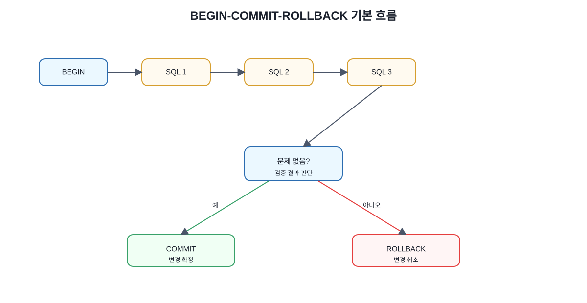

그림 9-2 BEGIN부터 COMMIT·ROLLBACK까지

| 명령 | 역할 | 주의점 |
| --- | --- | --- |
| `BEGIN` | 현재 세션에서 트랜잭션 시작 | 관련 변경 전에 실행 |
| `COMMIT` | 현재 트랜잭션의 변경 확정 | 검증이 끝난 뒤 실행 |
| `ROLLBACK` | 아직 확정되지 않은 변경 취소 | 오류·검증 실패 시 실행 |

기본 패턴은 다음과 같습니다.

```sql
SELECT ...;  -- 변경 전 상태 확인

BEGIN;

UPDATE ...;
INSERT ...;

SELECT ...;  -- COMMIT 전 검증

COMMIT;
-- 또는 ROLLBACK;
```

이미 `COMMIT`된 변경은 같은 트랜잭션의 `ROLLBACK`으로 되돌릴 수 없습니다.

이 장의 성공 SQL 파일은 사람이 확인할 조회 결과와 함께 `DO` 검증 구문을 사용합니다. 기대 결과가 다르면 예외를 발생시켜 `COMMIT` 전에 중단합니다.

---

## 6. 데이터 정합성과 안전장치의 역할

데이터 정합성은 여러 값과 관계가 정의된 업무 규칙과 모순되지 않는 상태입니다.

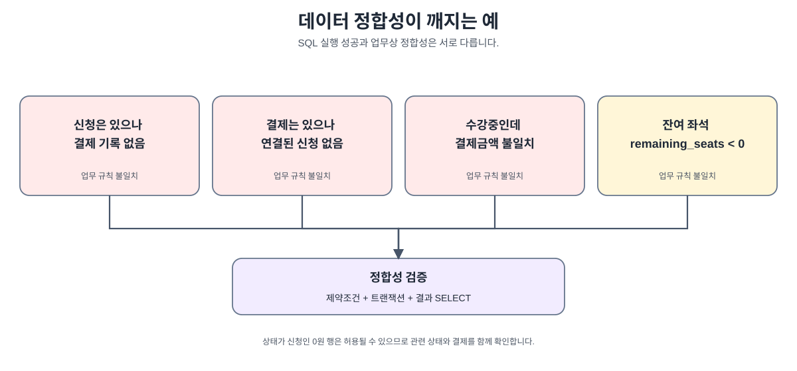

그림 9-3 데이터 정합성이 깨지는 예

이 장의 단순 규칙은 다음과 같습니다.

```text
remaining_seats는 0 이상 capacity 이하다.
각 payment는 하나의 유효한 lab enrollment를 참조한다.
한 enrollment에는 payment가 최대 한 건 연결된다.
수강중 enrollment에는 payment가 한 건 존재해야 한다.
enrollment.recorded_amount와 payment.amount는 같아야 한다.
학생·강의 조합의 수강중 enrollment는 최대 한 건이다.
활성 신청 수와 사용 좌석 수가 같아야 한다.
```

| 안전장치 | 담당 역할 | 예 |
| --- | --- | --- |
| 제약조건 | 한 행의 값과 참조 오류 차단 | 음수 좌석, 없는 FK, 음수 금액 |
| 고유 인덱스 | 조건에 맞는 중복 행 차단 | 동일 학생·강의의 중복 수강중 신청 |
| 트랜잭션 | 여러 변경의 확정·취소 경계 | 좌석·신청·결제 함께 처리 |
| 업무 조건 | 변경 가능 여부 판단 | 남은 좌석이 0보다 큰가? |
| 영향 행 수 | 조건부 변경의 성공 확인 | 좌석 UPDATE가 1행인가? |
| 검증 SELECT | 여러 테이블의 최종 의미 확인 | 신청·결제·좌석 일치 |

외래키와 `UNIQUE`는 결제의 유효한 참조와 신청당 **최대 한 건**을 보장합니다. 모든 수강중 신청에 결제가 **최소 한 건** 존재해야 한다는 규칙은 여러 테이블에 걸친 업무 규칙이므로 트랜잭션 흐름과 검증 SQL이 담당합니다.

트랜잭션만 사용한다고 정합성이 자동 보장되는 것은 아닙니다. 잘못된 SQL도 함께 `COMMIT`할 수 있으므로 업무 조건과 검증이 필요합니다.

---

## 7. ACID를 업무 사례로 이해하기

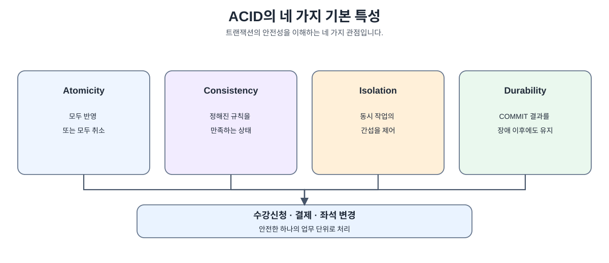

그림 9-4 ACID의 네 가지 기본 특성

| 특성 | 입문 수준 의미 | 수강신청 사례 |
| --- | --- | --- |
| Atomicity | 모두 반영되거나 모두 취소 | 좌석·신청·결제 |
| Consistency | 전후 상태가 정의된 규칙을 만족 | 좌석 범위·결제 연결 |
| Isolation | 동시 작업의 간섭을 정해진 수준에서 제어 | 마지막 좌석 경쟁 |
| Durability | 확정된 변경을 장애 이후에도 유지 | COMMIT된 신청·결제 |

```text
Atomicity가 업무 규칙의 옳고 그름을 판단하지 않는다.
Consistency에는 제약조건과 올바른 업무 로직이 필요하다.
Isolation의 가시성과 충돌 방식은 격리 수준에 따라 달라진다.
Durability는 DBMS의 로그·저장·복구 기능과 연결된다.
```

---

## 8. 실습 구조와 초기 상태

`transaction_lab.enrollments`에는 동일 학생·강의의 중복 활성 신청을 차단하는 부분 고유 인덱스가 있습니다.

```sql
CREATE UNIQUE INDEX uq_transaction_enrollments_active
ON transaction_lab.enrollments (student_id, course_id)
WHERE status = '수강중';
```

초기 좌석 상태:

| course_id | 강의 | 가격 | capacity | remaining_seats |
| ---: | --- | ---: | ---: | ---: |
| 301 | 데이터베이스 입문 | 100000 | 2 | 2 |
| 302 | 정규화 실습 | 120000 | 1 | 1 |
| 303 | 파이썬 데이터 분석 | 150000 | 1 | 1 |

```text
course_inventory 3행
lab enrollments 0행
payments 0행
```

Chapter 07의 `course_project.enrollments` 5건은 그대로 유지됩니다.

---

## 9. 성공 트랜잭션: 좌석·신청·결제를 함께 확정한다

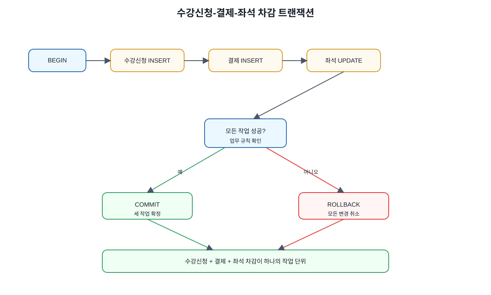

그림 9-5 수강신청·결제·좌석 변경 트랜잭션

학생 101이 강의 301을 신청하는 사례입니다.

### 9.1 행 잠금과 최신 상태 확인

```sql
BEGIN;

SELECT
    ci.course_id,
    c.title,
    c.price,
    ci.remaining_seats
FROM transaction_lab.course_inventory AS ci
JOIN course_project.courses AS c
    ON c.id = ci.course_id
WHERE ci.course_id = 301
FOR UPDATE OF ci;
```

`FOR UPDATE OF ci`는 좌석 상태 행을 수정 대상으로 잠급니다. 그러나 잠금만으로 업무 성공이 결정되는 것은 아닙니다.

```text
SELECT ... FOR UPDATE
→ 대상 행을 잠근 상태로 읽고 후속 판단 준비

UPDATE ... WHERE remaining_seats > 0
→ 좌석이 실제로 남아 있을 때만 변경

RETURNING·영향 행 수
→ 좌석 확보 성공 여부 확인
```

`UPDATE ... WHERE ... RETURNING` 자체도 수정 대상 행에 필요한 행 잠금을 획득하므로, 단일 조건부 변경만 필요한 경우 선행 `SELECT ... FOR UPDATE`가 항상 필수인 것은 아닙니다. 이 장에서는 좌석 행을 잠근 상태로 먼저 관찰한 뒤 여러 후속 판단을 이어 가는 흐름과 두 세션 대기를 명확히 학습하기 위해 `FOR UPDATE`를 명시합니다.

### 9.2 조건부 변경과 연결 INSERT

```sql
WITH seat AS (
    UPDATE transaction_lab.course_inventory AS ci
    SET remaining_seats = ci.remaining_seats - 1
    FROM course_project.courses AS c
    WHERE ci.course_id = c.id
      AND ci.course_id = 301
      AND ci.remaining_seats > 0
    RETURNING ci.course_id, c.price
),
new_enrollment AS (
    INSERT INTO transaction_lab.enrollments (
        id, student_id, course_id,
        enrolled_at, status, recorded_amount
    )
    SELECT
        9001, 101, course_id,
        CURRENT_TIMESTAMP, '수강중', price
    FROM seat
    RETURNING id, recorded_amount
)
INSERT INTO transaction_lab.payments (
    id, enrollment_id, amount, paid_at
)
SELECT
    9901, id, recorded_amount, CURRENT_TIMESTAMP
FROM new_enrollment
RETURNING id, enrollment_id, amount;
```

좌석 UPDATE가 1행이면 신청과 결제가 각각 1건 생성됩니다. 좌석이 없어 UPDATE가 0행이면 `seat` CTE가 비어 후속 INSERT도 실행 대상이 없습니다.

이 실습에서는 할인과 쿠폰을 적용하지 않습니다. 신청 당시 `course_project.courses.price`를 `recorded_amount`와 `payment.amount`에 기록합니다. 이후 강의의 현재 가격이 바뀌더라도 과거 신청 금액을 자동으로 변경하지 않습니다.

### 9.3 COMMIT 전 검증

```text
신청 9001 = 1행
결제 9901 = 1행
두 저장 금액 = 100000
강의 301 잔여 좌석 = 1
```

실습 파일은 이 조건을 `DO` 블록으로 다시 판정합니다. 하나라도 다르면 예외가 발생해 트랜잭션이 확정되지 않습니다.

---

## 10. 실패를 가정한 ROLLBACK

학생 102가 강의 302를 신청하는 변경을 트랜잭션 안에서 만든 뒤 외부 결제 승인 실패를 가정하고 취소합니다.

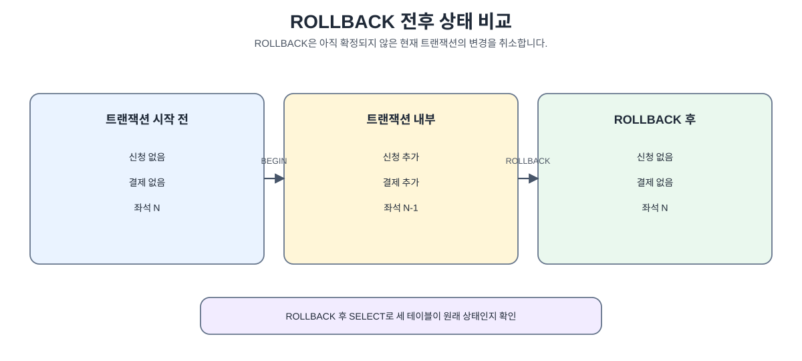

그림 9-6 ROLLBACK 전후 상태 비교

트랜잭션 안에서는 다음 임시 상태가 보입니다.

| 대상 | ROLLBACK 전 임시 상태 |
| --- | --- |
| course 302 | remaining_seats 0 |
| enrollment 9002 | 1행 존재 |
| payment 9902 | 1행 존재 |

```sql
ROLLBACK;
```

ROLLBACK 후 기대 상태:

```text
course 302 remaining_seats = 1
enrollment 9002 = 없음
payment 9902 = 없음
```

### ROLLBACK과 IDENTITY 번호는 다르다

이 실습은 결과 비교를 위해 `9002`, `9902`를 **명시적으로 입력**합니다. 따라서 ROLLBACK 후 같은 숫자를 다시 직접 사용할 수 있습니다.

IDENTITY 자동값은 내부 시퀀스에서 생성됩니다. 자동값이 할당된 뒤 트랜잭션이 취소되어도 그 번호는 일반적으로 회수되지 않으며 빈 번호가 생길 수 있습니다.

또한 명시적 ID 입력은 IDENTITY의 다음 값을 자동으로 이동시키지 않습니다. 주 실습 마지막에는 다음 값을 조정합니다.

```sql
ALTER TABLE transaction_lab.enrollments
    ALTER COLUMN id RESTART WITH 9003;

ALTER TABLE transaction_lab.payments
    ALTER COLUMN id RESTART WITH 9903;
```

---

## 11. 좌석 부족은 SQL 오류가 아니라 0행일 수 있다

학생 103의 강의 302 신청을 정상 확정하면 잔여 좌석은 0이 됩니다. 그 뒤 추가 신청의 조건부 UPDATE는 0행을 반환합니다.

```sql
UPDATE transaction_lab.course_inventory
SET remaining_seats = remaining_seats - 1
WHERE course_id = 302
  AND remaining_seats > 0
RETURNING course_id, remaining_seats;
```

```text
0행 반환
≠ PostgreSQL 문법 오류
≠ 자동 ROLLBACK
≠ 후속 작업 성공
```

CTE로 후속 INSERT를 좌석 UPDATE 결과에 연결하면 신청과 결제도 0건이 됩니다. 해당 트랜잭션은 업무상 좌석 확보 실패이므로 `ROLLBACK`으로 종료합니다.

애플리케이션에서는 반환 행 수가 0이면 “정원 마감” 같은 업무 결과로 처리해야 합니다.

---

## 12. PostgreSQL 문장 오류와 SAVEPOINT

조건 불충족으로 UPDATE가 0행인 것과 제약조건 오류가 발생한 것은 다릅니다.

PostgreSQL에서는 트랜잭션 안의 문장이 실패하면 현재 트랜잭션이 오류 상태가 될 수 있습니다.

```text
current transaction is aborted
```

기본 대응은 전체 트랜잭션 취소입니다.

```sql
ROLLBACK;
```

일부 단계만 되돌릴 필요가 있다면 오류가 발생하기 전에 `SAVEPOINT`를 설정합니다.

```sql
BEGIN;
SAVEPOINT before_optional_step;

-- 오류 가능 단계

ROLLBACK TO SAVEPOINT before_optional_step;

-- 트랜잭션 계속
COMMIT;
```

`09_error_and_savepoint.sql`은 좌석을 임시 차감한 뒤 중복 활성 신청 오류를 발생시키고, `ROLLBACK TO SAVEPOINT`로 좌석 차감까지 되돌리는 선택 실습입니다. 오류 유발 문장은 안전을 위해 기본 주석 상태입니다.

---

## 13. 최종 정합성 검증

주 실습의 최종 상태는 다음과 같습니다.

| 항목 | 기대 결과 |
| --- | ---: |
| course_project enrollments | 5 |
| lab enrollments | 2 |
| payments | 2 |
| course 301 remaining_seats | 1 |
| course 302 remaining_seats | 0 |
| course 303 remaining_seats | 1 |

검증 파일은 다음 위반이 모두 0행인지 확인합니다.

```text
좌석 범위 위반
수강중 신청의 결제 누락
신청·결제 금액 불일치
고아 payment
중복 활성 신청
좌석 부족 테스트의 잔여 행
```

또한 다음 관계를 확인합니다.

```text
활성 수강신청 수
= capacity - remaining_seats
```

마지막 `DO` 판정에서 하나라도 어긋나면 예외가 발생하며, 모두 맞으면 다음 결과를 표시합니다.

```text
Chapter 09 main transaction validation passed
```

---

## 14. 취소와 좌석 복구도 하나의 트랜잭션이다

`취소` 상태만 바꾸고 좌석을 복구하지 않으면 활성 신청 수와 사용 좌석 수가 달라집니다.

```text
수강중 → 취소
+ remaining_seats 1 증가
```

`08_cancel_and_restore.sql`은 신청 9001을 임시로 취소하고 강의 301 좌석을 1개 복구합니다. 중요한 점은 두 UPDATE를 단순히 나란히 실행하는 것이 아니라, **취소에 실제로 성공한 행만 좌석 복구의 입력으로 연결한다**는 것입니다.

```sql
BEGIN;

WITH cancelled AS (
    UPDATE transaction_lab.enrollments
    SET status = '취소'
    WHERE id = 9001
      AND status = '수강중'
    RETURNING course_id
)
UPDATE transaction_lab.course_inventory AS ci
SET remaining_seats = ci.remaining_seats + 1
FROM cancelled AS e
WHERE ci.course_id = e.course_id
  AND ci.remaining_seats < ci.capacity;

-- 검증
ROLLBACK;
```

같은 취소를 다시 실행하면 첫 UPDATE가 0행이므로 `cancelled`도 비고 좌석 복구 UPDATE도 0행입니다. 이렇게 상태 전이의 성공 결과에 후속 변경을 연결하면 재시도나 동시 실행에서 좌석이 두 번 복구되는 위험을 줄일 수 있습니다. 이것은 외부 시스템 전체의 멱등성을 완성한다는 뜻은 아니며, 실제 서비스에서는 별도의 요청 ID나 멱등성 키도 함께 설계합니다.

선택 실습은 주 실습의 최종 상태를 보존하기 위해 기본적으로 ROLLBACK합니다.

결제 행은 신청 당시 기록으로 남습니다. 실제 환불 업무에는 환불 금액, 환불 상태, 승인 ID, 재시도와 보상 처리 같은 별도 구조가 필요하며 이번 장의 범위에 포함하지 않습니다.

---

## 15. Lock과 동시성

잔여 좌석이 1인 강의에 두 사용자가 동시에 신청하면 둘 다 같은 초기 값을 읽으려 할 수 있습니다.

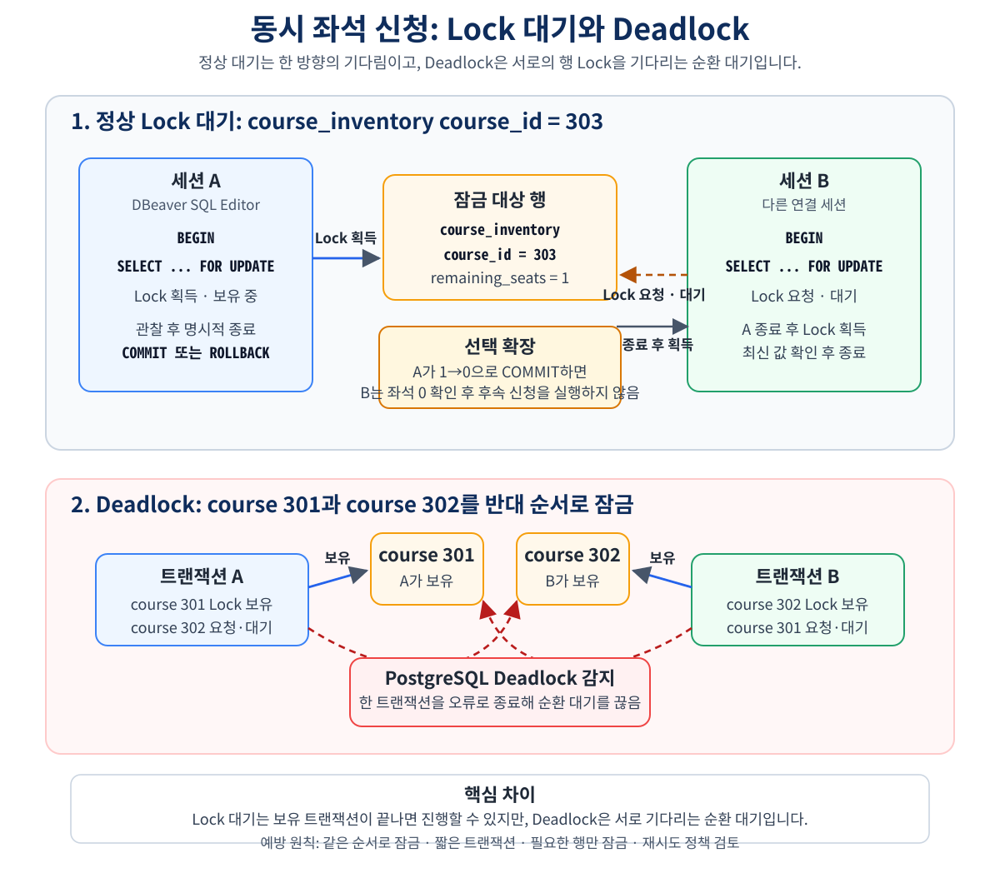

그림 9-7 동시 좌석 신청과 Lock

`07_concurrency_two_sessions.sql`은 두 SQL Editor를 서로 다른 연결 세션으로 열어 실행합니다.

```sql
SHOW transaction_isolation;
```

이 실습은 PostgreSQL 기본 격리 수준인 `READ COMMITTED`를 기준으로 설명합니다.

### 세션 A

```sql
BEGIN;

SELECT *
FROM transaction_lab.course_inventory
WHERE course_id = 303
FOR UPDATE;
```

### 세션 B

```sql
BEGIN;
SET LOCAL lock_timeout = '5s';

SELECT *
FROM transaction_lab.course_inventory
WHERE course_id = 303
FOR UPDATE;
```

세션 B는 세션 A가 끝날 때까지 대기할 수 있습니다. A가 종료된 뒤 READ COMMITTED에서는 B가 최신 행을 잠그고 확인할 수 있습니다.

`REPEATABLE READ`나 `SERIALIZABLE`에서는 동시 변경 상황에서 오류가 발생할 수 있습니다. `lock_timeout` 오류가 발생하면 해당 트랜잭션을 `ROLLBACK`으로 종료합니다.

트랜잭션을 사용자 입력이나 외부 응답을 기다리며 오래 열어 두지 않습니다.

---

## 16. Lock 대기와 Deadlock은 다르다

한 트랜잭션이 다른 트랜잭션의 한 행 잠금 해제를 기다리는 것은 일반적인 Lock 대기입니다.

Deadlock은 서로가 가진 잠금을 기다리는 순환 구조입니다.

```text
트랜잭션 A: course 301 잠금 → course 302 대기
트랜잭션 B: course 302 잠금 → course 301 대기
```

PostgreSQL은 Deadlock을 감지하면 한 트랜잭션을 오류로 종료할 수 있습니다.

```text
여러 행을 잠글 때 같은 순서로 접근한다.
트랜잭션을 짧게 유지한다.
불필요한 행을 잠그지 않는다.
오류 발생 시 재시도 정책을 검토한다.
```

실제 Deadlock 유발 SQL은 기본 실습에 포함하지 않습니다.

---

## 17. 트랜잭션 경계를 어디에 둘 것인가

트랜잭션이 너무 짧으면 하나의 업무가 부분 확정될 수 있고, 너무 길면 잠금 유지 시간이 길어집니다.

같은 트랜잭션에 포함할 후보:

```text
좌석 확보
수강신청 생성
결제 성공 결과 저장
관련 내부 상태 변경
COMMIT 전 내부 검증
```

오래 기다리지 않아야 하는 작업:

```text
사용자의 추가 입력
외부 결제창 응답의 장시간 대기
느린 외부 API 호출
대용량 파일 처리
```

외부 결제는 데이터베이스 트랜잭션만으로 전체 세계를 원자적으로 묶을 수 없습니다. 실제 시스템에서는 결제 승인 ID, 상태 전이, 멱등성 키, 재시도와 보상 처리 설계가 필요합니다.

이 장은 성공한 결제 결과를 내부 DB에 기록하는 단순화된 상황을 다룹니다.

---

## 18. AI가 만든 트랜잭션 SQL 검토

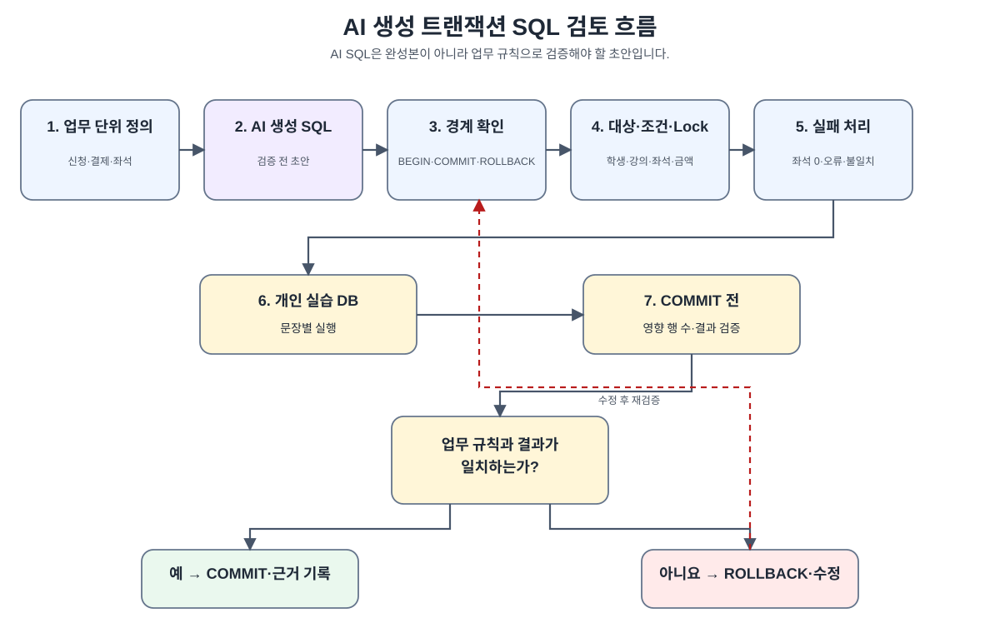

그림 9-8 AI 생성 트랜잭션 SQL 검토 흐름

AI에게 다음 정보를 함께 제공합니다.

```text
업무 단위: 좌석 차감 + lab enrollment 생성 + payment 생성
성공 조건: 좌석 1행, 신청 1행, 결제 1행, 금액 일치
실패 조건: 좌석 0행, SQL 오류, 관계 검증 실패
변경 대상: transaction_lab만
course_project 데이터 변경 금지
동일 학생·강의의 중복 수강중 신청 금지
```

| 검토 항목 | 확인 질문 |
| --- | --- |
| 경계 | `BEGIN`과 최종 확정 범위가 업무 단위와 맞는가? |
| 격리 | 기존 `course_project`를 변경하지 않는가? |
| 좌석 | `remaining_seats > 0`과 영향 행 수를 확인하는가? |
| 원자성 | 좌석 성공 결과에 신청·결제 INSERT가 연결되는가? |
| 관계 | payment가 올바른 enrollment를 참조하는가? |
| 중복 | 같은 학생·강의의 활성 신청을 막는가? |
| 검증 | COMMIT 전에 좌석·신청·결제를 함께 확인하는가? |
| 오류 | aborted 상태와 SAVEPOINT 복구를 고려하는가? |
| 잠금 | 마지막 좌석 경쟁과 격리 수준을 고려하는가? |
| 재실행 | 명시적 ID, 자동 ID, 멱등성 위험을 설명하는가? |
| 외부 작업 | 외부 API 대기를 DB 트랜잭션 안에 오래 두지 않는가? |

대표적인 잘못된 예:

```text
좌석 UPDATE가 0행이어도 신청 INSERT 실행
신청을 COMMIT한 뒤 별도 트랜잭션에서 결제 INSERT
취소 상태만 바꾸고 좌석은 복구하지 않음
동일 학생·강의의 중복 수강중 신청 허용
COMMIT 전에 결과 검증 없음
오류 상태에서 계속 SQL 실행
FOR UPDATE만 사용하고 조건부 UPDATE 결과를 확인하지 않음
```

AI SQL은 정상 경로뿐 아니라 실패·복구·재실행 경로까지 검토해야 합니다.

---

## 19. 자주 하는 실수

1. 트랜잭션이 업무 규칙을 자동 판단한다고 생각한다.
2. UPDATE 0행을 성공으로 간주한다.
3. COMMIT 전에 결과를 검증하지 않는다.
4. SQL 오류 후 aborted 트랜잭션을 계속 사용한다.
5. `BEGIN`과 `COMMIT`을 서로 다른 연결에서 실행한다.
6. 기존 `course_project`를 실습용으로 변경한다.
7. ROLLBACK이 IDENTITY 시퀀스 번호도 되돌린다고 생각한다.
8. 명시적 ID를 입력하고 IDENTITY 다음 값도 자동으로 이동한다고 생각한다.
9. 취소 UPDATE의 성공 여부와 무관하게 좌석을 별도로 복구해 중복 취소에서 좌석이 두 번 늘어날 수 있게 한다.
10. Lock 대기를 Deadlock이라고 부른다.
11. 외부 API를 기다리며 트랜잭션을 오래 유지한다.
12. 성공 파일을 기준 상태 확인 없이 반복 실행한다.

---

## 20. 스스로 확인하기

1. 트랜잭션의 업무 경계란 무엇인가요?
2. 제약조건과 트랜잭션의 역할은 어떻게 다른가요?
3. `COMMIT`과 `ROLLBACK`의 차이는 무엇인가요?
4. 좌석 UPDATE 0행과 SQL 오류는 어떻게 다른가요?
5. `FOR UPDATE`와 조건부 UPDATE의 역할은 어떻게 다른가요?
6. CTE로 좌석 결과에 INSERT를 연결한 이유는 무엇인가요?
7. payment의 FK·UNIQUE가 보장하는 것과 보장하지 못하는 것은 무엇인가요?
8. ROLLBACK과 IDENTITY 자동 번호의 관계를 설명해 보세요.
9. `SAVEPOINT`는 언제 사용할 수 있나요?
10. READ COMMITTED에서 Lock 대기 후 어떤 상태를 확인해야 하나요?
11. Lock 대기와 Deadlock의 차이는 무엇인가요?
12. 취소 시 좌석 복구를 같은 트랜잭션에 넣어야 하는 이유는 무엇인가요?
13. 외부 결제 API를 DB 트랜잭션 안에서 오래 기다리면 안 되는 이유는 무엇인가요?
14. AI 트랜잭션 SQL에서 실패 경로가 중요한 이유는 무엇인가요?

실행 결과를 기록하려면 `book/chapter09/chapter09_activity.md`의 독자 워크북을 사용합니다.

---

## 21. 권장 해설

### 업무 경계와 안전장치

- 트랜잭션 경계는 하나의 업무로 함께 성공하거나 취소되어야 하는 변경의 범위입니다.
- 제약조건은 값·참조·중복을 차단하고, 트랜잭션은 여러 변경의 원자성을 담당합니다.
- 업무 조건과 최종 검증은 DBMS 제약조건만으로 표현하기 어려운 여러 테이블의 의미를 확인합니다.

### 0행과 오류

- 조건부 UPDATE 0행은 조건을 만족하는 행이 없다는 정상 실행 결과입니다.
- 제약조건 위반이나 문법 오류는 트랜잭션을 오류 상태로 만들 수 있습니다.
- 오류 상태에서는 `ROLLBACK` 또는 미리 만든 SAVEPOINT로 복구해야 합니다.

### 잠금과 변경

- `FOR UPDATE`는 대상 행을 잠그고 상태를 관찰합니다.
- `UPDATE ... WHERE remaining_seats > 0`은 실제 변경 가능 여부를 결정합니다.
- `RETURNING`과 영향 행 수는 좌석 확보 성공 여부의 증거입니다.

### 결제 관계

- payment의 FK는 존재하는 enrollment만 참조하게 합니다.
- payment의 UNIQUE는 enrollment당 결제가 최대 한 건이 되게 합니다.
- 수강중 enrollment에 결제가 최소 한 건 존재하는지는 트랜잭션 흐름과 검증 SQL이 확인합니다.

### IDENTITY

- 명시적 ID 행이 ROLLBACK되면 같은 값을 다시 직접 입력할 수 있습니다.
- IDENTITY 자동 번호는 트랜잭션 취소로 회수되지 않을 수 있습니다.
- 명시적 ID는 IDENTITY의 다음 값을 자동으로 조정하지 않습니다.

### 취소와 외부 결제

- 수강중 신청을 취소하면 좌석도 같은 트랜잭션에서 복구해야 합니다.
- 결제 환불은 별도 상태·금액·승인 ID와 보상 처리 설계가 필요합니다.
- 외부 시스템의 응답을 기다리는 동안 DB 잠금을 오래 유지하지 않습니다.

---

## 22. 핵심 정리

```text
1. 트랜잭션은 여러 변경의 성공·실패 경계다.
2. 제약조건, 업무 조건, 영향 행 수와 검증 SELECT를 함께 사용한다.
3. COMMIT 전에 신청·결제·좌석의 최종 의미를 검증한다.
4. 좌석 UPDATE 0행은 오류가 아니라 업무상 실패일 수 있다.
5. 데이터 변경 CTE와 RETURNING으로 후속 변경을 성공 결과에 연결할 수 있다.
6. ROLLBACK은 행 변경을 취소하지만 IDENTITY 자동 번호까지 회수하지 않는다.
7. SQL 오류 후에는 ROLLBACK 또는 SAVEPOINT 복구가 필요하다.
8. FOR UPDATE가 항상 필수인 것은 아니며, 잠근 상태의 선행 읽기가 필요한 경우와 조건부 UPDATE 자체의 잠금을 구분한다.
9. 동시성 결과는 격리 수준과 잠금에 영향을 받는다.
10. 취소 성공 결과에 좌석 복구를 연결해 재시도에서도 한 번만 복구되게 한다.
11. AI SQL은 정상·실패·복구·재실행 경로를 모두 검토한다.
```

이 장에서 기억할 문장은 다음과 같습니다.

```text
변경이 실행됐는지가 아니라,
업무 단위 전체가 검증된 상태로 확정됐는지를 확인한다.
```

---

## 23. 다음 장에서는

Chapter 10에서는 같은 온라인 강의 도메인의 조회 패턴을 바탕으로 인덱스와 실행 계획을 살펴봅니다.

```text
어떤 WHERE·JOIN·ORDER BY가 느린가?
인덱스는 어떤 탐색을 줄이는가?
EXPLAIN은 무엇을 보여 주는가?
인덱스가 많으면 왜 쓰기 비용이 증가하는가?
AI가 제안한 인덱스를 어떻게 검증하는가?
```

트랜잭션이 변경의 정확성을 지키는 장치라면, 인덱스는 필요한 데이터를 효율적으로 찾도록 돕는 구조입니다.

---

# Chapter 10. 실행 계획으로 인덱스 효과 검증하기

> **검증 기준 버전**
>
> 이 장의 자동 검증 기준은 **PostgreSQL 16**입니다. PostgreSQL 16의 다중 컬럼 B-tree에서는 선두 컬럼 제약이 없으면 후행 컬럼 조건만으로 탐색 범위를 줄이기 어렵습니다. **B-tree Skip Scan은 PostgreSQL 18에서 추가**되었으므로, PostgreSQL 18 이상에서는 동일 SQL의 계획이 달라질 수 있습니다. 실습 결과에는 서버 버전을 함께 기록합니다.

**Chapter 07·08 시작 기준**

`course_project`의 `students / instructors / courses / enrollments = 3 / 2 / 3 / 5`, 상태는 `신청 2 / 수강중 1 / 완료 1 / 취소 1`이어야 합니다.  
`course_project.enrollments.recorded_amount`는 `NUMERIC(12,0)`이며, 전체 기록 금액은 `590000`, 활성 신청은 `3건 / 340000`, 취소 제외 이력은 `4건 / 440000`입니다.  
기준 신청은 `1001 = 완료 / 100000`, `1004 = 취소 / 150000`, `1005 = 신청 / 120000`이고 `uq_course_enrollments_active`가 존재해야 합니다. 또한 Chapter 07의 **명명 제약조건 15개와 `NOT NULL` 열 20개**가 유지되어야 합니다. Chapter 10은 이 상태를 읽기만 하고 변경하지 않습니다.

---

## 이 장에서 살펴볼 내용

Chapter 08에서는 `course_project` 데이터를 JOIN하고 집계했으며, Chapter 09에서는 별도 `transaction_lab`에서 데이터 변경의 원자성과 정합성을 확인했습니다. 이번 장에서는 데이터가 많아졌을 때 PostgreSQL이 어떤 경로로 행을 찾는지 살펴보고, 인덱스가 실제로 도움이 되는지를 실행 계획으로 검증합니다.

```text
실제 조회 질문 정의
→ 실험 데이터와 기존 인덱스 확인
→ 기준 SQL의 실행 계획 측정
→ 인덱스 후보와 컬럼 순서 결정
→ 후보 인덱스 생성
→ 같은 통계·같은 SQL로 다시 측정
→ 결과 행·계획·버퍼·시간 비교
→ 적용·보류·제거 결정 기록
```

이 장에서는 다음 내용을 다룹니다.

- B-tree 인덱스의 기본 역할
- `PRIMARY KEY`, `UNIQUE`와 자동 인덱스
- 외래키 자식 컬럼과 수동 인덱스
- `Seq Scan`, `Index Scan`, `Bitmap Heap Scan`
- 선택도와 반환 행 수
- `WHERE`, `JOIN`, `ORDER BY`, `LIMIT` 기반 후보 찾기
- 복합 인덱스의 선두 컬럼, 컬럼 순서와 PostgreSQL 18+ Skip Scan
- `EXPLAIN`, `EXPLAIN ANALYZE`, `BUFFERS`
- 예상 행 수와 실제 행 수 비교
- 실험 데이터와 통계 조건 통제
- 중복·미사용·과도한 인덱스 검토
- 읽기 이점과 쓰기·저장 비용
- 일반 `CREATE INDEX`와 운영 환경의 `CONCURRENTLY`
- AI 추천 인덱스 검증

> **핵심 원칙**
>
> 인덱스는 컬럼에 붙이는 장식이 아니라 반복되는 조회 패턴을 더 적은 비용으로 처리하기 위한 선택입니다. 적용 여부는 같은 데이터·통계·SQL의 인덱스 전후 실행 계획으로 판단합니다.

---

## 1. 작은 프로젝트 데이터와 성능 실험 데이터는 역할이 다르다

Chapter 07의 `course_project`에는 학생 3명, 강의 3개와 신청 5건이 있습니다. 이 정도 규모에서는 전체 테이블을 순차적으로 읽어도 비용이 매우 작기 때문에 인덱스 전후 차이를 관찰하기 어렵습니다.

Chapter 10에서는 기존 프로젝트를 삭제하거나 대량 데이터로 오염시키지 않고 별도 스키마를 사용합니다.

```text
course_project
- Chapter 07·08의 작은 프로젝트 데이터
- 변경하지 않음

transaction_lab
- Chapter 09의 트랜잭션 실습 데이터
- 변경하지 않음

performance_lab
- Chapter 10의 대량 성능 실험 데이터
- 독립적으로 생성·초기화
```

성능 실습 구조는 같은 온라인 강의 도메인을 사용하지만 독립적인 데이터셋입니다.

```text
performance_lab.students
performance_lab.instructors
performance_lab.courses
performance_lab.enrollments
```

이 장의 실습 파일은 `public`, `course_project`, `transaction_lab` 객체를 삭제하지 않습니다.

### 합성 데이터와 업무 규칙

성능 실험용 합성 데이터라고 해서 의미가 없는 값을 무작위로 넣지는 않습니다. 다음 기준을 유지합니다.

```text
학생별 신청 10건
강의별 신청 50건
동일 학생·강의 조합은 한 번만 생성
신청 당시 강의 가격을 recorded_amount에 저장
동일 학생·강의 활성 신청 중복 0건
```

다만 Chapter 07의 활성 신청 부분 고유 인덱스는 `performance_lab`에 미리 만들지 않습니다. 이 장은 신청 테이블의 인덱스 생성 전 기준 계획을 측정해야 하기 때문입니다. 데이터 생성식으로 규칙을 만족시키고, 마지막 검증 SQL로 중복이 0건인지 확인합니다.

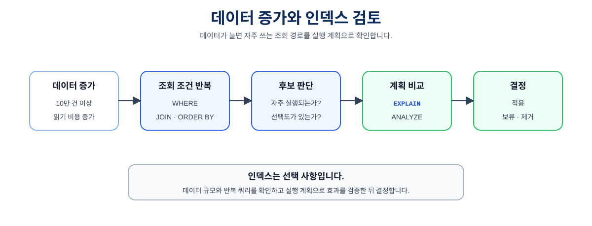

그림 10-1 데이터 증가와 인덱스 검토

---

## 2. 실습 파일과 실행 순서

```text
code/chapter10/
├── 01_performance_lab_schema.sql
├── 02_performance_lab_seed.sql
├── 03_baseline_explain.sql
├── 04_create_candidate_indexes.sql
├── 05_after_index_explain.sql
├── 06_index_review.sql
├── 07_result_validation.sql
├── reset_performance_lab.sql
├── index_performance_practice.sql
└── README.md
```

권장 실행 순서는 다음과 같습니다.

```text
01 사전 조건 검사·스키마 생성
→ 02 대량 데이터 생성·IDENTITY 조정·ANALYZE
→ 03 후보 인덱스가 없는 기준 계획 기록
→ 04 세 실험 후보 인덱스 생성
→ 05 같은 SQL의 사후 계획 기록
→ 06 자동·수동 인덱스와 사용 통계 검토
→ 07 결과 행·데이터 상태 자동 검증
```

`index_performance_practice.sql`은 기존 링크 호환용 안내·상태 확인 파일입니다.

모든 파일은 다음 위치를 확인합니다.

```sql
SELECT current_database();
SELECT current_schema();
SHOW search_path;
```

모든 객체를 `performance_lab.students`처럼 스키마 한정 이름으로 사용하므로 `current_schema()`가 `performance_lab`일 필요는 없습니다.

### 단계별 상태 보호

```text
01 실행 전
- ai_database_book
- course_project.enrollments 5행
- performance_lab 미생성

02 실행 전
- 네 테이블 존재
- 네 테이블 모두 비어 있음
- 실험 후보 인덱스 없음

03 실행 전
- 기준 행 수 일치
- 실험 후보 인덱스 0개

04 실행 전
- 기준 계획 기록 완료
- 실험 후보 인덱스 0개

05·06·07 실행 전
- 실험 후보 인덱스 3개
```

조건이 맞지 않으면 SQL 파일이 예외를 발생시켜 잘못된 비교를 막습니다.

---

## 3. 기준 데이터와 재현성

기본값은 다음과 같습니다.

| 테이블 | 기본 행 | 자동 생성 행 | 최종 예상 행 |
| --- | ---: | ---: | ---: |
| `students` | 3 | 10,000 | 10,003 |
| `instructors` | 2 | 0 | 2 |
| `courses` | 3 | 2,000 | 2,003 |
| `enrollments` | 5 | 100,000 | 100,005 |

성능 학생은 ID `1001~11000`을 사용합니다. 이메일도 실제 ID와 맞춥니다.

```text
student_id = 5000
email = performance5000@example.com
```

대량 신청 생성식은 학생마다 서로 다른 강의 10개를 배정합니다. 각 강의에는 정확히 50건의 신청이 분포합니다.

주요 기준 결과는 다음과 같습니다.

| 조건 | 기대 행 수 |
| --- | ---: |
| 이메일 `performance5000@example.com` | 1 |
| 제목 `성능 테스트 강의 00500` | 1 |
| `student_id = 5000` | 10 |
| `course_id = 1500` | 50 |
| `course_id = 1500 AND status = '수강중'` | 15 |
| 전체 `status = '수강중'` | 30,001 |

같은 `enrollments` 100,005행을 기준으로 반환 비율을 계산하면 인덱스 후보의 성격이 더 잘 보입니다.

| 조건 | 반환 행 | 대략적인 반환 비율 | 해석 |
| --- | ---: | ---: | --- |
| `student_id = 5000` | 10 | 약 0.010% | 매우 적은 행 선택 |
| `course_id = 1500` | 50 | 약 0.050% | 적은 행 선택 |
| `course_id = 1500 AND status = '수강중'` | 15 | 약 0.015% | 매우 적은 행 선택 |
| `status = '수강중'` | 30,001 | 약 30.0% | 많은 행 반환 |

반환 비율이 낮다고 무조건 인덱스가 선택되는 것은 아니지만, 왜 `student_id`·`course_id` 조건은 인덱스 후보가 되고 `status` 단독 조건은 `Seq Scan`이 합리적일 수 있는지 설명하는 중요한 단서입니다. 선택도뿐 아니라 테이블 크기, 필요한 컬럼, 정렬, 캐시와 비용 추정도 함께 봅니다.

PC 성능에 따라 데이터 생성 시간이 달라질 수 있습니다. 생성 건수를 줄이면 PostgreSQL이 인덱스보다 `Seq Scan`을 선택할 가능성이 커지고, 이 장의 기대 행 수와 자동 검증 SQL도 함께 수정해야 합니다.

---

## 4. 명시적 ID와 IDENTITY 시작값

실습은 관계와 기준값을 쉽게 재현하기 위해 ID를 직접 입력합니다.

```text
students 최대 ID      11000
instructors 최대 ID     202
courses 최대 ID        3000
enrollments 최대 ID  110000
```

`GENERATED BY DEFAULT AS IDENTITY`는 명시적 값을 허용하지만 내부 시퀀스의 다음 번호를 자동으로 맞추지는 않습니다. 따라서 샘플 입력 후 다음 시작값을 조정합니다.

```sql
ALTER TABLE performance_lab.students
    ALTER COLUMN id RESTART WITH 11001;

ALTER TABLE performance_lab.instructors
    ALTER COLUMN id RESTART WITH 203;

ALTER TABLE performance_lab.courses
    ALTER COLUMN id RESTART WITH 3001;

ALTER TABLE performance_lab.enrollments
    ALTER COLUMN id RESTART WITH 110001;
```

IDENTITY 번호는 행 수나 빈틈없는 업무 순번이 아닙니다.

---

## 5. 인덱스가 필요한 이유

다음 SQL은 이메일이 일치하는 학생 한 명을 찾습니다.

```sql
SELECT id, name, email
FROM performance_lab.students
WHERE email = 'performance5000@example.com';
```

학생이 10,003명이라면 매번 모든 행을 읽는 것보다 이메일 값이 정렬된 보조 구조에서 위치를 찾는 것이 유리할 수 있습니다.

인덱스는 일반적으로 다음 정보를 유지합니다.

```text
인덱스 키 값
→ 원본 테이블 행을 찾는 위치 정보
```

PostgreSQL의 기본 `CREATE INDEX`는 B-tree 인덱스를 만듭니다.

```sql
CREATE INDEX idx_performance_courses_title
ON performance_lab.courses(title);
```

B-tree는 정확 일치, 범위 조건과 정렬 등 다양한 일반 조회에 사용할 수 있습니다. 전문 검색, 배열, JSON, 공간, 벡터 검색에는 다른 인덱스 유형이 필요할 수 있습니다.

---

## 6. 자동 인덱스와 수동 인덱스를 먼저 구분한다

PostgreSQL은 기본키와 고유 제약조건을 유지하기 위해 인덱스를 자동 생성합니다.

| 구조 | 인덱스 자동 생성 | 이 장의 처리 |
| --- | --- | --- |
| `PRIMARY KEY` | 고유 인덱스 생성 | 같은 컬럼에 다시 만들지 않음 |
| `UNIQUE` | 고유 인덱스 생성 | 기존 인덱스를 먼저 확인 |
| 자식 테이블의 `FOREIGN KEY` | 자동 생성하지 않음 | 조회·삭제 패턴에 따라 검토 |
| 일반 컬럼 | 자동 생성하지 않음 | 실제 SQL을 기준으로 검토 |

현재 인덱스는 다음 SQL로 확인합니다.

```sql
SELECT
    schemaname,
    tablename,
    indexname,
    indexdef
FROM pg_indexes
WHERE schemaname = 'performance_lab'
ORDER BY tablename, indexname;
```

`students.email`과 `instructors.email`은 `UNIQUE`이므로 이미 고유 인덱스가 있습니다. AI가 다음 인덱스를 추천해도 바로 만들지 않습니다.

```sql
-- UNIQUE 자동 인덱스와 중복 가능성이 큼
CREATE INDEX idx_students_email
ON performance_lab.students(email);
```

중요한 것은 이름이 아니라 **키 컬럼, 순서, 조건과 역할이 기존 인덱스와 겹치는지**입니다.

외래키 자식 컬럼 인덱스는 외래키 정확성을 위해 반드시 필요한 구조는 아닙니다. 다만 JOIN, 부모 행 삭제와 부모 키 변경 시 자식 행을 찾는 비용을 줄일 수 있습니다.

---

## 7. 통계는 기준 계획 전에 한 번 수집한다

대량 데이터 입력 후 다음 명령으로 옵티마이저 통계를 수집합니다.

```sql
ANALYZE performance_lab.students;
ANALYZE performance_lab.instructors;
ANALYZE performance_lab.courses;
ANALYZE performance_lab.enrollments;
```

`ANALYZE table_name`과 `EXPLAIN ANALYZE query`는 역할이 다릅니다.

```text
ANALYZE table
→ 옵티마이저가 사용할 데이터 분포 통계 수집

EXPLAIN ANALYZE query
→ 쿼리를 실제 실행하고 계획의 실제 수치 측정
```

이 장에서는 데이터 생성 후 통계를 한 번 수집합니다. 후보 인덱스를 만든 뒤에는 다시 `ANALYZE`하지 않습니다.

```text
같은 데이터
+ 같은 테이블 통계
+ 같은 SQL
+ 후보 인덱스 존재 여부만 변경
```

`ANALYZE`는 통계 표본을 다시 수집할 수 있으므로 인덱스 생성 후 다시 실행하면 계획 차이에 새로운 통계 표본의 영향이 섞일 수 있습니다. 운영에서는 통계 갱신이 중요하지만, 이 실험에서는 비교 조건을 통제하는 것이 목적입니다.

---

## 8. 실행 계획을 읽는 기본 방법

`EXPLAIN`은 쿼리를 실제 실행하지 않고 예상 계획을 보여 줍니다.

```sql
EXPLAIN
SELECT ...;
```

`EXPLAIN ANALYZE`는 쿼리를 실제로 실행하고 실제 행 수와 시간을 표시합니다.

```sql
EXPLAIN (ANALYZE, BUFFERS)
SELECT ...;
```

| 항목 | 의미 | 주의점 |
| --- | --- | --- |
| 계획 노드 | 행을 찾고 연결·정렬하는 방법 | 한 노드만 보고 결론 내리지 않음 |
| `cost` | 옵티마이저의 상대적 예상 비용 | 밀리초가 아님 |
| `rows` | 예상 반환 행 수 | 통계 기반 추정 |
| `actual rows` | 실제 반환 행 수 | 예상과 차이 확인 |
| `actual time` | 실제 실행 시간 범위 | 캐시·장비 영향을 받음 |
| `loops` | 해당 노드 반복 횟수 | 실제 작업량 해석에 중요 |
| `Buffers` | 블록 hit·read 등 | 읽기 작업량 비교에 유용 |
| `Filter` | 행을 읽은 뒤 적용한 조건 | 제거된 행 수 확인 |
| `Index Cond` | 인덱스 탐색에 사용된 조건 | 실제 인덱스 사용 근거 |
| `Sort` | 별도 정렬 작업 | 메모리·디스크 사용 확인 |

이 장에서는 `EXPLAIN (ANALYZE, BUFFERS)`를 `SELECT`에만 사용합니다. 변경 SQL에 사용하면 실제 데이터가 변경될 수 있습니다.

한 번의 실행 시간만으로 결론을 내리지 않습니다. 같은 환경에서 여러 번 관찰하고 계획, Buffers와 행 수를 함께 비교합니다.

이 실습에서는 `enable_seqscan`, `enable_indexscan`, `enable_bitmapscan`을 모두 기본값 `on`으로 둡니다. `SET enable_seqscan = off`처럼 특정 계획을 강제로 피하게 만들면 **인덱스가 존재할 때 실제 옵티마이저가 자발적으로 선택하는지**를 비교할 수 없습니다. 이런 설정은 진단용 가설 실험에는 쓸 수 있지만, 인덱스 효과의 최종 증거로 사용하지 않습니다.

### 실행 계획과 결과 행은 다르다

`EXPLAIN ANALYZE`는 쿼리를 실제 실행하지만 일반 조회 결과 대신 실행 계획을 출력합니다. 결과 내용과 건수가 같은지는 별도 SQL로 확인해야 합니다.

```sql
SELECT COUNT(*)
FROM performance_lab.enrollments
WHERE course_id = 1500
  AND status = '수강중';
```

`07_result_validation.sql`은 기준 SQL의 기대 행 수와 데이터 상태를 자동으로 판정합니다.

---

## 9. Seq Scan, Index Scan과 Bitmap Scan

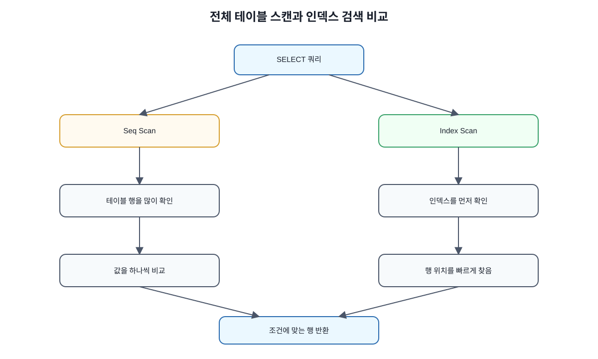

그림 10-2 Seq Scan과 Index Scan의 검색 경로

### Seq Scan

테이블의 행을 순서대로 읽고 조건을 확인합니다.

```text
작은 테이블
반환 비율이 높은 조건
대부분의 행이 필요한 집계
인덱스 탐색과 원본 행 접근 비용이 더 큰 경우
```

이런 상황에서는 인덱스가 있어도 `Seq Scan`이 합리적입니다.

### Index Scan

인덱스에서 조건에 맞는 키를 찾은 뒤 원본 행에 접근합니다.

```text
소수 행을 선택하는 정확 일치
LIMIT와 정렬 방향이 맞는 조회
인덱스 탐색 비용보다 절약되는 읽기가 큰 경우
```

### Bitmap Index Scan + Bitmap Heap Scan

여러 인덱스 위치를 비트맵으로 모은 뒤 필요한 테이블 블록을 묶어 읽습니다. 한 행보다 많은 행이 필요하지만 전체 테이블을 읽을 정도는 아닐 때 선택될 수 있습니다.

실행 계획 노드는 정답표가 아닙니다. 데이터 규모, 선택도, 캐시와 설정에 따라 달라질 수 있습니다.

---

## 10. WHERE 조건에서 인덱스 후보 찾기

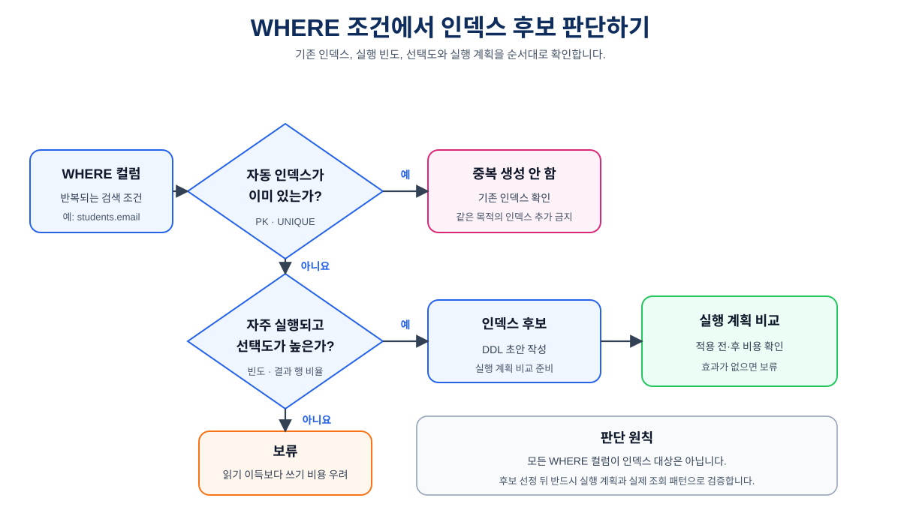

그림 10-3 WHERE 조건에서 인덱스 후보 판단하기

```text
이 SQL은 실제로 자주 실행되는가?
테이블이 충분히 큰가?
조건이 전체 행 중 비교적 적은 행을 선택하는가?
기존 PK·UNIQUE·수동 인덱스로 해결되는가?
쓰기 비용과 저장 공간을 감수할 가치가 있는가?
```

### 이메일 검색

```sql
SELECT id, name, email
FROM performance_lab.students
WHERE email = 'performance5000@example.com';
```

`email`은 `UNIQUE` 자동 인덱스를 사용하므로 새 수동 인덱스가 필요하지 않습니다.

### 강의 제목 정확 일치

```sql
SELECT id, title, level, price
FROM performance_lab.courses
WHERE title = '성능 테스트 강의 00500';
```

`title`에는 자동 인덱스가 없고 한 행을 찾는 선택도가 높은 조건이므로 실험 후보입니다.

```sql
CREATE INDEX idx_performance_courses_title
ON performance_lab.courses(title);
```

`LIKE '%데이터%'`처럼 문자열 앞에 와일드카드가 있는 검색은 일반 B-tree 인덱스를 같은 방식으로 활용하지 못할 수 있습니다. 이 장에서는 정확 일치 검색에 집중합니다.

---

## 11. JOIN과 외래키 자식 컬럼

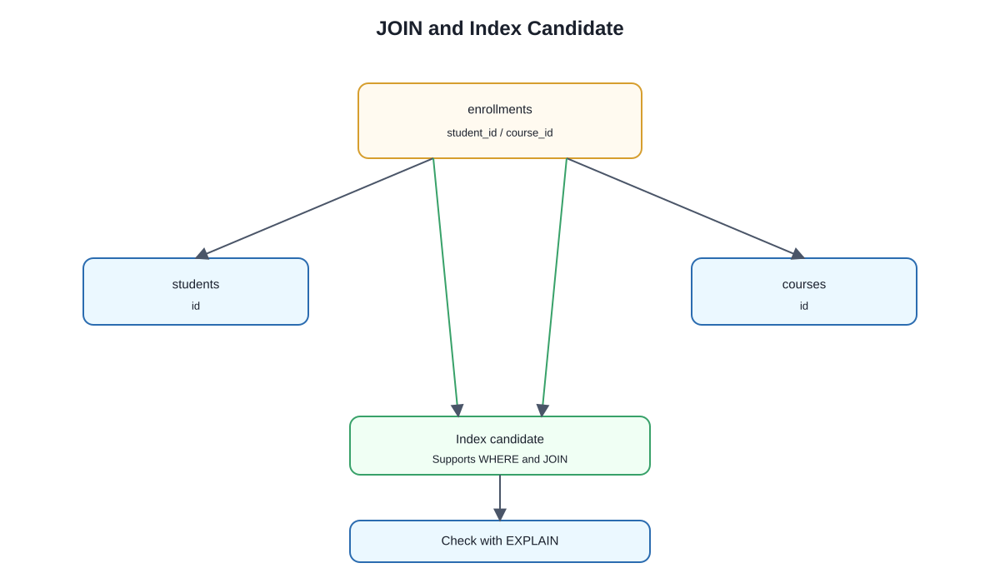

그림 10-4 JOIN 관계와 외래키 인덱스 후보

`students.id`와 `courses.id`는 기본키이므로 자동 인덱스가 있습니다. 반면 다음 자식 FK 컬럼에는 자동 인덱스가 없습니다.

```text
enrollments.student_id
enrollments.course_id
```

학생 한 명의 신청 목록을 자주 조회한다면 다음 인덱스를 검토할 수 있습니다.

```sql
CREATE INDEX idx_performance_enrollments_student_id
ON performance_lab.enrollments(student_id);
```

비교 SQL:

```sql
SELECT
    e.id,
    s.name AS student_name,
    c.title AS course_title,
    e.status,
    e.recorded_amount
FROM performance_lab.enrollments AS e
JOIN performance_lab.students AS s
    ON s.id = e.student_id
JOIN performance_lab.courses AS c
    ON c.id = e.course_id
WHERE e.student_id = 5000;
```

기대 결과는 10행입니다.

모든 FK에 기계적으로 인덱스를 추가하지 않습니다. 실제 읽기·변경 패턴과 테이블 크기를 확인합니다.

---

## 12. 복합 인덱스, 선두 컬럼과 PostgreSQL 18+ Skip Scan

강의별 특정 상태의 신청을 자주 조회한다고 가정합니다.

```sql
SELECT id, student_id, course_id, status, recorded_amount
FROM performance_lab.enrollments
WHERE course_id = 1500
  AND status = '수강중';
```

다음 복합 인덱스가 실험 후보입니다.

```sql
CREATE INDEX idx_performance_enrollments_course_status
ON performance_lab.enrollments(course_id, status);
```

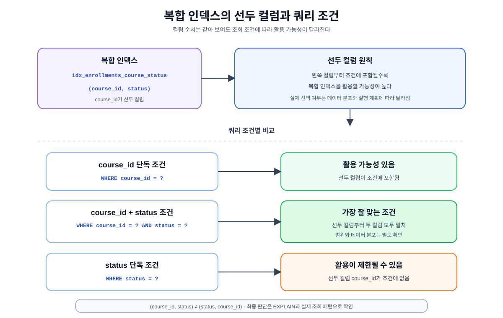

그림 10-5 복합 인덱스의 선두 컬럼과 쿼리 조건

일반적인 B-tree 복합 인덱스에서는 왼쪽부터 이어지는 컬럼 조건이 중요합니다.

| 조건 | `(course_id, status)` 활용 가능성 |
| --- | --- |
| `course_id = 1500` | 선두 컬럼 사용 가능 |
| `course_id = 1500 AND status = '수강중'` | 두 컬럼 모두 조건에 사용 가능 |
| `status = '수강중'` | 일반적으로 제한적이며 반환 비율도 높음 |

선두 컬럼 조건이 없다고 인덱스가 절대 사용되지 않는 것은 아닙니다. PostgreSQL은 선두 컬럼의 고유값 수와 비용이 적절하면 **PostgreSQL 18+ Skip Scan**을 선택할 수 있습니다. 다만 이 데이터에서는 `course_id` 고유값이 약 2,000개이고 `수강중` 행도 30,001건이므로 `Seq Scan`이 더 합리적일 가능성이 큽니다.

실제 선택은 실행 계획으로 확인합니다.

```text
실제 WHERE·JOIN 조건의 조합
단독 조건으로 자주 쓰이는 선두 컬럼
각 컬럼의 분포와 선택도
정렬 요구
기존 인덱스와의 중복
```

이 장에서는 `course_id` 단일 인덱스를 별도로 만들지 않습니다. 복합 인덱스가 선두 컬럼 조건에도 사용되는지 측정하고 역할 중복 가능성을 검토합니다.

---

## 13. ORDER BY, LIMIT와 인덱스

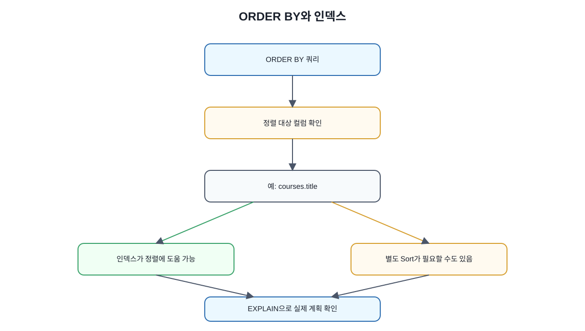

그림 10-6 ORDER BY에서 인덱스가 사용되는 흐름

`courses(title)` 인덱스를 만든 뒤 다음 두 SQL을 비교합니다.

```sql
SELECT id, title, level, price
FROM performance_lab.courses
ORDER BY title;
```

```sql
SELECT id, title, level, price
FROM performance_lab.courses
ORDER BY title
LIMIT 20;
```

전체 2,003행을 반환하는 첫 SQL에서는 `Seq Scan + Sort`가 합리적일 수 있습니다. 두 번째 SQL은 정렬 순서의 앞부분 20행만 필요하므로 인덱스 순서대로 읽는 계획이 유리할 가능성이 있습니다.

인덱스가 있다는 이유만으로 별도 `Sort`가 반드시 사라지는 것은 아닙니다. 정렬 방향, NULL 순서, 선택 컬럼, 반환 행 수와 비용에 따라 달라집니다.

---

## 14. 인덱스 전후를 같은 조건으로 비교한다

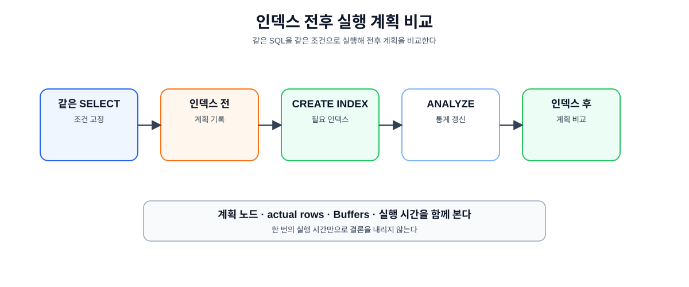

그림 10-7 인덱스 전후 실행 계획 비교

```text
1. 후보 인덱스가 없는지 자동 검사한다.
2. 기준 SQL을 EXPLAIN (ANALYZE, BUFFERS)로 실행한다.
3. 계획 노드·rows·actual rows·Buffers·Execution Time을 기록한다.
4. 세 실험 후보 인덱스만 생성한다.
5. 데이터와 테이블 통계는 변경하지 않는다.
6. 완전히 같은 SQL을 다시 실행한다.
7. 별도 검증 SQL로 결과 행과 데이터 상태를 확인한다.
8. 읽기 감소가 쓰기 비용을 감수할 만큼 의미 있는지 판단한다.
```

| 항목 | 생성 전 | 생성 후 | 해석 |
| --- | --- | --- | --- |
| 주요 계획 노드 |  |  |  |
| 예상 rows |  |  |  |
| actual rows |  |  |  |
| Buffers hit/read |  |  |  |
| Planning Time |  |  |  |
| Execution Time |  |  |  |
| 결과 행 동일 |  |  |  |

실행 시간이 짧아졌다는 이유 하나만으로 승인하지 않습니다. 캐시 영향이 있으므로 읽은 블록 수와 탐색 경로도 함께 봅니다.

---

## 15. 예상 행 수와 실제 행 수의 차이

옵티마이저는 통계를 이용해 각 단계의 행 수를 예상합니다.

```text
rows = 예상값
actual rows = 실제값
```

두 값이 크게 다르면 상위 JOIN 방식이나 스캔 선택에도 영향을 줄 수 있습니다.

```text
ANALYZE가 최근 실행되었는가?
데이터 분포가 심하게 치우쳐 있는가?
컬럼 간 상관관계가 큰가?
조건 값이 매우 흔하거나 매우 드문가?
통계 표본이 충분한가?
```

입문 단계에서는 먼저 통계 수집 시점과 데이터 분포를 확인합니다. 확장 통계와 세밀한 통계 목표 설정은 이 장의 범위를 넘습니다.

---

## 16. 인덱스의 비용

인덱스는 읽기를 줄일 수 있지만 무료가 아닙니다.

| 비용 | 설명 |
| --- | --- |
| 저장 공간 | 테이블과 별도로 인덱스 구조 저장 |
| INSERT 비용 | 새 키를 인덱스에도 추가 |
| UPDATE 비용 | 인덱스 키 변경 시 구조 갱신 |
| DELETE 비용 | 인덱스 항목도 정리 |
| VACUUM·유지보수 | 변경이 많은 인덱스 관리 필요 |
| 캐시 경쟁 | 여러 인덱스가 메모리 사용 |
| 계획·운영 복잡성 | 비슷한 인덱스가 여러 개면 관리 어려움 |

읽기가 매우 드문 컬럼이나 반환 비율이 높은 상태 컬럼마다 인덱스를 만드는 것은 비용만 늘릴 수 있습니다.

---

## 17. 실습의 CREATE INDEX와 운영 환경

이 장은 독립된 실험 스키마이므로 일반 `CREATE INDEX`를 사용하고 세 인덱스를 하나의 트랜잭션에서 생성합니다.

운영 중인 큰 테이블에서는 일반 인덱스 생성이 쓰기 작업에 영향을 줄 수 있습니다.

```text
실습 DB
→ 일반 CREATE INDEX
→ 짧고 통제된 실험

운영 DB
→ 잠금 영향·소요 시간·추가 디스크 공간 검토
→ 필요하면 CREATE INDEX CONCURRENTLY 검토
→ 실패 후 INVALID 인덱스 확인
```

`CREATE INDEX CONCURRENTLY`는 일반 생성보다 더 오래 걸리고 여러 단계를 수행하지만 동시 쓰기를 막는 영향을 줄이는 데 사용할 수 있습니다. 다만 트랜잭션 블록 안에서는 실행할 수 없습니다.

AI가 운영 인덱스 생성 SQL을 제안했다면 다음을 확인합니다.

```text
일반 CREATE INDEX로 가능한 점검 시간인가?
CONCURRENTLY가 필요한가?
트랜잭션 블록 안에서 실행하려는가?
실패 시 남은 INVALID 인덱스 처리 계획이 있는가?
```

---

## 18. 중복 인덱스와 제거 판단

전후 측정을 위한 실험 후보는 다음 세 개입니다.

```text
idx_performance_courses_title
idx_performance_enrollments_student_id
idx_performance_enrollments_course_status
```

아직 “최종 적용 인덱스”가 아닙니다. 최종 판단은 워크북의 측정 결과에 따라 달라집니다.

중복 가능성 예:

```text
students.email UNIQUE 자동 인덱스
+ 별도 students(email) 인덱스
→ 역할 중복 가능성

(course_id) 단일 인덱스
+ (course_id, status) 복합 인덱스
→ 선두 컬럼 역할 중복 가능성
```

복합 인덱스가 단일 인덱스를 항상 완전히 대체한다고 단정하지 않습니다. 인덱스 크기, 쿼리 형태, 정렬과 실제 계획을 비교합니다.

```sql
DROP INDEX performance_lab.idx_performance_courses_title;
```

`06_index_review.sql`은 인덱스를 자동 삭제하지 않습니다. 제거 SQL은 주석 상태로 제공하며 측정 기록을 검토한 뒤 선택합니다.

---

## 19. 인덱스 사용 통계를 해석할 때 주의한다

PostgreSQL은 `pg_stat_user_indexes`에서 인덱스 사용 통계를 제공합니다.

```sql
SELECT
    schemaname,
    relname AS table_name,
    indexrelname AS index_name,
    idx_scan,
    pg_size_pretty(pg_relation_size(indexrelid)) AS index_size
FROM pg_stat_user_indexes
WHERE schemaname = 'performance_lab'
ORDER BY relname, indexrelname;
```

`idx_scan = 0`이라고 즉시 삭제하면 안 됩니다.

```text
통계가 방금 초기화되었을 수 있다.
해당 워크로드가 아직 실행되지 않았을 수 있다.
월말·배치처럼 드물지만 중요한 조회일 수 있다.
PK·UNIQUE 인덱스는 제약조건 유지에 직접 필요하다.
FK 자식 인덱스는 JOIN·부모 변경 성능 근거를 더 확인해야 한다.
```

`idx_scan`은 사용자 SQL 실행 횟수와 항상 같은 값이 아닙니다. 실행 계획 내부의 인덱스 탐색 방식에 따라 증가할 수 있으므로 충분한 기간과 다른 통계도 함께 봅니다.

---

## 20. AI 추천 인덱스 검토

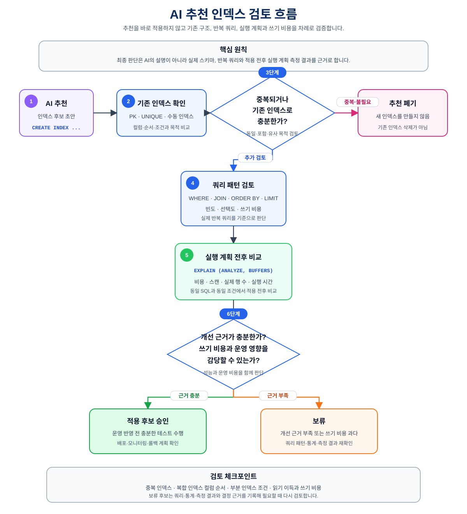

그림 10-8 AI 추천 인덱스 검토 흐름

AI에게 단순히 “인덱스를 추천해 주세요”라고 요청하지 않습니다.

```text
PostgreSQL performance_lab.enrollments는 100,005행입니다.
다음 조회가 반복됩니다.

[실제 SQL]

현재 인덱스 목록:
[pg_indexes 결과]

인덱스 후보를 제안하되 다음을 포함해 주세요.
1. 쿼리의 기준 행과 조건
2. 기존 PK·UNIQUE·수동 인덱스와 중복 여부
3. 컬럼 순서와 PostgreSQL 18+에서의 Skip Scan 가능성 근거
4. 예상되는 읽기 이점
5. INSERT·UPDATE·DELETE 비용
6. EXPLAIN ANALYZE 전후 검증 SQL
7. 결과 동일성 검증 SQL
8. 운영 적용 시 잠금과 CONCURRENTLY 검토
9. 적용·보류·제거 기준
```

| 검토 영역 | 확인 질문 |
| --- | --- |
| 워크로드 | 실제로 반복되는 SQL인가? |
| 규모 | 현재 데이터 규모에서 의미가 있는가? |
| 기존 인덱스 | 자동·수동 인덱스와 겹치지 않는가? |
| 선택도 | 조건이 충분히 적은 행을 선택하는가? |
| 컬럼 순서 | 복합 인덱스 선두 컬럼이 쿼리와 맞는가? |
| 계획 변화 | `Index Cond`, Buffers와 실제 시간이 개선되는가? |
| 결과 행 | 인덱스 전후 의미와 행 수가 같은가? |
| 쓰기 비용 | 읽기 이점이 유지 비용보다 큰가? |
| 운영 생성 | 잠금과 `CONCURRENTLY`를 검토했는가? |
| 범위 | 다른 스키마와 테이블을 변경하지 않는가? |

대표적인 AI 오류:

```text
UNIQUE 자동 인덱스와 같은 인덱스 추천
WHERE에 등장하는 모든 컬럼마다 단일 인덱스 추천
복합 인덱스 컬럼 순서 근거 없음
선두 컬럼이 없으면 절대 사용되지 않는다고 단정
작은 테이블의 Seq Scan을 무조건 문제로 판단
EXPLAIN ANALYZE를 UPDATE·DELETE에 무심코 적용
운영 잠금 영향 없이 일반 CREATE INDEX 실행
실제 계획·결과 비교 없이 성능 향상을 단정
```

---

## 21. 자주 하는 실수

1. 기존 프로젝트 데이터를 성능 데이터로 덮어쓴다. `performance_lab`만 사용합니다.
2. 기준 인덱스가 이미 있는데 생성 전 계획을 측정한다. 단계별 보호 구문을 확인합니다.
3. 인덱스 생성 후 데이터를 바꾸거나 `ANALYZE`를 다시 실행해 비교 조건을 섞는다.
4. 명시적 ID 입력 후 IDENTITY 다음 값도 자동으로 이동한다고 생각한다.
5. 인덱스가 있으면 반드시 `Index Scan`이 나와야 한다고 생각한다.
6. `cost`를 밀리초로 읽는다.
7. FK 자식 컬럼에도 자동 인덱스가 생긴다고 생각한다.
8. `EXPLAIN ANALYZE`가 쿼리를 실제 실행한다는 사실을 잊는다.
9. 실행 계획만 보고 결과 행 동일성을 확인했다고 생각한다.
10. 다른 SQL이나 다른 통계 상태를 전후에 비교한다.
11. 복합 인덱스의 컬럼 순서와 PostgreSQL 18+에서의 Skip Scan 가능성을 단정적으로 해석한다.
12. 실행 시간 한 번만 비교한다.
13. 읽기 성능만 보고 쓰기·저장 비용을 무시한다.
14. 운영 환경에 일반 `CREATE INDEX`를 바로 적용한다.
15. `idx_scan = 0`만 보고 인덱스를 삭제한다.

---

## 22. 스스로 확인하기

1. 작은 `course_project` 대신 `performance_lab`이 필요한 이유는 무엇인가요?
2. 성능 합성 데이터도 활성 신청 중복을 만들지 않도록 한 이유는 무엇인가요?
3. 명시적 ID 입력 뒤 IDENTITY 시작값을 조정하는 이유는 무엇인가요?
4. `PRIMARY KEY`, `UNIQUE`, `FOREIGN KEY`의 자동 인덱스 차이를 설명해 보세요.
5. `Seq Scan`이 합리적인 경우는 언제인가요?
6. `Index Scan`과 `Bitmap Heap Scan`은 어떤 상황에서 선택될 수 있나요?
7. `EXPLAIN`과 `EXPLAIN ANALYZE`의 차이는 무엇인가요?
8. 실행 계획과 실제 결과 행 검증을 분리해야 하는 이유는 무엇인가요?
9. 인덱스 생성 후 `ANALYZE`를 다시 하지 않은 이유는 무엇인가요?
10. `(course_id, status)`가 `status` 단독 조건에도 사용될 가능성이 전혀 없다고 단정하면 안 되는 이유는 무엇인가요?
11. `ORDER BY title LIMIT 20`에서 인덱스가 유리할 수 있는 이유는 무엇인가요?
12. 예상 rows와 actual rows의 차이가 큰 경우 무엇을 확인해야 하나요?
13. 자동 UNIQUE 인덱스와 중복되는 수동 인덱스를 피해야 하는 이유는 무엇인가요?
14. 일반 `CREATE INDEX`와 `CREATE INDEX CONCURRENTLY`는 어떤 상황에서 검토하나요?
15. `idx_scan = 0`만으로 삭제를 결정하면 안 되는 이유는 무엇인가요?
16. AI 추천 인덱스를 승인하기 전에 필요한 증거를 설명해 보세요.

측정값과 판단을 기록하려면 `book/chapter10/chapter10_activity.md`의 워크북을 사용합니다.

---

## 23. 권장 해설

### 자동 인덱스

```text
PRIMARY KEY와 UNIQUE는 제약조건을 유지하기 위한 고유 인덱스를 자동 생성한다.
FOREIGN KEY 자식 컬럼에는 자동 인덱스가 생성되지 않는다.
```

### 스캔 방식

```text
Seq Scan: 많은 행이 필요하거나 테이블이 작을 때 합리적
Index Scan: 선택도가 높은 조건에서 소수 행을 찾을 때 유리 가능
Bitmap Scan: 전체보다는 적지만 여러 행과 블록이 필요할 때 선택 가능
```

### 실행 계획

```text
cost는 상대 비용이며 밀리초가 아니다.
rows는 예상값, actual rows는 실제값이다.
Filter는 읽은 뒤 조건 적용, Index Cond는 인덱스 탐색 조건이다.
EXPLAIN ANALYZE는 실제 실행하지만 일반 결과 행 대신 계획을 출력한다.
```

### 실험 통제

```text
02에서 데이터를 생성하고 ANALYZE한다.
03에서 후보 인덱스 없이 기준 계획을 기록한다.
04에서는 인덱스만 생성하고 통계는 다시 수집하지 않는다.
05에서 같은 SQL을 다시 측정한다.
07에서 결과 행과 기준 상태를 자동 검증한다.
```

### 복합 인덱스

```text
선두 컬럼 조건이 일반적으로 중요하다.
후행 컬럼 단독 조건은 제한적일 수 있다.
PostgreSQL 18 이상은 데이터 분포와 비용에 따라 Skip Scan을 선택할 수 있으므로 실제 계획을 확인한다.
```

### 운영 인덱스 생성

```text
일반 CREATE INDEX는 실습과 점검 시간에 적합하다.
운영에서는 쓰기 잠금 영향을 검토하고 필요하면 CONCURRENTLY를 고려한다.
CONCURRENTLY는 트랜잭션 블록 안에서 실행할 수 없고 실패한 INVALID 인덱스를 확인해야 한다.
```

### 사용 통계

```text
idx_scan=0은 즉시 삭제 명령이 아니다.
통계 기간, 제약조건 역할, 드문 중요 워크로드와 인덱스 크기를 함께 본다.
```

---

## 24. 핵심 정리

```text
1. 성능 실험은 기존 프로젝트와 분리된 performance_lab에서 수행한다.
2. 합성 데이터도 업무 의미와 검증 가능한 기준 상태를 가진다.
3. 명시적 ID 뒤 IDENTITY 시작값을 조정한다.
4. 인덱스를 만들기 전에 실제 쿼리·데이터 규모·기존 인덱스를 확인한다.
5. PRIMARY KEY와 UNIQUE는 자동 인덱스를 만들지만 FK 자식 컬럼은 그렇지 않다.
6. Seq Scan은 항상 나쁜 계획이 아니며 Index Scan도 항상 최선은 아니다.
7. 기준과 사후 측정은 같은 데이터·통계·SQL과 기본 플래너 설정을 사용한다.
8. `enable_seqscan=off` 같은 강제 설정은 최종 성능 증거로 사용하지 않는다.
9. 실행 계획과 결과 행 동일성은 별도로 검증한다.
10. 복합 인덱스는 선두 컬럼과 PostgreSQL 18+에서의 Skip Scan 가능성을 실행 계획으로 확인한다.
11. 인덱스는 조회를 줄이는 대신 저장 공간과 쓰기 비용을 증가시킨다.
12. 운영 인덱스 생성은 잠금과 CONCURRENTLY를 검토한다.
13. AI 추천은 실행 계획과 검증 결과가 있을 때만 적용 후보가 된다.
```

이 장에서 기억할 문장은 다음과 같습니다.

```text
인덱스의 가치는 존재 여부가 아니라,
통제된 실험에서 줄인 읽기 비용과 추가한 유지 비용으로 판단한다.
```

---

## 25. 다음 장에서는

Chapter 11에서는 데이터베이스를 안전하게 보호하고 장애 후 복구하는 방법을 다룹니다.

```text
최소 권한
역할과 사용자
비밀번호·접속 정보 보호
논리 백업과 복원
백업 파일 검증
복구 절차와 복구 가능성
AI가 만든 보안·백업 명령 검토
```

빠른 조회도 중요하지만, 데이터베이스는 허가된 사용자만 접근하고 필요한 시점에 복구할 수 있어야 합니다.

---

# Chapter 11. 데이터베이스를 안전하게 지키고 복구하는 방법

---

## 이 장에서 살펴볼 내용

Chapter 10에서는 별도의 `performance_lab`에서 실행 계획과 인덱스 효과를 검증했습니다. 그러나 데이터베이스가 빨라도 접근 권한이 과도하거나, 접속 정보가 노출되거나, 백업 파일을 실제로 복원할 수 없다면 안전한 시스템이라고 할 수 없습니다.

이번 장은 **PostgreSQL 16**을 기준으로 보안과 복구를 하나의 운영 흐름으로 연결합니다.

```text
보호 대상과 위험 식별
→ 로그인 역할·권한 역할·소유 역할 분리
→ 최소 권한 작업 행렬 작성
→ GRANT·REVOKE와 유효 권한 검증
→ PUBLIC·멤버십·소유권 경로 확인
→ 실제 허용·차단 동작 검증
→ 비밀 정보와 입력값 보호
→ 백업 계정·범위·의존성·RLS·버전 확인
→ custom archive 백업
→ 별도 DB에 원자적으로 복원
→ 구조·데이터·소유권·권한 2단계 검증
→ RPO·RTO와 복구 기록 갱신
```

이 장에서는 다음 내용을 다룹니다.

- 인증, 권한 부여, 객체 소유권과 감사의 차이
- PostgreSQL Role, `LOGIN`, `NOLOGIN`과 역할 멤버십
- PostgreSQL 16의 membership `INHERIT`, `SET`, `ADMIN` 옵션
- 데이터베이스·스키마·테이블·컬럼·시퀀스 권한
- 직접 권한, `PUBLIC`, 역할 멤버십과 유효 권한
- 현재 객체 권한과 미래 객체 Default Privileges
- 개발·테스트·운영 환경과 계정 분리
- 비밀번호·접속 URL·로그·password file·백업 파일 보호
- SQL Injection과 파라미터 바인딩
- `pg_dump`, `pg_restore`, `psql` 기반 논리 백업·복원
- 백업 계정 권한, RLS와 스키마 외부 의존성
- custom archive의 owner·ACL 메타데이터와 복원 옵션
- 도구·서버 버전 호환성
- 백업 파일 목록·해시·별도 DB 복원 검증
- RPO, RTO와 복구 실행 기록
- AI가 만든 보안·백업 명령 검토

> **핵심 원칙**
>
> 보안은 필요한 작업만 허용하고 실제 허용·차단 결과를 확인하는 일입니다. 백업은 파일을 만드는 데서 끝나지 않고 별도 환경에서 복원에 성공해야 의미가 있습니다.

---

## 1. 보안 통제와 복구 준비는 함께 설계한다

보안은 하나의 기능이 아니라 여러 통제의 조합입니다.

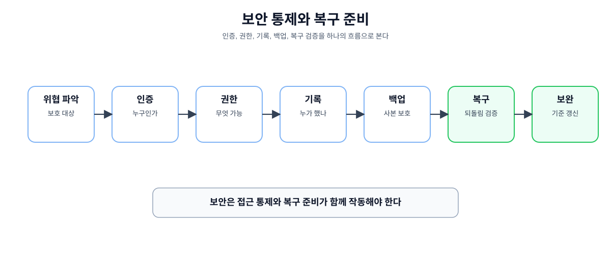

그림 11-1 보안 통제와 복구 준비

| 영역 | 핵심 질문 | 예시 |
| --- | --- | --- |
| 인증 | 접속을 시도하는 주체는 누구인가? | 비밀번호, 인증서, 외부 인증 |
| 권한 부여 | 인증된 주체가 무엇을 할 수 있는가? | `SELECT`, `INSERT`, `UPDATE` |
| 소유권 | 객체 정의와 권한을 관리할 주체는 누구인가? | 테이블 소유 역할 |
| 입력 보호 | 외부 입력이 SQL 구조를 바꿀 수 있는가? | 파라미터 바인딩 |
| 비밀 보호 | 접속 정보와 백업 파일이 노출되지 않는가? | 비밀 저장소, 접근 통제 |
| 감사·기록 | 누가 언제 무엇을 실행했는가? | 접속 로그, 변경 기록 |
| 복구 | 장애·실수 후 필요한 상태로 돌아갈 수 있는가? | 백업, 복원 시험, Runbook |

인증에 성공했다고 모든 테이블을 읽을 수 있는 것은 아닙니다. 애플리케이션 접속 계정을 객체 소유자로 사용하면 `DROP`, `ALTER`와 권한 재부여까지 가능한 범위가 커질 수 있습니다.

보안과 복구도 분리해서 생각하면 안 됩니다. 권한을 지나치게 제한해 백업 계정이 필요한 데이터를 읽지 못하면 복구 준비가 실패하고, 반대로 백업 계정에 과도한 권한을 주면 보안 위험이 커집니다.

---

## 2. 기존 프로젝트를 보호하는 Chapter 11 구조

Chapter 11은 앞 장의 다음 객체를 삭제하거나 변경하지 않습니다.

```text
course_project
transaction_lab
performance_lab
public
```

`transaction_lab`과 `performance_lab`은 실행 환경에 따라 이미 초기화되어 없을 수도 있습니다. Chapter 11은 이 두 스키마의 존재를 전제하지 않으며, 존재한다면 변경하지 않습니다.

Chapter 11의 필수 시작 기준은 Chapter 07·08에서 확정한 `course_project`입니다.

```text
students / instructors / courses / enrollments = 3 / 2 / 3 / 5
상태 = 신청 2 / 수강중 1 / 완료 1 / 취소 1
course_project.enrollments.recorded_amount = NUMERIC(12,0)
전체 recorded_amount = 590000
활성 신청 = 3건 / 340000
취소 제외 이력 = 4건 / 440000
1001 = 완료 / 100000
1004 = 취소 / 150000
1005 = 신청 / 120000
uq_course_enrollments_active 존재
Chapter 07 명명 제약조건 15개 / NOT NULL 열 20개 유지
```

별도의 실습 스키마를 사용합니다.

```text
security_lab.students
security_lab.courses
security_lab.enrollments
```

Role은 데이터베이스 하나가 아니라 PostgreSQL 클러스터 전역에 영향을 줄 수 있습니다. 따라서 역할 생성·삭제와 `GRANT`, `REVOKE` 예시는 기본적으로 주석 상태로 제공합니다.

```text
code/chapter11/
├── 01_security_lab_schema.sql
├── 02_security_lab_seed.sql
├── 03_role_permission_plan.sql
├── 04_permission_checks.sql
├── 05_permission_behavior_tests.sql
├── 05_restore_validation.sql
├── 06_restore_validation.sql
├── BACKUP_RESTORE_RUNBOOK.md
├── reset_security_lab.sql
├── security_backup_check.sql
└── README.md
```

권장 실행 순서는 다음과 같습니다.

```text
01 스키마·테이블 생성
→ 02 정상 샘플·IDENTITY 조정
→ 03 역할·권한 계획에서 필요한 문장만 선택 적용
→ 04 PUBLIC·ACL·멤버십·유효 권한 확인
→ 05 허용·차단 동작 선택 실습
→ 터미널에서 custom archive 백업
→ 별도 DB 생성·원자적 복원
→ 복원 DB에서 06 구조·데이터·소유권 검증
→ 역할 재적용 후 04·05 권한 재검증
→ BACKUP_RESTORE_RUNBOOK.md 기록
```

`05_restore_validation.sql`은 기존 링크 호환용 안내 파일입니다. 실제 복원 검증은 `06_restore_validation.sql`을 사용합니다.

모든 SQL 파일은 실행 위치를 먼저 확인합니다.

```sql
SELECT current_database();
SELECT current_schema();
SHOW search_path;
```

---

## 3. 보호할 자산과 위협을 먼저 정한다

| 자산 | 예 | 주요 위험 |
| --- | --- | --- |
| 개인정보 | 이름, 이메일 | 과도한 조회, 외부 유출 |
| 인증 정보 | 비밀번호, 토큰, 접속 URL | 계정 탈취 |
| 업무 데이터 | 수강 상태, 기록 금액 | 무단 변경·삭제 |
| 데이터 구조 | 테이블, 제약조건 | 잘못된 `ALTER`, `DROP` |
| 로그 | SQL, 오류, 접속 기록 | 비밀 정보 기록 |
| 백업 파일 | 전체 데이터 사본 | 저장소·공유 경로 노출 |
| 복구 절차 | 계정, 순서, 검증 기준 | 장애 시 복구 지연 |

위험은 외부 공격만 의미하지 않습니다.

```text
관리자의 잘못된 DELETE
개발 계정으로 운영 DB 접속
공개 저장소에 .env 또는 백업 파일 커밋
ALL PRIVILEGES를 가진 앱 계정
복원해 본 적 없는 오래된 백업
RLS 때문에 일부 행만 보이는 계정으로 전체 백업을 시도
AI가 만든 DROP·REVOKE·pg_restore 명령의 무검토 실행
```

보안 설계는 “무엇을 막을까?”보다 “이 역할이 실제로 해야 하는 작업은 무엇인가?”에서 시작하면 더 구체적입니다.

---

## 4. 인증·권한·소유권을 구분한다

PostgreSQL은 데이터베이스 접근 주체와 권한 묶음을 Role로 관리합니다.

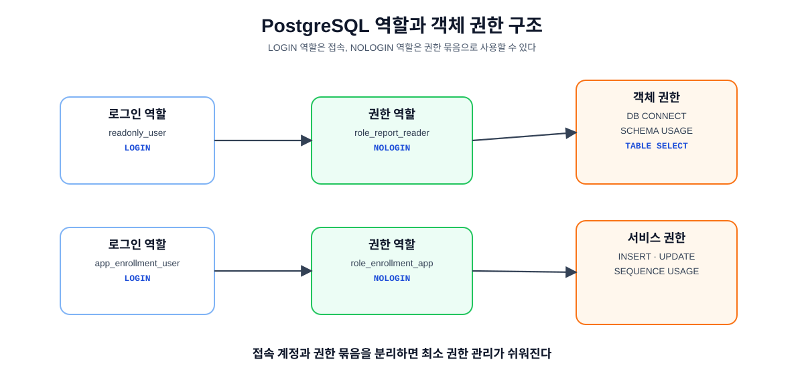

그림 11-2 PostgreSQL 역할과 객체 권한 구조

| 개념 | 핵심 질문 | 예 |
| --- | --- | --- |
| 인증 | 누가 접속했는가? | `LOGIN` Role, 인증 설정 |
| 권한 부여 | 어떤 객체에서 어떤 작업을 할 수 있는가? | `SELECT`, `INSERT`, `USAGE` |
| 소유권 | 객체 정의·삭제·권한 부여의 주체는 누구인가? | table owner |
| 역할 멤버십 | 다른 역할의 권한을 사용할 수 있는가? | `GRANT role TO user` |
| 감사 | 누가 무엇을 실행했는가? | 로그, 변경 기록 |

객체 소유자는 일반 `GRANT`와 별도로 객체를 변경하거나 삭제할 수 있습니다. 최소 권한 설계에서는 소유 역할과 실제 접속·실행 역할을 분리합니다.

`SUPERUSER`, `CREATEDB`, `CREATEROLE`은 일반 애플리케이션 업무 권한이 아닙니다. 필요성이 명확하지 않은 앱·보고·백업 역할에는 부여하지 않습니다.

---

## 5. 로그인 역할과 권한 역할을 분리한다

| 역할 종류 | LOGIN | 목적 | 예시 |
| --- | --- | --- | --- |
| 소유 역할 | 보통 NOLOGIN | 객체 소유와 권한 관리 | `lab_role_security_owner` |
| 읽기 권한 역할 | NOLOGIN | 보고용 조회 권한 묶음 | `lab_role_report_reader` |
| 앱 권한 역할 | NOLOGIN | 서비스 실행 권한 묶음 | `lab_role_enrollment_app` |
| 백업 권한 역할 | NOLOGIN | 백업용 읽기 권한 묶음 | `lab_role_backup_reader` |
| 읽기 로그인 역할 | LOGIN | 보고 사용자 접속 | `lab_readonly_user` |
| 앱 로그인 역할 | LOGIN | 애플리케이션 접속 | `lab_enrollment_user` |
| 백업 로그인 역할 | LOGIN | 백업 실행 주체 | `lab_backup_user` |

```sql
-- 관리자 권한이 있는 테스트 환경에서만 선택 실행
-- CREATE ROLE lab_role_report_reader NOLOGIN;
-- CREATE ROLE lab_role_enrollment_app NOLOGIN;
-- CREATE ROLE lab_role_backup_reader NOLOGIN;
-- CREATE ROLE lab_readonly_user LOGIN;
-- CREATE ROLE lab_enrollment_user LOGIN;
-- CREATE ROLE lab_backup_user LOGIN;
```

예제에는 실제 비밀번호를 넣지 않습니다. 역할 이름은 클러스터 전역에서 공유될 수 있으므로 기존 역할과 충돌하지 않는지 먼저 확인합니다.

### PostgreSQL 16의 membership 옵션

PostgreSQL 16에서는 역할 멤버십마다 `INHERIT`, `SET`, `ADMIN` 옵션을 확인할 수 있습니다. 교재에서는 의도를 명확하게 하기 위해 자동 상속과 `SET ROLE` 사용을 명시합니다.

```sql
-- GRANT lab_role_report_reader TO lab_readonly_user
--     WITH INHERIT TRUE, SET TRUE;
-- GRANT lab_role_enrollment_app TO lab_enrollment_user
--     WITH INHERIT TRUE, SET TRUE;
-- GRANT lab_role_backup_reader TO lab_backup_user
--     WITH INHERIT TRUE, SET TRUE;
```

멤버십이 존재하는 것과 로그인 역할이 권한을 즉시 사용할 수 있는 것은 구분해야 합니다.

```text
pg_has_role(..., 'MEMBER')
→ 멤버십 경로가 존재하는가?

pg_has_role(..., 'USAGE')
→ 현재 역할 설정에서 권한을 즉시 사용할 수 있는가?

pg_auth_members
→ inherit_option / set_option / admin_option은 무엇인가?
```

`rolinherit`만 보고 PostgreSQL 16의 membership별 설정까지 모두 확인했다고 생각하지 않습니다.

---

## 6. 권한은 객체 범위별로 나뉜다

| 범위 | 대표 권한 | 의미 |
| --- | --- | --- |
| 데이터베이스 | `CONNECT` | 데이터베이스 접속 허용 |
| 스키마 | `USAGE` | 스키마 내부 객체 이름 사용 |
| 스키마 | `CREATE` | 스키마 안에 객체 생성 |
| 테이블 | `SELECT`, `INSERT`, `UPDATE`, `DELETE` | 행 조회·변경 |
| 컬럼 | `SELECT`, `INSERT`, `UPDATE` | 특정 컬럼 작업 |
| 시퀀스 | `USAGE`, `SELECT`, `UPDATE` | 번호 생성·조회·설정 |
| 역할 | 멤버십 | 다른 역할 권한 사용 |

```text
CONNECT만 있다고 테이블을 읽을 수 없다.
스키마 USAGE만 있다고 SELECT할 수 없다.
INSERT 권한만 있다고 IDENTITY 자동값을 사용할 수 있는 것은 아니다.
```

`IDENTITY`가 사용하는 시퀀스의 `nextval()`에는 시퀀스 `USAGE` 또는 `UPDATE` 권한이 필요합니다. 앱 역할은 자동 번호 생성만 필요하므로 `USAGE`만 부여합니다.

백업 역할은 목적이 다릅니다. 현재 IDENTITY 시퀀스 상태까지 논리 백업에 포함시키는 실습이므로 세 시퀀스의 `SELECT`를 별도로 부여합니다. 같은 시퀀스라도 앱과 백업 역할이 필요한 작업이 다르므로 권한도 달라집니다.

---

## 7. security_lab 구조와 데이터 무결성

`01_security_lab_schema.sql`은 단순히 `course_project.enrollments = 5`만 보지 않고 Chapter 07·08의 기준 상태를 확인합니다.

```text
현재 DB = ai_database_book
읽기 전용 연결 아님
course_project = 3 / 2 / 3 / 5
상태 = 신청2 / 수강중1 / 완료1 / 취소1
recorded_amount = NUMERIC(12,0)
전체 590000 / 활성 340000 / 취소 제외 440000
1001·1004·1005 기준 상태 일치
활성 신청 부분 고유 인덱스 존재
Chapter 07 명명 제약조건 15개 / NOT NULL 열 20개 유지
현재 역할이 ai_database_book에 CREATE 권한 보유
security_lab 미존재
```

스키마와 세 테이블은 하나의 트랜잭션에서 생성하고, COMMIT 전에 다음을 자동 검증합니다.

```text
테이블 3개
명시 제약조건 13개
NOT NULL 컬럼 14개
recorded_amount NUMERIC(12,0)
부분 고유 인덱스 valid / ready
초기 행 수 0 / 0 / 0
```

구조는 다음과 같습니다.

```text
security_lab.students
- id IDENTITY PK
- name NOT NULL + 공백 CHECK
- email NOT NULL + 공백 CHECK + 정확한 문자열 UNIQUE
- joined_at NOT NULL

security_lab.courses
- id IDENTITY PK
- title NOT NULL + 공백 CHECK
- level CHECK
- price CHECK

security_lab.enrollments
- id IDENTITY PK
- student_id·course_id FK
- status CHECK
- recorded_amount NUMERIC(12,0) + 0 이상 CHECK
- enrolled_at NOT NULL
```

`recorded_amount`는 결제 승인액이나 회계 매출이 아니라 **신청 시점에 신청 행에 기록한 금액**입니다. 실제 결제·환불 이력은 이 장의 범위가 아닙니다.

학생 이메일의 대소문자·별칭 정규화는 별도 정책으로 남깁니다.

### Chapter 07 활성 신청 정책 유지

```sql
CREATE UNIQUE INDEX uq_security_enrollments_active
ON security_lab.enrollments (student_id, course_id)
WHERE status IN ('신청', '수강중');
```

완료·취소 이력은 여러 건 허용하지만 진행 중인 신청은 학생·강의 조합당 한 건입니다.

### 샘플과 IDENTITY

`02_security_lab_seed.sql`의 기준 상태는 다음과 같습니다.

```text
students = 3
courses = 3
enrollments = 3
JOIN = 3
상태 = 신청1 / 수강중1 / 완료1 / 취소0
recorded_amount 합계 = 310000
활성 신청 = 2
활성 중복 = 0
모든 recorded_amount = 연결된 course.price

1001 = 101 / 201 / 수강중 / 100000
1002 = 102 / 202 / 신청   / 120000
1003 = 103 / 203 / 완료   /  90000
```

명시적 ID는 IDENTITY 내부 시퀀스의 다음 값을 자동으로 이동시키지 않습니다. `02`는 다음 값으로 조정합니다.

```text
students.id → 104
courses.id → 204
enrollments.id → 1004
```

권한 동작 시험에서 자동 ID INSERT를 실행한 뒤 `ROLLBACK`해도 사용된 시퀀스 번호는 회수되지 않을 수 있습니다. 번호 공백은 데이터 오류가 아닙니다.

---

## 8. 최소 권한을 작업 행렬로 설계한다

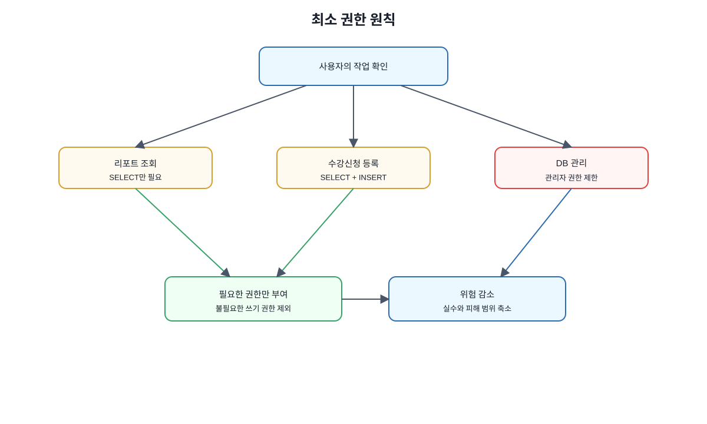

그림 11-3 최소 권한 설계 절차

| 객체·작업 | 보고 역할 | 수강신청 앱 역할 | 백업 역할 |
| --- | --- | --- | --- |
| DB `CONNECT` | 허용 | 허용 | 허용 |
| 스키마 `USAGE` | 허용 | 허용 | 허용 |
| students·courses·enrollments `SELECT` | 허용 | 허용 | 허용 |
| enrollments `INSERT` | 불허 | 허용 | 불허 |
| enrollments status `UPDATE` | 불허 | 허용 | 불허 |
| enrollments `recorded_amount UPDATE` | 불허 | 불허 | 불허 |
| enrollments ID 시퀀스 `USAGE` | 불필요 | 허용 | 불필요 |
| 세 IDENTITY 시퀀스 `SELECT` | 불필요 | 불허 | 허용 |
| `DELETE`, `TRUNCATE` | 불허 | 불허 | 불허 |
| 스키마 `CREATE` | 불허 | 불허 | 불허 |

```sql
-- GRANT USAGE ON SCHEMA security_lab
-- TO lab_role_report_reader, lab_role_enrollment_app, lab_role_backup_reader;

-- GRANT SELECT ON TABLE
--     security_lab.students,
--     security_lab.courses,
--     security_lab.enrollments
-- TO lab_role_report_reader, lab_role_enrollment_app, lab_role_backup_reader;

-- GRANT INSERT ON TABLE security_lab.enrollments
-- TO lab_role_enrollment_app;

-- GRANT UPDATE (status) ON TABLE security_lab.enrollments
-- TO lab_role_enrollment_app;

-- GRANT USAGE
-- ON SEQUENCE security_lab.enrollments_id_seq
-- TO lab_role_enrollment_app;

-- GRANT SELECT ON SEQUENCE
--     security_lab.students_id_seq,
--     security_lab.courses_id_seq,
--     security_lab.enrollments_id_seq
-- TO lab_role_backup_reader;
```

기본 예시에서는 `SUPERUSER`, `CREATEDB`, `CREATEROLE`, `ALL PRIVILEGES`를 부여하지 않습니다.

---

## 9. GRANT·REVOKE 후 유효 권한과 경로를 확인한다

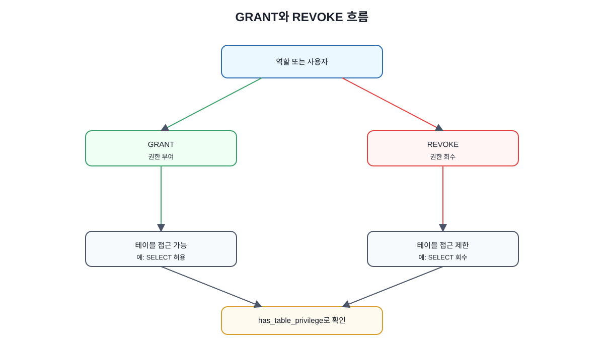

그림 11-4 GRANT·REVOKE와 유효 권한 확인

`REVOKE`는 특정 경로의 권한을 회수합니다. 다음 경로로 같은 작업이 여전히 가능할 수 있습니다.

```text
직접 부여된 권한
다른 권한 역할 멤버십
PUBLIC 권한
객체 소유권
membership INHERIT 경로
SET ROLE로 전환 가능한 역할
```

### 유효 권한과 ACL 구분

```text
has_*_privilege
→ 로그인 역할이 최종적으로 작업할 수 있는가?

pg_database.datacl·pg_namespace.nspacl·객체 ACL
→ 직접 GRANT와 PUBLIC 같은 권한 경로는 무엇인가?
```

데이터베이스에는 기본적으로 `PUBLIC CONNECT`가 존재할 수 있습니다. `has_database_privilege(..., 'CONNECT') = true`만으로 실습 역할에 직접 부여한 `GRANT` 덕분이라고 단정하지 않습니다.

### PUBLIC 테이블 권한 조회

`information_schema.role_table_grants`와 `role_column_grants`는 `PUBLIC` 경로를 제외할 수 있습니다. PUBLIC 권한은 다음 뷰에서 확인합니다.

```sql
SELECT *
FROM information_schema.table_privileges
WHERE table_schema = 'security_lab'
  AND grantee = 'PUBLIC';

SELECT *
FROM information_schema.column_privileges
WHERE table_schema = 'security_lab'
  AND grantee = 'PUBLIC';
```

무조건적인 `REVOKE ALL ... FROM PUBLIC`은 다른 계정 접속과 애플리케이션에 영향을 줄 수 있으므로 별도 테스트 DB에서 의존성을 먼저 확인합니다.

---

## 10. 현재 객체와 미래 객체 권한을 구분한다

```text
현재 객체 GRANT
→ 지금 존재하는 객체에 적용

ALTER DEFAULT PRIVILEGES
→ 특정 역할이 앞으로 생성할 객체의 기본 권한 설정
```

```sql
-- ALTER DEFAULT PRIVILEGES
-- FOR ROLE lab_role_security_owner
-- IN SCHEMA security_lab
-- GRANT SELECT ON TABLES TO lab_role_report_reader;
```

Default Privileges는 **어떤 역할이 미래 객체를 생성하는가**에 따라 달라집니다. 기존 객체의 권한을 바꾸지도 않습니다.

복원에서도 이 점이 중요합니다. `pg_restore --no-privileges`로 원본 ACL을 적용하지 않아도 복원 역할 자체에 Default Privileges가 설정되어 있다면 새 객체 생성 시 다른 ACL이 생길 수 있으므로 실제 ACL을 조회합니다.

---

## 11. 권한은 실제 허용·차단 동작으로 확인한다

`04_permission_checks.sql`은 ACL·PUBLIC·membership·RLS·유효 권한을 확인하고, `05_permission_behavior_tests.sql`은 실제 SQL 동작을 확인합니다.

```text
읽기 계정
- SELECT 성공
- INSERT·UPDATE·DELETE 실패

앱 계정
- SELECT 성공
- ID 생략 INSERT 성공
- status UPDATE 성공
- recorded_amount UPDATE 실패
- DELETE 실패
- schema CREATE 실패
```

성공 테스트는 마지막에 `ROLLBACK`해 기준 데이터를 보존합니다. 실패 테스트는 한 문장씩 선택 실행하며 오류 후 `ROLLBACK TO SAVEPOINT` 또는 `ROLLBACK`으로 트랜잭션을 복구합니다.

테이블 전체 `UPDATE` 권한이 `false`이면서 `status` 컬럼 `UPDATE` 권한만 `true`인지 확인하는 것이 중요합니다.

`05`의 마지막 자동 검증은 행 데이터가 여전히 `3 / 3 / 3`, 총 `recorded_amount = 310000`, 활성 중복 `0`인지 확인합니다. 단, 시퀀스 번호는 `ROLLBACK` 후에도 증가했을 수 있으므로 정확히 1004인지 다시 요구하지 않습니다.

---

## 12. 역할 소유권과 안전한 정리

소유 역할로 객체 소유권을 이전했다면 해당 역할을 곧바로 삭제할 수 없습니다.

```text
다른 역할로 소유권 이전
→ 남은 권한과 객체 의존성 검토
→ 관련된 각 데이터베이스에서 확인
→ 역할 삭제
```

```sql
-- 파괴적일 수 있으므로 자동 실행하지 않습니다.
-- REASSIGN OWNED BY lab_role_security_owner TO <successor_owner>;
-- DROP OWNED BY lab_role_security_owner;
-- DROP ROLE lab_role_security_owner;
```

`REASSIGN OWNED`와 `DROP OWNED`는 현재 데이터베이스의 객체·권한뿐 아니라 Role이 가진 의존성을 다루므로, 클러스터의 관련 데이터베이스마다 조사해야 합니다.

`DROP OWNED ... CASCADE`는 다른 객체까지 삭제할 수 있으므로 기본 정리 명령으로 제공하지 않습니다.

---

## 13. 개발·테스트·운영 환경과 비밀 정보를 분리한다

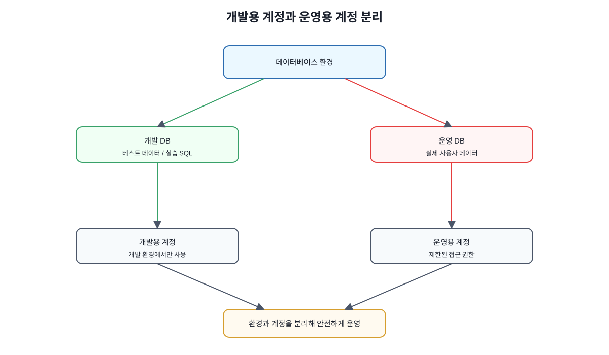

그림 11-5 개발·운영 환경과 계정 분리

| 환경 | 데이터 | 계정 | 권한 | 백업 |
| --- | --- | --- | --- | --- |
| 개발 | 가상·비식별 데이터 | 개발 전용 | 필요한 개발 권한 | 짧은 보존 가능 |
| 테스트 | 검증용 데이터 | 테스트 전용 | 운영과 유사한 제한 | 복원 시험 가능 |
| 운영 | 실제 데이터 | 운영 전용 | 최소 권한 | 암호화·보존·감사 |

루트 `.env.example`에는 변수 이름만 둡니다.

```text
PGHOST=
PGPORT=
PGDATABASE=
PGUSER=
PGPASSFILE=
```

`PGPASSWORD`를 저장소 예제에 두지 않습니다. PostgreSQL 16 공식 문서도 일부 운영체제에서 프로세스 환경 변수가 다른 사용자에게 보일 수 있어 `PGPASSWORD` 사용을 권장하지 않습니다. 대신 실제 libpq password file은 저장소 밖에 두고 `PGPASSFILE`로 위치를 지정합니다.

Unix 계열에서는 password file이 그룹·다른 사용자에게 읽히지 않도록 `chmod 0600` 수준으로 제한해야 하며, 권한이 느슨하면 libpq가 파일을 무시합니다. Windows는 별도 파일 권한 검사를 하지 않으므로 사용자 프로필의 PostgreSQL 암호 파일 위치나 접근이 제한된 보호 경로에 저장합니다.

비밀 정보가 노출되면 Git 기록에서 파일만 삭제하지 않습니다. 먼저 비밀번호·토큰을 폐기하거나 회전하고, 로그·복제본·캐시와 배포 환경의 노출 범위를 확인합니다.

---

## 14. SQL Injection은 SQL 구조와 값을 분리해 방어한다

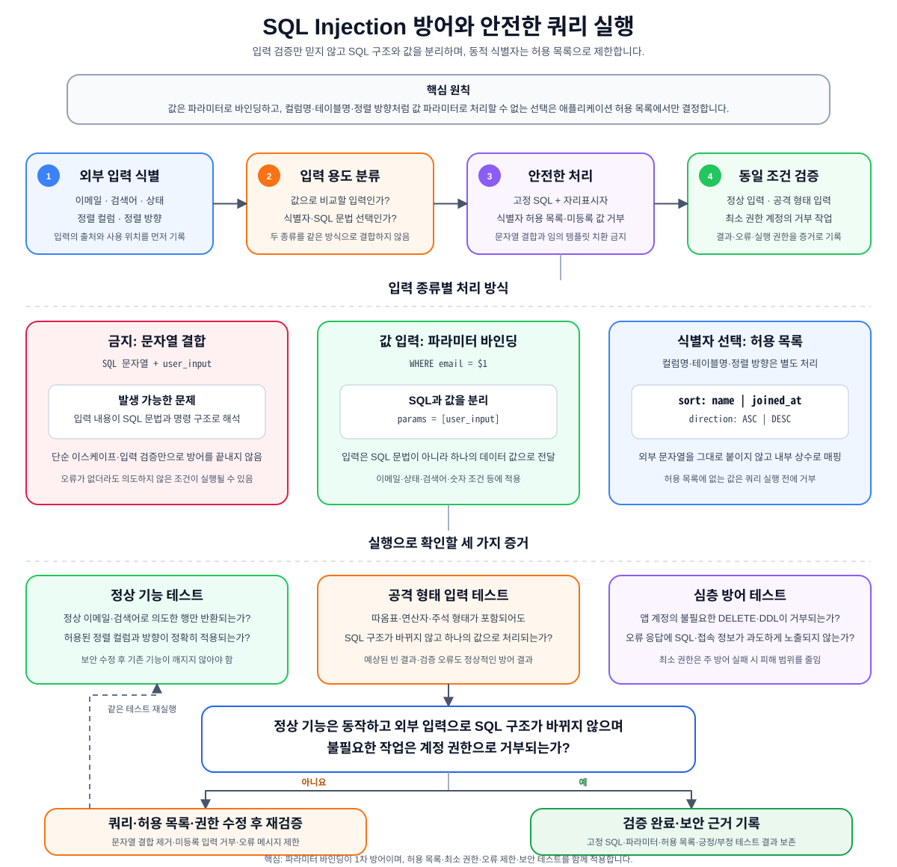

그림 11-6 문자열 결합과 파라미터 바인딩

위험한 방향:

```text
"SELECT * FROM security_lab.students WHERE email = '"
+ user_input
+ "'"
```

안전한 방향:

```text
SQL: SELECT * FROM security_lab.students WHERE email = $1
값: user_input
```

값은 파라미터로 바인딩합니다. 테이블명, 컬럼명과 정렬 방향은 일반적으로 값 파라미터로 바인딩할 수 없으므로 애플리케이션 허용 목록에서만 선택합니다.

```text
허용 정렬 컬럼: name, joined_at
허용 정렬 방향: asc, desc
그 밖의 값: 거부
```

입력 검증 하나만으로 방어가 끝나지 않습니다. 파라미터 바인딩, 허용 목록, 최소 권한 계정, 오류 메시지 제한과 보안 테스트를 함께 사용합니다.

최소 권한은 SQL Injection 자체를 막는 기능은 아니지만 공격이 성공했을 때 가능한 작업 범위를 줄이는 중요한 추가 방어선입니다.

---

## 15. 로그와 백업 파일도 민감 데이터다

```text
백업을 공개 저장소에 커밋하지 않는다.
백업이 자동으로 암호화된다고 가정하지 않는다.
저장 위치·전송 경로·보관 기간·삭제 정책을 정한다.
백업 접근 권한과 다운로드 기록을 관리한다.
로그에 비밀번호·토큰·전체 접속 URL을 남기지 않는다.
복원용 임시 DB와 임시 파일도 삭제 정책에 포함한다.
```

백업 파일에는 원본 테이블의 개인정보와 업무 데이터가 그대로 포함될 수 있습니다. 따라서 운영 DB와 같은 수준의 접근 통제와 보관 정책을 적용합니다.

파일 해시를 공개해도 원본 내용을 직접 노출하지는 않지만, 백업 경로·파일명·메타데이터를 불필요하게 공개할 이유도 없습니다.

---

## 16. 백업·복제·고가용성은 목적이 다르다

| 방식 | 주요 목적 | 실수 삭제 대응 | 주의점 |
| --- | --- | --- | --- |
| 논리 백업 | 구조·데이터 복원·이관 | 백업 시점으로 복원 가능 | 복원 시간·의존 객체 검증 |
| 물리 백업·PITR | 클러스터와 특정 시점 복구 | 설정에 따라 가능 | WAL·보관 정책 필요 |
| 복제 | 가용성·읽기 분산 | 삭제가 그대로 복제될 수 있음 | 백업 대체 불가 |
| 스냅샷 | 스토리지 시점 사본 | 일관성·보존 정책에 따라 다름 | DB 일관성과 복원 시험 필요 |

복제본이 있다고 해서 백업이 있는 것은 아닙니다. 잘못된 `DELETE`가 즉시 복제되면 복제본에도 같은 삭제가 반영될 수 있습니다.

이 장에서는 입문 수준의 논리 백업과 복원 검증에 집중합니다.

---

## 17. 백업 전 버전·계정·RLS·의존성을 확인한다

### 도구와 서버 버전

```bash
pg_dump --version
pg_restore --version
psql --version
```

```sql
SHOW server_version;
```

```text
pg_dump 주요 버전이 원본 서버보다 오래되면 중단한다.
복원에는 가능하면 백업 생성에 사용한 것과 같은 주요 버전의 pg_restore를 사용한다.
복원 서버가 원본보다 오래된 주요 버전이면 호환성을 별도로 검토한다.
확장 기능과 외부 모듈 버전도 확인한다.
```

교재 자동 검증 기준은 PostgreSQL 16입니다. 운영 환경에서는 실제 서버·클라이언트 버전을 기록합니다.

### 백업 계정 최소 권한

```text
DB CONNECT
security_lab USAGE
대상 테이블 SELECT
IDENTITY 시퀀스 상태 확인을 위한 SELECT
RLS 적용 여부
백업 후 권한 유지·회수 정책
```

`lab_backup_user`는 실제 접속 역할이고 `lab_role_backup_reader`는 권한 묶음입니다. 둘을 분리하면 백업 실행 주체를 바꾸더라도 권한 정책을 재사용하기 쉽습니다.

### RLS는 “일부 행 백업”을 조용히 허용하는 설정으로 생각하지 않는다

일반적인 전체 논리 백업에서 `pg_dump`는 Row-Level Security를 끄고 모든 행을 읽으려 합니다. 백업 역할이 정책을 우회할 수 없다면 오류로 중단될 수 있습니다. 이 동작은 일부 행만 백업하고도 성공으로 착각하는 일을 막는 데 도움이 됩니다.

`--enable-row-security`는 **역할에게 보이는 행만 의도적으로 덤프하려는 경우**에 검토하는 옵션입니다. 이것을 운영 전체 백업과 같은 의미로 사용하지 않습니다. 교재의 `security_lab`은 RLS를 사용하지 않으며 `04_permission_checks.sql`에서 `relrowsecurity = false`인지 확인합니다.

### 특정 스키마 백업의 의존성

`--schema=security_lab`은 외부 의존 객체를 자동으로 모두 포함한다고 보장하지 않습니다.

```text
외부 스키마 FK
사용자 정의 타입
함수·트리거
확장 기능
Large Object
외부 테이블
```

교재의 `security_lab`은 외부 스키마 의존성 없이 단독 복원할 수 있도록 설계했습니다.

---

## 18. 백업 범위와 형식을 결정한다

### security_lab custom format 백업

```bash
pg_dump \
  -U <backup_user> \
  -d ai_database_book \
  -Fc \
  --schema=security_lab \
  -f <backup-dir>/security_lab.backup
```

여기서는 custom archive에 원본 객체의 owner·ACL 메타데이터도 보존합니다. 중요한 점은 **archive 형식의 `pg_dump --no-owner`로 소유권을 제거한다고 생각하지 않는 것**입니다. custom archive에서 실제 소유권 적용 여부는 복원 시 `pg_restore --no-owner`로 제어합니다.

테스트 복원에서는 다음처럼 원본 owner와 ACL의 적용을 의도적으로 생략합니다.

```text
pg_restore --no-owner --no-privileges
```

이 방식의 장점은 하나의 archive에 원본 메타데이터를 보존하면서도, 이동성 검증 DB에서는 복원 역할이 객체를 소유하도록 만들고 권한은 2단계에서 별도로 검증할 수 있다는 점입니다.

### 전체 데이터베이스 선택안

```bash
pg_dump \
  -U <backup_user> \
  -d ai_database_book \
  -Fc \
  -f <backup-dir>/ai_database_book.backup
```

### 전역 객체 선택안

데이터베이스 덤프에는 Role과 Tablespace 같은 클러스터 전역 객체가 포함되지 않습니다.

```bash
pg_dumpall \
  --globals-only \
  --no-role-passwords \
  -U <admin_user> \
  -f <secure-backup-dir>/globals.sql
```

인증 정보까지 복구해야 한다면 `--no-role-passwords`를 사용하지 않을 수 있지만 파일을 더 엄격하게 보호해야 합니다. 같은 클러스터에서는 기존 Role·Tablespace와 충돌할 수 있으므로 내용을 검토 없이 실행하지 않습니다.

---

## 19. 백업 파일 자체를 검증한다

```text
명령 종료 코드와 표준 오류 확인
파일 크기·생성 시각·대상 DB 기록
pg_restore --list로 아카이브 목록 확인
SHA-256 해시 기록
보관 위치와 접근 권한 확인
```

```bash
pg_restore --list <backup-dir>/security_lab.backup
```

목록에서 다음을 확인합니다.

```text
security_lab 스키마
students / courses / enrollments
세 IDENTITY 시퀀스와 sequence set
PK·FK·UNIQUE·CHECK
uq_security_enrollments_active
ACL 항목이 archive에 있는지 여부
예상하지 않은 외부 객체가 없는지
```

Windows PowerShell:

```powershell
Get-FileHash <backup-dir>\security_lab.backup -Algorithm SHA256
```

Linux·macOS:

```bash
sha256sum <backup-dir>/security_lab.backup
```

해시는 파일이 변경되었는지를 확인하는 근거이며 실제로 복원된다는 증거는 아닙니다.

---

## 20. 별도 데이터베이스에 원자적으로 복원한다

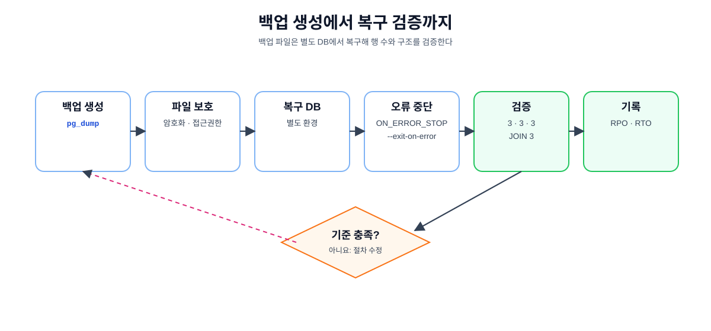

그림 11-7 백업 생성에서 복구 검증까지

원본 DB에 덮어쓰지 않고 복원 역할이 소유하는 깨끗한 검증 DB를 만듭니다.

```bash
createdb \
  -U <admin_user> \
  -O <restore_user> \
  -T template0 \
  ai_database_book_restore
```

작은 `security_lab` 실습은 전체 복원을 하나의 트랜잭션으로 묶습니다.

```bash
pg_restore \
  -U <restore_user> \
  -d ai_database_book_restore \
  --single-transaction \
  --no-owner \
  --no-privileges \
  <backup-dir>/security_lab.backup
```

```text
--single-transaction
→ 작은 실습에서 전체 복원을 한 트랜잭션으로 묶어 부분 객체 잔존 위험을 줄인다.

--no-owner
→ archive의 원본 owner 지정 명령을 적용하지 않고 복원 실행 역할이 객체를 소유하게 한다.

--no-privileges
→ archive의 GRANT·REVOKE ACL 적용을 생략한다.
```

대규모 운영 복원에서는 긴 트랜잭션, 잠금, WAL, 디스크 공간과 자원 사용을 별도로 검토합니다.

Plain SQL 복원:

```bash
psql \
  -X \
  -1 \
  -U <restore_user> \
  -d ai_database_book_restore \
  -v ON_ERROR_STOP=1 \
  -f <backup-dir>/security_lab.sql
```

```text
-X               → 사용자 psqlrc 설정 제외
-1               → 파일 전체를 하나의 트랜잭션으로 처리
ON_ERROR_STOP=1  → 첫 오류에서 중단
```

신뢰할 수 없는 덤프는 검토 없이 복원하지 않습니다. 덤프는 단순 데이터 파일이 아니라 대상 서버에서 SQL과 객체 정의를 실행하게 만드는 입력입니다.

---

## 21. 복원 검증은 두 단계로 나눈다

### 1단계: 구조·데이터·소유권

복원 DB에서 `06_restore_validation.sql`을 실행합니다. 이 파일은 원본 `ai_database_book`에서 실행하면 예외를 발생시킵니다.

```text
현재 DB = ai_database_book_restore
students·courses·enrollments = 3·3·3
JOIN = 3
상태 = 신청1 / 수강중1 / 완료1 / 취소0
총 recorded_amount = 310000
recorded_amount = NUMERIC(12,0)
recorded_amount와 course.price 불일치 = 0
고아 FK = 0
활성 신청 중복 = 0
NOT NULL 컬럼 = 14
13개 명시 제약조건 유지
부분 고유 인덱스 valid / ready
IDENTITY 시퀀스 3개
다음 자동값 > 기존 최대 ID
schema·table·sequence owner = 복원 역할
```

custom archive에는 원본 ACL이 들어 있을 수 있지만 `pg_restore --no-privileges`를 사용한 검증 복원에서는 이를 적용하지 않습니다. 다만 복원 역할의 Default Privileges가 새 객체에 적용될 수 있으므로 실제 ACL은 반드시 조회합니다.

### 2단계: 역할·권한 재적용

```text
03 역할·권한 계획 검토
→ 필요한 Role·GRANT 적용
→ 04 PUBLIC·ACL·membership·유효 권한 확인
→ 05 허용·차단 DML 검증
```

| 역할 | SELECT | INSERT | status UPDATE | recorded_amount UPDATE | DELETE | schema CREATE |
| --- | --- | --- | --- | --- | --- | --- |
| 읽기 계정 | 성공 | 실패 | 실패 | 실패 | 실패 | 실패 |
| 앱 계정 | 성공 | 성공 | 성공 | 실패 | 실패 | 실패 |

백업 역할도 별도로 검증합니다.

```text
테이블 SELECT = 성공
세 IDENTITY 시퀀스 SELECT = 성공
INSERT·UPDATE·DELETE·schema CREATE = 실패
```

검증이 실패하면 백업 파일을 성공으로 표시하지 않습니다. 원인을 수정하고 다시 백업·복원·검증합니다.

---

## 22. RPO·RTO와 복구 실행 기록

| 기준 | 질문 | 예시 |
| --- | --- | --- |
| RPO | 어느 시점까지의 데이터 손실을 허용하는가? | 최대 1시간 |
| RTO | 장애 후 얼마 안에 서비스를 재개해야 하는가? | 2시간 |

RPO가 1시간인데 하루 한 번만 백업하면 목표를 충족하지 못할 수 있습니다. RTO가 짧다면 백업 파일이 있어도 복원 시간이 너무 길 수 있습니다.

`BACKUP_RESTORE_RUNBOOK.md`에는 다음을 기록합니다.

```text
서버·pg_dump·pg_restore·psql 버전
백업 로그인 역할과 권한 역할
membership INHERIT·SET 상태
백업 범위와 외부 의존성
RLS 적용 여부와 처리 결정
파일 경로·크기·해시
archive 목록
복원 DB owner와 template
복원 옵션(--single-transaction / --no-owner / --no-privileges)
복원 시작·완료 시각
구조·데이터·소유권 검증 결과
역할·권한 재적용 검증 결과
오류와 해결 방법
RPO·RTO 충족 여부
다음 복원 시험 날짜
```

복구 절차는 담당자의 기억이 아니라 반복 실행할 수 있는 문서여야 합니다.

---

## 23. AI 보안·백업 명령 검토

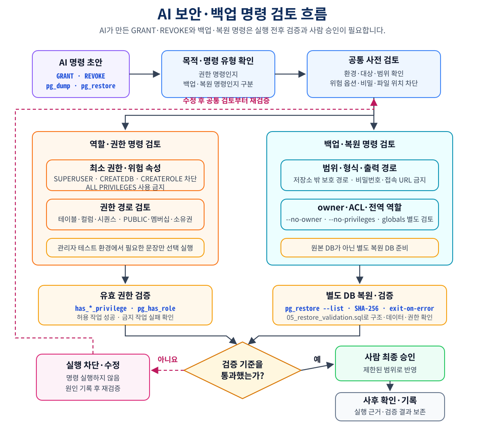

그림 11-8 AI 보안·백업 명령 검토 흐름

```text
PostgreSQL 16 security_lab의 최소 권한과 백업·복원 명령 초안을 작성해 주세요.

조건:
- 실제 비밀번호·전체 접속 URL 작성 금지
- SUPERUSER, CREATEDB, CREATEROLE, ALL PRIVILEGES 금지
- 로그인 역할과 NOLOGIN 권한 역할 분리
- PostgreSQL 16 membership의 INHERIT·SET 경로 확인
- 앱은 students·courses·enrollments SELECT
- enrollments는 INSERT와 status 컬럼 UPDATE만 추가 허용
- recorded_amount UPDATE 금지
- 앱 시퀀스는 자동 ID에 필요한 최소 USAGE
- 백업 역할은 테이블 SELECT와 IDENTITY 시퀀스 SELECT 검토
- PUBLIC·직접 GRANT·멤버십·소유권을 구분
- 백업 계정 권한과 RLS 확인
- --enable-row-security를 전체 백업과 혼동하지 않음
- 특정 스키마 외부 의존성 확인
- 도구·서버 버전 검사
- custom archive에서 pg_dump --no-owner 효과를 잘못 설명하지 않음
- 원본 DB 복원 금지
- template0 기반 별도 DB와 복원 역할 owner 지정
- 작은 실습은 single-transaction 복원
- pg_restore --no-owner --no-privileges 사용
- 구조·데이터와 권한을 두 단계로 검증
```

| 검토 영역 | 확인 질문 |
| --- | --- |
| 환경 | 테스트·운영과 원본·복원 DB가 명확한가? |
| 권한 | 실제 작업보다 과도하지 않은가? |
| membership | MEMBER·USAGE·INHERIT·SET을 구분하는가? |
| PUBLIC | 최종 권한과 부여 경로를 구분하는가? |
| 비밀 | 비밀번호·password file·접속 URL이 없는가? |
| 백업 계정 | 필요한 객체·시퀀스를 읽을 수 있는가? |
| RLS | 전체 백업과 가시 행 백업을 구분하는가? |
| 범위 | 스키마 외부 의존성을 확인했는가? |
| 버전 | 도구와 서버의 호환성을 확인했는가? |
| archive | owner·ACL 메타데이터와 restore 옵션을 구분하는가? |
| 복원 역할 | 복원 DB owner와 일치하는가? |
| 실패 처리 | 부분 복원 방지와 오류 중단 옵션이 있는가? |
| 검증 | 별도 DB에서 자동 판정하는가? |
| 정리 | 임시 DB·파일·Role 정리 계획이 있는가? |

위험한 제안:

```text
앱 계정에 SUPERUSER 또는 ALL PRIVILEGES 부여
PUBLIC 권한 경로를 확인하지 않음
실제 비밀번호를 CREATE ROLE에 포함
PGPASSWORD를 저장소 예제로 권장
RLS가 있는 계정으로 일부 행만 백업하고 전체 백업이라고 단정
custom archive에서 pg_dump --no-owner가 owner 메타데이터를 제거한다고 설명
원본 DB에 --clean 복원
복원 DB owner와 restore_user 불일치
--exit-on-error만 사용하고 부분 복원을 고려하지 않음
스키마 외부 의존성을 확인하지 않음
복원 없이 백업 성공이라고 단정
```

---

## 24. 자주 하는 실수

1. 인증 성공을 모든 데이터 접근 허용과 동일하게 생각한다.
2. 앱 계정을 객체 소유자로 사용한다.
3. `REVOKE` 한 번으로 모든 권한이 사라졌다고 생각한다.
4. `role_table_grants`로 PUBLIC 권한까지 확인했다고 생각한다.
5. `CONNECT = true`를 직접 `GRANT CONNECT`의 결과로만 해석한다.
6. PostgreSQL 16에서 `rolinherit`만 보고 membership별 `INHERIT`·`SET`을 확인하지 않는다.
7. 현재 테이블 `GRANT`가 미래 테이블에도 적용된다고 생각한다.
8. 앱에 시퀀스 `SELECT`까지 관성적으로 부여한다.
9. 반대로 백업 역할의 시퀀스 상태 읽기 목적을 검토하지 않는다.
10. 실제 비밀번호·접속 URL·password file을 저장소에 기록한다.
11. 값 바인딩으로 테이블명까지 안전해진다고 생각한다.
12. 백업 계정이 모든 데이터를 자동으로 읽는다고 생각한다.
13. RLS가 적용된 일부 행 덤프를 전체 백업과 혼동한다.
14. 특정 스키마 덤프가 모든 외부 의존성을 포함한다고 생각한다.
15. 백업 도구와 서버 버전을 확인하지 않는다.
16. custom archive의 `pg_dump --no-owner`와 `pg_restore --no-owner` 역할을 혼동한다.
17. 백업이 자동으로 암호화된다고 생각한다.
18. 파일 목록·해시만으로 복구 가능하다고 판단한다.
19. 관리자 소유 DB에 권한 없는 계정으로 복원한다.
20. 오류 중단만 설정하고 부분 복원 객체를 고려하지 않는다.
21. 원본 DB에서 복원 검증 SQL을 실행한다.
22. 소유 객체를 이전하지 않고 소유 역할을 삭제하려 한다.

---

## 25. 스스로 확인하기

1. 인증·권한 부여·소유권은 어떻게 다른가요?
2. LOGIN 역할과 NOLOGIN 권한 역할을 분리하는 이유는 무엇인가요?
3. 백업 로그인 역할과 백업 권한 역할을 분리하면 어떤 장점이 있나요?
4. `CONNECT`, schema `USAGE`, table `SELECT`가 각각 필요한 이유는 무엇인가요?
5. IDENTITY INSERT에서 시퀀스 `USAGE`를 확인해야 하는 이유는 무엇인가요?
6. 앱의 시퀀스 `USAGE`와 백업의 시퀀스 `SELECT` 목적은 어떻게 다른가요?
7. `MEMBER`와 `USAGE` 역할 확인은 어떻게 다른가요?
8. PostgreSQL 16의 membership `inherit_option`, `set_option`은 무엇을 보여 주나요?
9. `REVOKE` 후에도 권한이 남을 수 있는 경로는 무엇인가요?
10. PUBLIC 권한을 `role_table_grants`에서만 확인하면 안 되는 이유는 무엇인가요?
11. Default Privileges가 기존 객체 권한을 바꾸지 않는 이유는 무엇인가요?
12. 값 파라미터와 동적 식별자의 안전 처리 방식은 어떻게 다른가요?
13. RLS 테이블을 백업할 때 `--enable-row-security`를 신중히 봐야 하는 이유는 무엇인가요?
14. 스키마 백업 전 외부 의존성을 확인해야 하는 이유는 무엇인가요?
15. custom archive에서 owner 정보와 `pg_restore --no-owner`는 어떤 관계인가요?
16. `--no-owner --no-privileges` 복원의 장점과 후속 작업은 무엇인가요?
17. `--single-transaction` 복원이 작은 실습에서 유용한 이유는 무엇인가요?
18. 파일 해시가 실제 복원 시험을 대신할 수 없는 이유는 무엇인가요?
19. RPO와 RTO는 백업 주기와 복원 절차에 어떤 영향을 주나요?
20. 소유 역할을 삭제하기 전에 `REASSIGN OWNED`를 검토하는 이유는 무엇인가요?

---

## 26. 권장 해설

### 권한 모델

```text
인증은 접속 주체 확인,
권한 부여는 객체 작업 허용,
소유권은 객체 정의와 권한 관리 책임이다.
```

```text
CONNECT → DB 접속
USAGE → 스키마 내부 객체 이름 사용
SELECT → 테이블 행 조회
```

### PostgreSQL 16 역할 멤버십

```text
MEMBER는 멤버십 경로 존재 여부,
USAGE는 현재 설정에서 권한을 사용할 수 있는지,
pg_auth_members의 inherit_option·set_option은
자동 상속과 SET ROLE 가능 경로를 더 구체적으로 보여 준다.
```

### 시퀀스와 IDENTITY

```text
앱이 ID를 생략한 INSERT를 하려면 enrollments INSERT와 시퀀스 USAGE가 필요하다.
일반 자동 ID 생성에 시퀀스 SELECT를 반드시 부여할 필요는 없다.
백업 역할은 IDENTITY 시퀀스 상태를 보존하기 위해 SELECT를 별도 검토한다.
명시적 ID 입력 후 IDENTITY 시작값은 별도로 조정한다.
nextval이 호출된 번호는 트랜잭션 ROLLBACK으로 회수되지 않을 수 있다.
```

### 기록 금액

```text
recorded_amount는 신청 행에 기록한 금액이다.
결제 승인액·환불 반영 순매출·회계 매출로 해석하지 않는다.
security_lab 기준 합계는 310000이다.
```

### 백업과 복원

```text
--schema 덤프는 외부 의존 객체를 자동으로 모두 포함하지 않는다.
custom archive에는 owner·ACL 메타데이터를 보존할 수 있다.
검증 복원에서 pg_restore --no-owner --no-privileges로 적용을 생략한다.
파일 목록과 해시는 파일 검증이고, 별도 DB 복원은 복구 가능성 검증이다.
작은 실습의 single-transaction 복원은 오류 시 부분 객체가 남는 위험을 줄인다.
RLS가 있는 경우 전체 백업과 역할 가시 행 백업을 구분한다.
```

### RPO와 RTO

```text
RPO는 허용 데이터 손실 시점,
RTO는 서비스 재개까지 허용 시간이다.
백업 주기와 실제 복원 시간이 두 목표를 모두 충족해야 한다.
```

---

## 27. 핵심 정리

```text
1. 인증·권한·소유권·감사는 서로 다른 통제다.
2. 로그인 역할·권한 역할·소유 역할을 분리한다.
3. PostgreSQL 16 membership의 MEMBER·USAGE·INHERIT·SET 경로를 구분한다.
4. 최소 권한은 역할별 실제 작업 행렬에서 시작한다.
5. 유효 권한과 PUBLIC·직접 GRANT·멤버십·소유권 경로를 함께 본다.
6. 현재 객체 GRANT와 미래 객체 Default Privileges를 구분한다.
7. 허용·차단 동작을 실제 SQL과 ROLLBACK으로 확인한다.
8. 비밀번호·접속 URL·password file·백업은 저장소 밖에서 보호한다.
9. SQL Injection은 바인딩·허용 목록·최소 권한을 함께 사용한다.
10. 백업 전에 계정 권한·시퀀스·RLS·의존성·버전을 확인한다.
11. custom archive의 메타데이터와 pg_restore의 owner·ACL 적용 옵션을 구분한다.
12. 별도 DB owner와 복원 역할을 맞추고 원자적으로 복원한다.
13. 구조·데이터 검증과 역할·권한 검증을 두 단계로 수행한다.
14. RPO·RTO와 복원 결과를 반복 가능한 Runbook으로 유지한다.
```

이 장에서 기억할 문장은 다음과 같습니다.

```text
허용할 작업은 최소화하고,
복구 가능성은 별도 환경의 실제 복원으로 증명한다.
```

---

## 28. 다음 장에서는

Chapter 12에서는 관계형 데이터베이스와 다른 데이터 모델을 제공하는 NoSQL을 살펴봅니다.

```text
문서·키-값·그래프·와이드 컬럼 모델
스키마 유연성과 데이터 중복
일관성·확장성·조회 패턴
PostgreSQL JSONB와 전용 NoSQL의 차이
관계형 DB와 NoSQL 선택 기준
AI가 제안한 저장소 선택 검토
```

보안과 복구는 특정 DBMS에만 필요한 기능이 아닙니다. 어떤 저장소를 선택하더라도 접근 통제, 비밀 보호, 백업과 복구 검증을 함께 설계해야 합니다.

---

# Chapter 12. 조회 패턴으로 RDBMS와 NoSQL 선택하기

---

## 이 장에서 살펴볼 내용

Chapter 11에서는 최소 권한과 백업·복원 검증을 통해 데이터베이스를 안전하게 운영하는 방법을 살펴봤습니다. 이번 장에서는 데이터를 모두 같은 저장소에 넣는 대신, **데이터의 역할과 반복되는 조회·실패 패턴에 맞는 저장 모델을 선택하는 방법**을 다룹니다.

온라인 강의 서비스에는 성격이 다른 데이터가 함께 존재합니다.

```text
수강신청·신청 당시 금액
→ 관계·제약조건·트랜잭션이 중요한 원본 데이터

로그인 세션·인기 강의 캐시
→ 키로 빠르게 읽고 만료하거나 다시 만들 수 있는 상태·파생 데이터

강의 옵션·태그·표시용 강사 스냅샷
→ 문서마다 구조가 달라질 수 있는 부가 메타데이터

학습 행동 이벤트
→ 학생·날짜 범위에서 시간순으로 읽는 대량 이벤트

학생·강의·주제 추천 관계
→ 여러 단계 관계 탐색이 중요한 파생 인덱스
```

이번 장의 판단 흐름은 다음과 같습니다.

```text
데이터의 시스템 역할 확인
→ 원본·파생·캐시·이벤트·관계 인덱스 구분
→ 가장 중요한 읽기·쓰기 문장 정의
→ 트랜잭션·일관성 범위 결정
→ RDBMS·JSONB·NoSQL 후보 비교
→ 중복·동기화·장애 복구 검토
→ 작은 PoC
→ 운영·보안·백업 비용까지 포함해 결정
```

이 장에서는 다음 내용을 다룹니다.

- RDBMS와 NoSQL의 역할 차이
- Key-Value, Document, Column-Family, Graph 모델
- Source of Truth와 파생 저장소
- 조회 패턴에서 출발하는 데이터 모델링
- 트랜잭션·일관성 범위
- 비정규화와 동기화 실패
- PostgreSQL JSONB와 전용 Document DB의 차이
- 안정된 컬럼과 가변 메타데이터의 혼합 설계
- 문서 버전과 낙관적 잠금
- 캐시의 Seed 기준 상태와 실제 현재 상태
- JSONB GIN·표현식 인덱스 후보
- 후보 저장소와 최종 결정 상태
- AI 저장소 추천 검토

> **핵심 원칙**
>
> 저장소는 이름이나 유행으로 선택하지 않습니다. 반드시 보존해야 할 원본, 반복되는 조회 패턴, 허용 가능한 불일치와 복구 책임을 먼저 정의합니다.

---

## 1. NoSQL은 관계형 데이터베이스의 반대말이 아니다

NoSQL은 관계형 테이블 모델만으로 설명되지 않는 여러 저장 모델을 묶어 부르는 넓은 표현입니다. 흔히 “Not Only SQL”이라고 설명하지만, 하나의 공식 제품 유형처럼 외우기보다 다양한 비관계형 모델의 계열로 이해하는 편이 안전합니다.

```text
NoSQL은 SQL을 절대 사용하지 않는다.
→ 제품마다 질의 방식이 다르다.

NoSQL에는 스키마가 없다.
→ 저장 전·후 어디선가 구조 규칙이 필요하다.

NoSQL에는 트랜잭션이 없다.
→ 제품·설정·작업 범위에 따라 지원이 다르다.

NoSQL은 항상 RDBMS보다 빠르다.
→ 조회 패턴과 데이터 모델이 맞을 때 장점이 난다.

NoSQL은 자동으로 무한 확장된다.
→ 파티션 키, 핫스팟, 복제와 운영 설계가 필요하다.
```

기술 선택은 다음 질문에서 시작해야 합니다.

```text
어떤 데이터를 어떤 키·조건·정렬·관계 깊이로 얼마나 자주 읽고 쓰는가?
```

---

## 2. RDBMS와 NoSQL은 역할을 나눌 수 있다

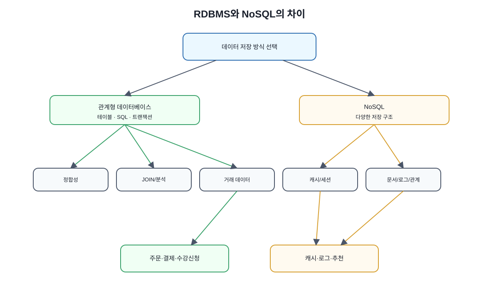

그림 12-1 RDBMS와 NoSQL 역할 나누기

| 판단 항목 | RDBMS가 유리한 경우 | NoSQL을 검토할 수 있는 경우 |
| --- | --- | --- |
| 구조 | 테이블·컬럼·관계가 명확 | 키·문서·파티션·그래프 중심 |
| 무결성 | PK·FK·UNIQUE·CHECK 중요 | 애플리케이션·모델 규칙 비중이 큼 |
| 트랜잭션 | 여러 테이블 변경 원자성 중요 | 한 키·문서·파티션 중심일 수 있음 |
| 조회 | JOIN·집계·다양한 조건 | 고정 키·문서·파티션·관계 탐색 |
| 변경 | 명시적 마이그레이션 선호 | 문서·속성 변화가 잦을 수 있음 |
| 운영 | 기존 SQL·권한·백업 체계 활용 | 별도 모니터링·백업·장애 대응 필요 |

온라인 강의 서비스의 수강신청과 신청 당시 금액 기록은 `course_project`의 RDBMS 원본에 두는 것이 자연스럽습니다. 인기 강의 목록은 원본에서 계산한 파생 데이터이므로 Key-Value 캐시 후보가 될 수 있습니다.

한 서비스에서 여러 저장소를 목적별로 사용하는 방식을 흔히 polyglot persistence라고 부릅니다. 저장소 수가 늘어날수록 동기화·보안·백업·장애 대응 범위도 늘어납니다.

위 표는 데이터베이스 계열별 **절대 보장 목록**이 아닙니다. 같은 Document·Key-Value·Wide-Column 계열 안에서도 트랜잭션, 일관성, 인덱스, 분산 동작은 제품과 배포 구성에 따라 달라질 수 있습니다. 따라서 실제 선택에서는 제품 공식 문서와 작은 PoC로 보장 범위를 다시 확인합니다.

---

## 3. 저장소보다 먼저 시스템 역할을 정한다

| 시스템 역할 | 설명 | 온라인 강의 예 |
| --- | --- | --- |
| Source of Truth | 최종 판단 기준이 되는 원본 | 수강신청·신청 당시 금액 |
| Derived Cache | 원본에서 계산·복사한 파생 데이터 | 인기 강의 TOP 3 |
| Ephemeral State | 만료되거나 다시 만들 수 있는 상태 | 로그인 세션 |
| Flexible Metadata | 항목별 구조가 달라질 수 있는 부가 정보 | 태그·옵션·표시용 스냅샷 |
| Event Log | 시간순으로 쌓이는 사실 기록 | 재생·정지·완료 이벤트 |
| Relationship Index | 관계 탐색을 빠르게 하는 파생 구조 | 추천 그래프 |

원본과 파생 데이터를 구분하지 않으면 장애 시 무엇을 신뢰하고 무엇을 재구축해야 하는지 판단하기 어렵습니다.

```text
캐시와 원본이 다르면 어느 쪽을 신뢰하는가?
추천 그래프를 잃으면 원본에서 다시 만들 수 있는가?
이벤트가 중복 수집되면 제거할 event_id가 있는가?
문서 메타데이터가 가격·신청 상태 같은 핵심 규칙을 대신해도 되는가?
```

---

## 4. NoSQL 유형 한눈에 보기

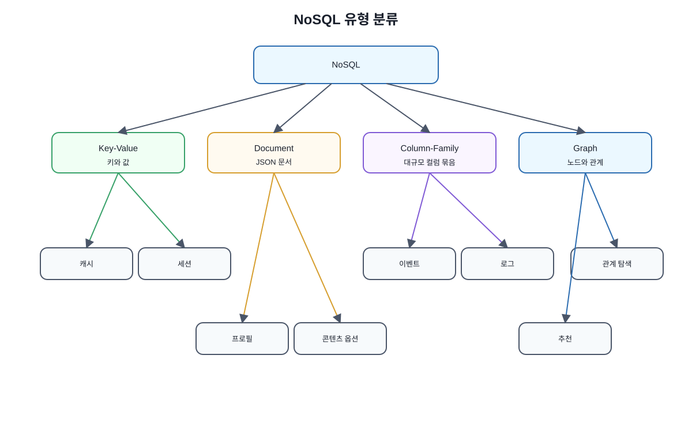

그림 12-2 NoSQL 유형 정리

| 유형 | 중심 모델 | 주된 접근 방식 | 온라인 강의 예 |
| --- | --- | --- | --- |
| Key-Value | 키 → 값 | 정확한 키 조회·만료 | 세션, 캐시, 기능 플래그 |
| Document | 독립 문서 | 문서 ID·필드 조건 | 강의 메타데이터·설정 문서 |
| Column-Family | 파티션·정렬 키 | 특정 파티션 범위 조회 | 학생별 날짜별 이벤트 |
| Graph | 노드·관계 | 다단계 관계 탐색 | 학생·강의·주제 추천 |

검색 엔진, 벡터 DB와 오브젝트 스토어도 데이터 시스템 구성 요소가 될 수 있지만 이 장에서는 제외합니다.

---

## 5. Key-Value DB: 정확한 키와 만료가 중심이다

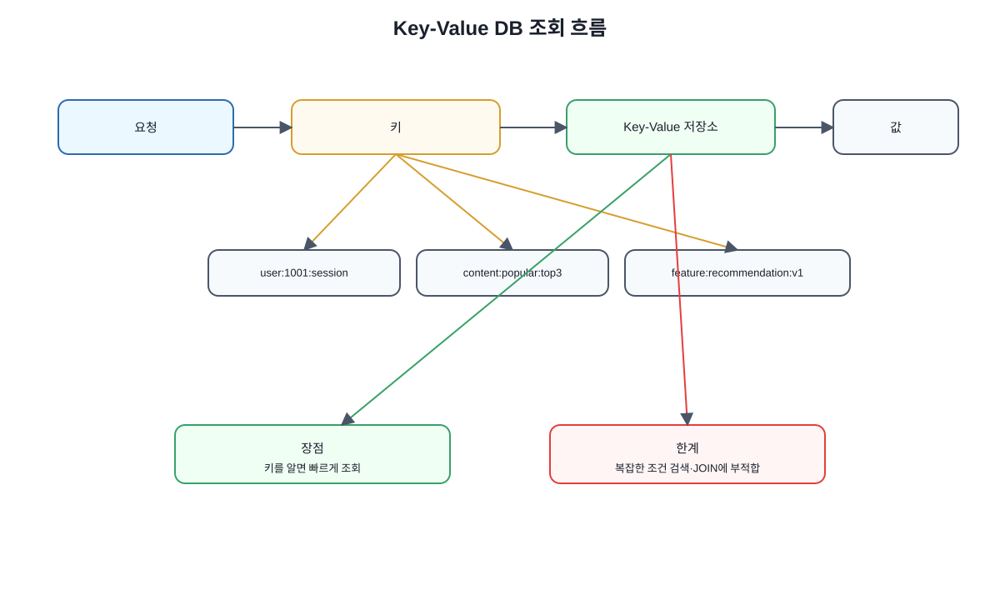

그림 12-3 Key-Value 조회와 캐시 미스

예시 키:

| 키 | 의미 | 원본 여부 |
| --- | --- | --- |
| `student:101:session` | 로그인 세션 상태 | 임시 상태 |
| `course:popular:v1:top3` | 인기 강의 ID 목록 | 파생 캐시 |
| `feature:recommendation:v1` | 기능 활성화 설정 | 운영 상태 |

좋은 키는 네임스페이스, 식별자, 버전과 목적이 드러납니다.

```text
좋은 방향: course:popular:v1:top3
주의 방향: top3
```

캐시 미스 흐름:

```text
1. 정확한 키로 캐시를 조회한다.
2. 값이 없거나 만료되면 원본 RDBMS를 조회한다.
3. 원본 결과로 캐시를 다시 만든다.
4. 사용자에게 결과를 반환한다.
```

추가 결정:

```text
TTL은 얼마인가?
TTL이 없는 키도 허용하는가?
원본 변경 시 삭제할 것인가, 갱신할 것인가?
동시 재생성 요청을 어떻게 줄이는가?
캐시 장애 시 원본 부하 급증을 막을 수 있는가?
오래된 값을 얼마 동안 허용하는가?
```

Key-Value 모델의 중심은 **키를 기준으로 값을 찾는 접근 방식**이며 TTL은 선택 가능한 정책 중 하나입니다. 예를 들어 Redis에서 key expiration은 지정한 시간이 지나 키를 만료시키는 기능이고, eviction은 메모리 한도에 도달했을 때 설정한 정책으로 키를 제거하는 동작입니다. 둘은 같은 개념이 아니므로 “TTL이 곧 eviction”이라고 설명하지 않습니다.

### 실습 모델의 범위

`nosql_lab.key_value_cache_examples`는 PostgreSQL 일반 테이블입니다.

```text
자동 TTL 삭제 없음
메모리 저장·eviction 없음
복제·샤딩 없음
실제 Key-Value 네트워크 성능 없음
```

`cache_value`는 편의를 위해 JSONB로 저장하지만 JSON 객체만 강제하지 않습니다. `expired_at IS NULL`은 만료 정책이 없는 키를 의미합니다.

### Seed 기준과 현재 기준을 구분한다

Seed 기준은 다음처럼 각 행의 생성 시각과 만료 시각을 비교합니다.

```sql
expired_at IS NULL OR expired_at > created_at
```

기대 결과:

```text
전체 4
Seed 시점 유효 3
Seed 시점 만료 1
```

실제 현재 상태는 다음 조건으로 확인합니다.

```sql
expired_at IS NULL OR expired_at > CURRENT_TIMESTAMP
```

현재 유효 건수는 시간이 지나면 달라질 수 있으므로 고정 정답으로 사용하지 않습니다.

---

## 6. Document DB: 함께 읽고 쓰는 문서 경계를 정한다

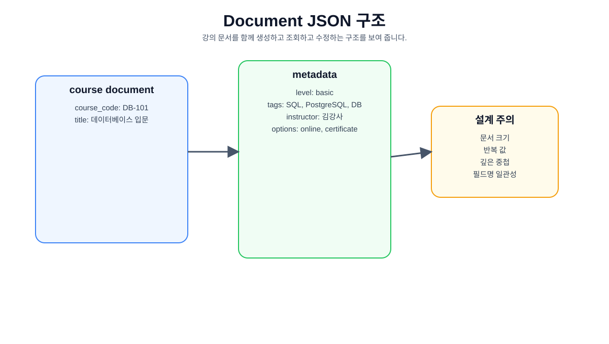

그림 12-4 Document JSON 구조

문서에 포함할 데이터는 관련 있어 보이는 모든 것이 아니라 **함께 읽고 쓰는 경계**로 결정합니다.

문서 안에 포함할 수 있는 방향:

```text
상세 화면에서 항상 함께 읽는 태그·옵션
문서와 수명이 같고 독립적으로 공유되지 않는 값
문서 단위 원자적 갱신이 필요한 값
```

별도 원본·참조를 검토하는 방향:

```text
여러 문서가 공유하는 강사 원본
매우 자주 독립적으로 바뀌는 데이터
크기가 계속 증가하는 배열
강한 관계 무결성이 필요한 데이터
```

유연한 스키마는 규칙이 없다는 뜻이 아닙니다. 필드 이름, 타입, 필수 여부, 문서 버전과 마이그레이션 정책을 관리해야 합니다.

문서 단위 원자성도 Document DB 전체의 공통 보장으로 외우지 않습니다. 예를 들어 MongoDB는 단일 문서 쓰기를 원자적으로 처리하고, replica set·sharded cluster에서는 여러 문서를 묶는 트랜잭션도 지원합니다. 다른 Document DB의 지원 범위와 비용은 다를 수 있으므로 제품·배포 구성별로 확인합니다.

---

## 7. 안정된 컬럼과 가변 메타데이터를 분리한다

Chapter 12는 Chapter 07 원본과 맞춘 다음 문서를 사용합니다.

| source_course_id | course_code | title | level |
| ---: | --- | --- | --- |
| 301 | COURSE-301 | 데이터베이스 입문 | basic |
| 302 | COURSE-302 | 정규화 실습 | basic |
| 303 | COURSE-303 | 파이썬 데이터 분석 | basic |

```sql
CREATE TABLE nosql_lab.course_documents (
    id BIGINT GENERATED BY DEFAULT AS IDENTITY PRIMARY KEY,
    source_course_id INTEGER NOT NULL UNIQUE,
    course_code TEXT NOT NULL UNIQUE,
    title TEXT NOT NULL,
    level TEXT NOT NULL,
    metadata JSONB NOT NULL,
    document_version INTEGER NOT NULL DEFAULT 1,
    created_at TIMESTAMPTZ NOT NULL,
    updated_at TIMESTAMPTZ NOT NULL
);
```

일반 컬럼:

```text
source_course_id
course_code
title
level
document_version
created_at
updated_at
```

JSONB:

```text
tags
options
instructor_snapshot
```

`level`은 모든 문서에서 중요하고 자주 검증·검색하므로 일반 컬럼으로 둡니다. JSONB에 모든 것을 넣으면 타입·제약·통계·JOIN과 변경 관리가 어려워질 수 있습니다.

### 강사 스냅샷의 의미

```json
{
  "instructor_snapshot": {
    "source_instructor_id": 201,
    "name": "문길래",
    "specialty": "Database",
    "copied_at": "..."
  }
}
```

이 값은 상세 화면 표시를 위한 파생 복사본입니다. 최종 원본은 `course_project.instructors`입니다. 변경 이벤트가 누락되면 `source_instructor_id`로 대조하고 다시 만들어야 합니다.

외부 FK를 만들면 `nosql_lab` 단독 이동성이 낮아질 수 있으므로 물리적 FK 대신 최종 검증 SQL에서 원본과 대조합니다.

---

## 8. Column-Family DB: 조회 문장에서 역으로 설계한다

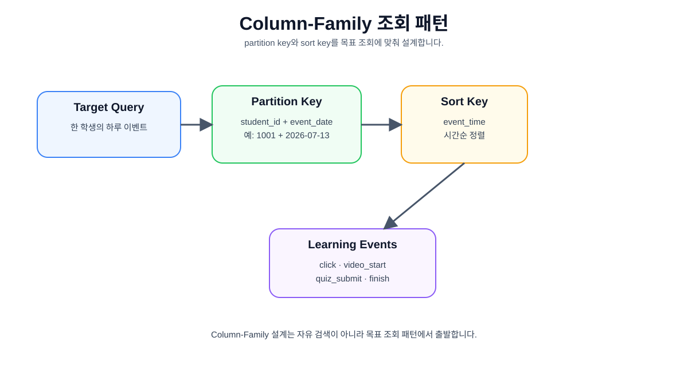

그림 12-5 Column-Family 조회 패턴

목표 조회:

```text
학생 101의 2026-07-13 학습 이벤트를 시간순으로 읽는다.
```

| 설계 요소 | 예시 |
| --- | --- |
| partition key | `(student_id, event_date)` |
| clustering key | `event_time` |
| row data | event_id, event_type, course_id, position_seconds |
| target query | 특정 학생·날짜의 시간 범위 조회 |

여기서 partition key와 clustering key는 Cassandra 계열을 중심으로 한 개념 예시입니다. Apache Cassandra CQL에서는 partition key가 같은 값을 가진 행을 하나의 파티션으로 묶고, clustering column이 그 파티션 안의 행 정렬을 정의합니다. 그래서 먼저 목표 조회를 정하고 그 조회에 맞춰 키를 설계합니다. 제품마다 키 구조, 정렬, 보조 인덱스와 트랜잭션 범위는 다를 수 있습니다.

확인 항목:

```text
파티션이 지나치게 커지지 않는가?
특정 학생·날짜에 쓰기가 집중되는가?
event_id로 중복을 제거할 수 있는가?
늦게 도착한 이벤트를 어떻게 처리하는가?
보존 기간과 분석 전달 경로는 무엇인가?
```

새로운 조회 패턴이 생기면 별도의 파생 테이블이나 파이프라인이 필요할 수 있습니다.

---

## 9. Graph DB: 관계의 존재보다 탐색 깊이가 중요하다

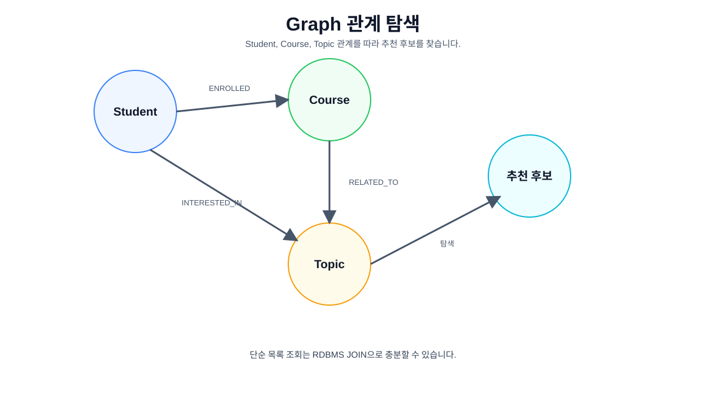

그림 12-6 Graph 관계 탐색

| 구성 요소 | 예 |
| --- | --- |
| 노드 | Student, Course, Topic |
| 관계 | ENROLLED, INTERESTED_IN, RELATED_TO |
| 속성 | 수강 시각, 관심도, 유사도 |
| 질문 | 주제 X와 연결된 학생에게 추천할 강의는 무엇인가? |

```text
강의별 수강 학생 목록
→ RDBMS FK와 JOIN으로 충분할 가능성이 큼

학생→주제→관련 강의→유사 학생→다른 강의
→ 다단계 관계 탐색이 반복되면 Graph DB 검토
```

추천 그래프가 원본인지 RDBMS·이벤트에서 만든 파생 관계 인덱스인지도 정해야 합니다. 파생 인덱스라면 재구축 방법과 허용 지연을 설계합니다.

---

## 10. 트랜잭션과 일관성은 제품·범위별로 확인한다

“NoSQL은 최종 일관성, RDBMS는 강한 일관성”처럼 단순하게 구분하면 안 됩니다.

```text
한 키·문서·파티션 변경은 원자적인가?
여러 문서·파티션 트랜잭션이 필요한가?
쓰기 직후 최신 읽기가 필요한가?
복제 지연 중 오래된 읽기를 허용하는가?
네트워크 분할 중 읽기·쓰기는 어떻게 동작하는가?
충돌을 어떤 규칙으로 해결하는가?
```

CAP도 “항상 세 가지 중 두 개만 선택한다”는 표어가 아니라 네트워크 분할 상황에서 일관성과 가용성의 동작을 검토하는 관점으로 사용합니다.

잔여 좌석처럼 즉시 일치해야 하는 원본 규칙과 인기 강의 캐시처럼 잠시 오래된 값이 허용되는 데이터를 같은 기준으로 처리하지 않습니다.

---

## 11. 여러 저장소 사이의 동기화가 어려운 이유

```text
RDBMS 수강신청 COMMIT 성공
→ 추천 그래프 갱신 실패

RDBMS 강의 수정 성공
→ 문서 스냅샷 갱신 실패

신청 취소 성공
→ 인기 강의 캐시 무효화 실패
```

애플리케이션이 두 저장소에 순서대로 직접 쓰면 중간 실패 시 불일치를 남길 수 있습니다.

검토 대안:

```text
원본 DB를 하나로 정하고 파생 저장소를 비동기로 갱신
변경 이벤트·메시지 큐·CDC 활용
재시도와 중복에 대비한 멱등성 키
실패 이벤트와 재처리 대기열
주기적 대조·재구축
데이터 버전과 갱신 시각 기록
```

새 저장소를 선택할 때는 조회 성능뿐 아니라 **불일치 탐지와 복구 방법**을 포함합니다.

---

## 12. PostgreSQL JSONB로 문서형 요구를 검증한다

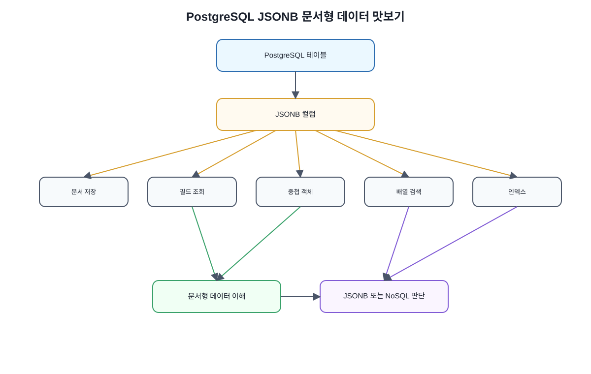

그림 12-7 JSONB 실습 흐름

Chapter 12는 앞 장을 변경하지 않고 별도 공간을 사용합니다.

```text
nosql_lab.course_documents
nosql_lab.key_value_cache_examples
nosql_lab.storage_choice_cases
```

파일 구성:

```text
01_nosql_lab_schema.sql
02_nosql_lab_seed.sql
03_document_jsonb_queries.sql
04_key_value_cache_queries.sql
05_storage_choice_review.sql
06_jsonb_index_candidates.sql
07_nosql_lab_validation.sql
reset_nosql_lab.sql
```

이 실습은 전용 NoSQL 제품의 분산 처리·성능·TTL·복제·장애 동작을 구현하지 않습니다. 교재의 SQL 자동 검증 기준은 **PostgreSQL 16**이며, 전용 NoSQL 제품의 기능 보장은 각 제품 공식 문서와 별도 PoC에서 확인합니다.

---

## 13. JSONB 조회 연산자와 검증 책임

| 연산자 | 결과 | 예 |
| --- | --- | --- |
| `->` | JSONB 값 | `metadata -> 'options'` |
| `->>` | text 값 | `metadata ->> 'field'` |
| `#>` | 깊은 경로 JSONB | `metadata #> '{options,online}'` |
| `#>>` | 깊은 경로 text | `metadata #>> '{options,online}'` |
| `?` | 최상위 키 존재 | `metadata ? 'instructor_snapshot'` |
| `@>` | JSONB 포함 | `metadata @> '{"tags":["SQL"]}'` |

검증 책임:

| 규칙 | DB 제약조건 | 애플리케이션·검증 SQL |
| --- | --- | --- |
| metadata 객체 | 적용 | 재확인 |
| course_code·title 공백 | 적용 | 보조 |
| level 허용값 | 일반 컬럼 CHECK | 보조 |
| tags 배열 | 선택 | 적용 |
| options 객체 | 선택 | 적용 |
| options.online boolean | 선택 | 적용 |
| instructor_snapshot 원본 대조 | 미적용 | 적용 |
| 문서 스키마 마이그레이션 | 어려움 | 주 책임 |

CHECK 하나로 깊은 JSON 전체를 완전히 검증하려 하기보다 핵심 규칙과 변화가 잦은 규칙을 나눕니다.

---

## 14. document_version으로 낙관적 잠금을 실습한다

단순히 버전을 증가시키기만 하면 동시 변경 충돌을 막을 수 없습니다. 읽은 버전을 조건에 넣습니다.

```sql
UPDATE nosql_lab.course_documents
SET
    metadata = jsonb_set(
        metadata,
        '{options,certificate}',
        'false'::jsonb
    ),
    document_version = document_version + 1,
    updated_at = CURRENT_TIMESTAMP
WHERE course_code = 'COURSE-301'
  AND document_version = 1
  AND jsonb_typeof(metadata -> 'options') = 'object';
```

영향 행 수가 1이면 예상 버전과 경로가 맞았습니다. 0이면 다른 사용자가 먼저 수정했거나 JSON 경로가 다를 수 있습니다.

`jsonb_set`은 중간 경로가 존재해야 기대한 변경이 이루어집니다. 따라서 경로 타입을 먼저 확인하고 변경 결과를 검증합니다.

실습 파일은 변경 후 다음 결과를 확인합니다.

```text
certificate=false
document_version=2
```

그 뒤 `ROLLBACK`해 기준을 유지합니다.

```text
certificate=true
document_version=1
```

`updated_at`은 자동으로 갱신되지 않습니다. 변경 SQL 또는 애플리케이션이 갱신 책임을 집니다.

---

## 15. JSONB 인덱스는 실제 질의 형태로 검토한다

```text
metadata @> ...
→ GIN 후보

metadata #>> '{options,online}' = 'true'
→ 표현식 B-tree 후보
```

```sql
CREATE INDEX idx_nosql_course_documents_metadata_gin
ON nosql_lab.course_documents
USING GIN (metadata);

CREATE INDEX idx_nosql_course_documents_online
ON nosql_lab.course_documents ((metadata #>> '{options,online}'));
```

`CREATE INDEX IF NOT EXISTS`는 같은 이름의 기존 인덱스 정의가 올바른지 보장하지 않습니다. `06_jsonb_index_candidates.sql`은 인덱스 미존재를 확인한 뒤 생성하고 `pg_indexes`와 카탈로그에서 정의를 검증합니다.

기본 `jsonb_ops`는 `?`, `?|`, `?&`, `@>`, `@?`, `@@` 등 다양한 연산을 지원합니다. `jsonb_path_ops`는 `@>`, `@?`, `@@`를 지원하지만 키 존재 계열 `?`, `?|`, `?&`는 지원하지 않습니다. 실제 질의 형태에 따라 선택합니다.

표본이 3행뿐이므로 인덱스가 있어도 PostgreSQL이 `Seq Scan`을 선택할 수 있습니다. 이 실습의 목적은 성능 향상 증명이 아니라 **질의 형태와 인덱스 구조의 대응**을 확인하는 것입니다.

---

## 16. 저장소 후보와 최종 결정을 구분한다

`storage_choice_cases`는 정답표가 아니라 의사결정 기록입니다.

```text
system_role
primary_query
candidate_storage
source_of_truth
consistency_requirement
synchronization_strategy
recovery_strategy
poc_success_criteria
decision_status
reason
```

결정 상태:

```text
candidate
poc_planned
hold
adopted
rejected
```

| 사례 | 후보 | 상태 |
| --- | --- | --- |
| 수강신청·신청 당시 금액 | PostgreSQL RDBMS | adopted |
| 로그인 세션 | Key-Value | poc_planned |
| 인기 강의 캐시 | Key-Value | poc_planned |
| 유연 메타데이터 | JSONB 또는 Document | candidate |
| 학습 이벤트 | Column-Family | hold |
| 추천 관계 | Graph | candidate |

후보 저장소가 있다는 사실과 실제 채택은 다릅니다.

---

## 17. 작은 검증 실험부터 시작한다

```text
1. 대표 조회 2~3개를 고정한다.
2. 실제와 비슷한 데이터 분포·크기를 준비한다.
3. 성공·실패 조건을 정한다.
4. 읽기·쓰기·지연·중복·재시도를 측정한다.
5. 장애·복구·백업·권한 절차를 시험한다.
6. 기존 RDBMS·JSONB 방식과 비교한다.
7. 적용·보류·제외 결정을 기록한다.
```

평균 응답 시간만 보는 것은 부족합니다. 데이터 손실, 중복, 재처리, 장애 복구, 운영 인력과 비용도 확인합니다.

---

## 18. AI가 추천한 저장소 선택을 검토한다

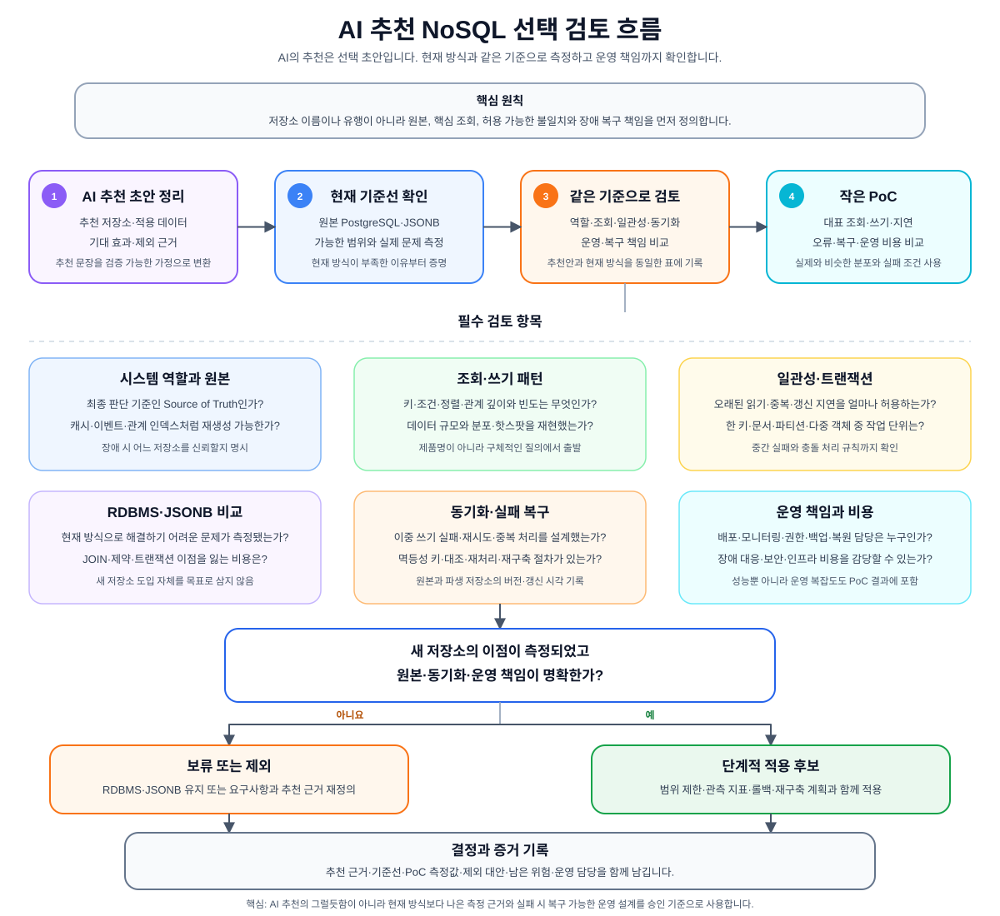

그림 12-8 AI 추천 NoSQL 선택 검토 흐름

AI 요청 예:

```text
온라인 강의 서비스의 저장소 후보를 검토해 주세요.

현재 PostgreSQL 원본:
- students, instructors, courses, enrollments
- 신청 당시 기록 금액은 `enrollments.recorded_amount NUMERIC(12,0)`에 저장
- `recorded_amount`는 결제 승인액·환불 반영 순액·회계 매출이 아님
- 별도 결제·환불 원장은 현재 프로젝트 범위 밖

검토 데이터:
- 로그인 세션
- 인기 강의 캐시
- 강의별 가변 메타데이터
- 학생별 날짜·시간순 학습 이벤트
- 학생·강의·주제 추천 관계

각 항목에 대해 작성하세요.
1. 시스템 역할
2. 핵심 읽기·쓰기 패턴
3. RDBMS·JSONB로 충분한지
4. NoSQL 유형 후보와 제외 근거
5. 트랜잭션·일관성 범위
6. 동기화 실패·재시도·멱등성
7. 복구·백업·보안·모니터링 책임
8. PoC 성공 기준과 결정 상태
```

| 검토 항목 | 확인 질문 |
| --- | --- |
| 원본 | 최종 판단 기준 저장소가 명확한가? |
| 조회 패턴 | 키·조건·정렬·관계 깊이가 구체적인가? |
| 일관성 | 오래된 읽기·중복 허용 범위가 있는가? |
| 트랜잭션 | 한 키·문서·파티션·다중 객체 범위가 명확한가? |
| JSONB 비교 | PostgreSQL 안에서 충분한지 먼저 봤는가? |
| 동기화 | 이중 쓰기 실패·재시도·멱등성을 고려했는가? |
| 복구 | 파생 저장소를 다시 만들 수 있는가? |
| 운영 | 배포·모니터링·백업·권한 담당이 있는가? |
| 검증 | 실제 데이터와 실패 조건을 포함한 PoC인가? |
| 결정 | 후보와 채택 상태를 구분했는가? |

잘못된 제안:

```text
트래픽이 많으므로 모든 테이블을 NoSQL로 이동
JSON을 저장하므로 무조건 Document DB
로그라는 이유만으로 조회 패턴 없이 Column-Family
관계가 있다는 이유만으로 단순 JOIN도 Graph DB
캐시를 원본처럼 사용하고 재구축 경로 누락
제품 이름만으로 일관성·트랜잭션 단정
운영·백업·복구 비용 누락
```

---

## 19. 실행 안전성과 최종 검증

`01_nosql_lab_schema.sql`은 다음을 검사합니다.

```text
현재 DB = ai_database_book
course_project = students 3, instructors 2, courses 3, enrollments 5
상태 = 신청 2 / 수강중 1 / 완료 1 / 취소 1
recorded_amount = NUMERIC(12,0)
전체 기록 금액 = 590000
활성 신청 = 3 / 340000
취소 제외 = 4 / 440000
1001 = 완료 / 100000
1004 = 취소 / 150000
1005 = 신청 / 120000
활성 신청 부분 고유 인덱스 존재
Chapter 07 명명 제약조건 15개 / NOT NULL 열 20개 유지
현재 역할에 ai_database_book CREATE 권한 존재
nosql_lab 미존재
```

Chapter 12는 `security_lab`의 존재를 시작 조건으로 요구하지 않습니다. 앞 장 실습이 남아 있다면 변경하지 않고, 없어도 Chapter 07·08의 canonical `course_project`만 맞으면 시작할 수 있습니다.

스키마와 테이블은 하나의 트랜잭션에서 생성합니다.

`02_nosql_lab_seed.sql`은 세 테이블이 비어 있는지 확인하고 문서·캐시·선택 사례를 하나의 트랜잭션에서 입력합니다.

`reset_nosql_lab.sql`은 `ai_database_book`이 아니면 삭제를 중단합니다.

`07_nosql_lab_validation.sql`은 다음을 자동 판정합니다.

```text
Chapter 07 기준 3/2/3/5 + 명명 제약조건 15개 + NOT NULL 열 20개
Chapter 12 기준 3/4/6
강의 301~303 원본 매핑
강사 스냅샷 원본 대조
JSONB 구조·버전·시각
COURSE-301 ROLLBACK 기준
Seed 캐시 4/3/1
인기 강의 course_ids 301~303
시스템 역할 6종
선택 근거 공백 0건
adopted 사례 1건
GIN·표현식 인덱스 정의
```

통과 메시지:

```text
Chapter 12 nosql_lab validation passed
```

---

## 20. 자주 하는 실수

1. NoSQL을 RDBMS의 완전한 대체재로 설명한다.
2. “스키마가 없다”를 “규칙이 없다”로 이해한다.
3. 캐시의 현재 유효 건수를 고정 정답으로 사용한다.
4. 파생 문서의 원본 식별자를 기록하지 않는다.
5. 안정된 핵심 필드까지 모두 JSONB에 넣는다.
6. 강사 복사본을 원본인지 스냅샷인지 정의하지 않는다.
7. 조회 패턴 없이 Column-Family 키를 설계한다.
8. 관계가 있다는 이유만으로 Graph DB를 선택한다.
9. 두 저장소에 직접 쓰고 중간 실패를 고려하지 않는다.
10. `document_version`을 저장만 하고 UPDATE 조건에 사용하지 않는다.
11. `jsonb_set`의 중간 경로 존재를 확인하지 않는다.
12. `CREATE INDEX IF NOT EXISTS`가 정의까지 검증한다고 생각한다.
13. 후보 저장소를 이미 채택한 것으로 기록한다.
14. 성능만 측정하고 복구·보안·운영 비용을 제외한다.

---

## 21. 스스로 확인하기

1. NoSQL이 RDBMS의 반대말이나 완전한 대체재가 아닌 이유는 무엇인가요?
2. Source of Truth와 Derived Cache는 어떻게 다른가요?
3. Seed 기준 캐시 상태와 현재 시각 기준 상태를 구분해야 하는 이유는 무엇인가요?
4. Key-Value 키에 네임스페이스와 버전을 포함하는 이유는 무엇인가요?
5. 문서 포함과 참조를 판단하는 기준은 무엇인가요?
6. `level`을 JSONB가 아닌 일반 컬럼에 둔 이유는 무엇인가요?
7. `instructor_snapshot`이 원본이 아닌 이유는 무엇인가요?
8. Column-Family 설계가 조회 문장에서 시작해야 하는 이유는 무엇인가요?
9. 단순 JOIN과 다단계 그래프 탐색은 어떻게 다른가요?
10. 여러 저장소에 직접 이중 쓰기할 때 어떤 실패가 남나요?
11. `document_version`은 동시 수정 충돌을 어떻게 탐지하나요?
12. `jsonb_set`에서 중간 경로를 확인해야 하는 이유는 무엇인가요?
13. GIN과 표현식 B-tree 인덱스의 대상 질의는 어떻게 다른가요?
14. 후보 저장소와 `adopted` 상태는 어떻게 다른가요?
15. PoC에서 응답 시간 외에 무엇을 검증해야 하나요?

---

## 22. 권장 해설

### 원본과 파생 데이터

```text
Source of Truth는 최종 판단 기준이다.
캐시·문서 스냅샷·추천 그래프는 원본에서 다시 만들 수 있는 파생 구조일 수 있다.
```

### 캐시 시간 기준

```text
created_at과 expired_at 비교는 Seed 시점 상태를 재현한다.
CURRENT_TIMESTAMP 비교는 실제 현재 상태이며 시간이 지나면 결과가 달라진다.
```

### 혼합 문서 설계

```text
모든 문서에서 중요하고 자주 검증·검색하는 값은 일반 컬럼에 둔다.
문서마다 달라지는 태그·옵션·표시용 스냅샷은 JSONB 후보가 된다.
```

### 문서 버전

```text
UPDATE 조건에 읽은 document_version을 포함한다.
영향 행 수 0은 충돌 또는 경로 불일치 신호다.
```

### 인덱스

```text
@> 포함 검색은 GIN 후보,
특정 JSON 경로의 동등 조건은 표현식 B-tree 후보다.
작은 표본의 Seq Scan은 오류가 아니다.
```

### 저장소 결정

```text
candidate는 검토 대상이고 adopted는 근거와 검증을 거친 현재 결정이다.
PoC는 성능뿐 아니라 중복·장애·복구·보안·비용을 포함한다.
```

---

## 23. 핵심 정리

```text
1. NoSQL은 여러 비관계형 저장 모델의 계열이며 RDBMS의 완전한 대체재가 아니다.
2. 저장소 선택은 데이터의 시스템 역할과 대표 조회에서 시작한다.
3. Key-Value는 정확한 키·TTL·미스·재생성 경로가 중요하다.
4. Document는 함께 읽고 쓰는 경계와 스키마·버전 책임이 중요하다.
5. Column-Family는 대표 조회에서 파티션·정렬 키를 역으로 설계한다.
6. Graph는 관계 존재보다 다단계 탐색이 핵심일 때 검토한다.
7. 여러 저장소에는 동기화·재시도·멱등성·재구축 책임이 생긴다.
8. 안정된 핵심 필드는 일반 컬럼, 가변 부가는 JSONB로 분리할 수 있다.
9. 문서 버전과 영향 행 수로 낙관적 충돌을 탐지한다.
10. 캐시 Seed 기준과 실제 현재 상태를 구분한다.
11. 후보 저장소와 최종 채택 상태를 분리한다.
12. 새 저장소는 실패·복구·운영까지 작은 PoC에서 검증한다.
```

이 장에서 기억할 문장은 다음과 같습니다.

```text
저장소는 데이터 모양이 아니라,
원본의 책임과 반복되는 조회·실패·복구 패턴으로 선택한다.
```

---

## 24. 다음 장에서는

Chapter 13에서는 ChatGPT와 Codex를 사용해 요구사항, 테이블, 제약조건, SQL과 검증 결과를 체계적으로 리뷰하는 방법을 다룹니다.

```text
AI에 제공할 설계 문맥
요구사항에서 누락된 규칙 찾기
DDL·DML·조회 SQL 검토
샘플 데이터와 반례 생성
파괴적 SQL·과도한 권한·성능 제안 검토
검토 결과를 변경 이력으로 남기기
```

저장소 선택도 AI에게 맡길 수 있는 정답 문제가 아닙니다. 사람이 업무 규칙과 실패 비용을 정의하고 AI 결과를 검증해야 합니다.

---

# Chapter 13. AI와 실행 증거로 데이터베이스 설계 검증하기

---

## 이 장에서 살펴볼 내용

Chapter 12에서는 원본의 책임과 조회 패턴을 기준으로 RDBMS, JSONB와 NoSQL 후보를 비교했습니다. 저장소 유형을 결정한 뒤에도 테이블·관계·제약조건·SQL이 실제 업무 규칙과 맞는지 검증해야 합니다.

ChatGPT와 Codex 같은 AI 도구는 요구사항 정리, 설계 대안 비교, DDL·테스트 SQL 작성과 저장소 파일 수정 속도를 높일 수 있습니다. 그러나 AI가 만든 SQL이 실행된다는 사실은 설계가 올바르다는 뜻이 아닙니다.

```text
요구사항에 없는 UNIQUE가 추가될 수 있다.
삭제 정책이 미확정인데 CASCADE가 적용될 수 있다.
LEFT JOIN의 NULL 때문에 결제 누락을 발견하지 못할 수 있다.
현재 강의 가격과 신청 시점 금액을 같은 값으로 오해할 수 있다.
운영 데이터에 DROP·DELETE를 실행하는 스크립트가 만들어질 수 있다.
실제 비밀번호·이메일·접속 URL이 프롬프트나 테스트 데이터에 포함될 수 있다.
```

이 장에서는 다음 검토 흐름을 사용합니다.

```text
확인된 요구사항·결정·미확정 정책 정리
→ AI에 전달할 문맥 묶음 작성
→ ERD·DDL·SQL 초안 생성
→ 수정 범위와 금지 범위 확인
→ 격리된 ai_review_lab에 생성
→ 정상 데이터·경계값·반례·메타데이터 검증
→ 업무 정합성 조회
→ 파일별 diff와 파괴적 변경 검토
→ 전체 자동 판정
→ 검증 증거·남은 가정 기록
→ 사람이 승인·조건부 승인·보류·거절 결정
```

> **핵심 원칙**
>
> AI 결과는 정답이 아니라 변경 후보입니다. 요구사항 추적, 실제 생성 구조, 정상·경계값·실패 테스트와 변경 diff가 모두 확인되어야 승인할 수 있습니다.

---

## 1. AI가 빠르게 만드는 것과 사람이 책임질 것은 다르다

AI는 짧은 시간에 엔터티 후보, 관계, PostgreSQL DDL, 샘플 데이터와 검증 SQL을 제안할 수 있습니다. 하지만 업무 정책의 사실 여부와 변경 위험을 스스로 책임질 수는 없습니다.

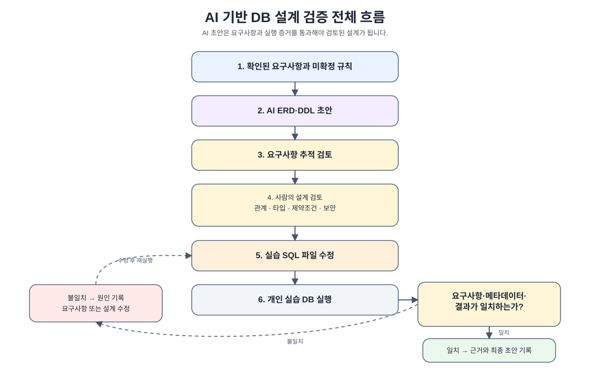

그림 13-1 AI 기반 DB 설계 검증 전체 흐름

검토의 기준은 다음 연결입니다.

```text
확인된 요구사항
→ ERD와 DDL의 반영 위치
→ 실제 PostgreSQL 메타데이터
→ 정상 입력과 의도한 오류
→ 업무 정합성 결과
→ 변경 diff와 검토 기록
```

AI가 제시한 설명이 자연스럽거나 SQL이 문법적으로 성공해도 이 연결이 끊기면 검토가 끝난 것이 아닙니다.

---

## 2. ChatGPT·Codex·사람의 권장 협업 흐름

ChatGPT와 Codex의 지원 기능과 사용 환경은 바뀔 수 있으며 서로 겹치는 기능도 있습니다. 이 장의 구분은 제품의 절대 기능 경계가 아니라 데이터베이스 작업을 안전하게 진행하기 위한 권장 흐름입니다. **2026년 8월 출판 검수 시점의 OpenAI 공식 안내**는 Chat을 빠른 대화형 지원, Work를 더 길고 여러 단계인 작업과 완성된 산출물, Codex를 소프트웨어 개발·기술 작업에 맞춘 환경으로 설명합니다. 제공 범위는 플랜·워크스페이스·사용 화면에 따라 달라질 수 있으므로 실제 사용 시 최신 공식 안내를 다시 확인합니다.

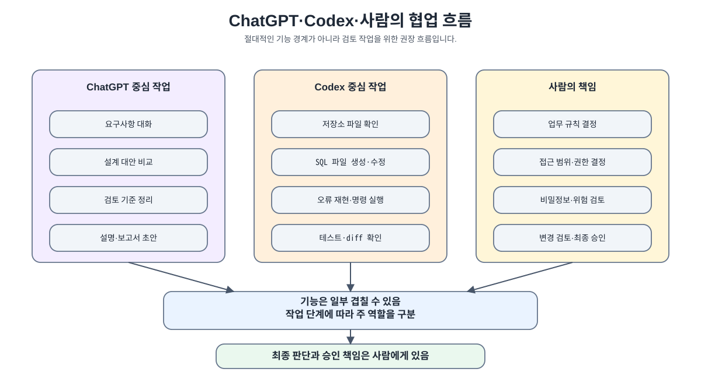

그림 13-2 ChatGPT·Codex·사람의 협업 흐름

| 참여자 | 활용하기 좋은 작업 | 맡기면 안 되는 최종 결정 |
| --- | --- | --- |
| ChatGPT Chat | 요구사항 구조화, 설계 대안·검토 질문·프롬프트 초안 | 미확정 업무 정책 확정 |
| ChatGPT Work | 긴 다단계 검토, 자료 분석, 검토 보고서 같은 완성 산출물 작성 지원 | 실행 증거 없이 변경 승인 |
| Codex | 저장소 탐색, 대상 파일 수정, SQL·테스트 작성, diff·실행 지원 | 변경 자동 승인 |
| 사람 | 요구사항 확인, 데이터·권한·운영 범위 결정, 실행 결과와 diff 검토 | 최종 책임을 AI에 이전 |

```text
정책을 사람이 확인한다.
AI가 초안을 만든다.
격리 환경에서 실행한다.
증거를 수집한다.
사람이 승인한다.
```

---

## 3. AI에 전달할 설계 문맥 묶음

좋은 결과를 얻으려면 질문 한 줄이 아니라 검토 가능한 문맥을 제공해야 합니다.

| 문맥 항목 | 포함할 내용 |
| --- | --- |
| 업무 목표 | 무엇을 저장하고 어떤 질문에 답해야 하는가 |
| 확인 요구사항 | 이미 담당자와 합의된 규칙 |
| 결정·단순화 | 이번 실습에서 명시적으로 선택한 범위 |
| 미확정 정책 | AI가 임의로 확정하면 안 되는 질문 |
| DB 환경 | PostgreSQL, DB, 스키마, 버전 의존 기능 여부 |
| 현재 구조 | 기존 테이블·제약조건·인덱스·행 수 |
| 대표 데이터 | 가상 정상값·경계값·반례 |
| 수정 범위 | 수정할 파일·스키마·객체 |
| 금지 범위 | 변경하지 않을 파일·데이터·권한 |
| 검증 기준 | 기대 행 수, 메타데이터, SQLSTATE, constraint name, 0행 검증 |
| 완료 보고 | 변경 파일, 이유, 실행 결과, 미실행 항목, 남은 가정 |

프롬프트에 실제 개인정보, 비밀번호, API 키, 전체 접속 URL이나 운영 데이터 샘플을 넣지 않습니다. 오류 재현에 필요한 기술 정보는 유지하되 식별 정보와 비밀은 마스킹합니다.

---

## 4. 요구사항·결정·미확정 정책을 ID로 분리한다

앞 장의 ID와 섞이지 않도록 Chapter 13 범위를 표시합니다.

```text
P13-Rxx → 확인된 요구사항
P13-Dxx → 결정·단순화·미확정 정책
P13-Txx → 테스트
P13-Vxx → 실행·검증 단계
```

### 확인된 요구사항

| ID | 확인된 요구사항 | 설계 반영 | 검증 증거 |
| --- | --- | --- | --- |
| P13-R01 | 학생 이메일은 공백이 아니며 정확히 같은 문자열이 중복될 수 없다 | `students.email UNIQUE` + 공백 CHECK | 중복·공백 입력 차단 |
| P13-R02 | 강사 이메일은 공백이 아니며 정확히 같은 문자열이 중복될 수 없다 | `instructors.email UNIQUE` + 공백 CHECK | 중복·공백 입력 차단 |
| P13-R03 | 강의는 강사 한 명을 참조한다 | `courses.instructor_id` FK | FK 메타데이터 |
| P13-R04 | 학생과 강의는 N:M 관계다 | `enrollments` 중간 테이블 | FK 2개와 JOIN |
| P13-R05 | 수강 상태는 허용값만 사용한다 | `status CHECK` | 잘못된 상태 차단 |
| P13-R06 | 가격과 금액은 음수가 될 수 없다 | 금액 CHECK | 음수·0 경계 테스트 |
| P13-R07 | 결제는 수강신청을 참조한다 | `payments.enrollment_id` FK | FK 메타데이터 |
| P13-R08 | 실제 카드번호·CVV를 저장하지 않는다 | 가상 외부 `payment_reference`만 사용하며 실제 참조값의 보호 수준은 조직 정책으로 결정 | 컬럼·Seed·흐름 검토 |
| P13-R09 | 신청·수강중은 학생·강의 조합당 최대 한 건이다 | 부분 고유 인덱스 | 활성 중복 차단 |

P13-R09는 Chapter 07에서 이미 확정한 정책을 유지합니다.

> **격리 시나리오 주의**
> Chapter 13의 `payments`는 `ai_review_lab`에서 AI 설계 검토 방법을 연습하기 위해 추가한 가상 테이블입니다. `course_project`에 결제·환불 원장이 생겼다는 뜻이 아닙니다. 기존 프로젝트의 `enrollments.recorded_amount NUMERIC(12,0)`는 계속 신청 시점 기록 금액이며 결제 승인액·환불 반영 순액·회계 매출이 아닙니다.

```sql
CREATE UNIQUE INDEX uq_ai_review_enrollments_active
ON ai_review_lab.enrollments (student_id, course_id)
WHERE status IN ('신청', '수강중');
```

전체 `(student_id, course_id) UNIQUE`와 다릅니다. 완료·취소 이력 뒤 재신청은 허용합니다.

### 결정과 범위

| ID | 질문 | 현재 처리 |
| --- | --- | --- |
| P13-D01 | 완료·취소 이력 뒤 재신청 | 허용 |
| P13-D02 | 결제 이력 | 현재 결제 상태 한 건만 저장하는 단순 모델 |
| P13-D03 | 삭제 정책 | `RESTRICT` |
| P13-D04 | 개인정보 보관 기간 | 조직 정책 필요 |
| P13-D05 | 상태 전이 순서 | 별도 서비스 정책·검증 필요 |
| P13-D06 | 환불 범위 | 전액 결제·전액 환불 샘플, 부분 환불 원장은 범위 밖 |
| P13-D07 | 이메일 대소문자 | 정확 문자열 비교, 정규화는 별도 결정 |
| P13-D08 | 결제 없는 신청 | 허용 |

확정되지 않은 규칙은 근거 없이 `UNIQUE`, `NOT NULL`, `CASCADE`나 트리거로 고정하지 않습니다.

---

## 5. 요구사항 추적표와 결정 기록

| 요구사항 ID | AI 초안 반영 | 발견 문제 | 수정 파일·위치 | 검증 증거 | 상태 |
| --- | --- | --- | --- | --- | --- |
| P13-R01 |  |  |  |  |  |
| P13-R02 |  |  |  |  |  |
| P13-R03 |  |  |  |  |  |
| P13-R04 |  |  |  |  |  |
| P13-R05 |  |  |  |  |  |
| P13-R06 |  |  |  |  |  |
| P13-R07 |  |  |  |  |  |
| P13-R08 |  |  |  |  |  |
| P13-R09 |  |  |  |  |  |

검증 증거는 구체적이어야 합니다.

```text
03_good_design_schema.sql의 제약조건·부분 고유 인덱스 이름
05_metadata_validation.sql의 정확한 FK 4개
07_negative_tests.sql의 actual_sqlstate와 actual_constraint
06_business_validation.sql의 이상 조회 0행
08_ai_review_lab_validation.sql의 최종 통과 메시지
git diff에서 ai_review_lab 외 객체 변경 없음
```

---

## 6. 실행 가능한 프롬프트는 계약처럼 작성한다

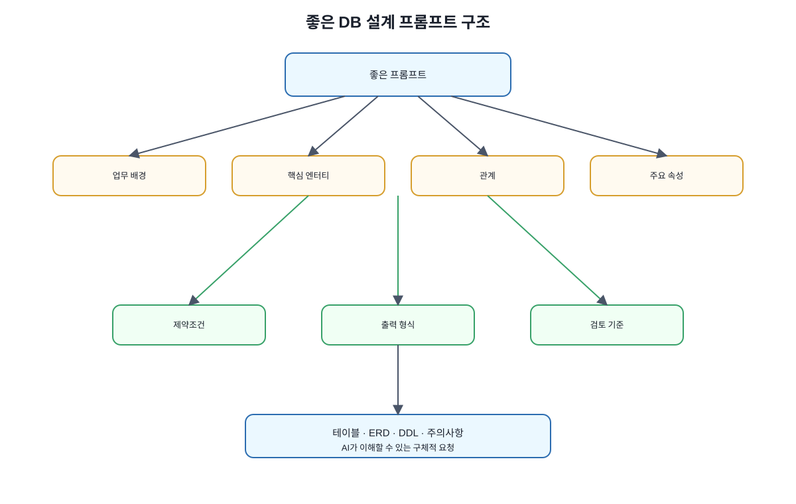

그림 13-3 실행 가능한 DB 작업 프롬프트의 구성

```text
목표
확인된 요구사항
결정·미확정 정책
현재 DB와 스키마
수정 대상 파일
수정 금지 범위
허용되는 파괴적 작업
정상·경계값·오류 검증 기준
완료 보고 형식
```

예시:

```text
PostgreSQL 온라인 강의 DB 설계를 검토해 주세요.

확인된 요구사항:
- P13-R01~P13-R09

결정·미확정 정책:
- P13-D01~P13-D08

범위:
- ai_review_lab만 생성·검토
- course_project와 다른 Chapter 스키마 변경 금지
- 역할·권한 변경 금지
- 자동 DROP 금지

검증:
- 기준 행 3/3/2/3/4/4
- 정상 JOIN 4
- 정확한 FK 4개와 제약조건 이름
- SQLSTATE와 constraint name
- 반례·정상 경계값 30/30
- 업무 이상 0행
- IDENTITY 다음 값 > 현재 최대 ID
```

---

## 7. ERD는 요구사항을 기준으로 검토한다

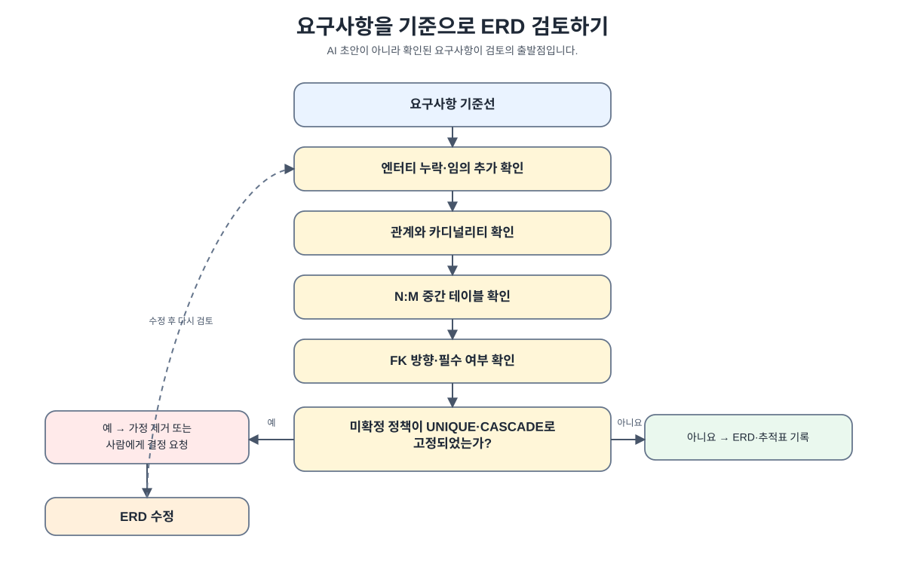

그림 13-4 요구사항을 기준으로 ERD 검토하기

```text
핵심 엔터티가 빠지거나 근거 없이 추가되지 않았는가?
한 테이블이 하나의 주요 역할을 담당하는가?
학생과 강의의 N:M 관계가 enrollments로 해소되었는가?
강사와 강의의 1:N 관계 방향이 올바른가?
결제와 신청의 관계가 현재 가정과 맞는가?
관계의 필수성·선택성과 삭제 정책이 명확한가?
미확정 정책이 전체 UNIQUE나 CASCADE로 고정되지 않았는가?
```

이 장의 단순화된 카디널리티:

```text
instructors 1 → 0..N courses
students 1 → 0..N enrollments
courses 1 → 0..N enrollments
enrollments 1 → 0..1 payments
```

마지막 관계는 현재 결제 상태 한 건만 저장한다는 P13-D02 가정입니다. 결제 시도·실패·재결제·부분환불 이력을 모두 저장하려면 1:N 결제 원장으로 바꾸어야 합니다.

---

## 8. 역할이 섞인 테이블과 분리된 설계 비교

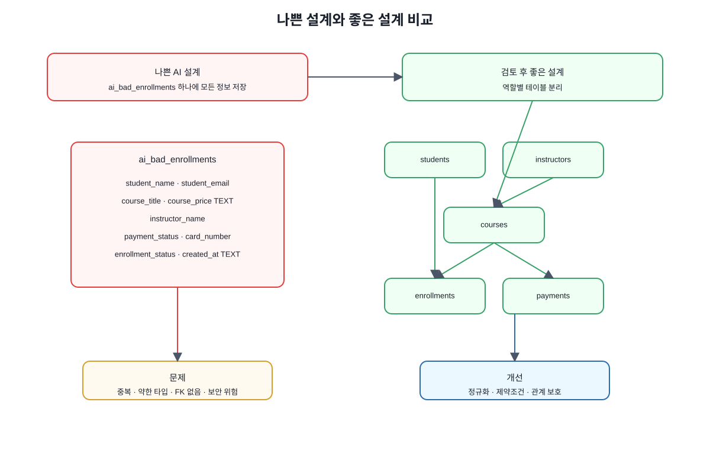

그림 13-5 역할이 섞인 설계와 분리된 설계

`bad_enrollments`는 학생·강의·강사·신청·결제 정보를 한 행에 저장합니다.

```text
이름·이메일 반복
모든 값을 TEXT로 저장
FK 없음
상태값 자유 입력
날짜를 자유 문자열로 저장
민감정보를 평문으로 저장하는 나쁜 예
```

가상 민감값은 실제 카드번호 형태가 아닌 `TEST-SENSITIVE-PLAINTEXT-01`처럼 명확한 테스트 문자열만 사용합니다.

| 테이블 | 주요 역할 |
| --- | --- |
| `students` | 학생 기본 정보 |
| `instructors` | 강사 기본 정보 |
| `courses` | 강의 현재 정보와 기본 가격 |
| `enrollments` | 학생·강의 관계와 신청 시점 기록 금액 |
| `payments` | 현재 결제 상태와 가상 외부 참조값 |

---

## 9. 타입과 제약조건을 업무 의미로 검토한다

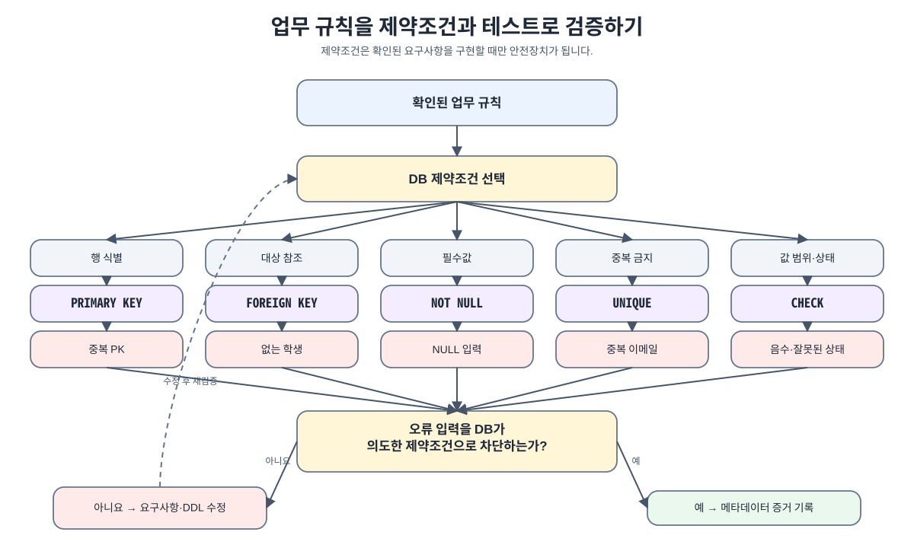

그림 13-6 업무 규칙을 제약조건과 테스트로 검증하기

| 업무 규칙 | 설계 | 검증 |
| --- | --- | --- |
| 행 식별 | `IDENTITY PRIMARY KEY` | PK·시퀀스 메타데이터 |
| 존재하는 부모 참조 | 명시적 FK | 없는 ID 입력 차단 |
| 이메일 중복·공백 금지 | `UNIQUE` + CHECK | 중복·공백 입력 차단 |
| 활성 신청 중복 금지 | 부분 고유 인덱스 | 같은 활성 조합 차단 |
| 허용 상태 | CHECK | 잘못된 상태 차단 |
| 금액 0 이상 | CHECK | 음수 실패·0 성공 |
| 결제·환불 시각 | 복합 CHECK | 잘못된 조합 차단 |
| 카드번호 미저장 | 전용 컬럼 없음·외부 참조값 | 컬럼·Seed·흐름 검토 |

상태 CHECK는 허용 단어만 제한합니다. `신청 → 수강중 → 완료` 같은 상태 전이 순서까지 자동으로 검증하지는 않습니다.

---

## 10. 이메일 UNIQUE의 범위를 명확히 한다

현재 설계는 다음을 보장합니다.

```text
NULL 불가
공백 문자열 불가
정확히 같은 문자열 중복 불가
```

다음 두 값은 현재 서로 다른 문자열입니다.

```text
Kim@example.com
kim@example.com
```

저장 전 소문자 정규화, 대소문자 비구분 인덱스 또는 별도 자료형 사용 여부는 P13-D07로 남깁니다. AI가 이를 임의 확정해서는 안 됩니다.

공백 CHECK는 이메일 외에도 다음 필드에 적용합니다.

```text
instructors.specialty
courses.course_code
courses.title
payments.payment_reference
```

---

## 11. 현재 가격·신청 시점 기록 금액·결제금액은 시점이 다르다

```text
courses.price
= 현재 기본 강의 가격

enrollments.recorded_amount
= 신청 시점에 확정된 금액

payments.amount
= 현재 결제 상태에 기록된 금액
```

현재 가격과 신청 시점 기록 금액이 달라도 할인·가격 변경일 수 있습니다. 샘플에서는 한 행이 다릅니다.

반면 P13-D06의 단순 예제에서는 신청 시점 기록 금액과 결제 기록 금액이 같아야 합니다. 부분 결제·부분 환불을 지원한다면 결제 원장과 환불 금액 모델을 새로 설계해야 합니다.

---

## 12. 결제 시각과 환불 시각을 분리한다

기존의 `paid_at` 하나로 환불 시점까지 표현하면 의미가 모호합니다. 이 장은 다음 두 컬럼을 사용합니다.

```text
paid_at
→ 결제가 완료된 시각

refunded_at
→ 환불이 완료된 시각
```

| 상태 | paid_at | refunded_at |
| --- | --- | --- |
| 결제대기·결제실패 | NULL | NULL |
| 결제완료 | NOT NULL | NULL |
| 환불 | NOT NULL | NOT NULL, paid_at 이후 |

`환불` 행의 `amount`는 최초 전액 결제 금액입니다. 부분 환불 금액과 다중 환불 이벤트는 이번 단순 모델 범위 밖입니다.

---

## 13. Chapter 13 실습은 별도 스키마에서 단계별로 실행한다

```text
course_project: 변경 금지
transaction_lab: 변경 금지
performance_lab: 변경 금지
security_lab: 변경 금지
nosql_lab: 변경 금지
ai_review_lab: Chapter 13 전용
```

파일 구조:

```text
code/chapter13/
├── 01_ai_review_lab_schema.sql
├── 02_bad_design_seed.sql
├── 03_good_design_schema.sql
├── 04_good_design_seed.sql
├── 05_metadata_validation.sql
├── 06_business_validation.sql
├── 07_negative_tests.sql
├── 08_ai_review_lab_validation.sql
├── AI_REVIEW_REPORT_TEMPLATE.md
├── PROMPT_TEMPLATES.md
├── reset_ai_review_lab.sql
├── ai_db_design_review_practice.sql
└── README.md
```

실행 순서:

```text
01 보호 검사·격리 스키마와 나쁜 테이블 생성
→ 02 나쁜 데이터 3행·IDENTITY 조정
→ 03 좋은 설계와 활성 신청 인덱스 생성
→ 04 정상 데이터·IDENTITY 조정
→ 05 정확한 메타데이터 검증
→ 06 NULL 안전 업무 정합성 검증
→ 07 반례 24개·정상 경계값 6개
→ 08 최종 자동 검증
→ 보고서에 요구사항·diff·증거 기록
```

생성 파일은 자동 DROP을 실행하지 않습니다. `01_ai_review_lab_schema.sql`은 Chapter 07·08 canonical 데이터뿐 아니라 **Chapter 07 명명 제약조건 15개, NOT NULL 열 20개, 현재 역할의 `ai_database_book` CREATE 권한**을 DDL 전에 확인합니다. Chapter 11의 `security_lab`이나 Chapter 12의 `nosql_lab` 존재 자체를 시작 조건으로 요구하지는 않습니다. 처음부터 다시 시작할 때만 보호된 `reset_ai_review_lab.sql`을 사용합니다.

---

## 14. 재현 가능한 샘플과 IDENTITY

| 항목 | 행 수 | 명시적 ID | 다음 값 |
| --- | ---: | --- | ---: |
| bad_enrollments | 3 | 1~3 | 4 이상 |
| students | 3 | 101~103 | 104 이상 |
| instructors | 2 | 201~202 | 203 이상 |
| courses | 3 | 301~303 | 304 이상 |
| enrollments | 4 | 1001~1004 | 1005 이상 |
| payments | 4 | 9001~9004 | 9005 이상 |

이 장의 ID 컬럼은 `GENERATED BY DEFAULT AS IDENTITY`를 사용합니다. INSERT에서 ID를 직접 지정하면 그 값이 우선 사용되므로 내부 시퀀스가 그 값에 맞춰 자동으로 이동하지 않습니다. 그래서 Seed 파일은 `ALTER TABLE ... RESTART WITH`로 다음 자동값을 명시적으로 조정합니다.

반대로 자동 ID를 요청해 시퀀스 값이 발급된 뒤 트랜잭션이 취소되어도 그 값은 일반적으로 재사용을 위해 회수되지 않습니다. 오류·경계값 테스트는 기준 상태를 보호하기 위해 명시적 테스트 ID와 하위 트랜잭션을 사용하며, 자동 번호의 공백 자체는 정합성 오류로 보지 않습니다.

---

## 15. 실제 생성된 메타데이터를 정확히 확인한다

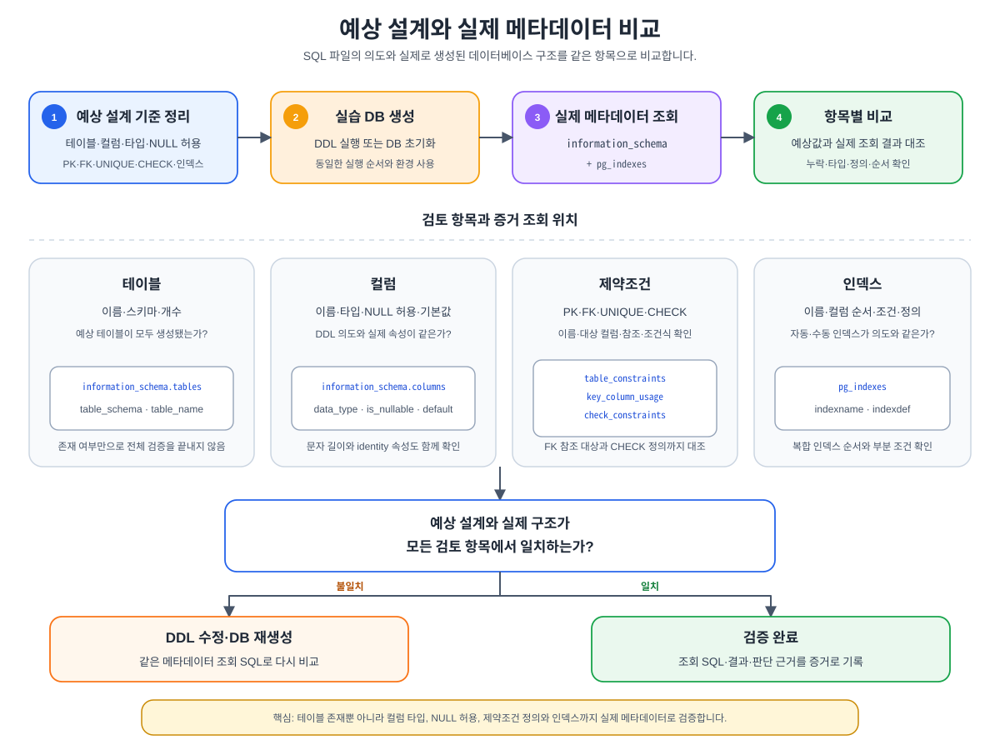

그림 13-7 예상 설계와 실제 메타데이터 비교

단순 개수만 확인하면 잘못된 객체가 하나 빠지고 관련 없는 객체가 하나 추가된 상태를 놓칠 수 있습니다.

```text
정확한 테이블 이름 6개
좋은 설계 제약조건 29개
정확한 FK 이름·출발 컬럼·대상 컬럼 4개
ON DELETE RESTRICT 또는 NO ACTION
IDENTITY id 컬럼 6개
활성 신청 부분 고유 인덱스
```

`05_metadata_validation.sql`은 조건이 다르면 예외를 발생시킵니다.

---

## 16. 정상 경계값과 반례를 함께 테스트한다

오류 테스트만 하면 제약조건이 필요 이상으로 강해 정상 데이터를 막는 문제를 발견하기 어렵습니다.

### 예상 실패 반례 24개

```text
중복·공백 학생 이메일
중복 강사 이메일·공백 전문분야
없는 강사·학생·강의·수강신청 FK
잘못된 level·수강 상태·결제 상태
음수 가격·신청 시점 기록 금액·결제 상태 기록 금액
활성 신청 중복
결제·환불 시각 조합 위반
공백·중복 payment_reference
한 신청에 결제 두 건
```

### 정상 경계값 6개

```text
가격 0
한 글자 이름·제목
description NULL
결제 없는 신청
완료·취소 이력 뒤 재신청
결제실패 + 금액 0 + 시각 NULL
```

`07_negative_tests.sql`은 다음을 구조적으로 기록합니다.

```text
expected_sqlstate / actual_sqlstate
expected_constraint / actual_constraint
actual_table / actual_column
actual_result / detail
```

`GET STACKED DIAGNOSTICS`로 실제 제약조건 이름을 확인합니다. 같은 SQLSTATE가 발생했다는 사실만으로 의도한 규칙이 작동했다고 단정하지 않습니다.

```text
전체 27
통과 27
unexpected 0
기준 행 수 유지
```

---

## 17. LEFT JOIN의 NULL을 놓치지 않는다

다음 조건은 결제 누락을 발견하지 못할 수 있습니다.

```sql
p.payment_status <> '결제완료'
```

`p.payment_status`가 NULL이면 비교 결과는 TRUE가 아니라 UNKNOWN입니다.

필수 결제 누락까지 찾으려면 다음처럼 작성합니다.

```sql
p.payment_status IS DISTINCT FROM '결제완료'
```

이 장의 샘플 규칙:

```text
완료 → 결제완료 필수
취소 → 환불 필수
신청 → 결제 없음 허용, 있으면 결제대기
수강중 → 결제 없음 허용, 있으면 결제완료
```

이는 샘플 시나리오이며 실제 서비스의 상태 전이 전체를 의미하지 않습니다.

---

## 18. 제약조건 이후에도 업무 정합성 검증이 필요하다

`06_business_validation.sql`의 이상 조회는 모두 0행이어야 합니다.

```text
학생·강사 이메일 중복
필수 문자열 공백
신청 시점 기록 금액·결제 상태 기록 금액 불일치
결제·환불 시각 조합 위반
고아 학생·강의·결제 참조
활성 신청 중복
샘플 수강·결제 상태 조합 위반
```

현재 가격과 신청 시점 기록 금액 차이는 정보용 1행입니다. 결과가 있어도 자동 오류가 아닙니다.

---

## 19. 실제 카드번호 미저장은 여러 증거로 검토한다

컬럼 이름에 `card`가 없다는 사실만으로 실제 카드번호 미저장을 완전히 증명할 수 없습니다. 민감값이 `value`, `memo`, `reference`, `metadata` 같은 일반 이름에 들어갈 수도 있습니다.

P13-R08 증거:

```text
카드번호·CVV·비밀번호 전용 컬럼 없음
payment_reference는 실습용 가상 외부 참조값이며 실제 보호 수준은 조직 정책으로 판단
Seed가 PAY-REVIEW-TEST-* 가상값만 사용
실제 데이터·로그·프롬프트에 민감 패턴 없음
애플리케이션이 카드정보를 DB로 전달하지 않는 흐름 검토
```

---

## 20. 최종 자동 판정 파일을 실행한다

`08_ai_review_lab_validation.sql`은 다음을 한 번에 판정합니다.

```text
Chapter 07 원본 신청 5행 유지
Chapter 07 명명 제약조건 15개 / NOT NULL 열 20개 유지
기준 행 수 3/3/2/3/4/4
정상 JOIN 4
정확한 테이블 집합
제약조건 29·FK 4·IDENTITY 6
활성 신청 부분 고유 인덱스
필수 문자열·고아 관계·활성 중복 0
금액·시간·상태 조합 위반 0
가격 차이 정보용 1행
모든 IDENTITY 다음 값 > 현재 최대 ID
같은 세션이면 07의 30/30 결과 재확인
```

통과 메시지:

```text
Chapter 13 AI review lab validation passed
```

07과 08을 다른 세션에서 실행했다면 07의 자체 `30/30` 통과 메시지를 별도 실행 증거로 기록합니다.

---

## 21. 파괴적 SQL과 마이그레이션 제안을 별도로 검토한다

```text
DROP TABLE / DROP SCHEMA
TRUNCATE
조건 없는 UPDATE / DELETE
ALTER COLUMN TYPE
SET NOT NULL
UNIQUE 추가
ON DELETE CASCADE
인덱스 삭제
권한 GRANT·REVOKE
```

검토 질문:

```text
대상 환경과 스키마가 명시되었는가?
기존 데이터가 새 제약조건을 통과하는가?
잠금 시간과 서비스 중단 가능성을 검토했는가?
백업·롤백·복구 절차가 있는가?
변경 전후 검증 SQL이 있는가?
미확정 정책을 DB 규칙으로 고정하지 않았는가?
```

---

## 22. Codex 변경 후 diff·재실행·승인 루프

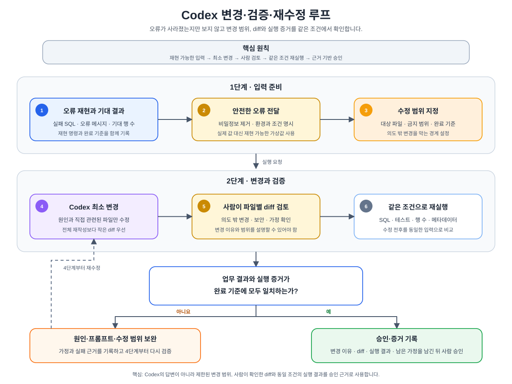

그림 13-8 Codex 변경·검증·재수정 루프

```text
1. 오류와 기대 결과를 같은 조건에서 재현한다.
2. 비밀번호·접속 정보·개인정보를 제거한다.
3. 수정 대상과 금지 범위를 지정한다.
4. 최소 변경을 요청한다.
5. 파일별 diff를 사람이 검토한다.
6. 관련 없는 변경을 제거한다.
7. 격리 스키마를 다시 생성한다.
8. 01→08 검증을 실행한다.
9. 실패하면 원인과 프롬프트를 수정한다.
10. 통과하면 증거·남은 가정·승인 상태를 기록한다.
```

| 영역 | 확인 질문 |
| --- | --- |
| 범위 | 요청한 파일·스키마만 변경되었는가? |
| 요구사항 | P13-R01~R09가 유지되었는가? |
| 정책 | P13-D01~D08과 충돌하지 않는가? |
| 데이터 | 실제 개인정보와 비밀이 포함되지 않았는가? |
| 파괴적 변경 | DROP·DELETE·ALTER 범위가 명확한가? |
| 테스트 | 정상·경계값·반례·메타데이터·정합성 검증이 갱신되었는가? |
| 문서 | README·워크북·기대 결과가 코드와 일치하는가? |

---

## 23. 검토 상태는 명시적으로 기록한다

| 상태 | 의미 |
| --- | --- |
| 승인 | 모든 필수 요구사항과 실행 증거가 충족됨 |
| 조건부 승인 | 제한된 환경·데이터에서만 사용 가능하며 후속 조치가 있음 |
| 보류 | 정책 결정 또는 실행 증거가 부족함 |
| 거절 | 요구사항 위반, 보안 위험 또는 파괴적 변경 위험이 큼 |

검증하지 않은 항목은 통과로 표시하지 않습니다.

---

## 24. 자주 하는 실수

1. 실행 가능한 SQL을 검토된 설계로 판단한다.
2. 앞 장에서 확정한 활성 신청 정책을 다시 미확정으로 되돌린다.
3. 전체 복합 UNIQUE와 부분 고유 인덱스를 구분하지 않는다.
4. 명시적 ID 입력 뒤 IDENTITY 시작값을 조정하지 않는다.
5. LEFT JOIN의 NULL을 일반 비교로 검사한다.
6. 결제 시각과 환불 시각을 한 컬럼으로 모호하게 표현한다.
7. SQLSTATE만 보고 의도한 제약조건에서 실패했다고 단정한다.
8. 오류 테스트만 하고 정상 경계값을 확인하지 않는다.
9. 컬럼명 검사만으로 민감정보 부재를 증명했다고 생각한다.
10. AI가 수정한 전체 diff를 확인하지 않는다.
11. 검증하지 않은 항목을 통과로 기록한다.

---

## 25. 스스로 확인하기

1. AI가 만든 SQL이 실행되어도 설계 검증이 끝나지 않는 이유는 무엇인가요?
2. P13-R, P13-D, P13-T, P13-V를 분리하는 이유는 무엇인가요?
3. 전체 `(student_id, course_id) UNIQUE`와 활성 상태 부분 고유 인덱스의 차이는 무엇인가요?
4. 명시적 ID 입력 뒤 IDENTITY 시작값을 조정해야 하는 이유는 무엇인가요?
5. 정확 문자열 이메일 UNIQUE와 대소문자 정책의 차이는 무엇인가요?
6. `courses.price`, `enrollments.recorded_amount`, `payments.amount`의 의미를 설명해 보세요.
7. `paid_at`과 `refunded_at`을 분리한 이유는 무엇인가요?
8. LEFT JOIN 검증에서 `IS DISTINCT FROM`이 필요한 이유는 무엇인가요?
9. SQLSTATE와 constraint name을 함께 기록하는 이유는 무엇인가요?
10. 정상 경계값과 실패 반례는 각각 무엇을 증명하나요?
11. 카드번호 미저장을 컬럼명 검사만으로 증명할 수 없는 이유는 무엇인가요?
12. 승인·조건부 승인·보류·거절의 차이는 무엇인가요?

---

## 26. 권장 해설

```text
실행 성공은 문법·참조 가능성을 보여 줄 뿐 업무 요구사항 충족을 증명하지 않는다.
확인 요구사항은 제약조건과 테스트로 추적하고 미확정 정책은 결정 기록에 남긴다.
```

```text
전체 UNIQUE는 모든 이력을 막을 수 있다.
부분 고유 인덱스는 신청·수강중 중복만 막고 완료·취소 이력을 보존한다.
```

```text
IDENTITY는 명시적 ID 입력으로 자동 이동하지 않는다.
ROLLBACK 후 자동 번호 공백은 정상일 수 있다.
```

```text
LEFT JOIN의 오른쪽 값이 NULL이면 <> 비교는 UNKNOWN이다.
필수 값 누락까지 찾으려면 IS DISTINCT FROM 또는 명시적 NULL 조건을 사용한다.
```

```text
SQLSTATE는 오류 종류이고 constraint name은 실제로 차단한 규칙이다.
둘을 함께 기록해야 의도한 제약조건이 작동했는지 확인할 수 있다.
```

---

## 27. 핵심 정리

```text
1. AI 결과는 요구사항과 실행 증거로 검토할 변경 후보다.
2. 확인 요구사항·결정·미확정 정책·테스트·검증 ID를 분리한다.
3. 앞 장에서 확정한 정책과 장 간 연속성을 유지한다.
4. 격리 스키마 생성·Seed·초기화에 실제 보호 구문을 둔다.
5. 명시적 ID 입력 뒤 IDENTITY 다음 값을 조정한다.
6. 정상·경계값·반례·메타데이터·업무 정합성을 모두 검증한다.
7. LEFT JOIN의 NULL과 정확한 제약조건 이름을 확인한다.
8. 결제·환불 시각과 금액의 소유자·시점을 명확히 한다.
9. Codex 변경은 파일별 diff와 01→08 재실행 결과를 사람이 검토한다.
10. 미실행 항목·남은 가정·승인 상태를 기록한다.
```

이 장에서 기억할 문장은 다음과 같습니다.

```text
AI가 만든 설계의 품질은 설명의 자연스러움이 아니라,
요구사항과 실행 증거를 얼마나 추적할 수 있는지로 판단한다.
```

---

## 28. 다음 장에서는

Chapter 14에서는 SQL로 분석 질문에 답하고 Python으로 결과를 확장·교차 검증하는 방법을 다룹니다.

```text
분석 질문과 기준 행 정의
집계·윈도우 함수
분석 결과 검산
PostgreSQL과 Python 연결
pandas 기반 후속 분석
SQL 결과와 Python 결과 대조
AI가 만든 분석 SQL·Python 코드 검증
```

AI가 분석 코드를 생성했다는 사실만으로 결과가 올바른 것은 아닙니다. 분석 대상·분모·기간·중복·NULL 처리와 SQL·Python 결과를 사람이 확인해야 합니다.

---

# Chapter 14. SQL 데이터 분석과 Python 확장

---

## 이 장에서 살펴볼 내용

Chapter 13에서는 AI가 만든 데이터베이스 설계와 SQL을 요구사항, 메타데이터, 정상·반례 테스트와 실행 결과로 검증했습니다. 이번 장에서는 그 검증 원칙을 데이터 분석으로 확장합니다.

```text
분석 질문 정의
→ 기간·행 단위·지표 의미 확정
→ SQL로 필터·JOIN·집계
→ 데이터 품질 확인
→ 분석용 VIEW 생성
→ CSV 또는 읽기 전용 PostgreSQL 연결
→ pandas 가공·피벗·시각화
→ 실제 SQL 결과와 pandas 결과 교차 검증
→ 관찰·해석·한계 기록
```

SQL과 Python은 경쟁 관계가 아닙니다.

```text
SQL
- 데이터가 저장된 위치에서 필요한 범위를 줄인다.
- PK·FK 관계를 따라 JOIN한다.
- 분석 기간과 한 행의 단위를 확정한다.
- 대규모 필터·집계와 기준값 계산을 수행한다.

Python
- SQL이 만든 분석 데이터셋을 추가 가공한다.
- 피벗·시각화·통계 분석으로 확장한다.
- SQL 결과와 pandas 결과를 자동 비교한다.
```

이 장에서는 다음을 다룹니다.

- 분석 질문·기간·행 단위·지표 정의
- `COUNT(*)`, `COUNT(column)`, `COUNT(DISTINCT ...)`
- JOIN 후 중복과 과대 집계 점검
- 반개방 날짜 구간과 데이터가 없는 월을 유지하는 date spine
- 상태·강의·지역·월별 집계
- 현재 완료 상태 비중과 완료율의 차이
- 가입일·강의 개설일·신청일·완료일 품질 검사
- 분석 기간이 적용된 VIEW
- DBeaver CSV와 출처 manifest
- libpq password file 기반 읽기 전용 PostgreSQL 연결
- pandas의 엄격한 컬럼·자료형·업무 규칙 검증
- matplotlib 헤드리스 시각화
- 같은 데이터 스냅샷의 실제 SQL·pandas 교차 검증
- AI가 만든 분석 SQL·Python 코드 검토

> **핵심 원칙**
>
> 분석 결과는 코드가 오류 없이 실행되거나 그래프가 보기 좋다는 이유만으로 신뢰하지 않습니다. 질문, 기간, 행 단위, 지표 의미와 검산 결과가 서로 일치해야 합니다.

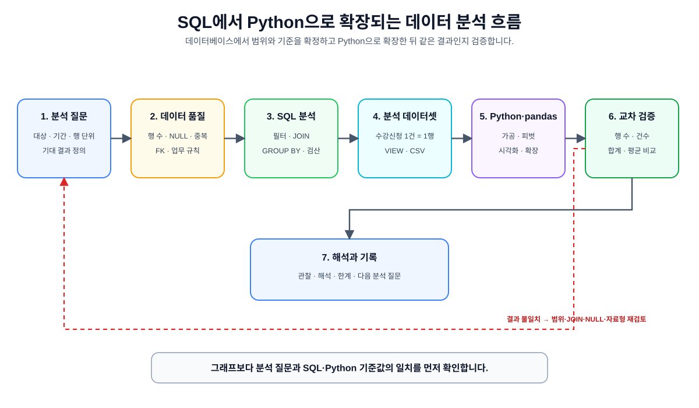

그림 14-1 SQL에서 Python으로 확장되는 데이터 분석 흐름

---

## 1. 분석 질문을 SQL보다 먼저 정의한다

온라인 강의 서비스 데이터를 분석한다고 가정하겠습니다.

```text
P14-Q01 상태별 수강신청 건수는 얼마인가?
P14-Q02 월별 신청 건수와 신청 시점 기록 금액은 얼마인가?
P14-Q03 강의별 신청 건수는 얼마인가?
P14-Q04 지역별 학생 수와 신청 건수는 어떻게 다른가?
P14-Q05 완료된 신청의 완료 기간은 얼마인가?
```

분석 질문에는 다음 항목이 필요합니다.

| 항목 | 확인 내용 |
| --- | --- |
| 분석 대상 | 학생·강의·수강신청 중 무엇인가? |
| 분석 기간 | 전체 기간인가, 특정 기간인가? |
| 날짜 기준 | 신청일·결제일·완료일 중 무엇인가? |
| 행 단위 | 학생 1명·강의 1개·신청 1건 중 무엇인가? |
| 비교 기준 | 상태·지역·강의·월 중 무엇인가? |
| 지표 의미 | 건수·기록 금액·매출·완료 비중 중 무엇인가? |
| 기대 결과 | 행 수·합계·평균 등 검산 기준이 있는가? |

이 장의 분석 범위는 다음과 같습니다.

```text
기간: [2026-01-01, 2026-07-01)
날짜 기준: enrollments.enrolled_at
행 단위: 수강신청 1건
금액 의미: 신청 시점 기록 금액
취소: 신청 시점 기록 금액을 그대로 유지
```

`[2026-01-01, 2026-07-01)`은 시작일은 포함하고 종료일은 제외하는 반개방 구간입니다.

> **금액 보존 원칙**
> `recorded_amount`는 신청 시점의 기록이므로 이후 상태가 `취소`로 바뀌어도 0으로 덮어쓰지 않습니다. 환불·순매출은 별도 결제·환불 원장이 있을 때 계산해야 합니다.

```sql
WHERE enrolled_at >= DATE '2026-01-01'
  AND enrolled_at <  DATE '2026-07-01'
```

`BETWEEN '2026-01-01' AND '2026-06-30'`보다 날짜·시간 자료형으로 확장하기 쉽고 경계가 명확합니다.

---

## 2. `recorded_amount`의 의미를 먼저 확정한다

이 장의 물리 컬럼 이름은 `recorded_amount`이지만 별도 결제 상태·환불 원장이 없습니다. `신청`과 `수강중` 상태에도 양수 금액이 존재합니다.

따라서 이 값을 실제 결제 완료 금액이나 회계 매출로 해석하면 안 됩니다.

```text
recorded_amount
→ 신청 시점 기록 금액
→ 결제 성공 여부를 의미하지 않음
→ 환불 완료 여부를 의미하지 않음
→ 회계 매출을 의미하지 않음
```

SQL 집계 별칭은 의미가 드러나도록 사용합니다.

```sql
SUM(recorded_amount) AS recorded_amount_sum
```

분석 VIEW와 Python에서는 `recorded_amount`라는 이름으로 제공합니다.

실제 결제 분석에는 다음과 같은 별도 모델이 필요합니다.

```text
payments
payment_status
paid_at
refunded_at
transaction_reference
```

---

## 3. SQL과 Python의 역할을 구분한다

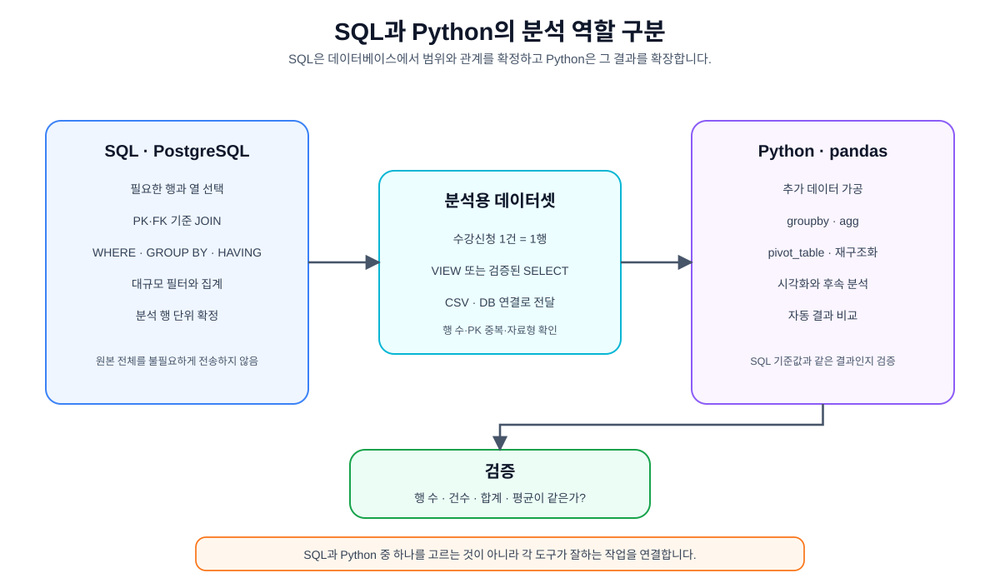

그림 14-2 SQL과 Python의 분석 역할 구분

| 작업 | SQL | Python |
| --- | --- | --- |
| 필요한 행·열 선택 | 적합 | 원본 전체를 가져오면 비효율적 |
| PK·FK JOIN | 적합 | 가능하지만 관계를 다시 관리해야 함 |
| 대규모 필터·집계 | 적합 | 전송 후 처리하면 비용 증가 |
| 데이터 품질 점검 | 적합 | 추가 검증에 적합 |
| 피벗·재구조화 | 가능 | 편리 |
| 시각화 | 제한적 | 적합 |
| 통계·머신러닝 | 제한적 | 적합 |
| 결과 자동 비교 | 가능 | 적합 |

권장 흐름:

```text
PostgreSQL
→ 기간과 관계를 SQL로 확정
→ 분석 VIEW 생성
→ 필요한 24행만 Python으로 읽기
→ pandas 가공·시각화
→ SQL 기준 결과와 비교
```

원본 테이블 전체를 Python으로 가져온 뒤 JOIN과 필터를 다시 구현하면 데이터 전송량이 늘고, DB의 관계와 업무 규칙을 분석 코드에 중복 구현할 수 있습니다.

---

## 4. Chapter 14 실습 구조

앞 장의 스키마는 변경하지 않습니다.

```text
course_project: 변경 금지
transaction_lab: 변경 금지
performance_lab: 변경 금지
security_lab: 변경 금지
nosql_lab: 변경 금지
ai_review_lab: 변경 금지
analysis_lab: Chapter 14 실습 대상
```

> **격리 분석 시나리오 주의**
> `analysis_lab`의 8명·3명·5개·24건 데이터는 SQL·Python 분석을 학습하기 위해 만든 합성 기준 데이터입니다. `course_project`의 행을 확장하거나 복제한 운영 데이터가 아니며, 기존 `course_project.enrollments.recorded_amount NUMERIC(12,0)`의 의미를 그대로 이어 받아 신청 시점 기록 금액으로 사용합니다.

실습 객체:

```text
analysis_lab.students
analysis_lab.instructors
analysis_lab.courses
analysis_lab.enrollments
analysis_lab.analysis_parameters VIEW
analysis_lab.enrollment_analysis_dataset VIEW
```

관계:

```text
students 1 → N enrollments
instructors 1 → N courses
courses 1 → N enrollments
```

파일:

```text
code/chapter14/
├── 01_analysis_lab_schema.sql
├── 02_analysis_lab_seed.sql
├── 03_data_quality_checks.sql
├── 04_summary_analysis.sql
├── 05_period_category_analysis.sql
├── 06_analysis_dataset.sql
├── 07_analysis_validation.sql
├── 08_analysis_lab_validation.sql
├── reset_analysis_lab.sql
├── python/
│   ├── requirements.txt
│   ├── .env.example
│   ├── validation_utils.py
│   ├── 01_load_csv.py
│   ├── 02_load_postgresql.py
│   ├── 03_pandas_analysis.py
│   ├── 04_result_validation.py
│   ├── reference_metrics.json
│   └── analysis_manifest.example.json
└── README.md
```

실행 순서:

```text
01 → 02 → 03 → 04 → 05 → 06 → 07 → 08
→ CSV 또는 읽기 전용 PostgreSQL 연결
→ pandas 분석
→ 실제 SQL·pandas 교차 검증
```

---

## 5. 생성·Seed·초기화의 안전성

모든 SQL은 다음 정보를 확인합니다.

```sql
SELECT current_database();
SELECT current_schema();
SHOW search_path;
```

`01_analysis_lab_schema.sql`은 다음 조건을 실제로 검사합니다.

```text
현재 DB = ai_database_book
현재 트랜잭션이 읽기 전용이 아님
현재 역할의 DB CREATE 권한
Chapter 07 명명 제약조건 15개
Chapter 07 NOT NULL 열 20개
Chapter 07 활성 신청 부분 고유 인덱스
course_project canonical 기준 상태
analysis_lab 미존재
```

스키마·테이블·기간 VIEW는 하나의 트랜잭션에서 생성됩니다. 중간 오류가 발생하면 일부 객체만 남는 위험을 줄입니다.

Seed도 다음 순서로 실행됩니다.

```text
현재 DB 검사
→ 필요한 객체 존재 확인
→ 네 테이블이 모두 비어 있는지 확인
→ BEGIN
→ 기준 데이터 입력
→ IDENTITY 다음 값 조정
→ 행 수·금액·완료·활성 중복 판정
→ COMMIT
```

명시적 ID 뒤의 다음 자동값:

```text
students 109
instructors 204
courses 306
enrollments 1025
```

`reset_analysis_lab.sql`은 `ai_database_book`에서만 분석 VIEW와 자식 테이블부터 삭제합니다.

---

## 6. 활성 신청 규칙과 중복 적재 규칙

Chapter 07에서 확정한 규칙을 유지합니다.

```sql
CREATE UNIQUE INDEX uq_analysis_enrollments_active
ON analysis_lab.enrollments (student_id, course_id)
WHERE status IN ('신청', '수강중');
```

```text
신청·수강중
→ 학생·강의 조합당 최대 한 건

완료·취소
→ 이력 보존과 이후 재신청 허용
```

별도의 다음 UNIQUE는 같은 날짜의 동일 원천 행 중복 적재를 막습니다.

```sql
UNIQUE (student_id, course_id, enrolled_at)
```

두 제약은 목적이 다릅니다.

---

## 7. 분석 기간을 한 곳에서 관리한다

`analysis_parameters` VIEW는 분석 기간을 한 행으로 제공합니다.

```sql
CREATE VIEW analysis_lab.analysis_parameters AS
SELECT
    DATE '2026-01-01' AS start_date,
    DATE '2026-07-01' AS end_date_exclusive;
```

SQL·분석 VIEW·Python 기준 파일에서 같은 값을 사용합니다.

```text
start_date = 2026-01-01
end_date_exclusive = 2026-07-01
```

Seed에 현재 1~6월 데이터만 있다는 이유로 기간 조건을 생략하면, 7월 데이터가 추가되는 순간 같은 질문의 결과가 달라집니다.

---

## 8. 기준 데이터 이해하기

| 테이블 | 기대 행 수 |
| --- | ---: |
| students | 8 |
| instructors | 3 |
| courses | 5 |
| enrollments | 24 |

상태:

```text
신청 4
수강중 5
완료 12
취소 3
```

월별 기준:

| 월 | 신청 건수 | 신청 시점 기록 금액 |
| --- | ---: | ---: |
| 2026-01 | 3 | 350000 |
| 2026-02 | 4 | 520000 |
| 2026-03 | 5 | 680000 |
| 2026-04 | 4 | 550000 |
| 2026-05 | 4 | 540000 |
| 2026-06 | 4 | 570000 |

전체 기록 금액 합계는 3,210,000입니다.

`completed_at`은 상태와 함께 해석합니다.

```text
완료 → completed_at 필요
신청·수강중·취소 → completed_at NULL
```

NULL은 무조건 오류가 아닙니다. 업무 상태에 따라 자연스러운 값일 수 있습니다.

---

## 9. 분석 전에 데이터 품질을 확인한다

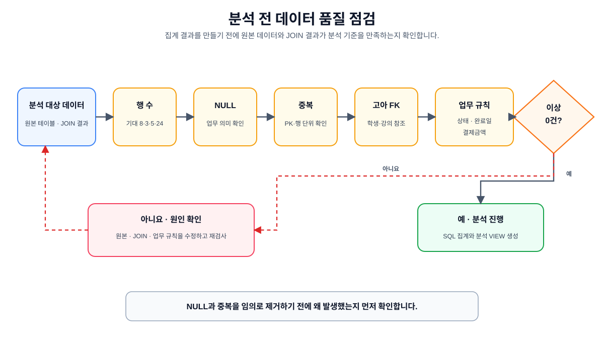

그림 14-3 분석 전 데이터 품질 점검

P14-V02 검증 범위:

```text
행 수
PK 중복
고아 학생·강의·강사
완료 상태와 완료일
완료일 >= 신청일
신청일 >= 학생 가입일
신청일 >= 강의 개설일
음수 기록 금액
취소 상태의 기록 금액 0
허용 상태
분석 기간 밖 행
활성 신청 중복
```

학생 가입일보다 이른 신청:

```sql
SELECT e.id, s.joined_at, e.enrolled_at
FROM analysis_lab.enrollments AS e
JOIN analysis_lab.students AS s
    ON s.id = e.student_id
WHERE e.enrolled_at < s.joined_at;
```

강의 개설일보다 이른 신청:

```sql
SELECT e.id, c.opened_at, e.enrolled_at
FROM analysis_lab.enrollments AS e
JOIN analysis_lab.courses AS c
    ON c.id = e.course_id
WHERE e.enrolled_at < c.opened_at;
```

두 결과 모두 0행이어야 합니다.

---

## 10. JOIN·필터·집계의 기본 흐름

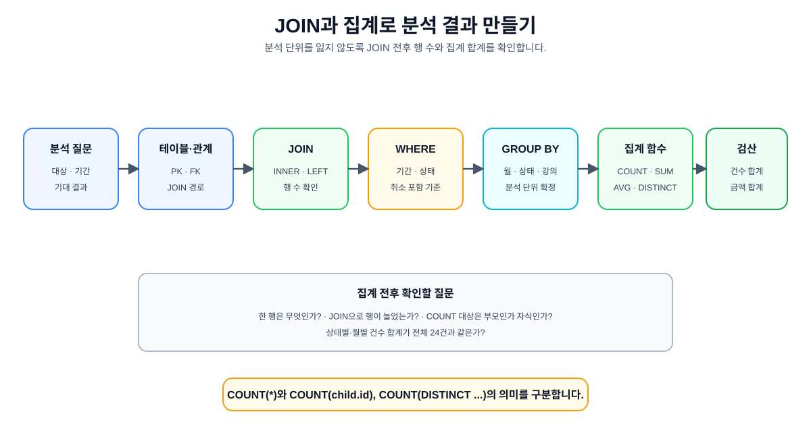

그림 14-4 JOIN과 집계로 분석 결과 만들기

```text
질문
→ 기간 제한
→ 테이블과 JOIN 경로
→ 결과의 한 행 단위
→ GROUP BY
→ 집계 함수
→ 정렬
→ 전체 합계 검산
```

P14-Q01 상태별 신청 건수:

```sql
WITH filtered_enrollments AS (
    SELECT e.*
    FROM analysis_lab.enrollments AS e
    CROSS JOIN analysis_lab.analysis_parameters AS p
    WHERE e.enrolled_at >= p.start_date
      AND e.enrolled_at < p.end_date_exclusive
)
SELECT
    status,
    COUNT(*) AS enrollment_count
FROM filtered_enrollments
GROUP BY status;
```

상태별 건수 합계는 24여야 합니다.

---

## 11. `COUNT(*)`, `COUNT(child.id)`, `COUNT(DISTINCT ...)`

강의가 1행 있고 신청이 없더라도 `LEFT JOIN` 결과에는 강의 행이 남습니다.

```sql
COUNT(*)
```

은 그 행을 1건으로 셀 수 있습니다. 신청 건수를 세려면 자식 PK를 사용합니다.

```sql
COUNT(e.id)
```

지역별 학생 수와 신청 수는 단위가 다릅니다.

```sql
COUNT(DISTINCT s.id) AS student_count,
COUNT(e.id) AS enrollment_count
```

학생 수를 `COUNT(*)`로 세면 신청이 많은 학생이 여러 번 계산될 수 있습니다.

---

## 12. 강의·강사·지역별 분석

강의별 집계:

```sql
SELECT
    c.id AS course_id,
    c.title,
    COUNT(e.id) AS enrollment_count,
    COALESCE(SUM(e.recorded_amount), 0) AS recorded_amount_sum
FROM analysis_lab.courses AS c
LEFT JOIN filtered_enrollments AS e
    ON e.course_id = c.id
GROUP BY c.id, c.title;
```

지역별 집계:

```sql
SELECT
    s.region,
    COUNT(DISTINCT s.id) AS student_count,
    COUNT(e.id) AS enrollment_count
FROM analysis_lab.students AS s
LEFT JOIN filtered_enrollments AS e
    ON e.student_id = s.id
GROUP BY s.region;
```

JOIN한 뒤 무엇을 세는지 이름으로 드러내야 합니다.

---

## 13. 데이터가 없는 월도 유지하는 date spine

실제 데이터만 월별로 GROUP BY하면 행이 없는 월은 사라집니다. 4월 데이터가 없다면 `LAG`에서 5월의 이전 행이 3월이 될 수 있습니다.

월 기준표를 먼저 만듭니다.

```sql
WITH months AS (
    SELECT generate_series(
        DATE '2026-01-01',
        DATE '2026-06-01',
        INTERVAL '1 month'
    )::date AS enrollment_month
)
```

실제 집계와 `LEFT JOIN`합니다.

```sql
SELECT
    m.enrollment_month,
    COALESCE(a.enrollment_count, 0) AS enrollment_count,
    COALESCE(a.recorded_amount_sum, 0) AS recorded_amount_sum
FROM months AS m
LEFT JOIN monthly_actual AS a
    ON a.enrollment_month = m.enrollment_month;
```

이렇게 하면 데이터가 없는 월도 0건으로 유지됩니다.

---

## 14. 이전 달과 비교한다

`LAG`는 정렬된 이전 행의 값을 가져옵니다.

```sql
LAG(enrollment_count) OVER (
    ORDER BY enrollment_month
) AS previous_enrollment_count
```

첫 달은 이전 달이 없으므로 NULL입니다. 오류가 아니라 분석상 자연스러운 값입니다.

중간 월을 date spine으로 유지해야 `LAG`의 이전 행이 실제 이전 달을 의미합니다.

---

## 15. 현재 완료 상태 비중과 완료율을 구분한다

다음 계산은 전체 신청 중 현재 `완료` 상태의 비중입니다.

```sql
COUNT(*) FILTER (WHERE status = '완료')
* 100.0 / COUNT(*)
```

이 지표는 `completed_share_pct`라고 부릅니다.

```text
현재 완료 상태 비중
→ 전체 신청 중 현재 완료 상태가 차지하는 비율

완료율
→ 완료할 충분한 시간이 지난 코호트와 분모 정책이 필요
```

최근 신청과 수강중인 행까지 분모에 넣으면 실제 완료 성과를 과소평가할 수 있습니다. 취소를 분모에 포함할지도 정해야 합니다.

---

## 16. 완료 기간 분석의 범위

```sql
SELECT
    COUNT(*) AS completed_count,
    ROUND(AVG(completed_at - enrolled_at), 2) AS avg_completion_days,
    MIN(completed_at - enrolled_at) AS min_completion_days,
    MAX(completed_at - enrolled_at) AS max_completion_days
FROM filtered_enrollments
WHERE status = '완료';
```

기대값:

```text
완료 12건
평균 25일
최소 18일
최대 36일
```

이 값은 **완료된 신청만의 완료 기간**입니다. 아직 완료하지 않은 신청을 제외하므로 전체 수강생이 평균적으로 25일 만에 완료한다고 일반화할 수 없습니다.

---

## 17. 분석용 데이터셋을 만든다

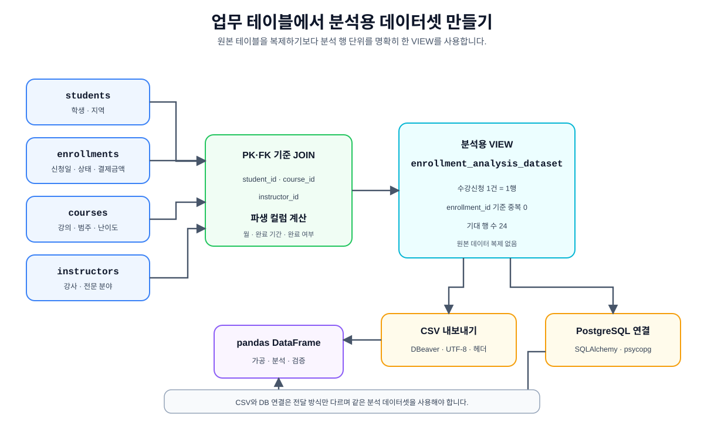

그림 14-5 업무 테이블에서 분석용 데이터셋 만들기

한 행의 단위:

```text
수강신청 1건 = enrollment_id 1개
```

VIEW의 정확한 컬럼:

```text
enrollment_id
student_id
student_name
region
course_id
course_title
category
level
instructor_id
instructor_name
enrolled_at
enrollment_month
status
recorded_amount
completed_at
completion_days
is_completed
```

VIEW는 분석 기간을 실제로 적용합니다.

```sql
CROSS JOIN analysis_lab.analysis_parameters AS p
WHERE e.enrolled_at >= p.start_date
  AND e.enrolled_at < p.end_date_exclusive
```

검산:

```text
VIEW 행 수 24
고유 enrollment_id 24
중복 0
recorded_amount 합계 3,210,000
```

---

## 18. SQL 최종 완료 게이트

`07_analysis_validation.sql`은 상태·월별·기간·품질의 상세 결과를 보여 줍니다.

`08_analysis_lab_validation.sql`은 다음 항목을 자동 판정합니다.

```text
현재 DB = ai_database_book
정확한 테이블 4개와 VIEW 2개
분석 기간 한 행
행 수 8·3·5·24·24
분석 데이터셋 정확한 17개 컬럼
제약조건 20개와 IDENTITY 4개
활성 신청 부분 고유 인덱스
상태별 12·5·4·3
월별 건수·기록 금액
완료 기간 12·25·18·36
품질 이상 0
IDENTITY 다음 값 > 기존 최대 ID
```

통과 메시지:

```text
Chapter 14 analysis_lab validation passed: rows 8/3/5/24/24, amount 3210000
```

단순 boolean 조회와 달리 하나라도 다르면 예외를 발생시킵니다.

---

## 19. CSV를 내보내고 출처를 기록한다

DBeaver에서 다음 조회를 UTF-8·헤더 포함 CSV로 내보낼 수 있습니다.

```sql
SELECT *
FROM analysis_lab.enrollment_analysis_dataset
ORDER BY enrollment_id;
```

권장 경로:

```text
code/chapter14/data/enrollment_analysis_dataset.csv
```

CSV만으로는 다음을 알기 어렵습니다.

```text
어느 DB에서 생성했는가?
어느 VIEW를 사용했는가?
분석 기간은 무엇인가?
언제 생성했는가?
파일이 변경되었는가?
```

manifest에는 다음 정보를 기록합니다.

```json
{
  "source_database": "ai_database_book",
  "source_view": "analysis_lab.enrollment_analysis_dataset",
  "analysis_start_date": "2026-01-01",
  "analysis_end_date_exclusive": "2026-07-01",
  "row_count": 24,
  "expected_recorded_amount_sum": 3210000,
  "generated_at_utc": "...",
  "sha256": "...",
  "amount_semantics": "recorded_amount = enrollment-time recorded amount; cancellation does not zero it"
}
```

`02_load_postgresql.py --export-csv`는 CSV와 manifest를 함께 생성합니다. DBeaver에서 직접 내보냈다면 `analysis_manifest.example.json`을 참고해 출처와 SHA-256을 기록합니다.

실제 개인정보가 있는 CSV를 저장소에 커밋하면 안 됩니다. `code/chapter14/data/`는 `.gitignore` 대상입니다.

---

## 20. Python 환경을 준비한다

패키지:

```text
pandas
matplotlib
SQLAlchemy
psycopg[binary]
python-dotenv
```

가상환경:

```bash
python -m venv .venv
```

Windows PowerShell:

```powershell
.\.venv\Scripts\Activate.ps1
pip install -r code/chapter14/python/requirements.txt
```

macOS·Linux:

```bash
source .venv/bin/activate
pip install -r code/chapter14/python/requirements.txt
```

설치 확인:

```bash
python -c "import pandas, sqlalchemy, psycopg, matplotlib; print('OK')"
```

Python과 패키지 버전은 재현성 기록에 포함합니다.

---

## 21. 접속 정보는 URL 문자열 대신 libpq 변수를 사용한다

`python/.env.example`:

```text
PGHOST=localhost
PGPORT=5432
PGDATABASE=ai_database_book
PGUSER=
PGPASSFILE=
```

실제 password file은 저장소 밖의 보호된 경로에 둡니다.

Python 연결은 다음을 검사합니다.

```text
PGDATABASE = ai_database_book
analysis_lab.enrollment_analysis_dataset 존재
transaction_read_only = on
```

SQLAlchemy의 `URL.create()`를 사용해 사용자·호스트·DB를 구성하고, 비밀번호는 libpq password file에 맡깁니다. 코드·노트북·화면 캡처에 전체 접속 URL과 비밀번호를 남기지 않습니다.

`transaction_read_only = on`은 분석 트랜잭션의 일반적인 비임시 테이블 변경을 막는 안전장치입니다. 다만 이것만으로 최소권한 보안 설계가 완성되는 것은 아니므로, 실제 환경에서는 분석 전용 계정에 필요한 `CONNECT`·`USAGE`·`SELECT`만 부여하고 코드에서도 변경 SQL을 허용하지 않는 방식을 함께 사용합니다.

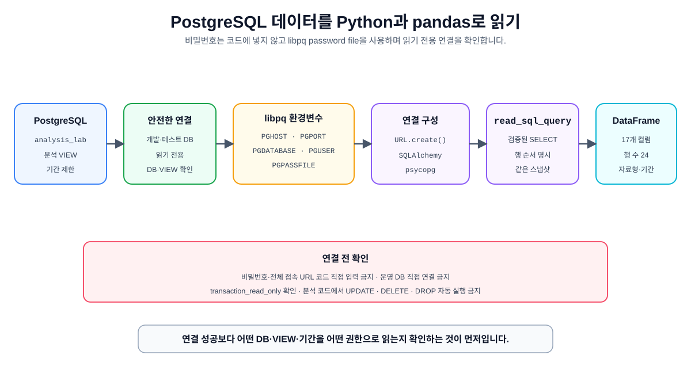

그림 14-6 PostgreSQL 데이터를 Python과 pandas로 읽기

---

## 22. Python 공통 검증을 한 파일로 통일한다

`validation_utils.py`는 모든 Python 경로에 같은 기준을 적용합니다.

```text
정확한 17개 컬럼
행 수 24
중복 enrollment_id 0
날짜형 strict 변환
recorded_amount 숫자형
completion_days 숫자 또는 NULL
is_completed boolean
status와 is_completed 일치
완료 상태와 완료일·완료 기간 일치
분석 기간 안의 행
```

잘못된 문자열을 NULL로 숨기지 않습니다.

```python
pd.to_numeric(
    df["completion_days"],
    errors="raise",
)
```

CSV의 빈 완료 기간은 정상적인 `NaN`으로 유지되지만, 잘못된 문자열은 오류로 중단됩니다.

---

## 23. pandas로 집계한다

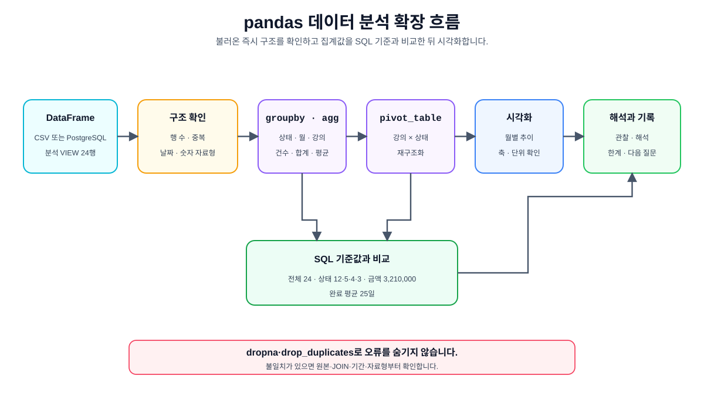

그림 14-7 pandas 데이터 분석 확장 흐름

상태별:

```python
status_summary = (
    df.groupby("status", as_index=False)
      .agg(enrollment_count=("enrollment_id", "count"))
)
```

월별:

```python
monthly_summary = (
    df.groupby("enrollment_month", as_index=False)
      .agg(
          enrollment_count=("enrollment_id", "count"),
          recorded_amount_sum=("recorded_amount", "sum"),
      )
)
```

Python에서도 `validation_utils.py`의 공통 분석 시작일·종료일을 사용해 월 기준표를 만들고 데이터가 없는 월을 0건으로 유지합니다. SQL 기간과 별도로 `2026-06-01` 같은 마지막 월을 다시 하드코딩하지 않습니다.

피벗:

```python
pd.pivot_table(
    df,
    index="course_title",
    columns="status",
    values="enrollment_id",
    aggfunc="count",
    fill_value=0,
)
```

---

## 24. 시각화는 검증 뒤에 수행한다

그래프는 GUI가 없는 환경에서도 저장되도록 `Agg` 백엔드를 사용합니다.

```python
import matplotlib
matplotlib.use("Agg")
```

설치된 한글 글꼴을 탐색하고 찾지 못하면 경고를 출력합니다. 저장소에 글꼴 파일을 포함하지 않습니다.

```python
ax.set_ylim(bottom=0)
```

Y축을 0부터 시작해 작은 차이를 과장하지 않습니다.

확인 항목:

```text
제목과 축 단위
월 정렬
데이터 점 6개
Y축 0 시작
SQL·pandas 표와 합계 일치
한글 글꼴 경고
```

시각화는 분석 증거를 대신하지 않습니다.

---

## 25. 실제 SQL과 pandas 결과를 교차 검증한다

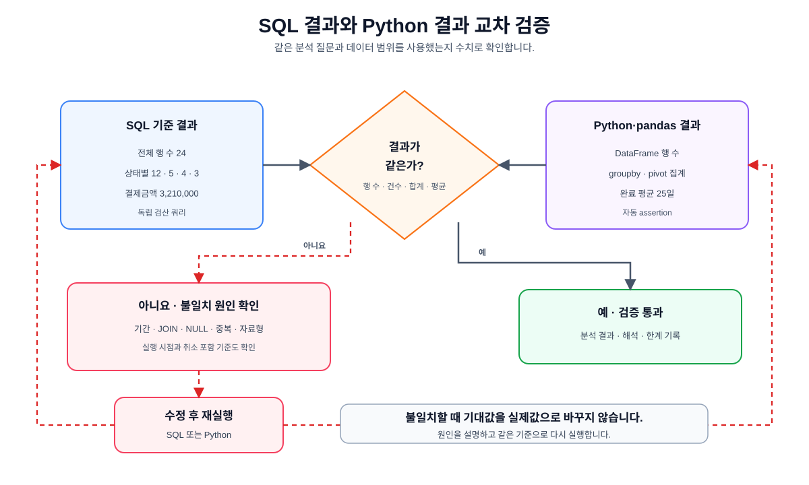

그림 14-8 SQL 결과와 Python 결과 교차 검증

Python 코드에 기대값을 다시 하드코딩한 뒤 비교하는 것만으로는 실제 SQL·Python 교차 검증이라고 보기 어렵습니다.

PostgreSQL 경로에서는 같은 연결의 읽기 전용 `REPEATABLE READ` 스냅샷에서 다음을 모두 읽습니다.

```text
분석 데이터셋
SQL 상태별 집계
SQL 월별 date spine 집계
SQL 완료 기간 집계
```

pandas가 같은 데이터셋으로 만든 결과와 `assert_frame_equal()`로 비교합니다.

```text
실제 SQL DataFrame ↔ pandas DataFrame
```

CSV 경로는 다음 세 파일을 사용합니다.

```text
CSV 데이터셋
manifest: 출처·기간·시점·SHA-256
reference_metrics.json: 버전 관리된 SQL 기준 결과
```

검증 실패 시 기대값을 실제값으로 바꿔 통과시키지 않습니다.

---

## 26. 결과가 다를 때 확인할 순서

```text
1. 같은 DB와 같은 분석 VIEW인가?
2. 같은 기간 [2026-01-01, 2026-07-01)인가?
3. 같은 데이터 스냅샷인가?
4. JOIN 종류와 행 단위가 같은가?
5. 데이터가 없는 월을 같은 방식으로 유지했는가?
6. NULL과 취소 처리 기준이 같은가?
7. recorded_amount와 실제 결제금액을 혼동하지 않았는가?
8. 숫자·날짜·boolean 자료형이 같은가?
9. Python에서 행을 임의 제거하지 않았는가?
10. CSV SHA-256이 manifest와 일치하는가?
```

---

## 27. 분석 결과를 해석한다

관찰:

```text
3월 신청 건수가 5건으로 가장 많다.
6월 신청 시점 기록 금액 합계가 570,000으로 가장 크다.
완료 상태가 12건으로 전체 24건의 절반이다.
```

해석 가능:

```text
기준 데이터에서 3월의 신청 활동이 가장 많았다.
강의별 기록 금액 차이 때문에 건수와 금액 순위는 다를 수 있다.
```

해석 제한:

```text
실제 서비스 성장 추세로 일반화할 수 없다.
기록 금액을 결제 완료 매출로 해석할 수 없다.
완료된 행만의 평균 기간을 전체 수강생에 적용할 수 없다.
상관관계만으로 원인을 확정할 수 없다.
```

최종 기록:

```text
분석 질문과 P14 ID
기간과 실행 시점
데이터 출처·VIEW·manifest
행 단위
SQL 결과
pandas 결과
교차 검증
관찰
해석
한계
다음 질문
```

---

## 28. AI가 만든 분석 코드를 검토한다

AI 요청에 다음 정보를 제공합니다.

```text
P14 분석 질문
테이블·컬럼·PK·FK
분석 기간
한 행의 단위
recorded_amount 의미
NULL·취소 기준
date spine 필요 여부
기대 행 수와 기준 집계
수정 파일과 금지 범위
실제 SQL·pandas 비교 방법
```

SQL 검토:

```text
존재하는 객체를 사용하는가?
기간 조건이 모든 집계에 적용되었는가?
PK·FK JOIN 경로가 맞는가?
LEFT JOIN 후 COUNT(child.id)를 사용하는가?
학생 수와 신청 수의 단위가 구분되는가?
없는 월을 누락하지 않는가?
recorded_amount를 매출로 표현하지 않는가?
UPDATE·DELETE·DROP이 없는가?
```

Python 검토:

```text
읽기 전용 연결인가?
올바른 DB와 VIEW를 확인하는가?
정확한 컬럼과 자료형을 검사하는가?
errors='coerce', dropna, drop_duplicates로 오류를 숨기지 않는가?
SQL 상수를 복사하는 데서 끝나지 않고 실제 SQL 결과와 비교하는가?
manifest와 파일 해시를 확인하는가?
그래프 축이 해석을 왜곡하지 않는가?
```

---

## 29. 자주 하는 실수

1. 분석 질문 없이 SQL부터 작성한다.
2. `recorded_amount`를 실제 결제 완료 매출로 해석한다.
3. Seed가 1~6월뿐이라는 이유로 기간 조건을 생략한다.
4. 데이터가 없는 월을 결과에서 없앤다.
5. `LEFT JOIN` 뒤 신청 수에 `COUNT(*)`를 사용한다.
6. 학생 수와 신청 수를 같은 단위로 센다.
7. 현재 완료 상태 비중을 완료율이라고 부른다.
8. 가입일·개설일보다 이른 신청을 확인하지 않는다.
9. Python에서 중복을 발견하고 원인 확인 없이 제거한다.
10. `errors="coerce"`로 잘못된 문자열을 NULL로 바꾼다.
11. 코드에 전체 DB URL과 비밀번호를 기록한다.
12. CSV의 출처·생성 시점·해시를 기록하지 않는다.
13. Python의 하드코딩 상수만으로 SQL 결과를 검증했다고 말한다.
14. 그래프만 보고 분석을 완료한다.
15. 완료된 행의 평균을 전체 대상의 평균으로 일반화한다.

---

## 30. 스스로 확인하기

1. 분석 질문에 기간과 행 단위가 필요한 이유는 무엇인가요?
2. `recorded_amount`를 실제 매출로 볼 수 없는 이유는 무엇인가요?
3. 반개방 날짜 구간을 사용하는 이유는 무엇인가요?
4. 데이터가 없는 월을 date spine으로 유지해야 하는 이유는 무엇인가요?
5. `COUNT(*)`, `COUNT(e.id)`, `COUNT(DISTINCT s.id)`의 차이는 무엇인가요?
6. 현재 완료 상태 비중과 완료율은 어떻게 다른가요?
7. 학생 가입일과 강의 개설일을 신청일과 비교해야 하는 이유는 무엇인가요?
8. 분석 VIEW의 한 행 단위를 먼저 정의하는 이유는 무엇인가요?
9. `errors="coerce"`가 데이터 오류를 숨길 수 있는 이유는 무엇인가요?
10. CSV manifest에는 어떤 정보가 필요한가요?
11. 실제 SQL 결과와 pandas 결과를 같은 스냅샷에서 비교하는 이유는 무엇인가요?
12. 완료된 신청의 평균 완료 기간을 전체 수강생에게 일반화할 수 없는 이유는 무엇인가요?

---

## 31. 권장 해설

```text
분석 질문은 어떤 데이터를 어떤 기준으로 셀지 결정한다.
SQL은 기간·관계·행 단위를 확정하고 Python은 그 결과를 확장한다.
```

```text
COUNT(*)는 JOIN 결과 행을 세고,
COUNT(child.id)는 실제 자식 행을 세며,
COUNT(DISTINCT parent.id)는 중복된 부모를 한 번만 센다.
```

```text
반개방 구간은 시작은 포함하고 끝은 제외해 날짜·시간 경계를 명확하게 한다.
date spine은 데이터가 없는 기간도 0건으로 유지한다.
```

```text
recorded_amount는 신청 시점 기록 금액이다.
결제 성공·환불·매출 분석에는 별도 결제 원장이 필요하다.
```

```text
현재 완료 상태 비중은 전체 신청 중 완료 상태의 몫이다.
완료율은 관찰 기간과 코호트·분모 정책을 추가로 정의해야 한다.
```

```text
Python의 기대 상수 비교는 회귀 검증에는 유용하지만,
실제 SQL 결과와 pandas 결과를 직접 비교해야 교차 검증이 된다.
```

```text
manifest는 CSV의 출처·기간·생성 시점·행 수·해시를 기록해
같은 데이터 스냅샷을 사용했는지 설명하게 한다.
```

---

## 32. 핵심 정리

```text
1. 분석은 질문·기간·행 단위·지표 정의에서 시작한다.
2. recorded_amount는 신청 시점 기록 금액이며 실제 매출이 아니다.
3. SQL·VIEW·Python은 같은 반개방 기간을 사용한다.
4. date spine으로 데이터가 없는 월을 유지한다.
5. COUNT 계열 함수는 세는 대상의 단위에 맞게 선택한다.
6. 집계 전에 중복·고아·상태·시간 관계·기간을 점검한다.
7. 현재 완료 상태 비중과 완료율을 구분한다.
8. 분석 VIEW는 수강신청 1건을 한 행으로 제공한다.
9. Python은 정확한 컬럼·자료형·업무 규칙을 공통 검증한다.
10. DB 연결은 올바른 DB·VIEW와 읽기 전용 상태를 확인한다.
11. CSV는 출처 manifest와 SHA-256을 함께 관리한다.
12. 실제 SQL과 pandas 결과를 같은 스냅샷에서 교차 검증한다.
13. 시각화는 검증 뒤 해석을 돕는 용도로 사용한다.
14. 관찰·해석·한계를 분리하고 AI 코드는 사람이 승인한다.
```

이 장에서 기억할 문장은 다음과 같습니다.

```text
SQL로 분석의 경계를 확정하고,
Python으로 확장한 결과를 같은 증거로 다시 검증한다.
```

---

## 다음 장 연결

Chapter 15에서는 요구사항, ERD, 정규화, SQL 구현, 트랜잭션, 인덱스, 보안·복구, AI 검토와 Chapter 14의 SQL·Python 분석을 하나의 재현 가능한 데이터베이스 종합 프로젝트로 통합합니다.

---

# Chapter 15. 데이터베이스 종합 프로젝트

---

## 이 장에서 완성할 것

Chapter 14에서는 SQL 분석 결과를 Python·pandas로 확장하고 같은 스냅샷의 실제 결과를 교차 검증했습니다. 마지막 Chapter에서는 지금까지 학습한 요구사항 분석, ERD, PostgreSQL 구현, SQL 검증, 트랜잭션, 인덱스, 보안, 백업·복구, 분석과 AI 검토를 하나의 재현 가능한 프로젝트로 통합합니다.

기준 예제는 **AI 튜터링 질문 관리 서비스**입니다.

```text
학생이 질문을 등록한다.
→ 튜터가 답변을 작성한다.
→ 질문에 학습 자료를 연결한다.
→ 운영자가 상태·관계·시간 정합성을 확인한다.
→ SQL과 pandas로 질문·답변 현황을 분석한다.
→ 별도 DB 복원과 최종 완료 근거를 기록한다.
```

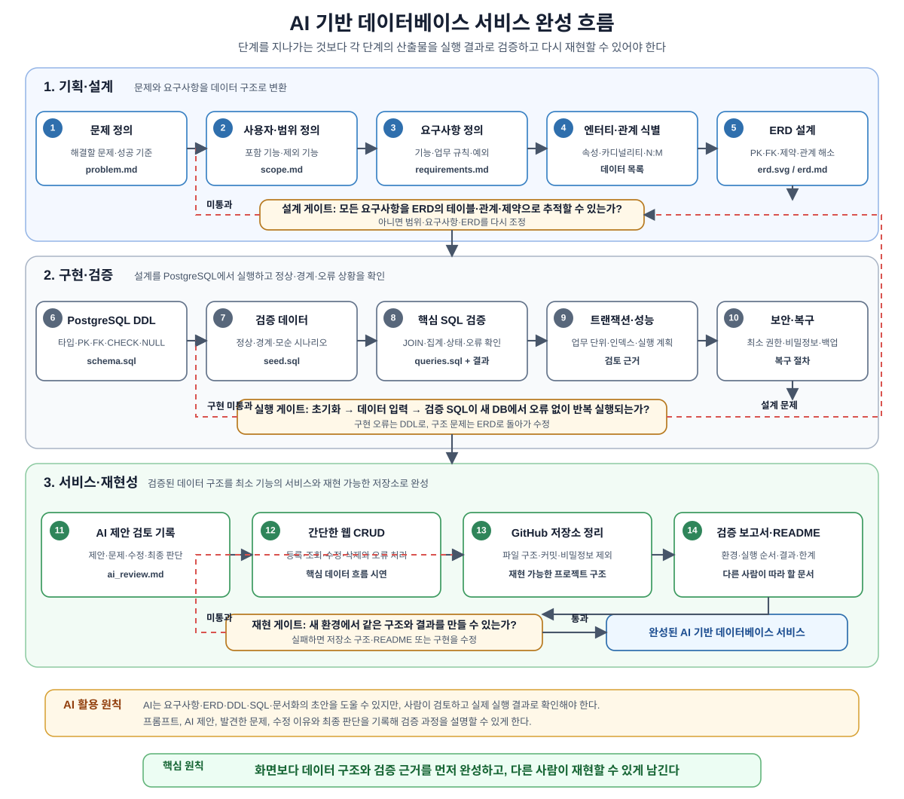

그림 15-1 통합 데이터베이스 프로젝트 완성 흐름

> **핵심 원칙**
>
> 프로젝트의 완성도는 사용 기술의 수가 아니라 요구사항, 실제 DB 구조, 검증 SQL, 분석 결과와 복구 절차가 서로 추적되고 다시 실행되는지로 판단합니다.

---

## 1. 필수 경로와 선택 확장을 구분한다

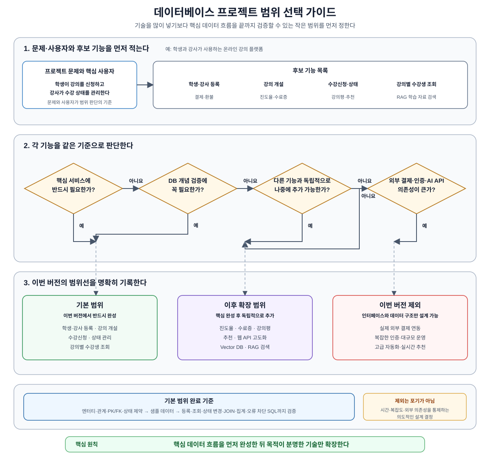

그림 15-2 필수 범위와 선택 확장 결정하기

### 필수 경로

```text
요구사항·미확정 정책
ERD·DDL·전용 스키마
기준 데이터·IDENTITY 조정
정확한 메타데이터·업무·시간 검증
트랜잭션·반례·정상 경계값
인덱스 후보·권한·보안 점검
백업·별도 DB 복원 계획
고정 기간 분석 VIEW
예외 기반 DB 완료 게이트
실제 SQL·pandas 결과 비교
AI diff·보고서·미실행 항목
```

### 선택 확장

| 확장 | 선택 기준 |
| --- | --- |
| 웹 CRUD·API | 외부 입력과 화면·API 흐름을 검증해야 할 때 |
| NoSQL | 캐시·이벤트·가변 문서라는 별도 조회 패턴이 있을 때 |
| 배포 | 다른 사용자가 실제 환경에서 접근해 검증해야 할 때 |

Python 분석은 이 장의 필수 경로입니다.

---

## 2. 파일 구조가 실행 순서와 증거를 설명해야 한다

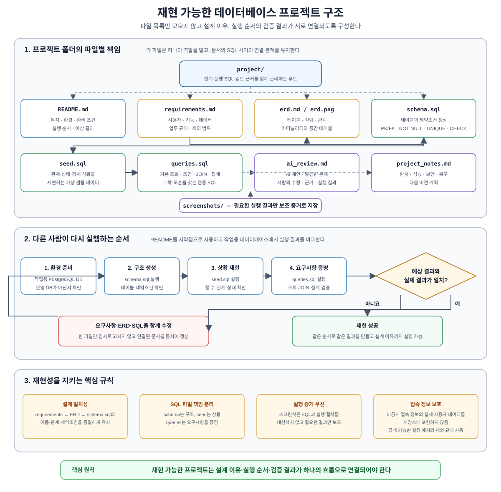

그림 15-3 재현 가능한 프로젝트 파일 구조

```text
code/chapter15/templates/
├── README.md
├── requirements.md
├── erd.md
├── 01_schema.sql
├── 02_seed.sql
├── 03_metadata_validation.sql
├── 04_requirement_queries.sql
├── 05_transaction_checks.sql
├── 06_negative_tests.sql
├── 07_performance_checks.sql
├── 08_operations_checks.sql
├── 09_analysis_dataset.sql
├── 10_completion_gate.sql
├── 11_restore_validation.sql
├── python/
│   ├── requirements.txt
│   ├── .env.example
│   ├── validation_utils.py
│   ├── 01_load_postgresql.py
│   ├── 02_pandas_analysis.py
│   └── 03_result_validation.py
├── OPERATIONS_RUNBOOK.md
├── ai_review_report.md
├── analysis_report.md
├── final_report.md
└── reset_tutor_project.sql
```

권장 순서:

```text
01 → 02 → 03 → 04 → 05 → 06 → 07 → 08 → 09 → 10
→ Python 01 → 02 → 03
→ 백업·별도 DB 복원 → 복원 DB에서 11
→ 보고서·AI diff·최종 판단
```

`10_completion_gate.sql` 통과는 DB 구조·데이터·SQL 검증 완료를 뜻합니다. Python 교차 검증, Role 시험과 복원 시험은 별도 증거가 필요합니다.

---

## 3. 문제·사용자·범위를 정의한다

| 사용자 | 필요한 작업 |
| --- | --- |
| 학생 | 질문 등록·자신의 질문 조회 |
| 튜터 | 질문 조회·답변 작성 |
| 운영자 | 상태·답변·자료 연결·정합성 확인 |
| 분석 담당자 | 질문·답변·자료 현황 분석 |

현재 범위에서 제외하는 항목:

```text
실제 로그인·인증
실제 개인정보 수집
알림·결제
실제 LLM API 호출
웹·API 구현
NoSQL 연동
클라우드 배포
자동 Role 생성
자동 백업·복원 스케줄
```

---

## 4. P15 추적 ID로 요구사항과 정책을 구분한다

| ID | 확정 요구사항 | 구현·검증 |
| --- | --- | --- |
| P15-R01 | 학생은 질문을 등록한다 | student FK·JOIN |
| P15-R02 | 학생 이메일은 공백이 아니며 정확히 같은 문자열은 중복되지 않는다 | CHECK·UNIQUE·반례 |
| P15-R03 | 튜터 이메일도 같은 규칙을 적용한다 | CHECK·UNIQUE·반례 |
| P15-R04 | 질문 상태는 허용값만 사용한다 | CHECK·반례 |
| P15-R05 | 질문에는 여러 답변이 가능하다 | 1:N·경계값 |
| P15-R06 | 답변은 존재하는 질문과 튜터를 참조한다 | FK·반례 |
| P15-R07 | 질문과 학습 자료는 N:M이다 | 연결 테이블 |
| P15-R08 | 질문이 없는 학생도 0건으로 조회한다 | 학생 요약 VIEW |
| P15-R09 | 연결되지 않은 자료를 찾는다 | LEFT JOIN |
| P15-R10 | 한 질문의 자료 표시 순서는 중복되지 않는다 | 복합 UNIQUE |
| P15-R11 | 실제 개인정보·비밀·운영 파일을 사용하지 않는다 | 가상 Seed·운영 점검 |
| P15-R12 | 질문 1건 단위 분석 데이터를 제공한다 | 질문 분석 VIEW |
| P15-R13 | 같은 스냅샷의 실제 SQL·pandas 집계가 일치한다 | Python 자동 비교 |

미확정 또는 후속 정책:

```text
P15-D02 같은 튜터가 한 질문에 여러 답변을 작성할 수 있는가?
P15-D03 답변 등록 시 상태를 앱·트리거·수동 중 어디에서 바꾸는가?
P15-D04 closed 질문에 추가 답변을 허용하는가?
P15-D05 비활성 학생·튜터가 신규 작업을 할 수 있는가?
P15-D07 삭제·보관 정책은 무엇인가?
P15-D08 access_scope를 실제 권한 통제로 어떻게 연결하는가?
```

이메일 대소문자를 같은 주소로 처리할지도 별도 정책입니다. 현재 UNIQUE는 정확히 같은 문자열만 차단합니다.

---

## 5. ERD·DDL·메타데이터를 추적한다

```text
students 1 → 0..N questions
questions 1 → 0..N answers
tutors 1 → 0..N answers
questions 1 → 0..N question_materials
learning_materials 1 → 0..N question_materials
```

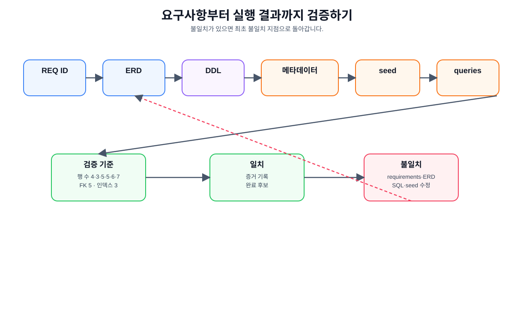

그림 15-4 요구사항부터 분석 결과까지 검증하기

전용 스키마:

```text
tutor_project.students
tutor_project.tutors
tutor_project.questions
tutor_project.answers
tutor_project.learning_materials
tutor_project.question_materials
```

앞 장 스키마와 `public`은 변경하지 않습니다.

### 실행 안전성

`01_schema.sql`은 다음을 실제로 검사합니다.

```text
현재 DB = ai_database_book
tutor_project 미존재
```

스키마, 6개 테이블, 업무 인덱스 3개와 분석 기준 VIEW는 하나의 트랜잭션에서 생성합니다. 생성 파일은 자동 DROP을 하지 않습니다.

### 무결성 규칙

```text
필수 이름·이메일·코드·본문·버전은 공백 금지
질문 상태: open·answered·closed
questions.updated_at >= questions.created_at
자료 유형·접근 범위 허용값
question_materials 복합 PK
질문 안에서 display_order UNIQUE·양수
FK 삭제 규칙 RESTRICT
```

`03_metadata_validation.sql`은 단순 개수뿐 아니라 정확한 테이블 집합, 제약조건 이름, FK 출발·대상 컬럼, 복합 PK 컬럼 순서와 인덱스 정의를 PostgreSQL 카탈로그에서 검증합니다.

기준:

```text
base tables 6
constraints 36
FK 5
IDENTITY PK 5
업무 인덱스 3
CASCADE 0
```

---

## 6. 기준 데이터와 IDENTITY를 함께 관리한다

| 테이블 | 기준 행 수 | 명시적 ID | 다음 자동값 |
| --- | ---: | --- | ---: |
| students | 4 | 101~104 | 105 |
| tutors | 3 | 201~203 | 204 |
| questions | 5 | 301~305 | 306 |
| answers | 5 | 401~405 | 406 |
| learning_materials | 6 | 501~506 | 507 |
| question_materials | 7 | 복합 PK | - |

명시적 ID 입력은 IDENTITY 내부 시퀀스를 자동 이동시키지 않습니다. `02_seed.sql`은 입력 후 `RESTART WITH`로 다음 값을 조정합니다.

Seed는 다음 경계 사례를 포함합니다.

```text
질문 없는 학생 1명
연결되지 않은 자료 1건
답변 없는 open 질문 1건
답변이 2개인 질문 1건
2026년 1~5월에 분산된 질문
```

`content_hash`의 `demo-sha256-*` 값은 실제 SHA-256 계산값이 아니라 가상 예시입니다.

---

## 7. 관계와 시간 정합성을 검증한다

`04_requirement_queries.sql`은 정상 JOIN과 다음 이상을 확인합니다.

```text
고아 질문·답변·튜터·자료 연결
answered인데 답변 없음
표시 순서 중복
질문 작성일 < 학생 가입일
답변 작성 시각 < 질문 작성 시각
답변 작성 시각 < 튜터 생성 시각
자료 연결 시각 < 질문 작성 시각
```

테이블 내부 시간 관계는 CHECK로, 여러 테이블이 필요한 관계는 검증 SQL로 확인합니다.

`is_active`와 상태 조합은 현재 모든 상황을 DB 제약으로 고정하지 않습니다. 비활성 사용자의 신규 작업과 closed 질문 답변은 후속 업무 정책입니다.

---

## 8. 트랜잭션은 정상·실패·ROLLBACK을 모두 증명한다

`05_transaction_checks.sql`은 질문 303의 답변 등록과 상태 변경을 한 트랜잭션으로 실행합니다.

```text
실행 전: answers 5, question 303 open
트랜잭션 내부: answers 6, question 303 answered
ROLLBACK 후: answers 5, question 303 open
```

상태 UPDATE는 다음처럼 기존 상태를 조건으로 사용합니다.

```sql
UPDATE tutor_project.questions
SET status = 'answered', updated_at = ...
WHERE id = 303
  AND status = 'open'
RETURNING id;
```

영향 행 수가 1이 아니면 성공으로 판단하지 않습니다. 잘못된 tutor 때문에 답변 INSERT가 실패하는 경로에서는 상태 변경도 남지 않아야 합니다.

---

## 9. 반례는 오류 종류와 제약조건 이름까지 확인한다

`06_negative_tests.sql`은 공통 실행 함수를 사용해 다음 증거를 기록합니다.

```text
expected_sqlstate / actual_sqlstate
expected_constraint / actual_constraint
actual_table / actual_column
actual_result / detail
```

실패 반례 18개와 정상 경계값 5개를 실행합니다.

```text
중복 이메일
없는 부모 FK
잘못된 상태·자료 유형·접근 범위
빈 이메일·코드·제목·답변·URL
잘못된 시간 순서
중복 자료 연결·표시 순서
한 글자 이름
NULL source_url·note
질문별 복수 답변
같은 튜터 복수 답변 정책 관찰
```

기대 결과:

```text
전체 23
통과 23
unexpected 0
기준 행 수 유지
```

오류만 시험하면 제약조건이 정상값까지 과도하게 막는 문제를 발견하기 어렵습니다. 정상 경계값도 반드시 포함합니다.

---

## 10. 인덱스는 후보 검토와 실제 효과 검증을 구분한다

| 인덱스 | 조회 패턴 |
| --- | --- |
| `questions(student_id, status, created_at DESC)` | 학생별 상태별 질문 |
| `answers(question_id, created_at)` | 질문별 답변 시간순 조회 |
| `question_materials(material_id)` | 자료별 질문 조회 |

`07_performance_checks.sql`은 인덱스 정의와 대표 EXPLAIN을 검토합니다. 작은 Seed에서 Seq Scan이 선택되어도 자동 오류가 아닙니다.

실제 효과 검증에는 다음이 추가로 필요합니다.

```text
운영과 유사한 데이터 크기·분포
인덱스 전·후 동일 SQL
EXPLAIN (ANALYZE, BUFFERS)
실행 시간·버퍼와 쓰기 비용
락·배포 방식과 최종 유지 결정
```

---

## 11. PUBLIC·소유권·데이터 분류를 구분한다

`08_operations_checks.sql`은 다음을 확인합니다.

```text
DB CONNECT와 pg_database.datacl
schema owner·nspacl
테이블·VIEW·시퀀스 owner와 ACL
직접 테이블·컬럼 GRANT
PUBLIC table_privileges·column_privileges
현재 사용자의 최종 has_*_privilege
가상 이메일·URL·해시 규칙
```

`information_schema.role_table_grants`만으로 PUBLIC 권한을 확인하지 않습니다.

`learning_materials.access_scope`의 `public·internal·restricted`는 업무 분류 값입니다. 이 값만으로 SELECT를 차단하지 않으며 Role·VIEW·RLS 같은 실제 접근 통제가 필요합니다.

Python 연결 정보는 다음 변수로 관리합니다.

```text
PGHOST
PGPORT
PGDATABASE
PGUSER
PGPASSFILE
```

실제 password file은 저장소 밖에 둡니다.

---

## 12. 백업은 별도 DB 복원으로 증명한다

Runbook은 도구·서버 버전, 백업 계정 권한, RLS와 스키마 외부 의존성을 먼저 확인합니다.

```bash
pg_dump \
  -U <backup_user> \
  -d ai_database_book \
  -Fc \
  --schema=tutor_project \
  --no-owner \
  --no-privileges \
  -f <backup-dir>/tutor_project.backup
```

복원 역할이 소유하는 깨끗한 DB를 만듭니다.

```bash
createdb \
  -U <admin_user> \
  -O <restore_user> \
  -T template0 \
  tutor_project_restore
```

```bash
pg_restore \
  -U <restore_user> \
  -d tutor_project_restore \
  --single-transaction \
  --no-owner \
  --no-privileges \
  <backup-dir>/tutor_project.backup
```

복원 DB에서만 `11_restore_validation.sql`을 실행합니다.

검증 범위:

```text
6개 테이블·5개 시퀀스·4개 VIEW
행 수·제약조건·인덱스·시간 정합성
IDENTITY 다음 값
복원 객체 owner
질문·학생·튜터 분석 VIEW
```

원본 DB에서 `11`을 실행하면 중단됩니다.

---

## 13. 분석 기간과 행 단위를 고정한다

분석 기간은 다음 반개방 구간입니다.

```text
[2026-01-01 00:00+09, 2026-06-01 00:00+09)
```

`09_analysis_dataset.sql`은 네 VIEW를 사용합니다.

```text
analysis_parameters
question_analysis_dataset       한 행 = 질문 1건
student_question_summary        한 행 = 학생 1명, 질문 0건 포함
tutor_answer_summary            한 행 = 튜터 1명, 답변 0건 포함
```

질문 VIEW만으로 학생별 집계를 만들면 질문이 없는 학생이 사라집니다. 튜터 차원도 질문 VIEW에 없으므로 별도 요약 VIEW 또는 원본 LEFT JOIN이 필요합니다.

분석 질문:

```text
P15-Q01 상태별 질문 수
P15-Q02 학생별 질문 수, 0건 포함
P15-Q03 튜터별 답변 수, 0건 포함
P15-Q04 월별 질문·답변·자료 수
P15-Q05 질문별 답변·자료 수
P15-Q06 첫 답변 시간
```

월별 집계는 date spine을 사용해 데이터가 없는 월도 0건으로 유지합니다.

기준 결과:

```text
상태: answered 3, closed 1, open 1
학생 질문 수: 2, 1, 2, 0
튜터 답변 수: 2, 1, 2
2026년 1~5월 질문 각 1건
첫 답변: 4건, 평균 2.00시간, 최소 0.50, 최대 3.50
```

---

## 14. 실제 SQL과 pandas 결과를 같은 스냅샷에서 비교한다

Python 공통 모듈은 다음을 확인합니다.

```text
DB = ai_database_book
transaction_read_only = on
분석 VIEW 존재
정확한 13개 컬럼
날짜·숫자·boolean 엄격 변환
question_id 중복 없음
has_answer·has_material과 건수 일치
답변 없음 → 첫 답변 시각·시간 NULL
첫 답변 시간 음수 없음
```

하나의 `REPEATABLE READ, READ ONLY` 연결에서 다음을 함께 읽습니다.

```text
원본 students·questions·tutors·answers
질문 분석 VIEW
실제 SQL 상태·월·학생·튜터·첫 답변 요약
```

pandas가 만든 결과와 `pandas.testing.assert_frame_equal()`로 직접 비교합니다. Python 코드에 복사한 기대 상수만 비교하는 방식이 아닙니다.

---

## 15. 완료 게이트와 전체 프로젝트 완료를 분리한다

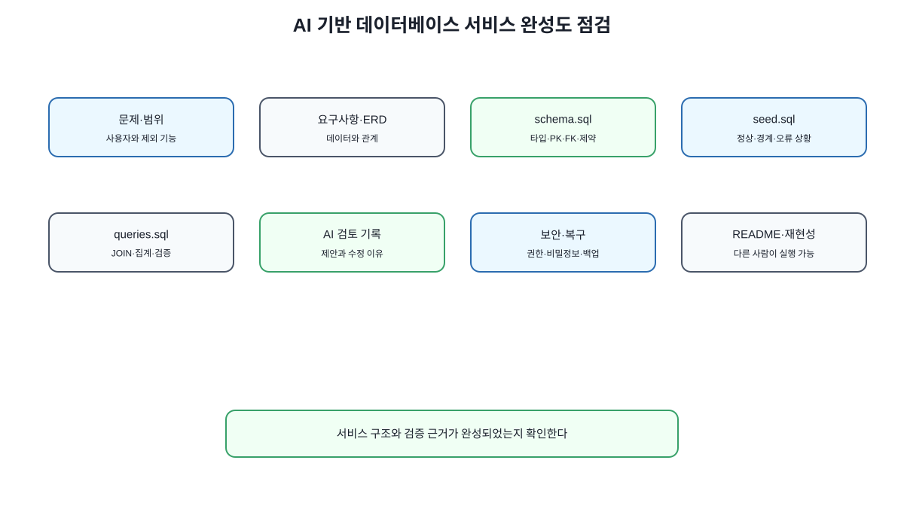

그림 15-8 최종 완료 판단 게이트

`10_completion_gate.sql`은 하나라도 다르면 예외를 발생시킵니다.

```text
정확한 테이블·VIEW·제약조건·FK·인덱스
기준 행 수와 IDENTITY 다음 값
트랜잭션 ROLLBACK
핵심 반례 14개
업무·시간 정합성
상태·월별·첫 답변 분석 기준
가상 데이터·CASCADE 기준
```

통과 메시지:

```text
Chapter 15 database completion gate passed
```

전체 완료는 다음 증거를 따로 확인합니다.

| 단계 | 증거 |
| --- | --- |
| DB 완료 | `10` 통과 |
| Python 완료 | 실제 SQL·pandas 요약 5종 일치 |
| 복구 완료 | 백업·별도 DB 복원·`11` 통과 |
| 권한 완료 | 실제 Role 허용·차단 시험 |
| 문서 완료 | 요구사항·ERD·보고서·AI diff 사람 승인 |

미실행 항목은 통과로 표시하지 않습니다.

---

## 16. AI 변경은 diff와 실행 증거로 검토한다

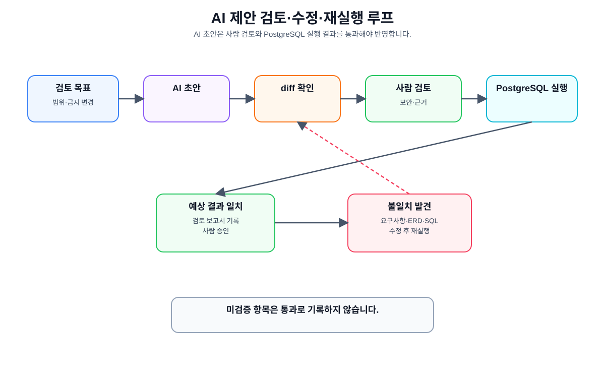

그림 15-5 AI 제안 검토·수정·재실행 루프

```text
요구사항·수정 범위 제공
→ AI가 SQL·Python·문서 초안 제안
→ 파일별 diff 확인
→ 격리 환경 실행
→ PostgreSQL 카탈로그·반례·게이트 검증
→ DataFrame 자료형·행 단위·SQL 결과 비교
→ 별도 DB 복원 검증
→ 사람이 최종 승인
```

검토 항목:

```text
요청하지 않은 파일 변경
근거 없는 UNIQUE·CASCADE·트리거·RLS
파괴적인 SQL과 잘못된 DB
접속 정보·password file 노출
임의 dropna·drop_duplicates·errors=coerce
분석 기간·행 단위 변경
미실행 항목을 통과로 표시하는 표현
```

---

## 17. 프로젝트 완성도의 일곱 축

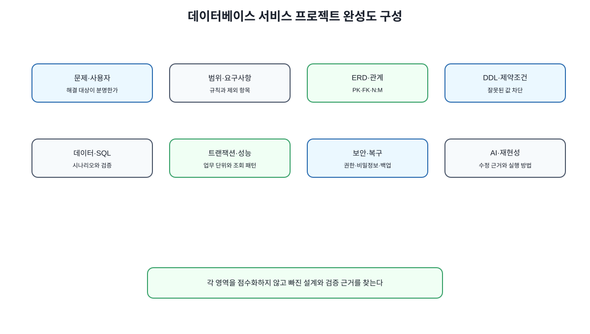

그림 15-6 프로젝트 완성도의 일곱 축

```text
1. 문제와 범위
2. 요구사항·정책과 설계 일관성
3. 재현 가능한 데이터·SQL·Python
4. 정상·경계·오류·시간·트랜잭션 증거
5. 성능·권한·보안·백업·복구 계획
6. AI diff·실행 결과·사람 승인
7. 남은 한계와 다음 버전
```

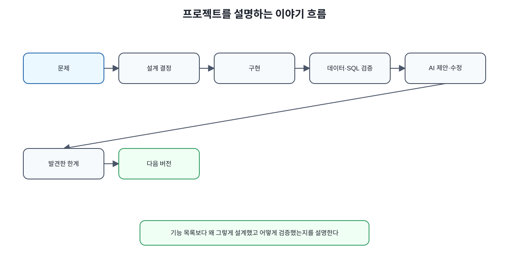

그림 15-7 설계 결정과 검증 근거를 설명하는 흐름

---

## 18. 자주 하는 실수

```text
기술 목록을 프로젝트 목표로 삼는다.
생성·초기화 파일에서 현재 DB를 확인하지 않는다.
명시적 ID 뒤 IDENTITY를 조정하지 않는다.
테이블·FK 개수만 보고 정확한 구조라고 판단한다.
정상 조회만 실행하고 실패·경계값을 생략한다.
SQLSTATE만 보고 의도한 제약조건이라고 단정한다.
access_scope 값을 실제 접근 권한으로 오해한다.
작은 Seed의 실행 계획만으로 인덱스 효과를 단정한다.
질문 VIEW만으로 질문 0건 학생을 분석한다.
Python 상수와 비교하면서 실제 SQL 교차 검증이라고 부른다.
DB 게이트 통과를 복원·권한·Python 완료로 확대 해석한다.
AI가 수정한 diff를 자동 승인한다.
```

---

## 19. 책 전체의 개념을 연결한다

```text
요구사항·ERD              Chapter 5
정규화·무결성             Chapter 6
관계형 DB 설계 프로젝트    Chapter 7
JOIN·집계                  Chapter 8
트랜잭션                   Chapter 9
인덱스·실행 계획           Chapter 10
권한·백업·복구             Chapter 11
NoSQL 선택                 Chapter 12
AI 설계·SQL 검토           Chapter 13
SQL·Python 데이터 분석     Chapter 14
설계·분석·검증 통합        Chapter 15
```

이후에는 웹 API, ORM·마이그레이션, 실제 인증·권한, NoSQL 연동, 자동화 테스트, 클라우드 배포와 대규모 분석으로 확장할 수 있습니다.

```text
데이터베이스 프로젝트의 완성은 SQL이나 그래프를 만드는 순간이 아니라,
다른 사람이 같은 절차로 실행하고 같은 근거를 확인할 수 있을 때 시작된다.
```
